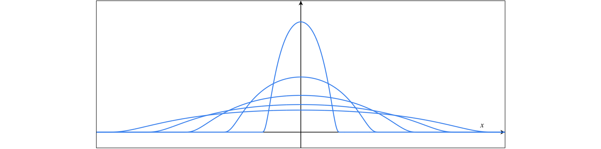
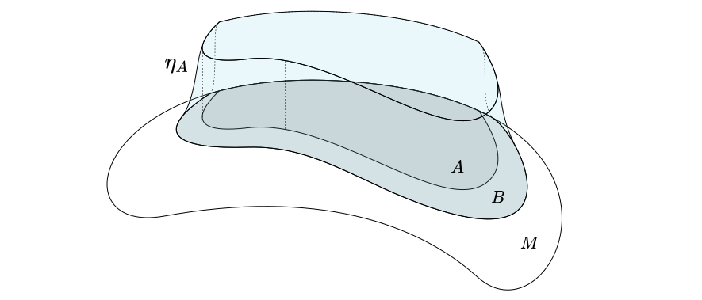
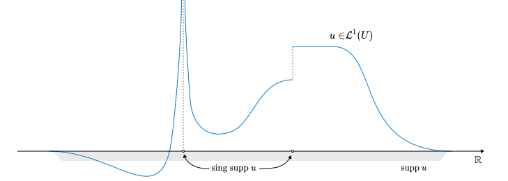
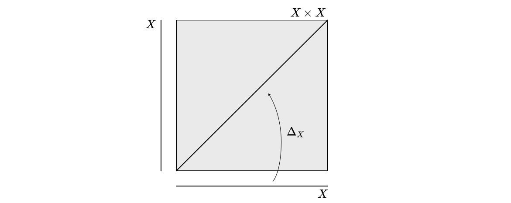
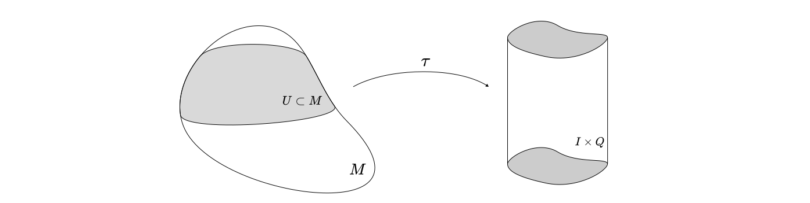
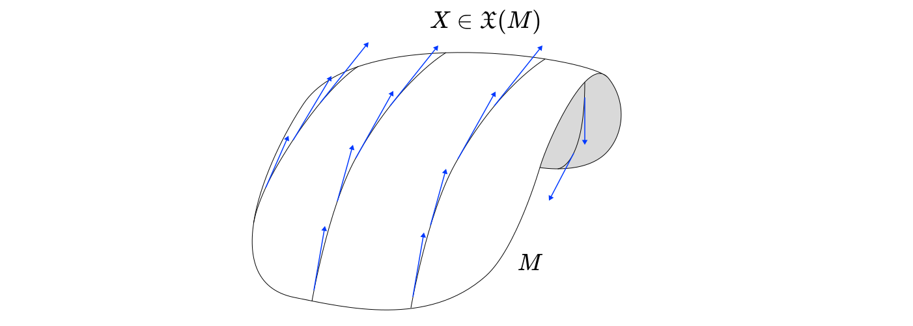
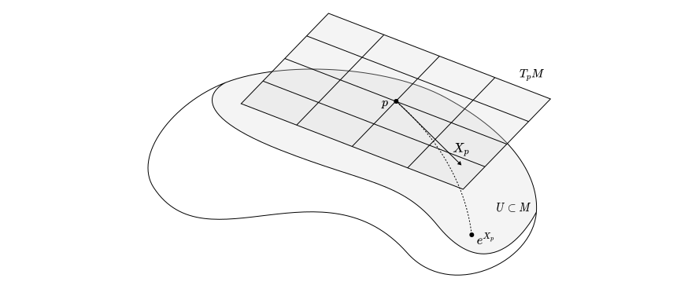
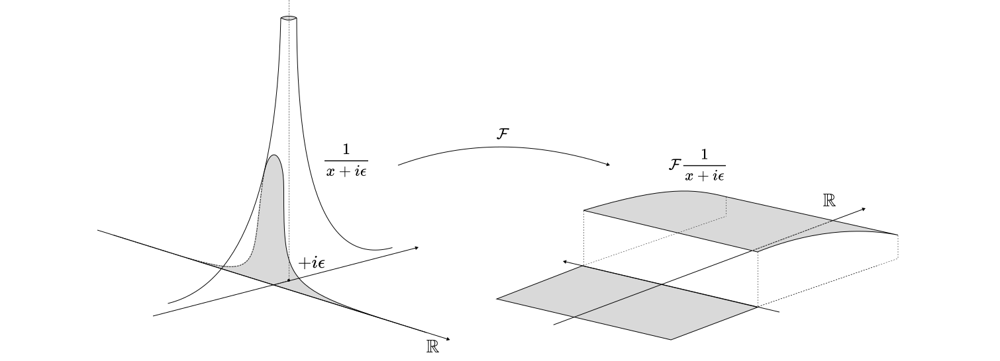

# Distributions

Formal distributions are such cool concepts in physics and we use them all the time! They are a way to generalize functions over some spaces but their genious is that so much of their properties are defined even better than most functions. For example all their derivatives exist, their Fourier transform exists, every linear PDE has a fundamental solution given by a distribution and that barely scratches the surface.

In here we will talk about distributions in a general sense such that we can build up to describing quantum fields in QFT.

We will start by defining test functions, playing around with their topology and slightly stretching what they can be. Then we define distributions as continous linear maps of test functions, highlight some of their properties and then we start playing! The main focus will be on the study of *local distributions* which are a special type of distributions that is super useful when we think of

These notes are compiled from: 

1. [The Analysis of Linear Partial Differential Operators I](https://link.springer.com/book/10.1007/978-3-642-61497-2)
2. [Methods of the Theory of Generalized Functions](https://www.taylorfrancis.com/books/mono/10.1201/9781482288162/methods-theory-generalized-functions-vladimirov) 
3. [Advanced Mathematical Analysis](https://link.springer.com/book/10.1007/978-1-4684-9886-8) 
4. [Generalized Functions and Partial Differential Equations](https://archive.org/details/generalizedfunct0000shil) 
5. [Partial Differential Equations I: Basic Theory](https://link.springer.com/book/10.1007/978-3-031-33859-5)
6. [A smooth introduction to the wavefront set](https://arxiv.org/pdf/1404.1778)

[toc]

# Definitions and Formalism

We begin by studying limits of functions. In essence this is an attempt to add a topology to the set of functions over some space. Eventually, we want to define distributions on smooth manifolds because at the end of the day we want to do physics. However, this is slightly cumbersome, so when proving things we will prove them in charts and then generalize to a general open subset of a manifold. 

> **<u>Remark:</u>** When talking about integration we will use a Riemannian manifold here in order to define the appropriate topology. A Riemannian manifold comes with a natural integration of smooth functions that lends itself to a Legesque integral that widens the set of measurable functions to things that are not necessarily smooth. This is the integral we use here, even though we don’t explicitly construct it.  

## Set of Test Functions

Distributions are objects that take in a test function and give you a number. Here we will talk about what is a test function in the first place. 

**<u>Definition:</u>** Let $U$ be an open subset of some smooth manifold, and $A$ a unital division algebra. The **set of test functions** $\mathcal D (U)$ is the set of all smooth functions with compact support on $U$. In other words it is given by

$$
\mathcal D(U,A) \coloneqq \{f \in C^\infty(U,A) \mid \text{supp } f \subset U\}.
$$

**<u>Remark:</u>** Here and throughout we will use the notation $C^\infty(U)$, $\mathcal D(U)$ to refer to the particular choice of $A = \mathbb R$ but the definitions are similar.

We pick these functions because they are particularly nice. They have all their derivatives defined and integrals finite for any open set that we can choose. Here is a very nice sequence of such functions. 

**<u>Example:</u>** Consider the following sequence of functions $\{\omega_{\epsilon}\}_{\epsilon \in \mathbb{R}^n} \subset \mathcal D(\mathbb R^n)$ given by

$$
\omega_\epsilon(x) = \begin{cases}A_\epsilon \exp\frac{-\epsilon^2}{\epsilon^2 - |x|^2} & |x| < \epsilon \\ 0 & |x| \geq \epsilon\end{cases}
$$

Where $A_\epsilon^{-1} = \int_{|x| \leq \epsilon} \exp\frac{-\epsilon^2}{\epsilon^2 - |x|^2}$. We will see later that sequences of these functions converge to the $\delta$ function under a particular definition of convergence. In fact we will use these as examples to come up with the topology of the set $\mathcal D(U)$ in more generality. Here is a picture of them

  

Before we add a topology, let’s consider a special set of functions called *bump functions*. We will define it in general manifolds because we will use it later anyway. 

**<u>Theorem:</u>** *(Existance of bump functions)* Consider a manifold $M$ and a compact subset $A \subset M$, and $B\subset M$ is an open subset that contains $A$. Then there exists a smooth function $\eta_A: M \to [0,1]$ such that

$$
\eta_A(x) = 
\begin{cases}
1 & \text{if } x \in A\\
0 & \text{if } x \in M \setminus B
\end{cases}
$$

**<u>Corollary:</u>** Given an open subset $U \subset M$ for any compact subset $A \subset U$ there exists a bump function $\eta_A \in \mathcal D(U)$. 

***Note:*** We sometimes call bump functions characteristic functions. Here is an illustration of what we have constructed. 

The more interesting theorem is the partitions of unity which we borrow directly from geometry

**<u>Theorem:</u>** *(Existance of Partitions of unity)* Given a locally finite open cover $\mathcal A$ of $U\subset M$ there exists a set of smooth functions $\{\epsilon_A : A \to [0,1]\}_{A\in \mathcal A}$ such that $\epsilon_A \in \mathcal D(A)$ and for any $x \in U$

$$
\sum_{A\in \mathcal A} \epsilon_A(x) = 1.
$$

Note that the $\omega_\epsilon$​ functions we defined earlier are such bump functions. 

## Turning $\mathcal D(U)$ into a topological space

We want to add a sense of closesness into our set of test functions. Luckily the set of test functions is a subset of the integrable functions on $U$ which apart form being a vector space can also admit the topology of a metric space. Let’s see how to do this. 

**<u>Definition:</u>** Let $U$ be an open subset of some smooth *Riemannian* manifold and $f : U \to \mathbb{R}$ be some measurable function on $U$. Then $f$ is **p-integrable** if

$$
||f||_{p} \coloneqq \int_U |f|^p < \infty.
$$

The **set of p-integrable functions** is defined as $\mathcal L^p(U)$​. Furthermore a function $f \in \mathcal L^p(U)$ is known as **locally p-integrable** if for every $x \in U$ there exists a neighborhood $V$ of $x$ such that $f \in \mathcal L^p(V)$. The **set of locally p-integrable** functions is denonted by $\mathcal L^p_{\text{loc}}(U)$. 

**<u>Corollary:</u>** The map $|| \cdot || : \mathcal L^p(U) \to \mathbb{R}$ is a metric. And therefore $\mathcal L^p(U)$ is a metric space.

**<u>Corollary:</u>** $\mathcal D (U) \subset \mathcal L^p(U)$ for any $p > 0$. Therefore $D(U)$ is a metric space. 

Now that we know that $D(U)$ is a metric space we can talk about sequences of functions and so on. Let’s use this to show something cool

**<u>Theorem</u>** $\mathcal D(U)$ is dense in $\mathcal L^p(U)$ for some open subset $U$​. 

## The Canonical LF Topology on $\mathcal D(U)$

While metric spaces are amazing, when it comes to finite dimensional vector spaces they might lack the limiting properties that we desire. To fix this we have introduced a type of topological spaces called ***L**imit of **F**rechet* spaces that are often more useful when talking about spaces of functions. We will try to find a canonical choice of an LF topology for the set of test functions.

The theory of LF spaces requires category theory to be able to fully describe, but we can cheat and define directly the LF topology on $\mathcal D(U)$ instead.  

**<u>Definition:</u>** A **linear smooth differential operator in** $U \subset M$ an open subset of an $n$ dimensional smooth manifold, is a smooth linear map $D : C^\infty(U) \to C^\infty(U)$ of the form

$$
D = \sum_{\alpha \in \mathbb N^n} c_\alpha \partial^\alpha,
$$

where all but finitely many $c_\alpha \in C^\infty(U)$ vanish. The **order** of such an operator is given by the largest norm of the multiindex of the nonvanishing coefficients $c_\alpha$, i.e. $\text{ord\,} D = |D|\coloneqq \sup \{|\alpha| \in \mathbb N^n\mid c_\alpha \neq 0\}$.

The point of the LF topology is to make all the differential operators continuous maps in $\mathcal D(U)$​. To do this we will first examine what type of topologies the space of test functions admits that are compatible with the vector space structure that it inherits as a set of Banach valued maps.

The topology that is compatible with a vector space is one that makes the operations of the vector space continuous maps. 

**<u>Definition:</u>** A **vector space topology** is a Frechet topology on an algebraic vector space such that the scalar multiplication and vector addtion maps are continuous. A vector space with a vector space topology is a **topological vector space.**

**<u>Corollary:</u>** A topological vector space is Hausdorff. 

***Proof:*** The proof relies on the fact that a vector space topology is Frechet (or $T_1$). We could have equivalently defined a vector space topology to be Hausdorff. 

The next thing we want, apart from compatibility with the algebraic vector space structure is a notion of convexity. 

**<u>Definition:</u>** A topological vector space $V$ over a field $\mathbb F$ is **locally convex** if for $0 \in V$ there exists a  (topological) neighborhood basis that consists of balanced convex sets. In other words for any neighborhood $U$ of the origin there exists some open, convex set $B$ in the basis such that for any $x \in U$ and $s \in \mathbb F$ such that $|s| \leq 1$ then $sx \in B$. 

The local convexity really is a property that can help us take narrower and narrower neighborhoods around the identity which will help A LOT with taking limits and proving convergence. We are now ready to define the topology on $\mathcal D(U)$.

**<u>Definition:</u>** The **canonical LF topology** on $\mathcal D(U)$ is the coursest locally convex vector space topology such that all linear smooth differential operators are continuous endomorphisms. 

From now on this is the topology we will assign to $\mathcal D(U)$. 

**<u>Lemma:</u>** The canonical LF topology on $\mathcal D(U)$ is strictly finer than the topology induced by $C^\infty(U)$ and $L^p(U).$ If a sequence converges using the norms $\|\cdot \|_p$ then it converges in $\mathcal D(U)$. 

From now on we will always assume that $\mathcal D(U)$ has the canonical LF topology. 

## Distributions

Now we are ready to define distributions.

**<u>Definition:</u>** A **distribution** on some open subset $U$ of a Riemannian manifold is an element of the dual space $\mathcal D'(U)$ of $\mathcal D(U)$, i.e. a continuous linear map $\phi: \mathcal D(U) \to \mathbb R$. 

**<u>Remark:</u>** While linearity is intuitively clear, continuity in this sense might be mysterious. In practice it means that for every convergent sequence of test functions $\{f_n\}_{n\in \mathbb{N}}$ 

$$
f_n \to f \in \mathcal D(U) \implies \phi(f_n) \to \phi(f) \text{ as } n\to \infty.
$$

Notice that if the manifold was not Riemannian we would have no natural topology on $\mathcal D(U)$. Also as the dual space of $\mathcal D(U)$, $\mathcal D'(U)$ inherits all the nice operations on distributions that we normally have, like addition and scalar multiplication and so on. 

**<u>Lemma:</u>** $U \subset V \implies D'(U) \subset D'(V)$. 

Any open subset of a chart is a chart, so it would be helpful to think about restrictions of distributions.

**<u>Definition:</u>** Let $V\subset U$ be an open subset of some open subset $U$, and $f \in \mathcal D'(U)$, then the **restriction of** $f$ is a distribution $\left.f\right|_{V} \in \mathcal D'(V)$ such that for any $\phi \in D(V) \subset D(U)$

$$
\left. f\right|_V (\phi) = f(\phi).
$$

There is a notion of restriction of a distribution to submanifolds that we will explore soon. Also there is a canonical product of distributions that share singularities.

## Examples

Now we can have some fun playing with examples. We will introduce certain commonly encountered distributions as well as classes of distributions. The first thing is a very useful class of distributions called regular. 

**<u>Definition:</u>** A distribution $F\in \mathcal D'(U)$ on some open subset $U$ of a smooth manifold is called **regular** if there exist a locally integrable function $f \in \mathcal L^1_{\text{loc}}(U)$ such that for any test function $\phi \in D(U)$ 

$$
F(\phi) = \int_U f\phi.
$$

In the case of regular distributions we often abuse notation and write $f$ instead of $F$​ to denote the distribution. 

**<u>Corollary:</u>** Since $\mathcal D(U) \subset \mathcal L^1_{\text{loc}}(U)$ with this identification there is an inclusion $\mathcal D(U) \hookrightarrow \mathcal D'(U)$​ as well. 

**<u>Example:</u>** *(The Heaviside function)* Consider the Heaviside function $h \in \mathcal L^1_{\text{loc}}(\mathbb{R})$ given by 

$$
h(x) = \begin{cases}
1, & x\geq 0\\
0, & x<0
\end{cases}.
$$

Then according to the natural identification above the Heaviside function can be considered as a distribution $H \in \mathcal D'(\mathbb{R})$ where for any test function $f \in \mathcal D(\mathbb R)$

$$
H(f) = \int_0^\infty f(x) dx.
$$

An interesting property is that $H(\omega_\epsilon) = \frac{1}{2}$  for any $\epsilon > 0$. But since $\omega_\epsilon$ is supported on $[-\epsilon,\epsilon]$ we can take the limit as $\epsilon \to 0$ to find that $\lim_{\epsilon \to 0} H(\omega_\epsilon) = \frac{1}{2}$ which is the reason that in a lot of applications we say that $h(0) = \frac{1}{2}$ instead of $1$. 

**<u>Example:</u>** *(The $\delta$ function)* Finally we can define one of the most commonly used objects in physics. The **delta function** on some open subset $U$ of some manifold centered at point $p \in U$ is the distribution $\delta_p \in \mathcal D'(U)$ such that for any $f \in \mathcal D(U)$ 

$$
\delta_p (f) = f(p)
$$

There are multiple ways we can construct it. One particularly nice one is using delta sequences. A sequence $\{\delta_p^k\}_{k\in \mathbb N} \subset \mathcal L^1_{\text{loc}}(U)$ (where we can use the identification we mentioned before to think of them as elements of $\mathcal D'(U)$) is a  **delta sequence**  if 

1. $p \in \text{supp } \delta_p^k \ \forall k\in \mathbb N$
2. $\text{supp } \delta_p^k$ is compact
3. $\int_U \delta_p^k = 1 \ \forall k\in \mathbb N$
4. $\int_U \delta_p^k = 1 \ \forall k\in \mathbb N$
5. $\int_{\text{supp}(\delta_p^k)} \to 0$ as $k \to \infty$. 

Then every delta sequence converges to the delta function, i.e. $\delta_p^k \to \delta_p$ as $k \to \infty$. 

Delta sequences are super powerful in prooving things because we can use them to construct averages of a function around a point. One such delta sequence is the bump functions $\omega_\epsilon \in \mathcal D(\mathbb R)$ we described earlier.

**<u>Example:</u>** *(The principal value)* We define the complex valued distribution $\mathcal P\frac{1}{x} \in \mathcal D'(\mathbb C)$ such that for any test function $f \in \mathcal D(\mathbb C)$ 

$$
\mathcal P\frac{1}{x} (f) = P.V. \int_\mathbb R \frac{f(x)}{x} dx = \lim_{\epsilon \to 0} \left[\int_{-\infty}^{-\epsilon} \frac{f(x)}{x} dx + \int_{\epsilon}^\infty \frac{f(x)}{x} dx\right].
$$

This is a very helpful distribution in physics since we always take integrals of the form when solving PDEs

$$
\lim_{\epsilon \to 0}\int_{\mathbb R} \frac{\phi(x)}{x + i\epsilon} dx = -\pi i \phi(0) + \mathcal P\frac{1}{x} (\phi).
$$

Therefore we can define the following super cool and helpful distributions

$$
\frac{1}{x + i0^{\pm}} = \mathcal P\frac{1}{x} \mp \pi i \delta.
$$

# Localization

There is a particularly interesting class of distributions that we use all the time in physics because they can be super similar to functions. These are called *local distributions*. They are the ones that can be thought of as functions almost everywhere in space with the exception of some sets that we don’t mind. To do this we need to talk about support of distributions. 

## Support of Distributions

Smooth functions have support and in principle this notion should extend to distributions as well. Here is how we do it. Throughout the rest we assume that $U$ is some open subset of a smooth manifold unless indicated otherwise.

**<u>Definition:</u>** Given a distribution $f \in \mathcal D'(U)$ the **support of** $f$ is the complement of the largest subset where $f$ restricts to $0$. In other words

$$
\text{supp }f = U \setminus O,
$$

 where $O$ is the largest subset such that $\left.f\right|_O = 0$. 

This definition already lends itself into some notion of localization of distribution. For example a distribution compactly supported in $U$​ can then be naturally extended to the entire manifold. 

**<u>Definition:</u>** The **set of distributions with compact support** on $U$ is denoted by $\mathcal E'(U)$

**<u>Lemma:</u>** $\mathcal E'(U)$ is homeomorphic to the set of continuous linear functionals of $\mathcal C^\infty(U)$

But there is a notion of support that is far more interesting to study.

**<u>Definition:</u>** Given a distribution $f \in \mathcal D'(U)$ the **singular support of** $f$, denoted by $\text{sing\,supp\,}f$ is the set of points in which there exists no neighborhood that the distribution restricts to a regular one, i.e. 

$$
\text{sing\,supp\,}f = \{x \in U\mid \nexists A \text{ neighborhood of }x \text{ s.t. } \left.f\right|_A \in \mathcal L^1_{\text{loc}}(A)\}.
$$

These are essentially the points where if we were to try to think of the distribution as a function it would “blow up”. 

**<u>Example:</u>** $\text{sing\,supp\,}\delta_p = \text{supp\,}\delta_p = \{p\}$ for $\delta_p \in \mathcal D'(U),\ p\in U$. 

As a visualization consider the distribution generated by the extension of the following $\mathcal L^1(U)$ function on some $U\subset \mathbb R$. The singular support is comprized out of the two points where the distribution can not be locally expressed as a test function for any neighborhood.

## Local Distributions

Now we are finally ready to talk about local distributions. We will define them here, show some examples, but really uncover how cool they are later.

**<u>Defintion:</u>** A distribution $f \in \mathcal D(U)$ is called **local** if its singular support has measure $0$. In other words a local distribution is regular in a neighborhood of almost every point in $U$. 

**<u>Example:</u>** The following are local distributions

1. The delta function
2. Any regural distribution
3. The Principal value
4. Probability measures for continuous random variables

The main usefulness of local distributions is the following 

## Distributions With Compact Support

Given some distribution with compact support, we can actually extend how it acts on any smooth function, not just test functions. Let’s see how to do this.

**<u>Theorem:</u>** Let $u \in \mathcal D(U)$ be a distribution with compact support. Then $u$ can be canonically extended to a continuous linear functional $U : \mathcal C^\infty(U) \to \mathbb R$ such that for any test function $f \in C^\infty(U)$ 

$$
U(f) = u(\eta_{\text{supp\,}u} f),
$$

where $\eta_{\text{supp\,}u}$ is the bump function on the support of $u$. 

Therefore we could define a class of distributions that act on all functions that are smooth in the support of $U$. The delta function is one such distribution. 

# Algebra and Calculus of Distributions

Distributions are generalized functions, but they are a bit finicky to work with. Here we develop multiple methods by which we can perform operations that resemble as closely as we can the operations of smooth functions. 

## Products with Test Functions and Partial Derivatives

Apart from the natural addition and scalar multiplication inherited by the structure of $\mathcal D(U)$ as a vector space it would be helpful to be able to multiply distributions with test functions.

**<u>Definition:</u>** The **product of distributions with test functions** is a continuous linear map $\cdot : \mathcal{D}(U) \times \mathcal D'(U) \to \mathcal D'(U)$ such that $(f,u) \mapsto f\cdot u = fu$ and for any $g \in \mathcal D(U)$

$$
fu(g) = u(fg).
$$

The next thing we want is the partial derivatives.

**<u>Definition:</u>** Given a derivation $\partial : C^\infty (U) \to C^\infty(U)$ on $U$ the **derivative of a distribution** $u \in \mathcal D'(U)$ is given by the distribution $\partial u \in \mathcal D'(U)$ defined such that for any $f\in \mathcal D(U)$

$$
\partial u (f) = -u(\partial f).
$$

**<u>Remark:</u>** The negative sign comes to make this definition compatible with regular distributions. To see this, let $u \in \mathcal D(U)$, then as a distribution it acts on test functions $f \in \mathcal D(U)$ as 

$$
u(f) = \int_U uf.
$$

Therefore we would like $\partial u$ to act in a similar way. If we say its true we get using by parts

$$
\partial u(f) = \int_U (\partial u) f = - \int_U u\partial f = -u(\partial f).
$$

We can now use bundle the two definitions above in the following lemma.

**<u>Lemma:</u>** Given a smooth linear differential operator $P$ of order $k$ and a distribution $u \in \mathcal D'(U)$ then there is a unique distribution $Pu \in \mathcal D'(U)$ that acts on test functions $f\in \mathcal D(U)$ like so

$$
Pu(f) = (-1)^k u(Df).
$$

One cool thing to notice is that all distributions are infinitely differentiable in this sense. Since we have an idea of what it means to take derivatives of distributions and we have seen that the locally integrable functions are distributions, we can find their derivatives!

**<u>Example:</u>** *(Derivative of Heaviside)* Consider the heaviside distribution $H \in \mathcal D'(\mathbb R)$ defined previously. Its derivative is given by $\frac{dH}{dx} \in \mathcal D'(\mathbb R)$ and it acts on test functions $f \in \mathcal D(\mathbb R)$ such that

$$
\begin{align*}
\frac{dH}{dx}(f) 
&=  -H\left(\frac{df}{dx}\right)\\
&= -\int_{0}^\infty \frac{df}{dx} dx\\
&= f(0).
\end{align*}
$$

Therefore $\frac{dH}{dx} = \delta$.

This definition also gives us our first steps towards thinking of distributions as the right object to do PDEs with. In fact we can now talk about fundamental solutions!

**<u>Defintion:</u>** Given a smooth linear differential operator $P$ a **fundamental solution** of the differential equation defined by $P$ in an open subset $U$ of a manifold relative to some point $p \in U$ is a distribution $G_p \in \mathcal D'(U)$ such that

$$
PG_p = \delta_p.
$$

Soon we will see the cases where convolutions can be defined and then we can use fundamental solutions as amazing tools to prove existance and uniqueness of solutions to PDEs. 

## Outer Product of Distributions

Another easy product that we can create which is surprisingly useful in physics is the outer product. It is a way of forming a distribution on the space $U\times U$. 

**<u>Definition:</u>** The **outer product of distributions** is a continuous binlinear map $\cdot \times \cdot : \mathcal D'(U)\times \mathcal D'(U) \to \mathcal D'(U\times U)$ where $(u,v) \to u\times v$ such that for any test function $f \in \mathcal D(U\times U)$ 

$$
(u\times v)(f) = u(v(f)),
$$

where we regard $v(f)$ to act on the second argument of $f$, i.e. $v(f) \in \mathcal D(U)$ such that $v(f)(x) = v(f(x,\cdot))$  for any $x \in U$. 

The complications arize when we try to multiply distributions in an associative way such that we obtain a distribution over the same subset $U$​. There is no general definition for that, but we will soon see ways in which that makes sense. 

## Pullback of Distributions

We want to generalize the operation of composition. Since we can compose functions with smooth maps we would like to extend this notion on distributions. We start by defining the pullback of functions.

**<u>Definition:</u>** Let $\phi:U\to V$ be a diffeomorphism from an open set $V \subset N$ of a manifold $N$. Then the **pullback of a function** $f: V \to X$ where $X$ is some set, is given by

$$
\phi^\ast  f = f \circ \phi : U \to X
$$

An interesting property of the pullback is as follows.

**<u>Proposition:</u>** $\phi^\ast : C^\infty(V) \to C^\infty(U) $ is continuous if its jacobian $J_\phi(x)$ is surjective for all $x \in U$. 

To define the pullback of distributions is a bit trickier. We take advantage of the fact that $\mathcal D(U)$ is dense in $\mathcal D'(U)$ under the canonical identification of test functions with distributions that we described before. Therefore every distribution can be thought of as a limit of test functions. As a result, we can define this by proxy using the following theorem. 

**<u>Theorem:</u>** Let $U \subset M$ and $V\subset N$ be open sets of Riemannian manifolds related by a smooth map $\phi:U \to V$ such that $J_\phi(x)$ is surjective for any $x \in U$. Then there is a unique continuous linear map $\phi^\ast : \mathcal D'(V) \to \mathcal D'(U)$ such that if $v \in \mathcal D'(V)$ is a regular distribution defined by a function $f \in \mathcal D(V)$, then $\phi^\ast v \in \mathcal D'(U)$ is a regular distribution defined by the function $\phi^\ast f \in \mathcal D(U)$. 

The following proposition sums up some properties of the pullback. Notice that we denote the pullback of functions $f \in \mathbb{C}^\infty(U)$ as $\phi^\ast f = f\circ \phi$. 

**<u>Proposition:</u>** Given distributions $u,v \in \mathcal D' (U)$,  test functions $f,g \in \mathcal D(U)$ and a diffeomorphism $\phi: V\to U$ the following are true

1. Given some linear differential operator $\partial$ then $\partial \phi^\ast u = \partial \phi^k \frac{\partial u}{\partial x^k}$
2. $\phi^\ast (fu) = (\phi^\ast f) (\phi^\ast u)$

**<u>Example:</u>** Consider an automorphism $\phi : U\to U$ such that $\phi(p) = q$, and $\det J_\phi(p) = 1$. Then $\phi^\ast \delta_q = \delta_p$.

## First Attempt at Product of Distributions

We have an outer product and a pullback, then it would make sense to try and define a product of distributions by pulling back the outer product from the diagonal map. This actually tends to work for some of them. As we move on we will figure out the condition under which the following is well defined. 

**<u>Definition:</u>** Let $X$ be a set. Its **diagonal map** $\Delta_X : X \to X\times X $ is the embedding $x \mapsto (x,x)$. 

Then with the diagonal map, we can do the following.

**<u>Definition:</u>** Let $u,v \in \mathcal D'(M)$ of some smooth Riemannian manifold $M$, then their product is defined as the distribution $u\cdot v \in \mathcal D'(M)$ as

$$
u\cdot v = \Delta_X^\ast (u\times v).
$$

**<u>Remark:</u>** Often this product is not defined. Consider for example $\delta \in \mathcal D'(\mathbb R)$. Then if we take

$$
\delta \cdot \delta = \Delta^\ast_{\mathbb R} \delta \times \delta
$$

We see that the pullback of $\delta \times \delta$ is not defined under this map, therefore we should start to struggle. This will eventually evolve into the criteria for multiplication of distributions using wavefront sets. 

**<u>Example:</u>** Let $u,v \in \mathcal D'(U)$ be regular distributions obtained from some functions $f,g \in \mathcal L^1(U)$. Then $u\cdot v$ is the regular distribution obtained from the function $f\cdot g$, which is a property that we want our product to satisfy. Soon we will see the same thing for local distributions where we are going to have much more fun!

# Fourier Transforms

Since we did all this analysis on manifolds, it would be nice to talk about Fourier transforms on manifolds. The immidiate problem is that a Fourier transform doesn’t seem to generalize to a definition on the whole manifold, because there is no canonical notion of inner product of points of a manifold!

The goal of these notes is to study distributions in a local sense in order to prepare for the analysis of quantum fields, so we will define a Fourier transform in a way that it can help us extract local properties of the distributions. This will have the interesting consequence of not giving us a unique (even up to constants) definition, however the properties that we want to study, such as singularities will be there regardless of the choice. 

## Local Trivializations

We want to introduce Fourier transform in so far as they help us study singularities. So our definition might look unfamiliar. In particular we will define the fourier transform on a neighborhood, which makes sense only on smooth functions supported in this neighborhood. To do this, we need to find a way to make the manifold trivial. 

**<u>Definition:</u>** A **local trvialization** of an open subset $U$ of a smooth $n$ dimensional manifold is a diffeomorphism $\tau: U \to I \times Q$, where $I \subset \mathbb R^k$ is some open subset of $\mathbb R^k$ and $Q$ is a quotient manifold of $U$ of dimension $n - k$. If the trvialization is a diffeomorphism to an open subset of $\mathbb R^n$ we call it a **chart.** 

This is similar to the notion of trivialization of a Fibre bundle over $Q$​. Here is a picture that schematically denotes a trivialization.

We can also guarantee the existance of trivializaations around any point of a manifold. 

**<u>Theorem:</u>** *(Existance of trivializations)* For any $p \in M$ for some manifol $M$ there exists a trivialization of a neighborhood $U$ of $p$. 

**<u>Example:</u>** Consider a chart $(U,\phi)$ of the manifold $M$. Then $\phi$ is a trivialization of $U$ to $\phi(U) \subset M$. 

But we can define cooler trivializations in a way that they are compatible with the metric. Such trivializations can be given using objects like Killing vectors which are introduced below.  We are building up to building a notion of Fourier transforms on trivializations.  

## Killing Vector Fields and the Quotient Manifold Theorem

A Fourier transform requires a canonical notion of translation on the manifold. Killing vector fields provide us with one! We will introduce them here and then explore relevant interesting results that will help us define the Fourier transform on certain open subsets of a manifold.

**<u>Definition:</u>** A vector field $X \in \mathfrak{X}(M)$ of a smooth Riemannian manifold $(M,g)$ is **Killing** if 

$$
\mathcal L_X g =0,
$$

where $\mathcal L$ is the Lie derivative. If we can define integral curves from all of $\mathbb R$ for each point of the Manifold then it is **complete**.

In fact any Killing vector field can be thought of as the fundamental vector field of some Lie group action on $M$​. Let’s see how this works

**<u>Theorem:</u>** A complete nonvanishing Killing vector field defines a smooth free proper action of $\mathbb R$ on $M$.

***Proof:*** Let $X \in \mathfrak X(M)$ be a complete nonvanishing Killing vector field. Then we know that its flow $\phi : \mathbb R \times M \to M$ is a smooth invertible map. To show that $\phi$ is a smooth group action of $\mathbb R$ we use the fundamental property of flows, i.e. $\phi_X(t,\phi_X(s,p)) = \phi(s+t,p)$ for all $p\in M$ and $s,t \in \mathbb{R}$​​. 

To show that it is free we use the fact that if $\phi(t,p) = p$ for some nonzero $t \in \mathbb R$ and $p\in M$ then we know that $\phi(\cdot, p): \mathbb R \to \phi(\mathbb R ,p)$​ is not injective. However, as a diffeomorphism it must be invertible, therefore the action must be free. 

To show that it is proper we will use the fact that $X$ is Killing. Let $C \subset M$ be a compact subset, then $\text{diam\,} C = \text{diam\,}f^{-1}(C)$ because as a metric space the flow of the killing vector does not change the metric. Therfore both $C$ and its preimage are bounded. Now we need to show that it is closed, but this is guaranteed since the flow is smooth. $\Box$  

This is a pretty cool result, because it means that a complete nonvanishing Killing vector field defines a trivialization. To construct it check out this theorem.

**<u>Theorem:</u>** *(Quotient Manifold Theorem)* Given a smooth manifold $M$ and a free proper $G$ action of some lie group $G$, the orbit set $M/G$ is a smooth manifold of dimension $\dim M - \dim G$. 

**<u>Corollary:</u>** Given a set of $k$ Killing vector fields on a Riemannian manifold $M$ there exists a trivialization $\mathbb{R}^k \times Q$, where $Q$ is the quotient manifold under the product action of the Killing flows.

Here is a pictire of a complete killing vector field with its integral curves. 

We can see how we could quotient the manifold by equivalence classes of the integral curves and obtain something nice looking like $\mathbb R $​ along the fibers.  This is one of the nicest trvializations we can do in order to define local Fourier transform on Riemannian manifolds. 

We can take this a step further though. In every neighborhood we can find local coordinate vector fields

## Fourier Transform in $\mathbb R^n$

We start by quickly reviewing the Fourier transform of compactly supported smooth functions of $\mathbb R^n$. Before we do this lets look at this very useful lemma.

**<u>Lemma:</u>** Let $U\subset \mathbb{R}^n$ be an open subset, then any compactly supported function or distribution on $U$ is a compactly supported function on $\mathbb R^n$ by the zero extension. 

This just says that of we take a compactly supported function or distribution we can put zeros to the rest of the points and talk about it as if it is on all of $\mathbb R^n$. So it makes sense to study compactly supported distributions and functions in all the space not just an open subset. 

**<u>Definition:</u>** Given a function $f \in \mathcal L^1(\mathbb R^n)$ its **Fourier transform** is a function $\hat f : \mathbb R^n \to \mathbb C$ such that for any $\omega \in \mathbb R^n$

$$
\hat f(\omega) = \int_{\mathbb R^n} e^{-i \omega \cdot x} f(x)dx.
$$

 **<u>Proposition:</u>** The Fourier transform is bounded and continuous.

***Proof:*** Boundedness comes from Parseval's identity, and continuity comes from sequential convergence under an integral sign. 

**<u>Definition:</u>** If the Fourier transform $\hat f$ of some function $f \in \mathcal L^1(\mathbb R^n)$ is also integrable, then its **inverse Fourier transform** is given by

$$
f(x) = \frac{1}{(2\pi)^n} \int_{\mathbb R^n} e^{i\omega\cdot x} \hat f(\omega) d\omega.
$$

Now we can have a Fourier transform of functions. However, we want to be able to study it as a linear map between spaces of functions. The best way to do this is using Schwartz functions. Here is how this works.

**<u>Definition:</u>** A **Schwartz function** is any $f\in C^\infty(\mathbb R^n)$ such that 

$$
\sup_{x\in \mathbb R^n} |x^\beta \partial^\alpha \phi(x)| < \infty,
$$

for any multiindex $\alpha,\beta$. We call the set of all Scwartz functions $\mathcal J(\mathbb R^n)$ and assign it its canonical LF topology in a similar way as we did for $\mathcal D(U)$ turning it into a Frechet space. 

Some reasons for introducing such a set of functions are the following propositions

**<u>Proposition:</u>** The Fourier transform is a continuous linear map $\mathcal F:\mathcal J(\mathbb R^n) \to \mathcal J(\mathbb R^n)$ with inverse $\mathcal F^{-1}$ given by the Fourier inversion formula. 

**<u>Proposition:</u>** $\mathcal D(\mathbb R^n)$ is a dense subset of $\mathcal J(\mathbb R^n)$, and there are canonical inclusions of $\mathcal L^p(\mathbb R^n) \subset \mathcal J'(\mathbb R^n)$ for any $p \geq 1$.

As a result, it is worth studying continuous linear functionals on $\mathcal J$. Here they are

**<u>Definition:</u>** The set of continuous linear functionals of $\mathcal J(\mathbb R^n)$ is known as the set of **tempered distributions** $\mathcal J'(\mathbb R^n)$.

Using some topology we can show that 

**<u>Lemma:</u>** $\mathcal J'(\mathbb R^n)$ is a vector subspace of $\mathcal D'(\mathbb R^n)$

The remark here is that not every distribution has a well defined Fourier transform. However we are interesting in studying compactly supported ones. Therefore we can show the following.

**<u>Proposition:</u>** $\mathcal E'(\mathbb R^n)$ is a vector subspace of $\mathcal J'(\mathbb R^n)$.

Therefore the compactly supported distributions *are* tempered. As a result they have nice Fourier transforms defined. Let's finally see how they are defined.

**<u>Definition:</u>** Let $u \in \mathcal J'(\mathbb R^n)$ be a tempered distribution. Its **Fourier transform** is a tempered distribution $\hat u \in \mathcal J'(\mathbb R^n)$ such that for any tempered function $f \in \mathcal J(\mathbb R^n)$ 

$$
\hat u(f) = h(\hat f)
$$

And there we have it! A Fourier transform of distributions, which includes compactly supported ones. In particular, here is a really cool theorem.

**<u>Theorem:</u>** The Fourier transform of any compactly supported distribution $u \in \mathcal E'(\mathbb R^n)$ is regular and is given by the function

$$
\hat u(\omega) = u(e^{-i \omega\cdot x}), \ \forall \omega \in \mathbb{C}^n
$$

where we assume that the right hand side is how $u$ acts on functions of $x \in \mathbb R^n$.  Moreover $\hat u$ is an entire function (i.e. holomorphic in the complex plane) 

This is probably one of the coolest theorems here! Not only is the Fourier transform of a compactly supported distribution regular, but it is also entire! We will use this result in the next section to talk about singularities. Before we do so let's extend the definition onto a manifold. 

## Fourier Transform as a Map of Bundles

This is very nice so far, but we have use the canonical inner product in $\mathbb R^n$ in order to define it. The cool thing is that we can use anything else to do so! In fact we can get rid of the dependence in the transform bby mapping to the dual space instead of the same one. 

**<u>Proposition:</u>** An inner product $g : \mathbb R^n \times \mathbb R^n \to \mathbb R$ on $\mathbb R^n$ induces a diffeomorphism $g : \mathbb R^n \to (\mathbb R^n)^\ast$ such that $x \mapsto g(x,\cdot )$. 

**<u>Corollary:</u>** There exists a canonical homeomorphism between $\mathcal J (\mathbb R^n)$ and $\mathcal J ((\mathbb R^n)^\ast)$. 

Using this corollary we can define the Fourier transform of $u \in \mathcal J(\mathbb R^n)$ such that for any $\omega \in (\mathbb R^n)^\ast$

$$
\hat u(\omega) = \int_{\mathbb R^n} u(x)e^{-i\omega(x)} dx
$$

Everything else can be casted into this definition. Now we are ready to move onto manifolds. 

## Local Fourier Transforms on Manifolds

Surprisingly, the Fourier transform, at its core is a local object. In this section we will explore a general definition of a local Fourier transform find some cool properties and also show how the Fourier transform in the real numbers is a special case of the local one on a manifolds.

We first start with the fact that each chart defines a trivialization of the manifold that in turn defines an exponential map of some neighborhood of the identity of of the tangent space to the manifold. Here is how it works.

**<u>Theorem:</u>** Given a Riemannian manifold $M$ and $p \in M$ there exists a neighborhood $U \subset M$ of $p$ where the diffeomorpshism 

$$
\exp_p : T_p M \supset \log U\to U
$$

 where $\log U \subset T_pM$ is a neighborhood of the identity of $T_pM$, is defined such that for any $X \in T_pM$, 

$$
\exp_pX = e^{X_p}=\gamma_X(1),
$$

where $\gamma_X : I \to U$ is the integral curve of $X$ such that $\gamma(0) = p$. This map is known as the **exponential map based at** $p$​. When the choice of base point is clear from context we drop it from the notation. In the case of Riemannian Manifolds we can always find a basis in local Killing vector fields for the Tangent space. 

Notice that the exponential map is only locally defined, in the case of Lie groups the exponential map definition is cannonically associated with the exponential map of the connected component to the identity. 

This might seem a bit restrictive, but we will soon see that it is not. Let’s try to define a local Fourier transform on a chart.

**<u>Definition:</u>** Let $(M,g)$ be a Riemannian Manifold, and $U \subset M$ be a chart of $p$. Then the **local Fourier transform** at $p \in U$ is a continuous map $\mathcal F_p : \mathcal D(U) \to \mathcal C^\infty(T^*M)$ such that any $f \in \mathcal D(U)$ is mapped to

$$
\mathcal F_p [f](\omega) =\hat f(\omega) \coloneqq \int_{T_pM} f(e^X)e^{-i\omega(X)}dX,
$$

where $dX$ is the measure induced in the tangent space via the metric $g$​, for any $\omega \in T_p^\ast M$.

**<u>Remark:</u>** Since there is an identification of a subset of the tangent space with the sbset of the manifold we can simply think that this is the natural Fourier transform we defined previously, where we have made the identification of $\mathbb R^n$ with the cotangent space. The only issue is that the local Fourier transform is not invertible in general.

We can extend this definition to locally supported distributions in a similar fasion.

**<u>Definition:</u>** Let $u \in \mathcal E'(U)$ where $U \subset M$ is a chart of $p\in M$ on a Riemannian Manifold. Then the **local Fourier transform of $u$ at $p$** is a distribution $\mathcal Fu \in \mathcal D'(T_p^\ast M)$ such that, for any $f \in \mathcal D(T_p^\ast M)$

$$
\mathcal F u( f) = \hat u(f) = u(\hat f)
$$

**<u>Remark:</u>** That the fourier transform of $f$ is taken as a function of the cotangent bundle.

The theorem we have shown before still holds though. 

**<u>Theorem:</u>** The local Fourier transform at $p \in U$ of a compactly supported distribution $u \in \mathcal E'(U)$ is regular and is generated by the smooth function 

$$
\hat u(\omega) = u(e^{-i\omega(\cdot)}).
$$

This is all we need from Fourier transforms really. The rest is an alternate way to define the Fourier transform in greater generality that it becomes slightly unhelpful after a while. One can safely skip. 

## Partial Fourier Transforms on Manifolds*

A partial Fourier transform is exactly that, a Fourier transform on some of the variables. We will define this for compact functions and distributions. 

**<u>Definition:</u>** Let $f \in \mathcal D(U)$ be a test function on some open subset $U \subset M$ of a Riemannian manifold $M$ with trivialization $\tau : U \to I\times Q$, where $I \subset \mathbb R^k$. Then a **partial Fourier transform** of $f$ in this trivialization is the map obtained by

$$
\hat f(\omega,p) = \int_{\mathbb R} f\circ \tau^{-1}(x,p) e^{-i \omega\cdot x} dx,
$$

for any $\omega \in \mathbb C^k, p\in Q$. 

**<u>Remark:</u>** Notice that the partial Fourier transform of $f$ is no longer a test function on $U$, but it is rather a function on $\mathbb C^k \times Q$. This is not bad as we can think of the natural extention of test functions on $U$ as test functions on $\mathcal D(I\times Q)$ and since they have compact support on $I$ they can then be considered as test functions on $\mathcal D(\mathbb R^k \times Q)$, or as we have shown before, test functions of the form $\mathcal D(\mathbb R^k) \times \mathcal D(Q)$. There are canonical identifications of each, related by pullbacks. What we are really doing is that we are taking a function with compact support on some region on a manifold with a trivialization and then we take the fourier transform on the component of the function under the trivialization. 

Let's understand this better through the following lemma. 

**<u>Lemma:</u>** A trivialization $\tau : U \to I \times Q$, where $I \subset \mathbb R^k$, induces an embedding $\epsilon: \mathcal D(U) \to \mathcal D(\mathbb R^k) \times\mathcal D(Q)$. If $U = M$ then $\epsilon$ is an isomorphism. 

The proof uses the canonical extension of functions with compact support on the entire space. 

**<u>Example:</u>** Consider Minkowski space $\mathbb R^{p,q}$, then we can find $p+q$ independent Killing vector fields and create a trivialization $\tau : \mathbb R^{p,q} \to \mathbb R^{p+q}$ as we saw before. In this case the induced embedding $\epsilon$ is also surjective, therefore we can identify the partial Fourier transform of test functions on $\mathbb R^{p,q}$ with test functions in $\mathbb R^{p,q}$ which is great. 

Now that we have this we can proceed with defining the partial Fourier transform of distributions

**<u>Definition:</u>** Let $u \in \mathcal E'(U)$ be a distribution with compact support on some open subset $U \subset M$ with trivialization $\tau:U \to I\times Q$ where $I\subset \mathbb R^k$. Then its **partial Fourier transform** is a distribution $\hat u \in \mathcal D'(\mathbb C^k \times Q)$ such that for any test function $f \in \mathcal D(\mathbb C^k \times Q)$ 

$$
\hat u(f) = u(\hat f).
$$

Using the theorem we showed in the previous section we can see that the partial Fourier transform is simply a complex valued distribution on $Q$. 

## Local Convolutions*

Having a Fourier transform one could think that we can locally multiply distributions by the property of the Fourier transform and its convolution. Let’s first introduce these concepts and then see when this multiplication fails.

**<u>Definition:</u>** Let $f,g \in \mathcal D(U)$ be test functions on an open subset $U\subset M$ of a Riemannian manifold with trivialization $\tau : U\to I\subset \mathbb R^n$. Then the **convolution** of the two functions is defined as the test function $f\ast g \in \mathcal D(U')$ given by

$$
f \ast g (\tau^{-1}(x)) = \int_{\mathbb R^n} f\circ \tau^{-1}(y) \cdot g\circ \tau^{-1}(x-y) dx,
$$

for any $x\in \tau(U)$, where the distribution is supported in 

$$
U' = \text{supp\,}f +_\tau \text{supp\,}g \coloneqq \{\tau^{-1}(p+q) \mid p \in \tau(\text{supp\,}f),\ q \in \tau(\text{supp\,}g) \}.
$$

**<u>Remark:</u>** Notice that the convolution is not defined between any two aribitrary test functions. It is defined as long as $U' \subset U$. Also this definition amounds to going to the trivialization and doing the convolution there. 

This is a severely restricted version of the convolution we are used to in $\mathbb R^n$, but it still works well in this case. We can, in fact, define convolutions of distributions.

**<u>Definition:</u>** Let $f \in \mathcal D(U)$ and $u \in \mathcal D'(U)$ for some $U$ with trivialization $\tau : U \to I \subset \mathbb R^k$, then their **convolution** is the smooth function $u\ast f \in C^\infty(U)$ such that for any $x \in \tau(U)$ 

$$
(u\ast f)(\tau^{-1}(x)) = u(f \circ \tau^{-1}(x - \cdot)),
$$

where $f \circ \tau^{-1}(x - \cdot)$ is the translated funtoin by $x$. 

**<u>Corollary:</u>** $\text{supp\,}u\ast f \subset \text{supp\,}u +_\tau \text{supp\,}f$​

The convolution of distributions with each other is also defined but only as long as one has compact support. Here is how it works.

**<u>Definition:</u>** Let $u \in \mathcal E'(U)$ and $v \in \mathcal D'(U)$ on some $U$ with trivialization $\tau: U\to I \subset \mathbb R^n$. Then their **convolution** is the unique distribution $u\ast v \in \mathcal D'(U)$ such that for any test function $f \in \mathcal D(U)$

$$
u\ast v(f) = u(v\ast f) = v(u\ast f).
$$

> **<u>Remark:</u>** Notice that in this version, the convolution of the distributions depends on the trivialization. Often in physics there is a canonical choice of trivialization such as the one on Minkowski space. In essence by picking a trivialization we are picking a notion of translation on the open set we are working with. Therefore this is why it can very easily happen that we can pick trivializations such that the convolution is not defined. Having fixed a trivialization, however, the rest of the properties that we will derive hold. 

Here is a common property that becomes subtly annoying in this generalization.

**<u>Proposition:</u>** Let $f,g \in \mathcal D(U)$ on some $U$ with trivialization $\tau : U \to I\subset \mathbb R^n$ then,

$$
\mathcal F(f\ast g) = \mathcal F(f ) \cdot \mathcal F(g).
$$

This looks familiar, but it is no longer a function on $U \subset M$, it is rather a function on $\mathbb C^n$ so there is no standard way to take its inverse fourier transform. Yet, we can still extract a lot of features by studying functions in this way! In fact we can see that if this doesn’t have an inverse fourier transform in $\mathbb C^n$ then it definitely doesn’t have a product as distributions! 

# Singular Analysis

We want to examine the properties of the singularities of distributions. This is particularly applicable in physics in Conformal Field Theory where we look at expansions of products of local distributions near their singularities. The main tool we are going to develop is the *Wave Front Set* of a distribution. This will be a collection of points in the cotangent bundle that we will interpret as the wavefronts caused by the presence of a singularity in the distribution. I promise this will make sense as this goes along. 

Using the Wavefront Sets we will be able to extend a lot of the properties of functions to distributions including pulling back distributions on submanifolds, writing something similar to Laurent series around a singularity, or even multiplication of distributions.

## Distinguishing Regularity Using Fourier Transforms

Let’s limit our scope to studying compactly supported distributions, i.e. elements of $\mathcal E'(U)$ on an open subset $U$ of a Riemannian manifold. One useful fact is the following.

**<u>Theorem:</u>** Let $u \in \mathcal E'(U)$ on some trivializable open subset of a Riemannian manifold. Then $u$ is a regular distribution obtained from $f \in \mathcal D(U)$ if and only if

$$
|\hat u(\omega)| \leq C_N (1+|\omega|)^{-N},
$$

for all $N\in \mathbb N$, $\omega \in \mathbb R^n$ and arbitrary constants $C_N \in \mathbb R^+$. 

This is a really powerful theorem and the proof comes from the continuity of the Fourier transform as a map between the scwartz functions or tempered distributions (In fact we recognize that this is parseval’s equality bounded by all the possible seminorms induced by the canonical LF topology on $\mathcal J(U)$). 

What the theorem tells us is that the behavior of the Fourier transform at infinity tells us about the singular structure of the distribution. Lets see some examples. 

**<u>Example:</u>** *(The Delta function)* The fourier transform of the delta function $\delta \in \mathcal E'(\mathbb R^n)$ is the map $1$ which takes the value $1$ everywhere. In fact if we multiply it with any compact envelope function, such as $\omega_\epsilon$, the distribution $\omega_\epsilon \cdot \delta$ has compact support in a ball of radius $\epsilon > 0$. For any $\epsilon > 0$ the fourier transform of $\omega_\epsilon \cdot \delta$ is always $1$. However if we translate $\omega_\epsilon$ by any nontrivial translation, then there exists an $\epsilon$ such that the fourier transform is regular (in fact it is zero in this case). This gives us a hint that there is a singularity around $0$ for the distribution $\delta$. In fact we already know there is one since $\text{sing\,supp\,}\delta = \{0\}$. 

**<u>Example</u>** *(The Causal Propagator)* We have already defined the distribution of the causal propagator as

$$
\frac{1}{x + i0} \coloneqq \lim_{\epsilon \to 0} \frac{1}{x + i\epsilon}.
$$

We can see that the its fourier transform is given by

$$
\mathcal F \left[\frac{1}{x+i0}\right] (\omega) = \lim_{\epsilon\to 0}e^{-\epsilon \omega} h(- \omega), = h(-
\omega)
$$

where $h$ is the Heaviside function. Here is a plot of how this looks like (Notice that I am plotting the absolute value on the left side. The actual function is complex valued so it doesn’t make sense).

As we can see at the limit, the Fourier transpose is simply $h(\Re\, \omega)$​ which doesn’t satisfy the convergence criterion that we have been describing, which implies that there is a singularity for any neighborhood around zero.

## Conic Neighborhoods and Smoothness of Distributions

What we have seen is two examples of distribution whose Fourier transform does not converge  fast enough when they have a singularity. But they don’t seem to be going to infinity the same way. The Fourier transform of the delta function is going to infinity from any direction, but the one of the causal propagator is going only in the positive directions. We want to find a way to quantify this. We do this using conic neighborhoods.

**<u>Definition:</u>** A **conic neighborhood** around a point $X_0 = (p,X_p) \in T^\ast M$ is an open subset $C \subset T^\ast M$ of the cotangent bundle such that $X_0 \in C$ and for any $\alpha > 0$ and $X \in C$ then $\alpha X \in C$​. 

Here is a picture of one (lol I learned how to draw diagrams and now I can’t stop).

When we think of smoothness of a function we usually check if all the directional derivatives exist and are continuous. We could port it in the sense of distributions, but all their derivatives exist already. This doesn’t mean that they’re smooth though, because we could have things like Heaviside distribution which is not smooth as a function. Additionally, we want smoothness to be a local property, and the distributional derivative is *not* a local operator. 

Therefore our notion of smoothness should be upgraded. Interestingly, unlike a function, a distribution’s smoothness depends on the direction. Here is the definition.

**<u>Definition:</u>** A distribution $u \in \mathcal D'(U)$ on some open subset $U\subset M$ of a Riemannian manifold $M$ is **smooth at a point** $\omega_p \in T^\ast_p M$ if there exist a bump function $\eta \in \mathcal D(U)$ and a conical neighborhood $\Gamma_p \subset $ of $\omega_p$ such that for any $\alpha \in \Gamma_p$ there exist $C_N > 0$

$$
|\mathcal F_p[\eta \cdot u](\alpha)| \leq C_N(1-|\alpha|)^{-N},
$$

for all $N \in \mathbb N$.  A distribution is **smooth at a conic subset** $\Gamma \subset TM$ if it is smooth at every point in $\Gamma$.

**<u>Example:</u>** *(Delta Function)* The delta function $\delta_p \in \mathcal D'(M)$ is not smooth for any $\omega \in T_pM$. The proof is that for any bump function $\eta$ centered at $p$, we have that $\eta \cdot \delta_p = \delta_p$. We also know that

$$
\mathcal F_p(\delta_p) = 1.
$$

As a result, for any $\omega_p \in T_pM, \omega_p \neq 0$ we have that there always exist some number $\lambda >0$ such that $1 - \lambda | \omega_p| > 1$ .

However, the delta function is smooth for every other point. In particular we can pick a bump function supported in a neighborhood that doesnt contain $p$. Therefore this is outside the support of $\delta_p$ as a result the fourier transform vanishes. 

**<u>Example:</u>** *(The Causal Propagator)* We have seen that the Fourier transform of the causal propagator is $\eta(-\omega)$. Therefore $\frac{1}{x+i0}$ is smooth for all $\omega > 0$. 

One reason for calling this property smoothness is the following.

**<u>Theorem:</u>** Given a distribution $u \in \mathcal D(U)$ that is smooth on $T_pU$ for some $p\in U$ there exists a neighborhood $A\subset U$ of $p$  such that the restriction of $u$ in $A$ is regular and generated by a *smooth* function.

This is a pretty nifty result, because this is giving us a condition. 

## Wavefront Sets

We built all this formalism so that we reach this tool. The 

