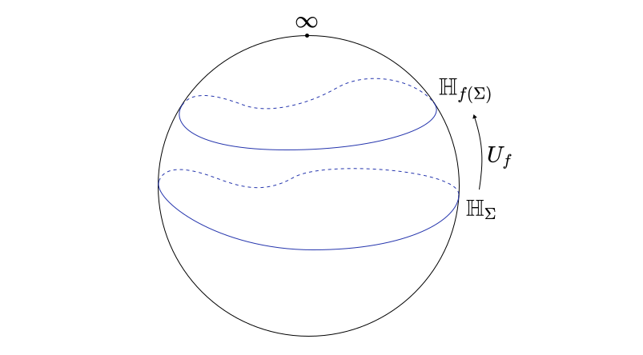

# Conserved Currents

We have found what [momentum](./Momentum.md) is, now it is time to find out what a conserved current is. We will start doing this classically, first with Lagrangian field theory, then using Hamiltonian field theory, and then using Path Integration in quantum field theory.

[toc]

# In Classical Field Theory

Let's begin with a definition of a conserved current.

**<u>Definition:</u>** Given a smooth manifold $M$ of dimension $n$ a **current** $J\in \Omega^{n-1}(M)$ is an $n-1$ form on $M$. The current is **conserved** iff it is closed, i.e. $dJ =0$.

## Lagrangian Setup 

The setup of Lagrangian field theory on smooth manifolds (this can be generalized, but I don't know how to work on the more general setting) is as follows. We consider $(M,g)$ a Lorentzian manifold, and $\pi : E\to M$ be some vector bundle over $M$. Then we get a map $S:\Gamma(E) \to \mathbb{R}$ which is an action on $M$, given for any $\phi \in \Gamma^\infty(E)$ by
$$
S(\phi) = \int_M \ast \mathcal{L}(\phi),
$$
where $\mathcal{L}:\Gamma(E)\to \mathbb{R}$ is a continuous Lagrangian and $\ast$ is the hodge star. This is the setup we adopt in the following section.  Note that $\Gamma(E)$, the set of sections of $E$, is a real Hilbert space with inner product induced by the metric on $M$. 

Specifically, one can obtain the field equations through variation. 

**<u>Lemma</u>**: For any $\eta \in \Gamma(E)$, the variation of $S$ under $\eta$ is given by
$$
\delta_\eta S(\phi) = \int_M E_\phi(\eta) + d(J_\phi(\eta)),
$$
where $E_\phi : \Gamma(E) \to \Omega^n(M)$ is a linear map called the **Euler-Lagrange equations**, and $J_\phi:\Gamma(E)\to \Omega^{n-1}(M)$ is another linear map.

***Proof:*** The quickest proof I can think of is given by thinking of the Lagrangian as a smooth map on some Jet bundle of $E$, and then showing that the variation of that is a contraction of the differential by the jet of $\eta$, proving the above thing. However, this proof sucks because Jet bundles suck. Yet, we could reproducing without pesky Jets by explicitly using variations, by noticing that the variations are linear maps on the variation variable, and reinterpreting the Lagrangian as a function of $\phi$ and all its derivatives, then using integration by parts to show the formula above. 
$$
\begin{equation}\tag*{$\Box$}\end{equation}
$$

In particular one can obtain the variation of the action by any sufficiently vanishing field $\eta \in \Gamma(E)$, in other words we want an $\eta$ satisfying the following definition.

**<u>Definition:</u>** A **test section** $\eta \in \Gamma(E)$ is such that that for every linear map $f:\Gamma(E) \to \Omega^{n-1}(M)$ then 
$$
\int_M d(f(\eta)) = 0.
$$
The set of test sections is denoted by $\Gamma_0(E)$. 

While this condition might seem esoteric it isn't as much. Every such linear map can be written as $f(\eta)^j = f^{i}_{\ j}\eta^j$ which is essentially a sum over the components of $\eta$. For example, in the case of $M = I\subset \mathbb R$, a compact interval, this condition is equivalent to saying that the components of $\eta$ vanish at the endpoints. 

**<u>Corollary:</u>** *(Least Action Principle)* For any $\phi \in \Gamma(E)$ the following are equivalent
$$
\delta_\eta S(\phi) = 0,\ \forall\eta \in \Gamma_0(E)  \iff E_\phi = 0.
$$
***Proof:*** By the previous lemma
$$
0 =\delta_\eta S(\phi) = \int_M E_\phi(\eta)\, \forall \eta \in \Gamma_0(E) \iff E_\phi =0.
$$

$$
\begin{equation}\tag*{$\Box$}\end{equation}
$$

## Timelike Foliations

Given such a manifold $M$ we often assume that there exists a global free and proper (timelike if the manifold is pseudo-Riemannian) action of $\mathbb R$ on $M$ called time evolution. This has the following interesting property.

**<u>Corollary:</u>** *(Existence of timelike slices)* $M$ is isomorphic to $\Sigma \times \mathbb{R}$ where $\Sigma \coloneqq M/{\mathbb{R}}$, the quotient under time evolution. The subset $\Sigma_{t} = \Sigma\times \{t\}$ is called a **timelike slice**, and it has dimension $n-1$. 

***Proof:*** Since time evolution is a Lie group action that is free and proper, this result is a corollary of the quotient manifold theorem. This is further explored [here](../Projects/CFT/Free_Fields.md#Wick-Rotation). 

  

## The Shell 

In physics we often say that something is true *on shell*. This intuitively means that we did our calculations with fields that are solutions to the Euler Lagrange equation. Here is a rigorous definition of this.

**<u>Definition:</u>** Consider the map $E$ that carries out the assignment $\phi \mapsto E_\phi$ of a field to the Euler Lagrange equations as defined above. The **shell** is the set
$$
S = \text{ker\,}E \subset \Gamma^\infty(E).
$$
Now, consider the embedding $\iota:S \to \Gamma^\infty(E)$. We say that an algebraic structure is **on shell** if it is pulled back by $\iota$. 

Now we have all the formalism we need to explore Noether's theorem!

## Noether's Theorem

While this definition is general enough it is not very useful for physics. What we usually refer to in Lagrangian mechanics is conserved currents arising from a particular action of some Lie group on the set of fields of the theory. We obtain such currents using Noether's Theorem. 

**<u>Theorem:</u>** *(Noether's Theorem on Smooth Structures)* Consider a Lie group $G$ and a representation $\rho: G\to \text{Aut}(\Gamma(E))$ such that the action $S:\Gamma(E)\to \R $ is $G$-invariant, then for every element of the Lie algebra $X\in \mathfrak{g}$ there exists a map $J_X:\Gamma(E)\to  \Omega^{n-1}(M)$ such that $dJ_X(\phi) = 0$ if $\phi \in \Gamma(E)$ is an extremum of $S$. Such a map is called a **Noether current**.

So in physics what we call a conserved current is a map of fields to currents, such that if the current is conserved every time the field is a solution to the field equations. Let's see some examples.  

**<u>Example:</u>** *(Spacetime Symmetries)* Consider a Lie group $G$ with an action $\rho:G\to \text{Diff}(M)$ on the manifold $M$. Then this induces an action on the fields by pullback. In particular, given a definition of the pullback on the vector bundle $\pi : E\to M$ we have a new action $\bar \rho : G\to \text{Aut}(M)$ (which is a representation because of the linearity of the pullback) is given for any $g\in G$ and $\phi \in \Gamma(E)$ by 
$$
\bar\rho(\phi) = \rho(g^{-1})^\ast \phi.
$$
Now we have an action on the set of fields. We are now ready to find the conserved currents using the Noether procedure. Given any $\phi \in \Gamma(E)$, consider the map $\tilde \phi : \mathfrak{g}\to \Gamma(E)$ such that $\tilde{\phi}(X) = \bar \rho(e^X)\phi = \rho(e^{-X})^\ast \phi$. Under this map we can calculate the variation of $\phi$ based on the Lie algebra element $X\in \mathfrak{g}$. This is given by 
$$
\delta_X\phi = \bar \rho_\ast(X) \phi,
$$
where $\bar \rho_\ast (X)$ is the induced representation of the Lie algebra on the fields by pushforward $\bar \rho_\ast : \mathfrak{g} = \text{End}(\Gamma(E))$. Knowing that $S$ is $G$-invariant we have that
$$
S(\phi) = S(\bar\rho (e^X)\phi) \implies 0 = \delta_XS(\phi) = \delta_{\delta_X\phi}S(\phi) = \int_M E_{\phi}(\delta_X\phi) + dJ_{\phi}(\delta_X\phi).
$$
If $\phi$ is on shell (aka a solution of the field equations) we have that $E_\phi = 0$ and therefore, 
$$
0 = \int_M dJ_\phi(\delta_X\phi),
$$
which implies that $J_\phi(\delta_X\phi)$ is a conserved current on shell! In particular, the Noether current associated to this Lie group action is the map
$$
\begin{align*}
J_X: \Gamma(E) &\to \Omega^{n-1}(M)\\
\phi &\mapsto J_X(\phi) = J_{\phi}(\delta_X\phi) = J_\phi(\bar\rho_\ast(X) \phi),
\end{align*}
$$
or in other words
$$
J_X = J_\phi \circ \bar \rho_\ast(X).
$$

$$
\begin{equation}\tag*{$\Box$}\end{equation}
$$

Here is a cool theorem though.

**<u>Theorem:</u>** For each $\phi \in \Gamma(E)$ the Noether currents form a representation of a central extension of the Lie algebra.

***Proof:***  I don't know yet which one hehe.
$$
\begin{equation}\tag*{$\Box$}\end{equation}
$$

## Conserved Charges

Now that we have the formalism of obtaining conserved currents under our belt, we can create another construction which is called a conserved charge.

**<u>Definition:</u>** Given a Noether current $J:\mathfrak{g}\times \Gamma(E) \to \Omega^{n-1}(M)$ associated with a Lie algebra representation of a Lie algebra $\mathfrak{g}$ on $\Gamma(E)$  a **conserved charge** for some codimension-1 surface $\Sigma \subset M$ is a map $Q_{\Sigma}:\mathfrak{g}\times \Gamma(E) \to \mathbb{R}$ given for any $\phi \in \Gamma(E)$ and $X\in \mathfrak{g}$ the function
$$
Q_\Sigma(X,\phi) = \int_{\Sigma} J_X(\phi),
$$
Sometimes, when $\Sigma$ is unambiguous we refer to $Q_X$ as the conserved charge for the symmetry generated by $X$ and $Q_X(\phi)$ as the conserved charge of field $\phi$ under the symmetry generated by $X$.

**<u>Theorem:</u>** If the surfaces $\Sigma,K \subset M$ are homologous, then $Q_\Sigma = Q_{K}$.

***Proof:*** If these two surfaces are homologous, then they enclose a region $R\subset M$ such that $\partial R = \Sigma \sqcup -K$, where $-K$ is the surface with the opposite orientation. Since we know that $dJ_X(\phi) = 0$, consider the integral
$$
0 = \int_{R} dJ_X = \int_{\Sigma \sqcup -K} J_X = \int_{\Sigma}J_X -\int_{K}J_X \implies Q_{\Sigma} = Q_{K},
$$
where we used stokes theorem in the second step. 

We will see later that the conserved charges $Q_X$ form a representation of some central extension $\mathfrak{g}$ in a very specific way. But in order to do this we need Hamiltonian field theory.

# In Hamiltonian Field Theory

This is perhaps a more illuminating framework to discuss why the currents and charges are useful objects! This will also help us motivate generalized symmetries in some sense.

## Hamiltonian Setup

The place where physics happens in Hamiltonian field theory is the **phase space**. In its most covariant formulation it is **the shell**, i.e the set of classical solutions to the equations of motion, which is defined in exactly the same way as it was above in classical Lagrangian field theory.

**<u>Definition:</u>** The **phase space** $\Pi$ for a field theory on $\pi:E\to M$ over some Lorentzian manifold $(M,g)$ with Lagrangian $\mathcal{L}\in \Omega^{n,0}(J^\infty E)$ is the shell of that Lagrangian, with canonical embedding map $\iota : \Pi \to \Gamma(E)$.

Often such a space can be parameterized by a symplectic manifold. For example in classical mechanics, where the underlying manifold is $\mathbb{R}$, and the fields are sections of an $M$ bundle over $\mathbb{R}$, there is a diffeomorphism $T^\ast M \cong \Pi$. We will explore this in more detail. However, when such a parameterization is possible, we often refer to the symplectic manifold as the phase space and $\Pi$ as the covariant phase space. 

To figure out the symplectic structure let's start with an example in field theory.

**<u>Corollary:</u>** *(Fundamental Variational Formula)* Let $\mathcal{L} \in \Omega^{n,0}(J^\infty E)$ be a Lagrangian, and assume that we are working on some coordinate chart $(U^\infty, x^i, \phi^i, \phi^i_I)$ Then we have that
$$
\delta \mathcal{L} = E\wedge \delta \phi - d\theta
$$
where $E \in \Omega^{n,0}(J^\infty E)$ and $\theta \in \Omega^{n-1,1}(J^\infty E)$ where $\delta, d$ are the vertical and horizontal differentials respectively. 

***Proof:*** This is what we proved before but in the more formal language of Jet bundles.
$$
\begin{equation}\tag*{$\Box$}\end{equation}
$$
The key object in Hamiltonian field theory is this $\theta$ form over there. We will use it to construct the symplectic form on the phase space and then BOOM we have a Lie bracket! To do this, we somehow need to integrate the $n-1$ horizontal degrees of freedom. Here is how.

**<u>Theorem:</u>** *(Transgression Definition)* An $n$ form $\omega \in \Omega^n(M)$ over a smooth manifold $M$, and a closed submanifold $\Sigma$ of dimension $k\leq n$ induce a $n-k$ form on the mapping space $M^\Sigma$. 

We first need to know what we mean by a form on $M^\Sigma$. We do this with what's called "smooth families." But instead of doing it in all generality, let's do it for Jet bundles in particular. 

**<u>Definition:</u>** Given a vector bundle $\pi:E\to M$, a **smooth family of sections**  parameterized by a Euclidean space $U$ is a smooth function
$$
\begin{align*}
\Phi : U\times \Sigma &\to E\\
(u,p) &\mapsto \Phi_{u}(p),
\end{align*} 
$$
such that $\Phi_u \in \Gamma(E)$ is a smooth section of $E$.

This is a small set of smooth sections inside there, that can help us do computations on additional smooth structures. In fact, we are ready to find that form. 

**<u>Definition:</u>** Given a vector bundle $\pi : E\to M$, a submanifold $\Sigma \subset M$, and a form $\omega \in \Omega^{\text{dim\,}\Sigma, k}(J^\infty E)$, its **transgression** with respect to $\Sigma$ is a $k$ form on $\Gamma(E)$ given for any smooth family $\Phi:U\times \Sigma \to E$ by
$$
\left.\tau_\Sigma\omega\right|_\Phi \coloneqq \int_\Sigma (j^\infty\Phi)^\ast \omega \in \Omega^k(U),
$$
where $|_\Phi$ denotes the restriction of the form on the sections parameterized by the smooth family $\Phi$.

The interesting thing is that in the absence of gauge fields the form $\tau_\Sigma \omega$ is symplectic! So in other words, we can calculate Hamiltonian vector fields and by extension Lie brackets in a very nice way. 

**<u>Definition:</u>** A **Hamiltonian vector field** of some smooth function $f\in C^\infty(\Pi)$ is a vector field $X_f \in \mathfrak{X}(\Pi)$ such that
$$
\iota_{X_f} \omega = df,
$$
where $\omega$ is the transgression of the symplectic form above.

The last thing we want to do is to talk about vector fields and differential forms on $\Gamma(E)$ because it is an infinite dimensional smooth set. BUT! It's a Banach space! So our definitions of variational derivatives are compatible. In particular consider the following propositions.

**<u>Proposition:</u>** For any section $\phi \in \Gamma(E)$, the tangent space at that point is isomorphic to the set of sections, namely  
$$
T_\phi \Gamma(E) \cong \Gamma(E).
$$
***Proof:*** Consider that the tangent vectors can be obtained by germs of curves with the same derivatives.
$$
\begin{equation}\tag*{$\Box$}\end{equation} 
$$
**<u>Proposition:</u>** The differential on $\Gamma(E)$ is the [variational differential](../Analysis/Variational_Calculus.md#Functional-Differential). 

***Proof:*** Show that it satisfies the definitions using the previous proposition.
$$
\begin{equation}\tag*{$\Box$}\end{equation} 
$$
We are ready to play with currents!

## Currents on Phase Space

As we have seen before, currents are functions of the fields that are horizontally closed on shell. In particular, let's see how we can formulate everything in the language of covariant phase spaces.

As we have seen, any Lagrangian $\mathcal{L}\in \Omega^{n,0}(J^\infty E)$ has a variation (vertical differential) where in local coordinates $(x^i,\phi^\alpha,\phi^\alpha_I)$ it is given by  
$$
\delta \mathcal{L} = E_\alpha\wedge \delta\phi^\alpha - d\theta,
$$
where $\theta \in \Omega^{n-1,1}(J^\infty E)$ is the most magical construction the world has ever seen (aka the presymplectic potential). The cool thing, is that on the shell $S \coloneqq \bigcap_{\alpha}\ker E^\alpha \subset \Gamma(E)$ we have that $\delta \mathcal{L} = -d\theta$. 

To describe currents, we need some kind of representation. Consider a Lie group $G$ with a group action $\rho:G\to \text{Aut}(\Gamma(E))$. Through prolongation this can be expanded to the shell. 

**<u>Definition:</u>** A Lagrangian $\mathcal{L} \in \Omega^{n,0}(J^\infty E)$ is **invariant** under the action $\rho:G\to \text{Aut}(\Gamma(E))$ if for all $\phi \in \Gamma(E)$ and all $g \in G$ 
$$
\int_M \mathcal{L}_{j^\infty g\phi} = \int_M \mathcal{L}_{j^\infty \phi}.
$$
This is exactly the statement of action invariance we made above in Lagrangian field theory, but  it is now phrased in terms of forms in the Jet bundle and their prolongations. In particular, consider $g = e^{X}$ where $X \in \mathfrak{g}$. Now we have that $\rho (g) = e^{\rho_\ast X}$ where now $e$ is the exponential map in $\Gamma(E)$. 

Therefore we can see that if $\pi:E \to M$ is a vector bundle
$$
\rho(e^X)\phi = \phi + \rho_\ast X \phi + \cdots,
$$
 by the expansion of the exponential map. Therefore, $\rho_\ast X \eqqcolon \tilde X$ is a vertical vector field on $E$ such that $\delta \phi (\tilde X) = \tilde X \phi$. This induces a vector field $\bar X \in \mathfrak{X}(J^\infty E)$ such that 
$$
\delta u^i_{j^\infty \phi}(\bar X) = u^i(j^\infty \tilde X \phi).
$$
In other words we would have that
$$
\bar X = \tilde  X^\alpha \frac{\partial }{\partial u^\alpha} + \tilde X^\alpha_I\frac{\partial }{\partial u^\alpha_I},
$$

is the associated vertical vector field on the jet bundle. Now we are finally ready to see how to define conserved currents. 

**<u>Definition:</u>** A **conserved current** corresponding to some Lie algebra element $X\in \mathfrak{g}$ is given by
$$
J_X = \iota_{\bar X} \theta \in \Omega^{n-1}(J^\infty E).
$$
Which is pretty nifty as a construction. We will not reprove or restate all the results about Noether's theorem, yet what is worth mentioning is about charges.

## Charges in Covariant Phase space

**<u>Definition:</u>** Given a codimension 1 surface $\Sigma \subset M$, the **associated conserved charge** of $X\in \mathfrak{g}$ on $\Sigma$ is the transgression of the conserved current over $\Sigma$
$$
Q_X(\phi) = \int_\Sigma (j^\infty \phi)^\ast J_{X}.
$$
**<u>Corollary:</u>** A conserved charge is a smooth function over the covariant phase space $Q_X:\Pi \to \mathbb{R}$. 

With this definition we can start playing with Hamiltonian vector fields and so on. All we need is a symplectic form.

## Symmetry Generators

It is time for our first big result! We will use the painful formalism developed here to discover that the conserved charges generate the symmetry action on the fields, and that their algebra is a central extension of the corresponding Lie algebra! We do this by finally deriving what a field is in Hamiltonian field theory. 

**<u>Definition:</u>** A **field** $\Phi :\Gamma(E) \to \mathbb{R}$ is a distribution [(in the analysis sense)](../Analysis/Distributions.md), namely a continuous linear map of sections to real numbers. A field is called **local** if its singular support is finite. 

This by the way is the origin of the statement that formally quantum fields are operator valued distributions over spacetime. We will see how that intuition arises with this notation soon. But for now we want to prove the following proposition.

**<u>Theorem:</u>** *(Conserved Charges are Symmetry Generators)* Let $X\in \mathfrak{g}$ be an element of a Lie algebra that has some representation on $\Gamma(E)$, and $Q_X : \Gamma(E) \to \mathbb{R}$ be the associated conserved charge. Then for the field $\Phi_x^\alpha : \Gamma(E) \to \mathbb{R}$ such that for for any $\phi \in \Gamma(E)$ 
$$
\Phi_x^\alpha(\phi) = \phi_x^\alpha,
$$
the following identity holds
$$
\delta_X\phi(x) = (X_{Q_X} \Phi_x)(\phi) = \{Q_X,\Phi_x\}(\phi),
$$
for all $\phi \in \Pi$.

However, the cooler theorem that we have here is the following result.

**<u>Theorem:</u>** *(Definition of Current Algebras)* Given an element of the Lie algebra $X \in \mathfrak{g}$ and an adjoint invariant Hamiltonian action on $\Pi \subset \Gamma(E)$, the map that assigns the conserved charges $Q_X$ to each Lie algebra generator element is a momentum map of the Hamiltonian action of the fields, and it satisfies that for every $X,Y\in \mathfrak{g}$ 
$$
\{Q_X,Q_Y\} = \mathbf{d} (\iota_{\bar X} \iota_{\bar Y} \Theta) + Q_{[X,Y]},
$$
where $\Theta$ is the transgression Cartan form $\theta$ of the corresponding Lagrangian.

This is really cool! Not only does it tell us that the conserved charges are generators of symmetries of the covariant phase space, but also that the conserved charges (and by extension the conserved currents) form a representation of a central extension of the corresponding Lie algebra! The reason why the extension is central is because the Cartan form commutes with everything in this language. 

# In (local) Quantum Field Theory

In quantum field theory things are much simpler. Especially when we consider it from an axiomatic point of view. In any **local quantum field theory** the defining data of the theory include a prescription to obtain the currents from spacetime symmetries. This data is the energy-momentum tensor of the theory, which so far we have been just calling it $\theta$, but that form contains exactly the same information as the stress tensor. 

In quantum field theory, we have a collection of fields that define the tensor, but since the QFT is the most fundamental object we can consider we can simply change define it a priori.

> **Note:** Motivating examples for the structure of a stress energy tensor come from second quantization, path integral quantization, and deformation quantization. The latter is closer to the spirit of these notes, but if I have to consider the metaplectic correction of the set if sections as a smooth bundle I will cry. So we will assume that we are starting with an a priori defined tensor. 

For the definitions of quantum fields as local operators one can look [here](../Quantum_Fields/2D_CFT_Axioms.md#Field-Operators). 

## Local QFT Setting

In a local quantum field theory, we have a separable Hilbert space $\mathbb{H}$ with a Hermitian inner product that we usually just reference as "the Hilbert space." We usually define operators on dense subsets of this Hilbert space. 

**<u>Definition:</u>** An **operator**, or **densely defined operator** on a quantum Hilbert space $\mathbb{H}$ is a pair $(D,A)$ where $D\subset \mathbb{H}$ is a dense subset of $\mathcal{H}$ and $A: D \to \mathbb{H}$. We often abuse notation and drop the domain of the operator. An operator $(D^\dagger,A^\dagger)$ on is the **adjoint** of $(D,A)$ iff
$$
\begin{gather*}
D^\dagger = \{f \in \mathbb{H} \mid \exists h \in \mathbb{H} \text{ s.t. } \forall g\in D\  \langle h,g\rangle=\langle f,A g\rangle\}\\
\langle A^\dagger f, g \rangle = \langle f,A g \rangle\ \ \  \forall f\in D^\dagger, g\in D,
\end{gather*}
$$
where the definition essentially boils down to $D^\dagger$ being big enough to contain the dual states and $A^\dagger$ being able to be moved around in the inner product $\langle \cdot, \cdot \rangle$. The **set of all densely defined operators** on $\mathbb{H}$ is denoted by $\mathcal{O}(\mathbb{H})$. 

The namesake of a quantum *field* theory is its fields. Just like in classical Hamiltonian field theory, the fields, where distributions on the set of sections, here the fields are operator valued distributions defined as follows.

**<u>Definition:</u>** An **operator valued distribution** on an open subset $U \subset M$ of a (pseudo-) Riemannian manifold $M$ is a continuous linear map $u \in \mathcal D'(U,\mathbb H)$ of the form $u : \mathcal D(U) \to \mathcal O(\mathbb H)$, where $\mathcal D(U)$ is the space of compactly supported test functions on $U$ defined [here](../Analysis/Distributions.md). 

**<u>Definition:</u>** A **field operator** or a **quantum field** is a local operator valued distribution on some manifold $M$, i.e. a linear map
$$
\Phi:\mathcal{D}(M) \to \mathcal{O}(\mathbb{H})
$$

such that there exists a dense subspace $D\subset \mathbb{H}$ where

1. For all $f\in \mathcal{D}(M)$ we have that $D\subset D_{\Phi(f)}$.
2. The induced map $\mathcal{D}(M) \to \text{End}(D), f\mapsto \left.\Phi(f)\right|_D$ is linear. 
3. For all $v\in D$ and $w \in \mathbb{H}$ the map $f \mapsto \langle w,\Phi(f)(v)\rangle$ is a distribution on $M$. 
4. $\text{sing\,supp\,} \Phi$ is a discrete set of measure $0$ on $M$.

The **set of all field operators** is denoted as $\mathbb{\Phi}(M,\mathbb{H})$ or just $\mathbb{\Phi}$ when the setting is understood. A field operator is **local** if its singular support is discrete. Additionally, in physics a field is called **slightly non-local** if its singular support has measure zero in $M$. Finally, a field is **non-local** if its singular support is a submanifold of $M$ with nonzero measure in $M$. 

Additionally, in a *local* quantum field theory, there exist an energy-momentum tensor which is defined as the following quantum field. 

**<u>Definition:</u>** An **energy-momentum tensor** or **stress-energy tensor** is an operator valued tensor distribution 
$$
T:\mathcal{D} (T^\ast M\otimes T^\ast M) \to \mathcal{O}(\mathbb{H})
$$
that is symmetric and divergence free. In conformal field theory we take $T$ to be traceless as well.

## Conserved Currents and Charges

The interesting thing is that we use the energy momentum tensor to define the action on the fields. In particular we have the following definitions.

**<u>Definition:</u>** Consider the representation a lie algebra $\mathfrak{g}$ on the base space $M$ that maps the lie algebra to the fundamental vector fields. Then a **conserved current** corresponding to a Lie algebra element $X\in \mathfrak{g}$ is an operator valued n-1 form given by 
$$
J_X = \ast \iota_{\tilde X} T,
$$
 where $\tilde X \in \mathfrak{X}(M)$ is the representation of $X \in \mathfrak{g}$ on $M$. Then a **conserved charge** is the integral over a codimension 1 surface $\Sigma \subset M$ 
$$
Q_X \coloneqq \int_\Sigma J_X = J_X(1_\Sigma),
$$
which is an operator in the Hilbert space. Now we define the transformed version of a field operator as 
$$
\phi' = e^{iQ_X} \phi e^{-iQ_X}.
$$

One interesting result is the following.

**<u>Theorem:</u>** The variation of a field $\phi$ under the symmetry relation $X \in \mathfrak{g}$ is given by 
$$
-i\delta_X\phi = [Q_X,\phi]
$$

This was honestly so much easier than the classical stuff! The important conceptual note here is that a local quantum field theory axiomatically requires an energy-momentum tensor to be defined in order to proceed. In other words, in the most fundamental theory we have, we need to specify the generator of spacetime transformations for it to make sense. 

Here is another picture of this. Consider a theory on the Riemann sphere (only so that I can draw it). In the sphere, there is a Hilbert space associated with each spacelike slice (Cauchy slice) for some local field theory, in a similar construction to the symplectic reduction of the covariant phase space.  

The stress tensor, which is defined as initial data, is telling us how to interpret the spacetime transformation of one slice $\Sigma$ to another under a spacetime transformation $f:\mathbb{C}\to \mathbb{C}$ at the level of hte attached Hilbert spaces. This is also true for other spacetime transformations, but not as clear looking as this. 

## Ward Identities

Now we are ready to see the true power of the quantum field theoretic symmetry language. Since the variation is given by the conserved charges, we should be able to use them and the fact that $J$ vanishes on shell to obtain cool stuff. 

 

