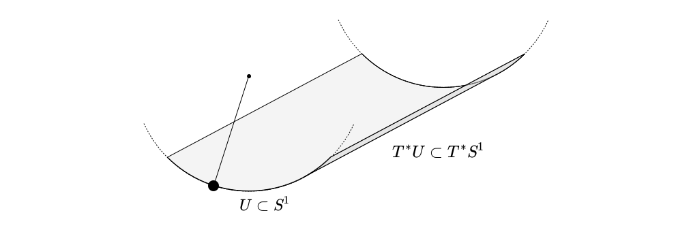
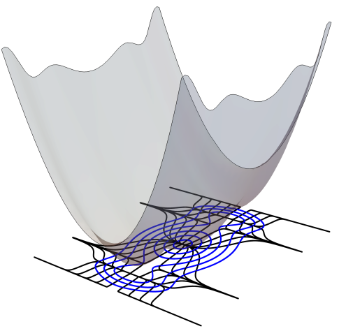
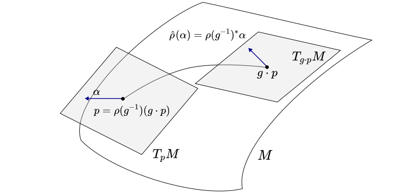

# Momentum

One of the first thing I learned in classical physics is the concept of momentum as $p=mv$. Over time I learned that this was a very small part of the story. Angular momentum, energy, magnetic moment, spin, stress, and others kept creeping up over time. While position was a relatively strightfoward concept to understand, through coordinates, momentum had so many different forms that didn’t seem to be compatible with each other.

The purpose of this is to describe a general form of momentum that when applied to different circumstances it becomes the appropriate quantity we are used to. Furthermore, we will do it in such a way that this will lend itself to the intricate way that momentum becomes messed up in quantum mechanics. 

We will use [differential geometry](../Geometry/Bundles.md) as well as [representation theory](../Geometry/Lie_Crap.md) to build up the concept of the **momentum map**. We will then play around with Noether’s theorem and give some examples.

[toc]

# Phase space

This will be done in the context of Hamiltonian mechanics. However, the only functional difference from Hamiltonian Field theory is that we allow for mathematical structures that are less rigid than smooth manifolds (like infinite dimensional manifolds, or vector bundles with with uncountably dimensional fibers). A more complete exploration of this with the structures encountered in field theory can be found [here](../Projects/CFT/Free_Fields.md#Phase_Spaces). For now we will restrict ourselves in the mechanics case. A complete version of this discussion is found in the following.

1. [An Introduction to Riemannian Geometry](https://link.springer.com/book/10.1007/978-3-319-08666-8)
2. [Quantum Theory for Mathematicians](https://link.springer.com/book/10.1007/978-1-4614-7116-5)
3. [Mathematical Methods of Classical Mechanics](https://link.springer.com/book/10.1007/978-1-4757-1693-1)

## Classical Mechanics Setting

**<u>Definition:</u>** A **phase space** is an even dimensional symplectic manifold $(P,\omega)$. Given any manifold $M$, we can define its **canonical phase space** $\pi: T^\ast M \to M$ as its cotangent bundle together with the **canonical symplectic** or **Liouville form**  $\omega = d\theta$ where $\theta \in \Omega^1(T^\ast M)$ is the **symplectic potential**, also known as the **tautological one-form** given for any $\alpha \in T^\ast M$ by
$$
\theta_\alpha \coloneqq \alpha \circ \pi_\ast.
$$
This looks super complicated so let's look at some familiar examples.

**<u>Example:</u>** *(Euclidean Phase Spaces)* Traditionally the configuration space of a particle (or a system of particles) is a point in some Euclidean space $\mathbb R^n$. The *canonical phase space* for this configuration is $T^\ast \mathbb R^n \cong \mathbb R^{2n}$, that we already know of. In particular consider some coordinate system in $\mathbb R^n$ given by $(q^1,q^2,\cdots, q^n)$ where $q^i:\mathbb R^n \to \mathbb R$ are smooth coordinate maps.

Then we know that the set of smooth vector fields $\{V_i\coloneqq\frac{\partial }{\partial q^i}\}_{i=0}^n$ forms a coordinate chart on $T^\ast M$ since at every point $q \in M$ we have that $V_{iq} : T^\ast_q M \to \mathbb R$. So we can formally define a coordinate chart for $T^\ast M$ like so:
$$
\alpha \in T^\ast M \mapsto (q^i(\alpha),p_i(\alpha)) \coloneqq(q^i\circ \pi(\alpha), V_{i\pi(\alpha)}(\alpha))
$$
where we have used some abuse of notation to define the coordinate functions $q^i:T^\ast M \to \mathbb R$ given by the pullback of the coordinates of $\mathbb R^n$by $\pi$, as well as defined the coordinate functions $p^i : T^\ast M \to \mathbb R$ given by  the standard "velocity vectors." 

> In physics, we usually pick $mV_i$ instead of $V_i$ for some positive mass $m$ and we are going to see soon why this would be a more natural choice in this setting. But nothing, so far, forbids us from using the $V_i$ basis.

Now we are ready to come up with the canonical  symplectic form of $T^\ast \mathbb R^n$. In our coordinate chart we can calculate it like so. We know that since $\theta \in \Omega^1(T^\ast M)$ it can be expressed, in our chart, as
$$
\theta = \theta_i dq^i + \theta^idp_i.
$$
where $\theta_i,\theta^i \in C^\infty(T^\ast M)$. To find these components we can use the fact that
$$
\begin{align*}
\theta\left(\frac{\partial}{\partial q^i}\right) = \theta_i && \theta\left(\frac{\partial}{\partial p_i}\right) = \theta^i.
\end{align*}
$$
Using the definition we can calculate that for any $\alpha \in T^\ast M$
$$
\begin{align*}
\theta_i(\alpha) 
&= \alpha \left(\pi_\ast\left( \frac{\partial}{\partial q^i} \right)\right)\\
&= \alpha \left( \frac{\partial}{\partial q^i} \right)\\
&= \alpha(V_i)\\
&= V_{i,\pi(\alpha)}(\alpha)\\
&= p_i(\alpha)
\end{align*}
$$
and similarly for $\theta^i$
$$
\begin{align*}
\theta^i(\alpha) 
&= \alpha \left(\pi_\ast\left( \frac{\partial}{\partial p_i} \right)\right)\\
&= \alpha \left( 0 \right)\\
&= 0.
\end{align*}
$$
As a result we can conclude that the sumplectic potential takes the form
$$
\theta = p_idq^i,
$$
implying that the Liouville is the familiar 2 form
$$
\omega = d\theta = dp_i\wedge dq^i.
$$
This is a the canonical phase space structure of any Euclidean space. We will soon talk about a much more general way to describe the canonical form of a *physical system* which could often differ from the canonical form of the configuration space.
$$
\begin{equation}\tag*{$\Box$}\end{equation}
$$
**<u>Example:</u>** *(The Oscillator)* To avoid introducing the horrid formalism in physics, we often describe the phase space of a pendulum as a $\mathbb R^2$ where one axis is the angle and the other is the angular momentum. This is a very nice thing to do (in fact it corresponds to the universal cover of the phase space) but we now have the tools to describe it completely.

A pendulum lives on a circle. In other words, the configuration space of a pendulum is $S^1$. We know that the tangent bundle is $T^\ast S^1 \cong S^1\times \mathbb R $ which makes sense for an intuitive point of view. In each angle the angular momentum can take any scalar value, but as the angle increases at some point it has to wrap around.

 Here is a picture of how it looks locally around a point.

$$
\begin{equation}\tag*{$\Box$}\end{equation}
$$

## Hamiltonian Vector Fields

The point of phase space is that given a point, I can tell you exactly how you will flow over time. But there is no time axis here, and to be honest we don't want to include it. Instead we will depict the flow directly. The way we do this geometrically is with a vector field. 

What we will develop here is a way to obtain that vector field from any Hamiltonian-like function. But since the Hamiltonian could be any function on our phase space, might as well generalize it for anything. Doing so we will get some pretty results concerning Lie brackets and so on.

**<u>Definition:</u>** For any smooth function $f \in C^\infty(P)$ on a phase space $(P,\omega)$ its **Hamiltonian vector field** $X_f \in \mathfrak X(P)$ is a vector field such that
$$
df = -\iota_{X_f}\omega,
$$
where $\iota_{X_f}$ denotes the contraction by $X_f$. Namely, for any $Y\in \mathfrak X(f)$
$$
Yf = \omega(Y,X_F).
$$
**<u>Proposition:</u>** For any $f \in C^\infty(M)$ a Hamiltonian vector field exists and is unique.

***Proof:*** Existence is guaranteed by existence of solutions of 1st order ODEs. Uniqueness is guaranteed by the nondegeneracy of $\omega$ as a symplectic form. 
$$
\begin{equation}\tag*{$\Box$}\end{equation}
$$
**<u>Example:</u>** *(Hamiltonian vector field of the Hamiltonian)* Let $H : T^\ast \mathbb R^n \to \mathbb R$ be a Hamiltonian in the Euclidean space we defined before. Then, its Hamiltonian vector field $X_H = X^i \frac{\partial }{\partial q^i} + X_i \frac{\partial }{\partial p_i}$ can be calculated similarly to the symplectic potential $\theta$. Namely, we know that
$$
\begin{align*}
-\frac{\partial H}{\partial q^j} 
&= \omega\left(X_H,\frac{\partial}{\partial q^j} \right) \\
&= dp_i \wedge dq^i\left (X_H,\frac{\partial}{\partial q^j}\right)\\
&= (dp_i \otimes dq^i- dq^i \otimes dp_i)\left (X_H,\frac{\partial}{\partial q^j}\right)\\
&= dp_i \otimes dq^i \left (X_H,\frac{\partial}{\partial q^j}\right)\\
&= X_j
\end{align*}
$$
and similarly,
$$
\begin{align*}
-\frac{\partial H}{\partial p_j} 
&= \omega\left(X_H,\frac{\partial}{\partial p_j} \right) \\
&= dp_i \wedge dq^i\left (X_H,\frac{\partial}{\partial p_j}\right)\\
&= (dp_i \otimes dq^i- dq^i \otimes dp_i)\left (X_H,\frac{\partial}{\partial p_j}\right)\\
&= - dq^i \otimes dp_i \left (X_H,\frac{\partial}{\partial p_j}\right)\\
&= - X^j.
\end{align*}
$$
Therefore the Hamiltonian vector field of the Hamiltonian is
$$
X_H = \frac{\partial H}{\partial p_i}\frac{\partial }{\partial q^i} - \frac{\partial H}{\partial q^i} \frac{\partial}{\partial p_i}.
$$
The cool thing to notice is that the integral curves of this vector field follow Hamilton's equations of motion! Another cool thing that we notice is that the Hamiltonian vector field can be calculated by applying the following linear transformation to the gradient
$$
X_H = 1\cdot \begin{pmatrix}0&1\\-1&0\end{pmatrix} \nabla H,
$$
which is a rotation by $\pi/2$! So since the gradient of the Hamiltonian points perpendicular to the level curves, the Hamiltonian vector field is pointing parallel to them. This means that its integral curves (i.e. the physical paths in phase space) are precisely the level curves of the Hamiltonian! Which proves that the Hamiltonian is conserved. Here is an example in $\mathbb R^2$.

In Grey is a 2D plot of a Hamiltonian, while in blue is a stream plot of its Hamiltonian vector field. In black is a stream plot of the gradient. We can see that the level curves of the Hamiltonian are the integral curves (streams) of its Hamiltonian vector Field. 
$$
\begin{equation}\tag*{$\Box$}\end{equation}
$$
**<u>Proposition:</u>** *(Properties of Hamiltonian Vector Fields)* Let $f,g \in C^\infty(P)$ and $a \in \mathbb R$. Then

1. $X_{f+a g} = X_f + aX_g$
2. $X_{fg} = gX_f + fX_g$.

We will soon use these properties to show that we can convert $C^\infty(P)$ into a Lie algebra. Another super interesting and useful theorem is the famous phase space conservation theorem.

**<u>Theorem:</u>** *(Liouville's Theorem)* For any $f\in C^\infty(P)$ on some phase space $(P,\omega)$ the volume form is invariant along its Hamiltonian vector field. Namely,
$$
\mathcal L_{X_f}\omega =0, \ \ \ \forall f\in C^\infty(P).
$$
***Proof:*** In this formalism the proof is very simple. We use the following
$$
\begin{align*}
\mathcal L_{X_f}\omega 
&= \iota_{X_f}d\omega + d(\iota_{X_f}\omega)
\end{align*}
$$
The first term vanishes because $d\omega = dd\theta = 0$ and the second term vanishes because $d(\iota_{X_f} \omega) = d(-df) = 0$.
$$
\begin{equation}\tag*{$\Box$}\end{equation}
$$
A very useful corollary in calculation is the following

**<u>Corollary:</u>** For any two Hamiltonian vector fields $A,B$ we have that
$$
[A,B] = X_{\omega(A,B)}
$$

## Poisson Bracket

With this insight we will introduce one of the most useful constructions of Hamiltonian mechanics. The Poisson bracket. 

**<u>Definition:</u>** Given two smooth functions $f,g \in C^\infty(P)$ on some phase space $(P,\omega)$ their **Poisson bracket** $\{\cdot,\cdot\} : C^\infty(P)\times C^\infty(P) \to C^\infty(P)$ is given by
$$
\{f,g\} \coloneqq \omega(X_g,X_f) = X_gf=-X_fg.
$$
We can think of the Poisson bracket as a measure of how similar the vector fields are in some sense. For example, if the functions are the same, then by the antisymmetry of $\omega$, their Poisson bracket vanishes. But that is not the only case when they vanish. Let's examine some cases.

Since $\{f,g\} = X_fg$, the Poisson measures the change of $g$ along the Hamiltonian vector field of $f$. This is naturally the opposite change of $f$ along the Hamiltonian vector field of $g$ which is verified by t the antisymmetry of the symplectic form. As a result we obtain the following familiar theorem.

**<u>Theorem:</u>** *(Hamiltonian Conservation Laws)* Given $f,g \in C^\infty(P)$ on some phase space $(P,\omega)$ iff
$$
\{f,g\} = 0
$$
then $g$ is conserved on the level curves of $f$ and vice versa.

Another very interesting theorem is the following.

**<u>Theorem:</u>** The Poisson bracket is a Lie bracket for $C^\infty(P)$ converting it into a Lie algebra over $\mathbb R$.

***Proof:*** The corollary from the previous section can be rewritten as $[X_f,X_g]=X_{\{g,f\}}$. Since we know that $[\cdot,\cdot]$ is a Lie bracket for the Hamiltonian vector fields (closure of the Lie subalgebra is guaranteed by the corollary), we can apply it directly to show
$$
\begin{align*}
0 
&= [X_f,[X_g,X_h]] + [X_h,[X_f,X_g]] + [X_g,[X_h,X_f]]\\
&= [X_f,X_{\{g,h\}}] + [X_h,X_{\{f,g\}}] + [X_g,X_{\{h,f\}}]\\
&= X_{\{f,\{g,h\}\}} + X_{\{h,\{f,g\}\}} + X_{\{g,\{h,f\}\}}\\
&= X_{\{f,\{g,h\}\}+ \{h,\{f,g\}\}+\{g,\{h,f\}\}}\\
\implies 0 &= \{f,\{g,h\}\}+ \{h,\{f,g\}\}+\{g,\{h,f\}\}.
\end{align*}
$$

$$
\begin{equation}\tag*{$\Box$}\end{equation}
$$

# Motion Using Lie Groups

We often think of motion in $\mathbb R^3$. We are in a position, a vector in $\mathbb R^3$ and then we pick a displacement, another vector in $\mathbb R^3$ to tell us where we will move to. We call that translation, and when a body is in motion it also translates with respect to a point. We also know that there is an associated momentum to translation. 

Intuitively, we can think of the motion of an object as applying successive translations, and the momentum associated to translation telling us how the translations we apply change along the motion.

Translations are not the only way of moving though! We could also rotate, flip, expand, and all sorts of weird things. In this section we will generalize what we mean by motion in our configuration space using the language of Lie groups. 

In the previous example, $\mathbb R^3$ is the Lie group of translations in the configuration space $\mathbb R^3$, and it acts on $\mathbb R^3$ by vector addition. We will generalize this for any Lie group now.

## Lie Group Actions

The way groups transform a configuration space is through Lie group actions. We will quickly introduce them, and then move forward to the nicer topic of Fundamental vector fields.

**<u>Definition:</u>** Let $M$ be a manifold and $G$ a Lie group, then a **Lie group action** is a smooth group homomorphism
$$
\begin{align*}
\rho: G\to \text{Diff}(M).
\end{align*}
$$
 Given a group action $\rho$ for every point $p \in M$ the subgroup 
$$
G_p \coloneqq \{g\in G \mid \rho(g)(p) = p\},
$$
is called the **group of stabilizers of** $p$. Further more, the **orbit of **$p$ is the set 
$$
O_p=G\cdot p = \rho(G)p \coloneqq\{\rho(g)(p) \in M \mid g\in G\}.
$$
Finally, the **oribit map** of a point $p\in M$ under the action of $G$ is the smooth map
$$
\begin{align*}
\phi_p:G&\to M\\
g&\mapsto \rho(g)(p).
\end{align*}
$$

Using a Lie group action, we can move the underlying configuration space. Here are some examples.

**<u>Example:</u>** *(Euclidean Translation)* Consider the action $\rho : \mathbb R^n \to \text{Diff}(\mathbb R^n)$ where in the standard coordinate system $\psi =(q^1,q^2,\cdots,q^n)$ it is given by 
$$
v \in \mathbb R^3 \mapsto \rho(v),
$$
where for any $p\in \mathbb R^3$ we have
$$
\rho(p) = (q^i(p) + q^i(v)).
$$
This is the standard way we translate stuff. But what happens when the manifold is a bit curved? Then we have options on how to translate. 

**<u>Example:</u>** *(Euclidean Rotation)* The set of rotations in $\mathbb R^n$ is describe by the group $SO(n)$ that comes with its defining representation that maps an element of the group to the corresponding matrix.

## Inducing Actions on the Cotangent Bundle

Ideally we would like to have a representation not only the configuration space, but also on the Phase space. This is something slightly harder to achieve. If the phase space is not canonical, then we have to figure it out by hand. However if we have an action on the configuration space and we want to lift it to an action on the phase space we absolutely can in a canonical way. Here is how to do it.

We start with formalizing the concept of an infinitesimal transformation. This is done by using the exponential map to induce a representation of the Lie algebra elements of the Group. A more in depth explanation is found [here](../Quantum_Fields/Conformal_Group.md#Infinitesimal-Transformations). In this section we will skip the details of the exponential map, and present the result with some useful properties.

**<u>Definition:</u>** A given a Lie group representation $\rho:G\to \text{Diff}(M)$ a **fundamental vector field** $\tilde X \in \mathfrak X(M)$ on $M$ related to a Lie algebra element $X\in \mathfrak g$ is a vector, such that at any point $p\in M$
$$
\tilde X_p \coloneqq {\phi_p}_{\ast,e}(X),
$$
 where $\phi_p : G\to M$ is the orbit map of $p\in M$ under the action of $G$.  

This means that for every Lie algebra element we can come up with a smooth vector field on $M$. It has interesting consequences. Perhaps the coolest of them is the following.

**<u>Theorem:</u>** Given a Lie group action of $G$ on $M$, the map $\psi: \mathfrak g \to \mathfrak X(M)$ given by $X\mapsto -\tilde X$, is a Lie algebra homomorphism.

This is great news because we can now lift the group action to an action on the tensor bundle.

**<u>Theorem:</u>** Let $\rho : G\times M\to M$ be a Lie group action on a smooth manifold $M$. Then $\hat \rho : G\times T^\ast M\to T^\ast M$ given by
$$
(g,\alpha) \mapsto \hat \rho(g)(\alpha) = \rho(g^{-1})^\ast \alpha,
$$
where $\phi_{g^{-1}\pi(\alpha)}$ is the orbit map of $g^{-1}\pi(\alpha)$ and $\pi : T^\ast M \to M$ is the canonical projection map of the cotangent bundle, is a Lie group action on $T^\ast M$. We call $\hat \rho$ the **lift of** $\rho$.

There are too many symbols on this theorem so here is a picture.

What we are essentially doing is using the representation to steal a one form form where we pick it up at $p = \pi(\alpha)$ to the new cotangent space $g\cdot \pi(\alpha)$. But since we need to use a pullback for a form, there is a nice map to choose which is the one that takes us from $g\cdot \pi(\alpha)$ to $\pi(\alpha)$. This map is $\rho(g^{-1})$, hence the pullback. 

## Symplectic Lie Group Actions

As a result, we now have a way to induce an action on the phase space, directly from the group. However, now that we are on phase space, we would like our action not to be anything! We would like to preserve the symplectic structure. Imagine doing a transformation in the base space that moves you to the left but for some reason switches your momentum to the right. This is not something physical so we need to be mindful of it. In other words we want our action to be symplectic.

**<u>Definition:</u>** Let $M$ be a manifold and $\rho: G\to \text{Diff}(M)$ is a Lie group action. Then $\rho$ is **symplectic** iff $\rho(g)^\ast \omega = \omega$ for all $g \in G$.

This has the following interesting consequences. 

**<u>Corollary:</u>** $\rho(g)$ is a symplectomorphism for all $g \in G$. Therefore the phase space volume is conserved under the action of $G$.

**<u>Lemma:</u>** The lifted group action to the tangent bundle together with the Liouville form is symplectic. 

***Proof:*** We need to show that $\hat \rho(g)^\ast \omega = \omega$ for any $g\in G$. This is rather intricate but there is a nice proof [here](https://people.math.ethz.ch/~acannas/Papers/lsg.pdf)
$$
\begin{equation}\tag*{$\Box$}\end{equation}
$$

# The Momentum Map

We are now ready to talk about momentum! The construction that generalizes the concept of momentum is called the *momentum map* and it is another sort-of-natural construction that we attach to the representation. 

## Definition 

Let's start with a small definition before we start writing examples and properties.

**<u>Definition:</u>**  Given a symplectic Lie group action $\rho : G \to \text{Diff}(M)$ on a symplectic manifold $(M,\omega)$, a **momentum map** $\mu:M\to \mathfrak g^\ast$ for the action of $G$ on $M$ is a map such that for any $X\in \mathfrak g$ 
$$
d\mu_X=\iota_{\tilde X}\omega.
$$
Here $\mu_X : M \to \mathbb R$ is notation for the smooth function on $M$ given for all $p\in M$ by $\mu_X(p)=\mu(p)(X)$ where $\mu(p) \in \mathfrak g^\ast$.

**<u>Lemma:</u>** *(Momentum map on Tangent Bundle)* Let $\hat\rho : G\to \text{Aut}(T^\ast M,\omega)$ be the lifted Lie group action on a smooth manifold $M$. Then there exists a unique (up to constant) momentum map for this action given by
$$
\mu_X = 
\iota_{\tilde X}\theta,
$$
 where $\theta$ is the canonical symplectic potential.

**<u>Lemma:</u>** If a momentum map exists, then there also exists a momentum map that is $G$-equivariant, where $G$ acts with the coajoint action (the dual of the adjoint action) on the Lie algebra. 

The existence of such a momentum map is not guaranteed however. As a result we have this definition.

**<u>Definition:</u>** A symplectic Lie group action that admits an equivariant momentum map is called a **Hamiltonian action.**

## Marsden–Weinstein Quotient

This is hard to visualize but it is an amazing tool to be able to play with. The momentum map attaches a momentum related to a Hamiltonian action on each point of the symplectic manifold. If the momentum is zero at that point, that means that this point is invariant under that action. Therefore, we can take an interesting quotient by removing the parts of the space that are not useful. This was done in [1974 by Marsden and Weinstein](https://www.sciencedirect.com/science/article/pii/0034487774900214?via%3Dihub). 

Before we write the theorem we need some extra properties.

**<u>Definition:</u>** A group action $\rho : G\to \text{Aut}(X)$ on some set $X$ is called **free** if for some $x\in X$ 
$$
g\cdot x = x \implies g = e.
$$
Furthermore, a Lie group action is **proper** if the map $G\times X \to X\times X$ such that $(g,x) \mapsto (x,g\cdot x)$ is proper (i.e. the preimage of compact sets is compact).

These are niceness properties for some group actions. The first one says that the only element that fixes any point in the target space is the identity. This includes things like rotations and such. The second one says that essentially, no point from infinity is mapped nearby. Most interesting actions in physics are free and proper. The reason for introducing this is because these are properties necessary for taking the nice quotient I mentioned. 

**<u>Proposition:</u>** Let $(M,\omega)$ be a symplectic manifold with a Hamiltonian Lie group action $\rho:G\to \text{Diff}(M)$ with momentum map $\mu: M\to \mathfrak g^\ast$, then $\mu^{-1}(0)$ is invariant under $G$.

***Proof:*** Since the momentum map is $G$-equivariant, then $\mu(g\cdot p) = g\cdot \mu(p) = 0$. Therefore $G\cdot \mu^{-1}(0) = \mu^{-1}(0)$. 
$$
\begin{equation}\tag*{$\Box$}\end{equation}
$$
Now we are ready to write the theorem.

**<u>Theorem:</u>** *(Symplectic Quotient Theorem)* Let $(M,\omega)$ be a symplectic manifold with a Hamiltonian Lie group action $\rho:G\to \text{Diff}(M)$ with momentum map $\mu: M\to \mathfrak g^\ast$, then if $\left.\rho\right|_{\mu^{-1}(0)} : G\to \text{Diff}(\mu^{-1}(0))$ is free and proper, the quotient $\mu^{-1}(0)/G$ by the orbits of $G$ is a symplectic manifold with symplectic form $\bar \omega = \left.\omega\right|_{\mu^{-1}(0)}$ such that $q^\ast \bar \omega = \omega$. This quotient is known as the **symplectic quotient** of $M$ by $G$ and it is denoted by $M/\!\!/ G$. 

**<u>Corollary:</u>** $\dim{M/\!\!/ G} = \dim M - 2\dim G$. 

So far this might not look like much, but physically this theorem allows us to isolate mechanical systems from one to the other. For example we can isolate the angular momentum from the position dependence to create a classical spin system, or we can isolate a system orbiting around a point and itself into two systems with their respective motions. Some cool examples are shown [below](#examples).

## Lie Algebra Representation

One of the most interesting results of this exploration is that we have come full circle. In particular, we are about to show that a Hamiltonian action of a Lie group preserves the structure of the Lie algebra in the momenta. As a result, all we really need to know to do Hamiltonian (and by extension quantum) mechanics is the structure of the underlying Lie algebra. This is an amazing result, so let's show it.

**<u>Theorem:</u>** Given a Hamiltonian representation $\rho : G\to \text{Aut}(M,\omega)$ with momentum map $\mu$,  The map $\bar \mu: \mathfrak g \to C^\infty(M)$ defined by $X\mapsto \bar \mu(X) \coloneqq \mu_X$ is a Lie algebra representation.

***Proof:*** We know already that $\mu$ is a linear map. The only thing we need to show is that it also preserves the structure of the Lie bracket. In other words
$$
\mu_{[X,Y]} = \{\mu_X,\mu_Y\}.
$$
To do so we will use the fact that $\rho$ is symplectic. Since it is symplectic the momentum map follows
$$
d\mu_X = \iota_{\tilde X} \omega \implies \tilde X = - X_{\mu_X}.
$$
Therefore we can now do
$$
\begin{align*}
X_{\mu_{[X,Y]}} 
&= -\tilde{[X,Y]}\\
&= [\tilde X,\tilde Y]\\ 
&= [X_{\mu_X},X_{\mu_Y}]\\
&= X_{\{\mu_X,\mu_Y\}},
\end{align*}
$$
which implies the claim.
$$
\begin{equation}\tag*{$\Box$}\end{equation}
$$

# Examples

So what is momentum? So far all we can say is that momentum is a quantity associated with a Hamiltonian action on phase space. Let's do some examples. 

## Lie Group as Configuration Space

We will start with a general case that is very useful. The case where the configuration space is a Lie group.

**<u>Example:</u>** *(Lie Group as a Configuration space)* Let $G$ be an $n$ dimensional Lie group. Therefore, there is a canonical action on itself by left multiplication. The action of $G$ is given by $\rho:G\to \text{Diff}(G)$ where $g\mapsto L_g$ where
$$
L_g(h) = gh \in G,
$$
is the left multiplication map on $G$ which is smooth by construction. Using the Lemma from the previous section we can construct a Hamiltonian action on $T^\ast G \cong G\times \mathfrak g$ as follows. For any $\alpha \in T^\ast G$ and $g\in G$ we have
$$
\hat \rho(g)(\alpha) = \rho(g^{-1})^\ast \alpha.
$$
Here is a really cool trick. We know that the fundamental vector fields of a basis of $\mathfrak g$, which in this case happen to be the left invariant ones, form a basis for each tangent space! Therefore we can write given a basis $\{X_i\}_{i=0}^n$ of the Lie algebra $\mathfrak g$
$$
\alpha = \alpha_i L_{\pi(\alpha)^{-1}}^\ast J^i,
$$
where $J^i \in \mathfrak g^\ast$ is such that $J^{i}(X_j) = \delta^i_j$.

As a result, we can calculate the lifted action by
$$
\begin{align*}
\hat \rho(g)(\alpha) 
&= \rho(g^{-1})^\ast \alpha\\
&= \alpha_i L_{g^{-1}}^\ast L_{\pi(\alpha)^{-1}}^\ast J^i\\
&= \alpha_i L_{(g\pi(\alpha))^{-1}}^\ast J^i.
\end{align*}
$$
This is pretty cool! We now have the action in terms of the generators! In fact we can now calculate the momentum map. Consider a specific element of the Lie algebra $X\in \mathfrak g$. Then from the previous lemma we know that for any point $\alpha \in T^\ast G$
$$
\begin{align*}
\mu_X(\alpha) 
&= (\iota_{\tilde X} \theta)(\alpha)\\
&= \theta_\alpha(\tilde X)\\
&= \alpha (\pi_\ast \tilde X)\\
&= \alpha ({L_{\pi(\alpha)}}_\ast X)\\
&= \alpha_i  L_{\pi(\alpha)^{-1}}^\ast J^i ({L_{\pi(\alpha)}}_\ast X)\\
&= \alpha_i  J^i ({L_{\pi(\alpha)^{-1}}}_\ast {L_{\pi(\alpha)}}_\ast X)\\
&= \alpha_i J^i(X)
\end{align*}
$$
So really the momentum is the component of the $J^i$ we just described!! That's really cool! In other words, we can fully define the momentum map as
$$
\begin{align*}
J : T^\ast G &\to \mathfrak g^\ast \\
(\alpha=\alpha_i L_{\pi(\alpha)^{-1}}^\ast J^i) &\mapsto \mu(\alpha) = a_i J^i, 
\end{align*}
$$
which implies that $\mu = L^\ast_{\pi(\cdot)}$. 

While this is super cool, there is more coolness to be uncovered. In particular, each $\mu_X \in C^\infty(T^\ast G)$ is the component function of the momentum by moving in the $X \in \mathfrak g$ direction. It would be nice to calculate Poisson brackets.

We know from the theorem in [this section](#Inducing-Actions-on-the-Cotangent-Bundle) that the fundamental vector fields are also Hamiltonian in this case. Therefore we can find which is the corresponding function that generates them. 

**<u>Proposition:</u>** For any $Y \in \mathfrak g$ we have that $\tilde Y = X_{\mu_Y}$.

This is awesome, because we can prove the following, really cool theorem

**<u>Theorem:</u>** For any $X,Y \in \mathfrak {g}$ the following identity holds
$$
\{\mu_X,\mu_Y\} = \mu_{[X,Y]}.
$$
***Proof:***  This is an application of the theorem we have proved previously. 
$$
\begin{equation}\tag*{$\Box$}\end{equation}
$$
This result is fascinating. It says that the component functions of the symmetry group maintain their Lie algebra relations! So we only need to identify the symmetry group in order to do physics with them on a phase space. 

An application of this is the following.

**<u>Example:</u>** *(Momentum of Translation)* This is a direct application of what we did before where we can actually calculate the momentum map. Consider that our configuration space is the Lie group $\mathbb R^n$ with coordinates $(q^1,q^2,\cdots, q^n)$. Then we can actually calculate the momentum map of the self left action (i.e. translation).

We pick as generators of the Lie algebra 
$$
V_i =\frac{\partial}{\partial q^i} \in \mathfrak X(\mathbb R^n).
$$
 Then we know that the symplectic potential is $\theta = p_i dq^i$, where $p_i(\alpha) = V_i(\alpha)$. Now can calculate the canonical momentum map like so.
$$
\begin{align*}
\mu_{V_i} 
&= \iota_{\tilde V_i} \theta\\
&= p_j \iota_{V_i} dq^j\\
&= p_j \delta_i^j\\
&= p_i.
\end{align*}
$$
Therefore the canonical momentum is $p_i$! And it has to follow the standard commutation relations which as a check we can do since we already know how to calculate them from the symplectic form.
$$
0 = \{p_i,p_j\} = \mu_{[V_i,V_j]} = \mu_0 = 0.
$$

**<u>Example:</u>** *(Angular Momentum)* Consider the configuration space to be $G=SO(3)$. This is the Lie group where each element is an orientation of an object in $\mathbb R^3$. Then we can proceed with calculating the momentum. 

Let's use the standard coordinate chart $\psi:SO(3) \to \mathbb R^3$ for $SO(3)$ given by
$$
 p\mapsto (\theta^1,\theta^2,\theta^3)
$$
such that $\theta^i$ is the rotation around each axis. Then, we know that the Lie algebra elements corresponding to each rotation are the generators $J_i$ with the familiar commutation relations
$$
[J_i,J_j] = \epsilon_{ijk} J_k.
$$
In such a way that we can write every element of $SO(3)$ as
$$
p = e^{\theta^i J_i}.
$$
Now we are ready to calculate the momentum components in terms of the angles. Now we know that in the coordinates where $p_i(\alpha) = \frac{\partial}{\partial \theta^i} (\alpha)$ that we have seen before, the Liouville form is given by
$$
\omega = dp_i\wedge dq_i = d\theta = d(p_id\theta^i).
$$
 However, we can now write the vector fields $\frac{\partial}{\partial \theta^i}$ in terms of $\tilde J_i$. 

By calculating the canonical momentum map in this setting we have:
$$
\begin{align*}
\mu_{J_i} = \iota_{\tilde J_i} \theta.
\end{align*}
$$

**<u>Example:</u>** *(Classical Phase Space of a Spin)* We want to create a Hamiltonian system that quantizes to a single spin system. The way we will do this is using the Symplectic quotient by the action of $SO(3)$. 

Consider the action $SO(3) \to \mathbb R^3$ given by its fundamental representation. If we consider the phase space $T^\ast SO(3)$ the fundamental representation canonically lifts to a Hamiltonian action in $T^\ast\mathbb R^3$ as we have seen previously. Let's call the momentum map $\mu : T^\ast \mathbb R^3 \to \mathfrak{so}(3)^\ast$ and find its kernel.

We know that
$$
\begin{align*}
\mu_X 
&= \iota_{\tilde X} \theta\\
&= \iota_{\tilde X} p_idq^i\\
&= p_i\tilde X^i\\
&= p_i {\phi_{\cdot}}_{\ast,e}(X)^i.
\end{align*}
$$
 Now lets see what points are in its kernel. Consider the point $x=(q^i,p_i) \in T^\ast \mathbb R^3$, and the generator $J_i \in \mathfrak g$ then we have:
$$
\begin{align*}
\mu_{J_j}(x) 
&= p_i\tilde{J_j}_x^i\\
&= p^T \tilde{J_i} q,
\end{align*}
$$
where $\tilde J_i = \rho_\ast(J_i)$ is the well known representation of the generators of the Lie algebra. They are listed here
$$
\begin{align*}
J_1 = \begin{pmatrix}0 & 0 & 0\\0 & 0 & -1\\ 0 & 1 & 0\end{pmatrix} &&
J_2 = \begin{pmatrix}0 & 0 & 1\\0 & 0 & 0\\ -1 & 0 & 0\end{pmatrix} &&
J_3 = \begin{pmatrix}0 & -1 & 0\\1 & 0 & 0\\ 0 & 0 & 0\end{pmatrix}.
\end{align*}
$$
 As a result, we see that the full momentum map has three components given by
$$
(\mu_{J_1},\mu_{J_2},\mu_{J_3}) = q\times p,
$$
where $q\times p$ is the canonical cross product between $q,p\in \mathbb R^3$. Now all we need to do is to find the kernel of the cross product between position and momentum. This is all the points where $q=\lambda p$ for any $\lambda \in \mathbb R$ are parallel. To be more precise
$$
\mu^{-1}(0) = \{(q,\lambda q) \in T^\ast \mathbb R^3 \mid \lambda \in \mathbb R, q\in \mathbb R^3\}.
$$
This looks suspiciously like the diagonal of $T^\ast \mathbb R^3$, but it is not, in fact we can see it with the following proposition.

**<u>Proposition:</u>** $\mu^{-1}(0) \cong \mathbb R^3 \times \mathbb R$.

***Proof:*** Consider the linear map $(q,\lambda) \mapsto (q,\lambda q)$.
$$
\begin{equation}\tag*{$\Box$}\end{equation}
$$
Now all we need to do is to see whether the restricted action of $SO(3)$ on $\mu^{-1}(0)$ is free and transitive. 

