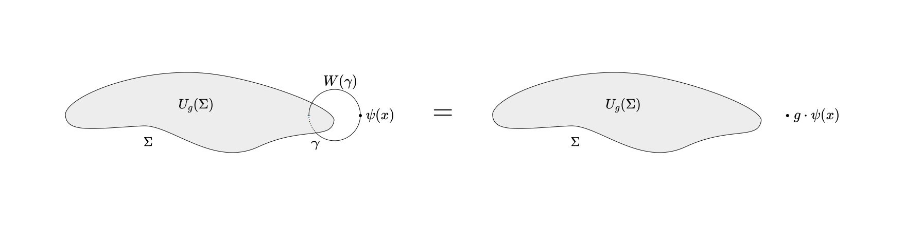

# Gauging

## Gauging Discrete Symmetries

Here we describe how to gauge discrete symmetries using the language of defects. The main idea is to find ways to construct modular invariant partition functions of a theory that remains unaffected by the addition of symmetry defects. Here are some references

1. [**Generalized Symmetries and their Gauging**](https://youtu.be/tj7JrjbclWA)
2. [**Generalized Global Symmetries**](https://arxiv.org/pdf/1412.5148)
3. [**Gauging Non Invertible Symmetries**](https://arxiv.org/abs/2311.17044)
4. [**Mathematical Gauge Theory**](https://link.springer.com/book/10.1007/978-3-319-68439-0)

Here are the contents.

\[toc]

## Defects on Open Manifolds

Gauging is facilitated by combining defects in a _particular type of network_. To build a network of defects we first need to learn how to glue them. As a result, we need to understand symmetry defects associated to _open_ manifolds.

### Closed Symmetry Defects and Gauge Fields

[Here](Symmetry_Defects.md#Implementing-Symmetry-Operators-by-Twisting) we have discussed how we can build defect operators on closed submanifolds by applying the symmetry action (aka "twisting") on the interior. Another equivalent way to think about this is to say that the addition of the defect corresponds to coupling the theory with a connection that is singular on the submanifold and flat everywhere else.

Let's see an example before we formalize.

**Example:** _($U(1)$ Symmetry for complex scalar fields)_ Consider a free complex scalar field $\phi : M \to \mathbb{C}$ on some Lorentzian manifold $M$. The corresponding Lagrangian $\mathcal{L} : C^\infty(M,\mathbb{C}) \to \Omega^1(M)$ is given by

$$
\mathcal{L}(\phi) = d\phi \wedge \ast d\phi.
$$

Notice that this Lagrangian is invariant under the group action $\rho : U(1) \to \text{Aut,}(C^\infty(M,\mathbb{C}))$ given by $\theta\cdot \phi = e^{i\theta} \phi$ for all $\theta \in U(1)$. Therefore we say that this theory has a **global $U(1)$ symmetry**. As a result, we can now implement the corresponding symmetry operator using a defect on a closed codimension-1 manifold $\Sigma \subset M$ by introducing the operator

$$
U_{\theta}(\Sigma) = \sum_{i \in I} (\theta \cdot \psi_i)\psi_i^\dagger,
$$

where ${\psi\_i}_{i\in I } \subset \mathbb{H}_\Sigma$ is a set of orthonormal states in the separable Hilbert space $\mathbb{H}_\Sigma$ corresponding to quantizing our theory on that slice, each corresponding to asymptotic field configurations $\psi\_i$. Such an operator insertion has the effect of treating the classical fields in the path integral as transformed in the interior of $\Sigma$. Let's denote the exterior of $\Sigma$ as $M^+$ and the interior as $M_-$. We can undo this transformation by performing the following gauge transformation $g:M\setminus\Sigma \to U(1)$

$$
g_{\theta}(x) = \begin{cases}0 & x \in M^+ \\ -\theta  & x \in M^-\end{cases}.
$$

One can easily check that our connection one form in $M\setminus\Sigma$ remains flat (since $dg = 0$ when restricted there), but on $\sigma$ we can take a the derivative in the distributional sense to find that it must include a $\delta$ function term. Specifically, we can write $\Theta\_\Sigma(x)$ the Heaviside function that is $1$ on $M^-$ and $0$ on $M^+$, and notice that $d \Theta\_\Sigma = \delta\_\Sigma d\Sigma$, where $d\Sigma$ is the normal vector field to $\Sigma$. Therefore, the connection one form such that this transformation is undone can be given by

$$
A = g_\theta^{-1}\delta_\Sigma\, d\Sigma,
$$

up to a sign that I can't really figure out at the moment. So in some sense the insertion of a defect on a closed surface $\Sigma$ corresponds to the coupling with this singular gauge field $A$!

$$
\begin{equation}\tag*{$\Box$}\end{equation}
$$

This realization is super cool! The idea of twisting the space is equivalent to inserting a singular gauge field. Let's summarize this in the following lemma. Let's introduce some notions first.

**Definition:** Let $P$ be a principal $G$ bundle over a Riemannian manifold $M$ for some connected matrix Lie group $G$, and $E$ is a vector bundle over $M$ associated to $P$ under the representation $\rho : G\to \text{Aut,}V$ on some vector space $V$. Then a choice of local gauge $\sigma \in \Gamma(P\_U)$ on some $U\subset M$ is **null** if the null gauge field $A \in \Omega^1(P\_U, \mathfrak{g})$ vanishes under pullback.

**Lemma:** _(Singular Connection Lemma)_ Let $\Sigma \subset M$ be a codimension-1 closed orientable submanifold, such that its interior is $M^-$ and its exterior is $M^+$. Then consider a null gauge $\sigma \in \Gamma(P\_U)$ on some $U\subset M$ and the physical gauge transformation $\tau:M \to G$ defined by

$$
\tau_{g}(x) = \begin{cases}1 & x \in M^+ \\ g^{-1}  & x \in M^-\end{cases},
$$

where $g\in G$ is some element of $G$. Then the corresponding local gauge field $A \in \Omega^1(U,\mathfrak{g})$ is given by

$$
A = (g-1) \delta_\Sigma\, d\Sigma.
$$

_**Proof:**_ This is an application of the transformation of local gauge fields under a physical gauge transformation $\tau : U \to G$ which is given by

$$
A' = \text{Ad}_{\tau^{-1}} \circ A+\tau^\ast \mu_G,
$$

where $\mu\_G$ is the Mauer Cartan form on the group $G$ given for any $X\_g \in T\_gG$ by

$$
\mu_G(X_g) = L_{g^{-1},\ast} X_g,
$$

where $L\_g$ is the left multiplication map on $G$ by $g\in G$.

$$
\begin{equation}\tag*{$\Box$}\end{equation}
$$

**Corollary:** The corresponding local gauge field is flat away from $\Sigma$.

_**Proof:**_ It vanishes away from $\Sigma$.

$$
\begin{equation}\tag*{$\Box$}\end{equation}
$$

### Opening Defects

Now that we have showed that we can write the action of defects as the coupling by some gauge field, we can try and extend it to symmetry defects defined on open submanifolds. The issue is that we don't expect it to be unique. There could be many possible connections that we can add that are compatible with consistency conditions such as gauge invariance, unitarity, global symmetry invariance, etc.

To get an idea of how we can restrict them check out the following picture.

If we insist on the inclusion of the open defect to be facilitated by the coupling with some gauge field, can now parallel transport charged operators along with that gauge field. We can see that if we parallel transport a charged operator insertion around the boundary of the defect $\Sigma$, along curve $\gamma$, then we will cross the bulk once.

In the picture above $W(\gamma)$ is the Wilson loop associated with the holonomy of $A$ around $\gamma$ given by

$$
W(\gamma) = \mathcal{P}e^{i\int_\gamma A}.
$$

> **Observation:** What we have motivated above is that when we open a defect we have a choice of possible symmetry operators that we can introduce on the same open submanifold. However, if we interpret the insertion of the defect as the coupling with a gauge field, we can see that not all gauge fields are possible. We have to use gauge fields that have holonomy $g$ around the boundary.

### The boundary of a defect is another defect

What we have written looks tantalizingly close to another defect! In fact we can say that the boundary of a defect is simply another defect that is charged under a representation of the same symmetry! In the case we have illustrated above, the defect $U\_g(\Sigma)$ ends on a defect supported on $\partial \Sigma$ that is charged under the representation of the group furnished by the corresponding parallel transport operator.

This means that we can start thinking of open defects as defects that end in other defects such that they satisfy some consistency conditions. We can also see that the set of defects that a topological $p$ dimensional defect (aka symmetry operator) can end on are a vector space of defects of dimension $p-1$. We will see soon that in the case of topological defect lines ($p=1$) that vector space contains point operators that in cases like **CFT** can form an actual Hilbert space by the state operator correspondence!

### So what is a Gauge Theory?

Now in order to understand gauging we need to understand what is a gauge theory. A QFT is called a **gauge theory** if it is invariant under gauge transformations. The coupling of gauge fields introduced by defects can be thought of as facilitating gauge transformations. Therefore a theory with a gauged symmetry is somehow invariant under insertions of the associated symmetry defects.

We can imagine this as obtaining the correlation function by averaging over all correlation functions with all possible symmetry defect insertions. However, as we will see, because of the fusion of defects, and their topological nature, most of the terms in this average cancel out.

## Gauging $\mathbb{Z}\_2$ in $\text{Ising}^{2}$

Let's walk through a concrete example in which we are gauging $\mathbb{Z}\_2$ in the $\text{Ising}^2$ CFT. We will try to work out the details of everything and then make some general statements before we abstractly discuss Gauging.

What we want to gauge is the $\mathbb{Z}\_2$ symmetry furnished by the defect lines $1, \sigma$ where $\sigma$ exchanges the operators in the two copies of the $\text{Ising}$ CFT. The algebra object we want to Gauge is

$$
A = 1 \oplus \sigma,
$$

with the only possible multiplication map $m$ and unit $u$. Note that we adopt the conventions $m \circ m^{\dagger} = \text{Id}_A$ which implies $u\circ u^{\dagger} = \langle A \rangle, \text{Id}_{1} = 2, \text{Id}\_{1}$.

### Finding the possible Half Gauging Interfaces

Interfaces $I$ are topological defect lines that serve as boundaries between the ungaged and gauged theories. Categorically these are $A$**-modules** since $A$ must end on them. The endpoint would be a map of the form

$$
\left(\rho : I \otimes A \to I\right) \in \text{Hom}(I\otimes A, I),
$$

which defines the multiplication map of $I$ as a right $A$-module. So to find the possible interfaces we need to find the possible right $A$-modules. An $A$ module can be invariant or variant.
