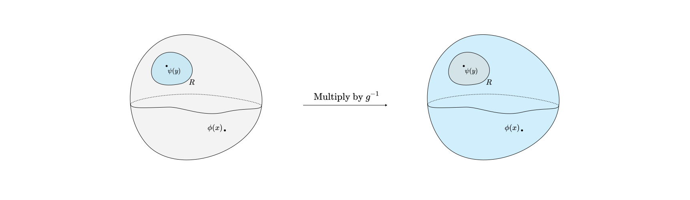
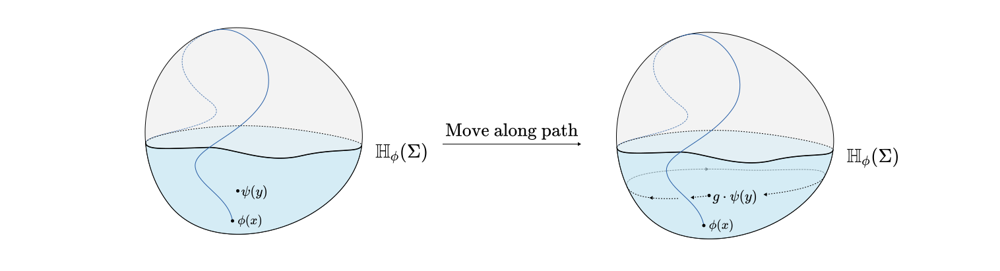
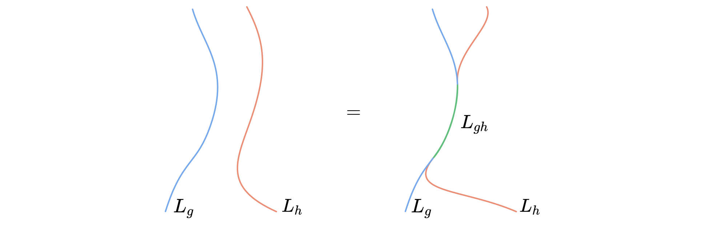
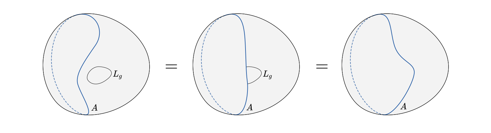
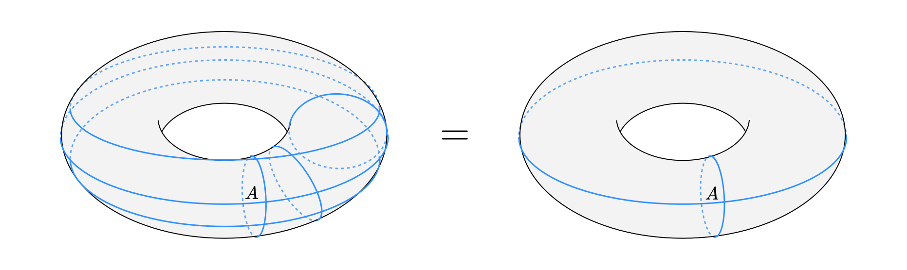
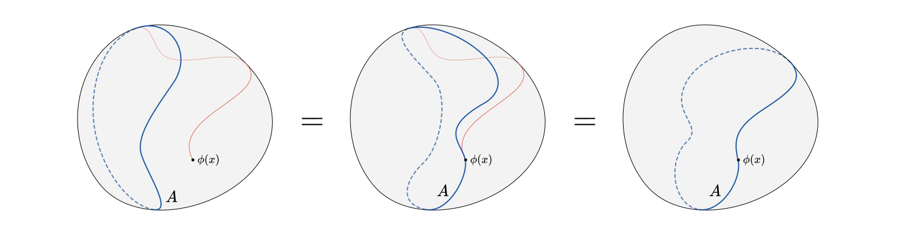
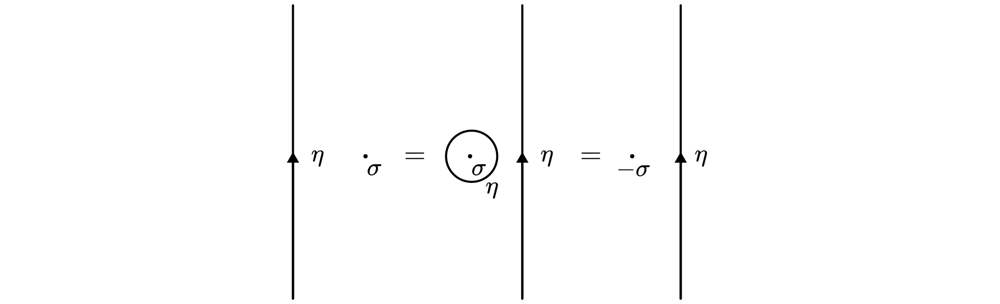
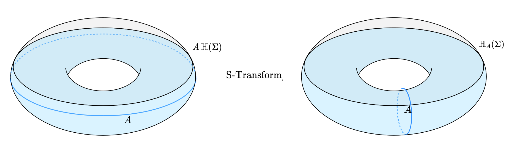

# Orbifolds

In the context of Quantum Field Theory an **Orbifold** is a QFT where we have gauged a finite group. This set of notes will introduce the idea of gauging finite groups, provide a historical disclaimer that bridges the early string theory view of orbifolds to the more modern interpretation, and finally provide calculation tools for a set of examples that we already know how to solve known as cyclic. We will also see what fails in the general case. 

Here are some resources or supplemental reading for these notes.

1. [The Operator Algebra of Orbifold Models](https://link.springer.com/article/10.1007/BF01238812)
2. [Gauging Non-Invertible Symmetries and the Generalized Orbifold Groupoid](https://arxiv.org/pdf/2311.17044)
3. [Operator Algebra of Cyclic Orbifolds](https://arxiv.org/pdf/2212.07678)
4. [Systematic Approach to Cyclic Orbifolds](https://arxiv.org/pdf/hep-th/9701061)

[toc]

## Historical Disclaimer

> **This section is here solely to clear up confusion with String Theory orbifolds.** They are the same thing, but the intuition surrounding how they're presented is not easily generalizable to the modern view of orbifolds. The rest of the notes are not going to use this chunk so feel free to skip.

The modern view of orbifolds, as QFTs with a gauged discrete global symmetry group, is not usually discussed in standard QFT/String Theory courses. People with the good fortune of taking a string theory class, however, had most likely encountered the term orbifold referring to a particular Conformal Field Theory (usually a version of free boson or free fermion) with some version of messed up boundary conditions.

To be more concrete, let's pick up the free boson. This is a conformal field theory, where the field we are quantizing is a way to assign an element of a real line on every point in spacetime. In the tradiational fashion of CFT we choose to think of lines as really big circles ([this is done for IR completeness reasons](../Defects/Twisting.md#Space-is-a-Circle)). As a result, for a string theorist, the classical field we quantize in a free boson CFT doesn't assign an element of a line everywhere, but an element of circle (with possibly infinite radius) instead. This creates a family of "free boson CFTs" classified by the radius of the circle the free boson itself is valued in.

The *orbifold* in this context arises if we consider the following. "Why not identify the antipodal points of the circle that the free boson takes values in?" In other words, instead of having the free boson assign an element of a circle at every point, why don't we fold the circle in a weird way, and have the free boson assign an element of that folded thing at every point. One is probably already screaming that what we really did was put boundary conditions on the values the boson can take. A mathematician would say that we replaced the circle with one of its orbifolds. And so the name stuck.

Turns out this can lead to a well defined (i.e. local, unitary, blah blah) Conformal Field Theory! *Unfortunately this is where the intuition stops.* What we secretly did when adding these boundary conditions on the free bosons, or swapping the target space with an orbifold, was actually gauging the discrete group $\mathbb{Z}_2$. However, this is not obvious from this construction. 

In the remaining of the notes, we talk about orbifolds from scratch without making reference to this construction. Once we define orbifolds using discrete gauging we will then make the connection between the two ideas.

# Gauging Discrete Groups?

I've mentioned a couple of times that Orbifolds are really gauge theories, where the group we are gauging is discrete. However, depending on how one thinks of gauge theories this might seem nonsensical. 

## Gauging Lie Groups

*This should really be called Gauging Lie groups with dimension* $\geq 1.$

Usually, "gauging a global symmetry" means the following. Use your Lagrangian $\mathcal{L}$ to identity a Lie group $G$ that acts on the fields of your theory in such a way that the action $S$ remains invariant. For $G$ to be a **global symmetry**, it has to satisfy an extra requirement. The way it acts on the values of the fields, does not depend on which point one considers. Such actions could be anything from spacetime transformations moving the fields around when the action only depends on their derivatives, changing the value of the fields by a phase in a Lagrangian where every field is multiplied to its conjugate, and so on. 

Once you have identified your global symmetry $G$, the idea is to take your original theory, do some clever manipulations to it, and generate a different one that has following property. Anything you can calculate in the new theory, should not change if you act with $G$ in a random small region in spacetime. This means that $G$ is now a **local symmetry**. The process of converting global to local symmetries is called **gauging**.

If $G$ is a Lie group, we have developed advanced tools to help us gauge it. In practice, we introduce a **Gauge field** whose purpose is to alter how the derivatives act on fields in specific regions of spacetime. The idea is that for any calculation you want to do, you average over the copies of the calculation with all possible gauge fields. Then the result would not change if you act with $G$ in a specific region.

## Why Averaging Works

The reason why this is true is worth paying close attention to when it comes to generalizing this idea to discrete groups. So let's look at an example outside of QFT for a second.

Consider the group $G=\mathbb{Z}_2 \times \mathbb{Z}_2$. This has 4 elements $G=\{1,a,b,ab\}$. Now consider a matrix reprentation of it $\rho: G \to \text{Aut}(V)$ to some finite dimensional vector space $V$. Check this out! Define the "average" $A \in \text{Aut}(V)$ of $G$ like so
$$
A = \rho(1) + \rho(a) + \rho(b) + \rho(ab).
$$
Now $A$ **is an operator on $V$ that is invariant under** $G$! Say you take an element $a \in G$, then you can see that
$$
\rho(a) A = \rho(a) \rho(1) + \rho(a) \rho(a) + \rho(a) \rho(b) + \rho(a) \rho(ab) = \rho(a) + \rho(1) + \rho(ab) + \rho(b) = A.
$$
Any element in $G$ can **at most permute** $A$. While this example is trivial, this is how summing over all Gauge fields turns $G$ into a local symmetry in the Gauged theory.

Anything you calculate in a gauged theory will contain sum over copies of the calculation but with all possible gauge fields you can put.  Pick a region in spacetime, and act there with $g \in G$. Then, out of all the possible gauge fields, there must be one that undoes the action of $g$ in that region. The copy of the calculation that uses that one, will be permuted with the one that had the do nothing gauge field. The one that had the do nothing gauge field, will be permuted with the gauge field that made it look like in that region there is a $g$ action and so on. The overall result after averaging over all possibilities is the same.

In practice there are a lot of things to consider when extending the above intuition to a healthily defined QFT. Often one needs to account for degeneracy in the possible $A$ fields which has the side effect of introducing ghosts, or one might find that after gauging a group the resulting theory fails to even have unitary time evolution (this could happen when gauging certain Lie groups that are not compact). Subtleties aside, when it works, that's why it works.

## The Problem with Discrete Groups

At this point, it is natural to say: "Ok, let's gauge a discrete group in an identical way. Find all the gauge fields that correspond to its action and then sum over them." In fact, a lot of textbooks would say exactly that. However, that is really an abuse of notation, and there are a couple of meaningful subtleties for us to take into account.

1. **The Lie algebra of discrete groups is 0 dimensional.** The traditional techniques we have for gauging Lie groups tells us that gauge fields are valued in the Lie algebra of the group we want to gauge. So it seems that there really aren't many gauge fields for a discrete group. They're all zero. This is partly true, and examining the consequences of this intuition will give us an answer for how to gauge a discrete group.
2. **There are QFTs with no Lagrangian.** How do we even begin to think about gauging in those?

Both of these observations motivate us to more carefully examine gauge fields, and perhaps indicate that we should try to rethink of how we *couple a gauge field* to our theory. Thankfully, we have an answer to both, and that is **defects.** 

# Gauging Discrete Groups using Defects

A topological defect is so closely related to a coupling of a gauge field to a QFT (some people say that it straight up is that). In our case, it is the perfect alternative alternative viewpoint of the same thing to help us reframe how we think about gauging. A quick review of topological defects for symmetry purposes can be found [here](../Defects/Symmetry_Defects.md). For the purposes of these notes, we will only use the intuition of the first section in that reference. 

## 10s Review of Symmetry Defects

Defects can help us make precise the idea of a *Symmetry Operator* in a QFT. Imagine you have a global symmetry $G$ that acts on a QFT that lives on a spacetime $M$. For simplicity let's consider a 2 dimensional conformal field theory. One thing you might want to calculate, is correlation functions that involve insertions of a couple quantum fields $\phi,\psi$ at some points $x,y \in M$. Something like this
$$
F(x,y) = \langle \phi(x)\psi(y) \rangle.
$$
You know though, that since $G$ is a global symmetry gourp, its elements $g\in G$ have the property that 
$$
F(x,y) = \langle g\cdot \phi(x)\ g\cdot \psi(y) \rangle,
$$
where $g\cdot \phi$ denotes the field $\phi$ after being transformed by the action of $g$. Ok so that's not really useful to calculate because tranforming the fields did nothing. But what about this?
$$
F' = \langle \phi(x) g\cdot \psi(y) \rangle.
$$
In general we shouldn't expect that $F' = F$ because we didn't transform both fields, we only transformed one. 

> This can be thought of as applying the global symmetry in a region $R$ that contains $y$ but not $x$. This way only insertions at $y$ will be transformed by the global symmetry. There is no reason to think that that messed up non global application of the $G$ action would still be a symmetry of the theory.

This leads to an interesting question. Is there an operator associated with this half-implementation of the symmetry associated to $g\in G$ restricted in the region $R$? In other words we're looking for an operator $U_{g,R}$ such that
$$
U_{g,R} \psi(y) = g\cdot \psi(y) U_{g,R}.
$$
The realization that is key to help us understand that object better is that since $g \in G$ is a global symmetry, the correlation functions would stay the same if $U_{g,R}$ transformed all insertions inside $R$ or all insertions outside it in $M{\setminus} R$. The only difference between the two cases is a global application of $g^{-1} \in G$ which doesn't affect correlation functions. Therefore the only real data of interest in the Region $R$ is weather an insertion crossed its boundary, which is a **line** (in 2 Dimensions).

This is what people mean when they say, that a global symmetry operator is a codimension 1 topological defect. In this case, if we call $L = \partial R$ the boundary of $R$, then we can associate an operator $U_g(L)$ to it in such a way that when field insertions cross it, they pick up the action by $g$. In other words
$$
U_g(L) \psi(y) = g\cdot \psi(y) U_g(L).
$$
We call $U_g(L)$ a topological defect line or topological defect operator, though sometimes people would straight up denote it as $L_g$ or even $g$ when $L$ is clear from context.

One last interesting point, is that if we fix the point $y$, we can freely, but still continuously, deform $L$. As long as it doesn't cross any other operator insertions, the correlation function would not even know! It is in this sense, that the operator $U_g(L)$ is topological. It is called a defect because it has this singular action concentrated in the line $L$. 

> It is worth reflecting on what we created. The topological defect line $U_g(L)$ seems to do to our fields what a gauge field would do. It applies the global action of $g$ in a random region in spacetime enclosed by $L$!

### Interlude: What happens when $L$ has endpoints? & Twist Fields

So far we have considered defect operators that are associated with boundaries of regions in our 2D CFT. One might wonder if it is possible to consistently define a defect operator on a Line that is not the boundary of something, or in other words, a line with endpoints. 

It is not unreasonable to conceive such an operator. In fact, we already know a lot about hot it behaves. If we insert it in a calculation of a correlation function, then when other insertions cross the line, they still feel the action of the group. The line (with the exception of the end points) is still topological even if the endpoints must remain fixed.

The real confusion is what happens at the endpoints. Since the Line is singular as hell, the endpoint of it will also be something akin to a singular point. At this moment it is important for us to realize, that we in fact know how to treat singular point insertions in QFT. We call them local operators. Field operators, like $\phi(x)$, are this kind of objects. In some sense, the end of a defect has a lot in common with a field operator. One needs a point to completely define it, and one should expect that correlation functions change as you change the point. The only difference is that if you take a true point-like (or local) operator and do a full circle around the endpoint you would inevitably cross the defect picking up an action of $g$. 

So how can we think of the endpoints of the defects? We can think of them as point-like operators but with the particular monodromy (or branch cut) defined by the defect line. 

**These operators are not local.** The reason being exactly that monodromy condition. Their OPEs have branch cuts! From an operator content point of view, while field operators would appear in the set of local operators of the theory, defects with endpoints would not!

We have already encountered some defect endpoint operators when studying Renyi entropies. We called them **twist fields**. In fact twist fields corresponding to global symmetry actions play such a major role in gauging. They are often quite hard to find, and the reason why discrete gauging is not solved is because we don't have a process of figuring out twist fields in general. We will soon see examples of calculating them in theories where orbifolding is solved. 

For now, the key thing I want to elude to without justification is while such twist fields are not local operators in the main theory, they become local operators in the orbifold. Which is why calculating things like Renyi entropies in the orbifold as correlation functions of defect operators, not only makes sense, but is also tractable.   

## Summing Over Networks of Defects

With this interlude over, let's go back to the realization in the last box. Using idea that applying a global symmetry in some random region enclosed by $L$ is the same as inserting a topological defect line at $L$ we can rephrase what we mean by a gauge theory.

A gauge theory in this language is a QFT where anything we can calculate remains the same, if we insert an arbitrary topological defect line associated to a global symmetry $g \in G$. The answer to achieving this is fusion.

Two defects corresponding to two group elements $g,h \in G$ have the property that when the lines they are associated to merge to a single defect corresponding to the group element $gh \in G$. Here is a picture that explains it.

So what if we could find a defect $A$, that remains invariant under under fusion? If so we could create a mesh of $A$ defects, put it on our theory, and then every time we insert a defect line, we can deform it until it gets absorbed by $A$. This way it would be as if nothing had ever happened. Here is a picture.

But what should that $A$ be? We have already encountered it! Let's say we have a global symmetry $G =\mathbb{Z}_2 \times \mathbb{Z}_2 = \{1,a,b,ab\}$, where the action of the symmetry group is defined for any $g \in G$ using defects $L_g$ on a line $L$ in the 2D CFT example we have been working with. Then check out this defect
$$
A = \frac{1}{4}(1 + L_a + L_b + L_{ab}).
$$
We have already seen how the fusion of A with any defect corresponding to a $G$ element, will only permute the terms of the sum, and have no real impact in the theory. By the way, the $\frac{1}{4}$ is there so that $AA = A$, what this means in practice is that if we insert a copy of $A$ in a correlation function along with other insertions collectively called $X$, then we have to calculate
$$
\langle XA \rangle = \frac{1}{4}\left(\langle X \rangle + \langle XL_a \rangle + \langle XL_{b} \rangle + \langle XL_{ab} \rangle\right),
$$
 which is so dangerously close to averaging over all possible defect configurations that correspond to $G$. Just by inserting any $A$ along any line we have summed over the elements of the group. But in principle to average over all possible defect configurations, we need to sum over all lines too. 

That might seem like we took one step forward and 2 steps back because summing over all lines is insanely complicated. That is until we realize that we don't need to do that. Most complicated meshes of $A$ defects that we can come up to absorb $G$ defects, will eventually all merge into pretty much just one configuration. Let's see an example in the torus.

 

This is an incredible result, and also really enlightening in actually calculating the orbifolds. In fact this generalizes for any finite abelian group $G$ by considering
$$
A = \frac{1}{|G|}\sum_{g\in G} L_g.
$$

## Orbifolds Get Rid of Local Fields

Before we proceed with the actual calculation, we have developed a really robust framework to guide our intuition. It would be a shame not to use it to predict what we expect from our calculations.

Just by $A^2 = A$ we understand that $A$ serves as a projector to the invariant subset of the group action. For the simplest example consider $G=\mathbb{Z}_2 = \{1,\sigma\}$ and take a field such that $L_{\sigma} \phi = - \phi L_\sigma$.  Since in this case $A = \frac{1}{2}(1 + L_\sigma)$ we see that
$$
A\phi = 0.
$$
In other words, if $\phi$ crosses an $A$ defect line it vanishes (I am realizing that I have been using defect operator, defect line, and line interchangeably. They all mean the same thing, but sorry for the confusion).

Since we can freely deform $A$, because of its topologicalness, any insertion of $\phi$ in the gauged theory will automatically spit out a zero in any correlation function. It is as if the field $\phi$ from our original theory doesn't exist anymore.

This generalizes. The only fields (or states) that will survive gauging are the ones that are invariant under the action of $G$. From a conventional gauge theory point of view, this is pretty straightforward. But what might not be, is the following.

## Orbifolds Introduce New Local Fields

This is the trickiest part of orbifold calculation. In the interlude above we explored how a defect operator can end at specific points onto which we attach something like a point-like operator but with a monodromy condition that makes it have non-local OPEs.

However, in the presence of an $A$ mesh, the tail can be completely absorbed in $A$! In other words, the monodromy would stop appearing and what was previously a nonlocal field, that we wouldn't include in the field content of our ungaged theory, is now a perfectly local operator in the Gauged theory.

This is a blessing and a curse. It is a blessing because we have all this machinery of working with local operators so it would be nice to convert a nonlocal calculation to a local one by moving to the orbifold (which is what we do in Renyi entropies). It is a curse though because in order to even find the orbifold we need a way to take a theory and find all of its operators that could have a brunch cut in order to see which of them appear in the orbifold out of nowhere. This is not solved and can be quite involved even for relatively simple theories.

But with these main things done, we are ready to start calculating.

# Calculating Orbifolds

So far everything here is pretty general. We only used a 2D CFT as a playground to draw some pictures, but these arguments hold in most QFTs. But even though they hold, actually calculating them in a general QFT setting is a nightmare. So in this section we will do some calculations in a particular subset of CFTs known as *Rational*. For Rational CFTs we have figured out how to gauge any finite abelian group which is pretty nice! 

Rational CFTs include bosonic CFTs encountered in string theory, free fermions, almost all of the 2nd order phase transitions in Statistical mechanics, plus they are what pretty much everything flows to under RG so it's a wide enough class for figuring out orbifolding is not a minor thing. We will first start with a very simple example, the Ising model which has the property that it is its own orbifold. Once that is done, we will introduce aspects in the calculation of cyclic orbifolds, in other words gauging $\mathbb{Z}_n$ in any Rational CFT. We'll see how to calculate twist fields, as well as find their conformal weights and correlation functions.

*This section requires some more CFT terminology like primary fields, modular invariance, S-matrix (the modular not the scattering one), and Chiral Algebras as well as some familiarity with the state operator correspondence*.

## The Ising Orbifold

Here is why the Ising CFT is the easiest example to orbifold. Unlike something like a free boson, which has infinite primary fields (all the modes of the free boson), the Ising CFT has **three**, one of which is the freaking identity. They are usually called

1. $1$: The **identity** operator.
2. $\sigma$: The **spin** operator. The operator that probes the spin at a particular point.
3. $\varepsilon$: The **energy** operator. The operator that probes the energy at a particular point, 

and have conformal weights
$$
\begin{align*}
h_1 = \bar h_1 = 0 && h_\sigma = \bar h_\sigma = \frac{1}{16} && h_\epsilon = \bar h_\epsilon = \frac{1}{2}.
\end{align*} 
$$
Every other field in the theory is a Virasoro descendant of one of these three. In fact we often write the Hilbert space of the Ising model like this
$$
\mathbb{H} = \left(V_{0} \otimes \overline{V_{0}}\right) \oplus \left(V_{\frac{1}{2}} \otimes \overline{V_{\frac{1}{2}}}\right)\oplus \left(V_{\frac{1}{16}} \otimes \overline{V_{\frac{1}{16}}}\right)
$$
where $V_h$ corresponds to an irreducible Virasoro representation with $c=\frac{1}{2}$ and highest weight $h$, and $\overline{V_h}$ is the same Virasoro representation but for the antichiral part. If thinking in terms of Virasoro representations is unfamiliar, essentially one can think of the module
$$
V_h \otimes \overline{V_{h}},
$$
as the vector space that takes a primary $\phi$ with conformal weights $h=\bar h$ and creates the rest of the states by applying Virasoro generators to it. For example $L_{-5} L_{-3} L_{-1} \phi  \in V_h \otimes \overline{V_{h}}$. Some people refer to $V_h \otimes \overline{V_{h}}$ as a **conformal family,** or the set of **Virasoro descendants** of $\phi$, or the set of secondary fields related to $\phi$. In Ising there are only 3 primaries, so there are 3 sets of descendants.

One symmetry of the Ising orbifold is the spin flip. This is a $\mathbb{Z}_2$ symmetry that is responsible for $\sigma \mapsto -\sigma$. The operator that facilitates that symmetry is called the **spin flip defect** and it is usually denoted by $\eta$ (where the reference to the line remains implicit). The spin flip defect satisfies the following relations
$$
\begin{align*}
\eta 1 &= \eta\\
\eta \sigma &= -\sigma \eta\\
\eta \epsilon &= \epsilon \eta. 
\end{align*}
$$

> [!TIP]
>
> Here is an example for how to read these relations. The relation $\eta \sigma = -\sigma \eta$ is that if we have an insertion $\sigma$ at some point in spacetime, and then we move it across the $\eta$ defect, then $\sigma$ will pick up a minus sign. In this case we see that the $\eta$ defect does nothing on all primaries except flipping the sign of $\sigma$.

Here is a picture of the above relations. 

### Local Operators that Survive in the Orbifold

Let's try to gauge the $\mathbb{Z}_2$ furnished by the spin flip defect $\eta$. Our projection defect $A$ is now given by
$$
A = \frac{1}{2} \left( 1  + \eta \right).
$$
The first step we have to do is to see which operators from the original Hilbert space would survive. These are the invariant operators under the $\mathbb{Z}_2$ action, which are therefore $1$ and $\epsilon$, or to be more precise, the only modules that will appear in the orbifold are
$$
\left(V_{0} \otimes \overline{V_{0}}\right) \oplus \left(V_{\frac{1}{2}} \otimes \overline{V_{\frac{1}{2}}}\right).
$$
However, as we said before, operators that were nonlocal in Ising, might become local in the orbifold! So we need to somehow find all the nonlocal operators in the Ising model with monodromy $\eta$. In other words we need to find any operator that has a branch cut that acts like $\eta$ on local fields.

### Nonlocal Operators that Turn Local in the Orbifold

This is not easy to do in general. However, in the Ising model (and all other minimal models), modular covariance of the theory fully restricts the kind of defects one has available. So let's take a momentary detour to see how.

State operator correspondence is a thing in CFT, which means that if you know the Hilbert space at some slice, you can reconstruct the operators used to create these states. So we will shift our attention to look for the Hilbert space at some spatial circle instead. Let's go on the sphere, and consider what would it mean to add one of these nonlocal defect operators that have endpoints. 

Consider an $\eta$ defect line that starts at the origin and goes radially outwards to infinity. Since the line starts at the origin there must be one of those special nonlocal operators with monodromy $\eta$ attached to it. If we were able to somehow find the Hilbert space in some circle, we would know all the possible operators that could have been placed at the end of the defect located at the origin! That is because by operator-state correspondence insertion of the operator at the origin creates a unique state. 

This is where modular covariance comes in. One of the most amazingly powerful results of CFT, is that in a modular invariant theory, one can consistently define it in any Riemann surface and the Hilbert space remains the same! As a result, we can pinch the poles of the sphere together, and add it on our torus. On its face this might not seem to help us calculate the Hilbert space, but we remember modular covariance. On the torus, the S-transformation exchanges the two cycles. So we can use the S transformation to map between the defect placed on one cycle vs the other. Doing so help us tremendously, because we actually know how to calculate the Hilbert space with the defect inserted in the other cycle. Once we do that, we simply S transform that, and we obtain the Hilbert space with the defect inserted along the original cycle! This requires a lot of pictures to make sense, so here they are.

Using pain and some things beyond the scope of these notes, one can calculate that the modular transformation of the original Hilbert space in the presence of the $\eta$ vector is given by
$$
\mathbb{H}_{\eta} = \left( V_{\frac{1}{2}} \otimes \overline{V_{0}} \right) \oplus \left( V_{0} \otimes \overline{V_{\frac{1}{2}}} \right) \oplus \left( V_{\frac{1}{16}} \otimes \overline{V_{\frac{1}{16}}} \right).
$$
We usually call the Hilbert space $\mathbb{H}_\eta$ that contains the states created by defect insertions the **Twisted Hilbert space** or the **Twisted Sector**, and the operators with the lowest conformal weight (the closest thing there to a vacuum operator) the **Twist Fields**, or twisted vacuums (vacua?). Now, all of these operators will appear local under $A$ insertions, because $A$ will absorb their tail! The only question is to figure out which ones don't also get annihilated by crossing an $A$ defect. In other words, which ones are invariant under the action of $\mathbb{Z}_2$.

Figuring out the action of $\mathbb{Z}_2$ on the twisted fields is not obvious. Yet, modular invariance can save us again! Here is a picture of what happens when we enclose one of the twisted fields with an $\eta$ defect (notice that twisted fields refer to any field we can put at the endpoint of $\eta$, whereas twist fields is specifically the one(s) with the lowest conformal weight).

It looks like we twisted (like an actual grab and rotate twist not a theoretical twisted operator twist) the sphere around the poles, which would correspond to the $T$ transformation on the torus! So to find out how the defect $\eta$ acts on the states of the torus, we need to just $T$ transform the twisted Hilbert space! The phases the different modules acquire after the $T$ transform would be the action of the $\eta$ defect on the corresponding primary twisted operators. Here is a picture.

Finally using the $T$ transformation, we obtain that the only invariant subspace when we place an $\eta$ insertion is $V_{\frac{1}{16}} \otimes \overline{V_{\frac{1}{16}}}$. So we can finally combine whatever we get from the twisted Hilbert space with what we got from the untwisted to obtain
$$
\mathbb{H}_{\text{orb}} = \left(V_{0} \otimes \overline{V_{0}}\right) \oplus \left(V_{\frac{1}{2}} \otimes \overline{V_{\frac{1}{2}}}\right) \oplus \left( V_{\frac{1}{16}} \otimes \overline{V_{\frac{1}{16}}} \right) = \mathbb{H}
$$
which is **equal to the unorbifolded Ising Model**! This is not something that happens in general, this example of CFT and defect, was chosen specifically so we observe that. If we were to try to gauge a different symmetry of the Ising model we wouldn't get back the same thing. But this leads to an interesting concept.

## Gauge Duality

Oftentimes people refer to gauging in a CFT as some form of duality. However, in face value, it seems like gauging would remove information from the theory, since we took a global symmetry and made it local, effectively projecting out states (or fields) that were not invariant under the global symmetry. However, we caught a glimpse of how we both lose information, by projecting out, but also gain information, by including things from the twisted sectors.

> In some sense, gauging simply rearranges the content of our theory. It doesn't remove any information.

Since we didn't lose any information overall, we could in principle undo gauging. A general fact is that if we take a theory and gauge some group $G$, then there must exist a different group $G'$ that we can gauge in the gauged theory such that we return back to the original one.

It is in this sense that people refer to gauging as a duality. It can help us map between different theories with the same "content." This is really fascinating, but these notes are way too long already and I need to calculate things about cyclic orbifolds. There is a reference at the top.

# Cyclic Orbifolds

While symmetries of minimal models are fun to gauge, they are not as universally used as cyclic orbifolds. These have great applications in the calculation of Renyi entropies as well as other areas of QFT like classifying RG flows, and more. Let's start though by thinking of them as their own thing first. 

## Roadmap

Calculating  an orbifold really means finding its operator content. If we have that, then we can calculate correlation functions, partition functions, and whatnot. Let's take a second to review how we did it in the Ising case, and point out what we need to take care of now.

1. We start with a rational CFT with Hilbert space $\mathbb{H}$ on a circle. Rational means that it has at most a finite number of primary fields with respect to the algebra of conserved currents (i.e. the current algebra) of the theory. If that doesn't ring a bell, it is not important right now, one can still think of Ising as an example, which is a special type of rational CFT.

2. We then take $q \in \mathbb{N}$ copies of the theory. This really means that the Hilbert space of the new theory is $\mathbb{H}^{\otimes q}$. We call that the **folded theory** because we "folded" it $q$ times. 
3. We define a permutation symmetry for our copies. In other words, one symmetry of the fold theory is to permute the copies of the original theory. Correlation functions wouldn't even know about it. The symmetry group is $\mathbb{Z}_n$ (or $S_n$, but in this case we can calculate everything in the $\mathbb{Z}_n$ orbifold instead)
4. Find out the defects that correspond to $\mathbb{Z}_n$.
5. To find the operator content, project out the states that are not invariant under $\mathbb{Z}_n$ from the original Hilbert space.
6. Find out what the twisted Hilbert spaces that correspond to each $\mathbb{Z}_n$ defect, and project out the states that are not invariant under $\mathbb{Z}_n$.
7. Combine all of these together into the Orbifold Hilbert space. 

