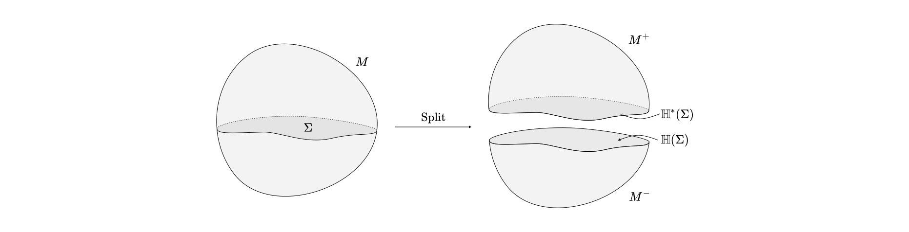

# Symmetries as Defects

This is a motivation for defining defects and their role in symmetry. The idea is to introduce defects in a familiar setting using conserved currents and then quickly stretching that definition to its limits to find what other things we could have.

These are stolen from

1.  [**Generalized Symmetries and their Gauging**](https://youtu.be/tj7JrjbclWA)
2.  [**Generalized Global Symmetries**](https://arxiv.org/pdf/1412.5148)
3.  [**Lectures on Generalized Symmetries**](https://arxiv.org/pdf/2307.07547)
4.  [**Codimension-2 Defects and Higher Symmetries**](https://arxiv.org/pdf/2208.07367)
5.  [**Path Integrals and Operators in QFT**](http://www.hartmanhep.net/topics2015/4-pathintegrals.pdf) 
6.  [**Global Symmetries**](https://www.youtube.com/watch?v=GZvs-ae4YRA)

[toc]

# QFT as a Correlation Function Builder

We can think of any Quantum Field Theory as a way to take some data about an *“experimental”* configuration and spit out correlation functions. Take this correlation function, for example
$$
\langle \phi(x) \psi(y)\rangle.
$$
The data that we put is a couple of probes in spacetime $M$. One is for the value of field $\phi$ at point $x \in M$ and the other is for the value of field $\psi$ at point $y \in M$. Implicit in this notation, and often in most cases, are the boundary conditions we set on the fields.

A QFT is the mechanism by which we convert this data to this correlation function. Recently there is this [growing idea](https://www.youtube.com/watch?v=GZvs-ae4YRA) (2015, aka the year I learned Newton’s laws) that QFT hard to understand partly because we restrict the building blocks for the data we can have to point-like probes like the *field operators* $\phi(x)$. Sure we encounter nonlocal operators, such as the symmetry operators that we talk about here, but we usually treat them as composite objects that a theory *can have* but not as objects that are essential in building it. This leads to our first intuitive definition:

> The (possibly nonlocal) algebraic data fed into a QFT are called **defects**.

While this is a terrible definition, and we will give a more precise one soon, the first part of these notes is to recast our understanding of local operators into something that can be extended. Then we will use symmetry operators as a motivation of such nonlocal defects, and then start stretching the concept until it breaks.

> ***Note:*** Here we motivate defect operators using symmetry operators, but it is important to understand that defect operators have applications far beyond symmetry. The purpose of this though is to show why defects are natural objects to use when describing symmetries.

# Invitation

A QFT comes with a spacetime manifold $M$. When probing the value of some field $\psi : M \to \mathbb{C}$ (almost all fields we probe can be casted into such functions) at a point $x \in M$ we call that a **field operator insertion** of the quantum field operator $\psi(x)$. But clearly we can insert more things.

Consider for example the correlation function
$$
\langle \psi(y) U\phi(x) \rangle,
$$
where $U$ is some symmetry transformation. The way this correlation function is written it is not clear what the "spacetime dependence associated" with the operator $U$ is, but it is clearly not a single point! $U$ is not a local quantum field.  

## Operators come with Manifolds

Let's be less sloppy by doing an example. Consider that our theory has a bunch of symmetry transformations that form a Lie group $G$. If that is the case, there is a Noether current $J \in \Omega^1(M)$ associated with any Lie algebra element. 

What we want to do is construct the operator $U$ that facilitates this symmetry action on the fields. To do this we usually construct a conserved charge by integrating $J$ over a codimension 1 surface $\Sigma \subset M$. That surface is usually a spacetime slice, but it doesn't have to be in general. 

Then we exponentiate the charge $Q(\Sigma)$ to get $U(\Sigma)$. But we already see the surface dependence of the operator $U$. Instead of $U$ being supported at a point, it is supported on a codimension 1 surface $\Sigma$ . This construction allows us to think of $U$ as a representation of some element $g \in G$ of our symmetry group. Making our notation explicit, the construction allows us see that 
$$
U_g(\Sigma) U_{h}(\Sigma) = U_{gh}(\Sigma),
$$
for all $g,h \in G$. 

One fun thing to notice that reversing the orientation of $\Sigma$ to obtain $\bar \Sigma$ we get that $Q(\Sigma) = - Q(\bar \Sigma)$, therefore we have that $U_{g^{-1}}(\Sigma) = U_{g}(\bar \Sigma)$. Which is cute.

Due to $Q$ being a symmetry charge it is conserved (aka independent of the spatial slice $\Sigma$ ) this construction makes the dependence of the surface unclear. Here is another construction of the operator $U(\Sigma)$ that makes the dependence on $\Sigma$ more explicit, and it is more illustrative of how to think of $U(\Sigma)$ as a *defect*.

## Path Integral Quantization

In path integral quantization we construct states on space-like slices using path integration from our asymptotic boundary with some prescribed boundary conditions. Going over all possible boundary conditions we can construct a set of states $\mathbb{H}_\Sigma$ associated with a codimension-1 spacelike slice $\Sigma$.

Specifically, given a spacelike slice $\Sigma$ and some boundary conditions in the past, a state $\Psi \in \mathbb{H}_\Sigma$ is a function of field configurations $\left.\phi\right|_\Sigma$ restricted on $\Sigma$ like so
$$
\Psi(\left.\phi\right|_\Sigma) = \int_{\left.\psi\right|_\Sigma = \left.\phi\right|_\Sigma} \mathcal{D}\psi\, e^{iS(\psi)},
$$
in this notation the dependence on the initial/asymptotic boundary conditions is implicit. Similarly, we can create the dual state as the one with the same boundary conditions but at the future boundary, and define their inner product by calculating their path integral. 

## Implementing Symmetry Operators by Twisting

We now have states that are defined on $\Sigma$ for our theory. Now we want to perform the symmetry action to define how $U$ acts on the states. Well we know how whatever global symmetry $G$ we have acts on the classical field configurations at the boundaries, i.e. $\psi \mapsto g\cdot \psi$ under the action of some $g \in G$ therefore we can construct $U_g(\Sigma)$ as the operator that takes in the untransformed states and spits out their transformed version.
$$
U_g(\Sigma) = \sum_{\psi} \ketbra{g\cdot \psi}{\psi},
$$
where the sum runs over all admissible boundary conditions of our theory. We refer to this as the **cut and twist** procedure. Here is a picture.

In summary, we cut our spacetime on $\Sigma$ found the Hilbert space $\mathbb{H}_\Sigma$ on that slice, and then proceeded by transforming all the states according to the symmetry transformations. 

In essence the Operator $U_g(\Sigma)$ applies the symmetry action to the field configurations in the past of $\Sigma$. 

Carrying this out we obtain the expected commutation relation with a field operator at $x \in \Sigma$ 
$$
U_g(\Sigma) \phi(x) = R_g \phi(x) U_g(\Sigma),
$$
where $R_g$ is the induced representation of the of the group element $g$ on the set of field operators. For example, if the symmetry is $G=U(1)$ then $R_g$ is a phase, and so on. 

## Abstracting

Let's go back to the correlation function picture. We have found a relation between the picture of an insertion of a symmetry operator $U(\Sigma)$ on $\Sigma$ and constructing the operator. Additionally we have seen that the surface $\Sigma$ doesn't matter as long as we don't change the path integration measure (i.e. as long as the surface doesn't cross any insertions).

What that really means is that correlation functions will be the same if we insert $U(\Sigma)$ or $U(\Sigma')$ for some, appropriately, deformed surface $\Sigma'$ (i.e. without crossing any other insertions).

We also learned what happens if a field operator lies on $\Sigma$, as well as what happens when two such defects collide. Now the question is what happens if $\Sigma$ encloses a defect? We can draw some pictures to show that if $\Sigma$ is some embedding of a codimension 1 sphere on $M$ that encloses $x \in M$ then
$$
U(\Sigma) \phi(x) = R_g \phi(x).
$$
Here is a series of pictures that playfully justify this.

**<u>Disclaimer:</u>** What we did here was to perform an **F-move**. Schematically what we did was to pass the defect through a point by pinching it. In this case we could justify that pinching the defect behaves like so in the path integral picture, but soon we will generalize what type of pinching we can have. For now it suffices to say that when a symmetry defect operators fuses with its orientation reversal we get the identity defect. In reality we need some more work to show this in general.   

## Open Manifolds?

So far we have been recasting things that we already know, but here is the first way that thinking of defects in this way we can extend our intuition. In particular this notation makes it natural to consider what happens in the case where $\Sigma$ is no longer a boundary-less manifold, aka an open manifold. Let's call its boundary $\gamma = \partial \Sigma$. 

The most crucial point is to realize that when we want to define a $U$ defect related to an open surface $\Sigma$ our construction does not yield a unique operator.  

# Symmetries beyond Points

There are two ways to generalize symmetries. One is to generalize the type of object that the symmetry operator acts on. So far the symmetries we have discussed where operators that acted on points-like probes, i.e. local fields. However, now we introduced these Defect operators that are significantly different than point-like probes. There must be symmetry transformations for them too! This leads to the concept of **p-form** symmetries.

To study them we will now highlight the lessons we've learned from studying symmetries of point-like operators using defects. 

## What we Learned from Path Integrals

Here is a quick summary of what we learned.

1. An operator that appears in a correlation function is associated with a submanifold of the theory. The dimension of that submanifold is the dimension of the operator.
2. We can implement symmetry transformations by cutting and gluing the spacetime along a defect.
3. Symmetry operators act the same in a correlation function even after certain deformations of their manifold, making them in some sense *topological*.
4. Defect operators can fuse with each other to produce other operators in a way that resembles group multiplication. 
5. The orientation of the submanifold matters.
6. A symmetry operator can act on field operators by enclosing them in some way.
7. There is some ambiguity in defining defect operators on open submanifolds. 

Now with this list of observations to guide our intuition we can turn this on its head and think of symmetries defined by the existence of defect operators that are axiomatized to satisfy the consistency conditions of our theory as well as these observations.

## Generalized Group Symmetry

Here we can finally introduce the terminology **p-form** symmetry that is used very often in the Generalized Symmetry community. The symmetries we are familiar with are called $0$-form symmetries because they objects that transform under them (aka the charged objects under the symmetry) are fields. Fields are functions which in differential geometry speak are known as $0$-forms.

If we want to generalize such that the charge object is a defect operator associated with some submanifold $\Sigma$ of dimension $p$, one way to construct it is to integrate something over the manifold. Like this
$$
\mathcal{O}(\Sigma) = \int_\Sigma f(x) d^px.
$$
 The mathematical object $f(x)d^px$ is called a $p$-form which is where the name $p$-form symmetry comes from. But ok, how do we implement $p$-form symmetries?

$0$-form symmetry operators acted on local field operators $\psi(x)$ (or $0$-form operators) by enclosing them in a sphere of dimension $n-0-1$, where $n$ is the spacetime dimension. The natural way to enclose a $p$-form operator, i.e. an operator supported on a $p$-dimensional manifold, is by a sphere of dimension $n-p-1$. This motivates the first generalization of these observations on $0$-form symmetries.

> **<u>Necessary Condition 1:</u>** A $p$-form symmetry operator is an $n-p-1$ dimensional defect $U_g$ associated with some group element $g$ that acts on $p$ dimensional defects $V$ like so
> $$
> U(S^{n-p-1})V(C) = g \cdot V\ V(C),
> $$
> where $S^{n-p-1}$ is the embedding of a sphere in spacetime $M$ such that the $p$ dimensional submanifold $C$ crosses its interior once and not its boundary, and $g\cdot V$ denotes the action by the representation of $g$ that facilitates the symmetry.  

This sounds quite pretentious, but the picture is super simple. 

This has an interesting corollary on the generalization of the **equal time commutator**.

**<u>Corollary:</u>** Assume that $S^{n-p-1}$ is an embedding of an $n-p-1$ dimensional sphere in spacetime $M$ and $C$ is a $p$ dimensional submanifold on $M$ that intersects with the embedded sphere $k$ times. Then if $U_g$ is a $p$-form symmetry operator associated to a group element $g$, and $V$ is $p$-dimensional defect we have that
$$
U_g(S^{n-p-1}) V(C) = (g\cdot V)^{k} V(C) U_g(S^{n-p-1}).
$$

Cool! Now let's see other necessary conditions. Another thing we noticed was that for symmetry operators associated with a group, they must be able to be combined in a way that respects group multiplication.

> **<u>Necessary Condition 2:</u>** Let $U_g$ and $U_h$ be $p$-form symmetry operators associated with elements $g,h \in G$ of some symmetry group $G$. Then if $\Sigma$ is an $n-p-1$ dimensional oriented submanifold we have that
> $$
> U_g(\Sigma) U_h(\Sigma) = U_{gh}(\Sigma).
> $$
> Additionally, if $\bar \Sigma$ is the orientation reversal of $\Sigma$ we have that
> $$
> U_{g^{-1}}(\Sigma) = U_g(\bar \Sigma).
> $$

That helps us facilitate some way of *fusing* operators together. The final thing we observed was that the symmetry operator was invariant under deformations of the associated surface unless it crossed a defect! This leads to the third necessary condition.

> **<u>Necessary Condition 3:</u>** A $p$-form symmetry operator $U(\Sigma)$ associated with a closed manifold $\Sigma$ is invariant under homologous transformations of $\Sigma$ in spacetime with other defects removed.  

The idea behind *homologous transformations* is that $U(\Sigma) = U(\Sigma')$ if you can deform $\Sigma$ to $\Sigma'$ continuously inside $M$ after having removed the manifolds associated with other operator insertions. 

These are by no means enough necessary conditions to define $p$-form symmetry operators. We need them to satisfy consistency conditions such as well defined correlation functions, locality when they're inserted and so on. In these notes we assume that we have found the right consistency conditions without specifying them explicitly, and we will rather mention when we use them in practice. 

## Abelianness

These consistency conditions, however, are enough to illustrate an amazing fact about higher form symmetries that are associated to groups. 

**<u>Theorem:</u>** If a collection of $p$-form symmetries forms a group, that group is Abelian.

***Proof sketch:*** We can sketch a proof for this by simply using this topological invariance condition we have outlined before. Here is the picture. 

## Example (Maxwell)

Let's do a hello world example in Maxwell. We have a $U(1)$ Yang-Mills theory in $n$ dimensional Minkowski space $M$. The Lagrangian is given by
$$
\mathcal{L}(A) = F\wedge \ast F = dA \wedge \ast dA,
$$
for some $A \in \Omega^1(M)$ a one form on $M$ called the gauge field. The field strength is $F = dA$ and it is a 2-form, additionally it is closed since $dF = ddA = 0$ by the Bianchi identity on $M$. Therefore $F$ can be thought of as a conserved higher form current, as a result there must be a $n-2-1=n-3$-form symmetry defined by a family of operators on closed $2$-dimensional surfaces $\Sigma$ in $M$ by
$$
U_{\alpha}(\Sigma) = e^{i\alpha \int_\Sigma F},
$$
where $\alpha \in \mathbb{R}$. By multiplying them we see that these operators form a representation of $U(1)$, where $U_\alpha$ is the representation of $g = e^{i\alpha} \in U(1)$. **This is known as the Magnetic d-3 form symmetry.** 

Extremely similarly we can see that $\ast F$ is also conserved due to the equation of motion $d\ast F = 0$. So it can also serve as a generalized $n-(n-2)-1 = 1$-form symmetry where its operators are defined on closed $n-2$-dimensional surfaces $\Sigma$ as
$$
V_\alpha(\Sigma) = e^{i\alpha \int_\Sigma \ast F}.
$$
Similarly the $V_\alpha$ operators form a representation of $U(1)$. This is known as the **electric 1-form symmetry**.

With some work we can see that the operators that are charged under the electric 1-form symmetry are Wilson lines associated with lines $L$ given by
$$
W_q(L) = e^{2\pi iq \int_L A},
$$
for some $q \in \mathbb{Z}$ which we call the **charge** of the Wilson line. This really is a probe for the electric field for an immovable (by the electromagnetic field) particle of electric charge $q$ with worldline $L$. Let's see why this operator is charged under the electric symmetry. 

With the insertion of a Wilson line, the action in the path integral is modified and therefore we obtain the modified equations of motion that become
$$
d\ast F\  W_q(L) = q \delta^{n-1}(L) W_q(L).
$$
 We can integrate this over a closed $n-1$ surface with boundary a (closed) surface $\Sigma$ such that the line crosses its interior only, and the exponentiate to obtain
$$
V_\alpha(\Sigma) W_q(L) = e^{iq\alpha} W_q(L) V_\alpha(\Sigma).
$$
So what have we shown? We have shown that the charge of the Wilson line under the electric symmetry is $q$. Or in other words we have shown **Gaus' Law!** Here is a picture at $n=3$. 

We can do the same thing with the magnetic symmetry though the charged objects are 't Hooft operators (or monopole operators) which are codimension 3 in spacetime. 

# Symmetries Beyond Groups

There is another way to generalize symmetries and that is instead of relaxing the **dimension** of the submanifold that our symmetry operator (i.e. our defect) is supported on, we can generalize the way that the defects combine, or *fuse*, with each other. 

The previous axiom was that they must fuse according to the rules they are forming a representation of. Namely
$$
U_g(\Sigma) U_h(\Sigma) = U_{gh}(\Sigma).
$$
Relaxing this, essentially means that the rules by which defects fuse together do not form a group. For example, there might not be inverses for a defect, or other crazy things. In fact here is a picture of what fusion of defects looks like in general vs special case where the fusion rules are group like. 

If we want to be slightly more formal we say that the structure that the symmetry defects are a representation of is no longer a Group, but is some kind of abstraction that allows us to not have inverses for example. That abstraction is called a **fusion ring**. 

We won't go into formal details talking about fusion rings and fusion categories, but the idea is that when people in Generalized symmetry talks bring up about fusion rings what they really refer to is the algebraic structure that generalizes the notion of a group of symmetries.  This might sound a bit abstract so let's give a motivating example

## 2D Ising Conformal Field Theory

We will consider the 2D Ising model in the continuum limit at a temperature right before its phase transition. Without going into the details to actually derive this, the classical Ising model can be thought of as a Conformal Field Theory on the Riemann sphere where every field configuration can be obtained by performing infinitesimal conformal transformations on 3 fields. These are.

1. $\mathbb{1}$: The **identity** operator
2. $\sigma$: The **spin** operator. The operator that probes the spin at a particular point
3. $\varepsilon$: The **energy** operator. The operator that probes the energy at a particular point. 

There is a lot of non-trvialities around this identification, but for the sake of moving on and not getting hung up on these details, the identification goes like this
$$
\begin{pmatrix}\text{2D Classical}\\\text{Ising Model}\end{pmatrix} \leftrightarrow \begin{pmatrix}\text{1D Quantum}\\\text{Ising Chain}\end{pmatrix} \leftrightarrow \begin{pmatrix}\text{2D Free Fermion}\\\text{Continuum CFT}\end{pmatrix}.
$$
So the observables of the 2D Classical Ising model can be mapped to observables in the 1D Quantum Ising chain, and at the continuum we get the 2D CFT of a free fermion, who's observables we map to the spin and energy operator and so on. We call that the Ising CFT. All of these are details are beyond the scope of this motivating example, so let's move on. 

Doing this process we already found the possible $0$-form or point like operators for our theory. From our discussion we expect that corresponding symmetry operators would be line defects (i.e. defects supported on $n-1=2-1=1$ dimensional submanifolds) that we can move around without changing the theory as long as we don't cross any operator insertions. 

However, since our theory is a CFT, this means that all the correlation functions we can build must be invariant under conformal transformations. So not every line operator that is topological that we can write down would be a valid operator for this theory. In other words we might find operators that produce correlation functions that under conformal transformations are not invariant.

Turns out that constraint is suuuper sufficient in this case. In fact, it turns out that all possible topological line defects one can write down can be generated using three! Here they are.

1. $\mathbb{1}$: The **identity defect**. It commutes with everything and does nothing when inserted in the CFT.
2. $\eta$ The **spin flip defect**. It implements the $\mathbb{Z}_2$ global symmetry of the Ising model where the energy is the same if we flip all the spins.
3. $\mathcal{N}$: The **duality defect**. It implements the Kramers-Wannier duality, which is a special property of the classical Ising model that it is equivalent to the model defined on the dual lattice. 

I didn't derive why we get these! In fact it shouldn't be obvious about any point of our construction. But have faith that we can find these by searching what defect operators satisfy conformal symmetry.

These defects have the following *fusion rules*.

**<u>Proposition:</u>** Let $U$ be any topological line defect and $L$ be a closed 1-dimensional submanifold in $\mathbb{C}$. Then we have the following fusion rules for the defects above.

1.  $\mathbb{1}(L) U(L) = U(L)$
2. $\eta(L)\eta(L) = \mathbb{1}(L)$
3. $\mathcal{N}(L) \eta(L) = \mathcal{N}(L)$
4. $\mathcal{N}(L)\mathcal{N}(L) = \mathbb{1}(L) + \eta(L)$

By the way here it is in pictures.

From these rules we see clearly that $\eta(L)$ is a representation of $\mathbb{Z}_2$. Additionally, we see that $N$ is not the representation of some group! Why? In order to see it clearly let's see how these defects act on the fields of our CFT. Again, we don't prove this, this is part of the defining data on the defects (even though we could in principle use consistency conditions to derive these).

**<u>Proposition:</u>** Consider an embedding of $S^1$ on $\C$ that encloses a point $x \in \mathbb{C}$. Then the following identities hold.

1. $\eta(S^1) \sigma(x) = -\sigma(x) \eta(S^1)$
2. $\eta(S^1) \eta(x) = \eta(x) \eta(S^1)$
3. $N(S^1)\eta(x) = \sqrt{2} \eta(x)N(S^1)$
4. $N(S^1)\sigma(x) = 0$

 Now check out the 4th identity! HELL NO THIS CAN'T BE INVERTIBLE! Otherwise there would be an inverse defect that would take $0$ and give you $\sigma(x)$ at a particular point. Not a thing. Yet this is a valid defect operator to write down that is just as topological as the other stuff we have seen with group like symmetries. So by relaxing our multiplication laws, or fusion rules, we have gotten a natural extension of what a symmetry could be. 

## Defects give Ward Identities

Why is this useful? Well if you know the defects you can get the ward identities. We often do this the other way around but this is one example where we can see a familiar application of them.

**<u>Proposition:</u>** In the Ising CFT the following Ward identity holds for odd $k\in \mathbb{N}$
$$
\langle \sigma(x_1) \sigma(x_2) \cdots \sigma(x_k) \rangle = 0.
$$
***Proof:*** Yes you could show this by calculating the stress tensor and plugging it in to the conformal Ward identity formula. But what's the fun in that! Here is a picture.

