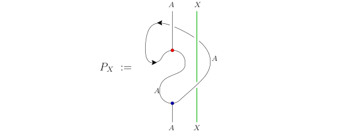

# Invariant Defects under a Chiral Algebra

When a CFT is rational with a diagonal modular invariant, the set of topological defects that are invariant under the corresponding chiral algebra $\mathcal{V}$ is just the Verlinde lines of $ C =\text{Rep}(\mathcal{V})$, i.e. the primaries of the theory. What we could try to relax is what happens when the modular invariant is not diagonal, or in other words the special symmetric Frobenius algebra defining it is not $A=1$. In that case, we are looking for the set of $A-A$ bimodules of $C$. So it would be nice to work this for a couple examples.

[toc]

# Setup

We have a modular tensor category $C$ with a special symmetric Frobenius algebra $A$ defining the following modular invariant partition function
$$
Z(q) = \sum_{i,j \in \text{Irr\,}C} Z_{i j} \chi_{ i}(q)\chi_j(\bar q),
$$
where $\text{Irr\,} C$ is a dominant set of simple lines in $C$, $\chi_i(q)$ is the Virasoro character of line $i \in \text{Irr\,}C$ and the $Z_{ij} \in \mathbb{Z}_{\geq 0}$ is the modular mass matrix given by tracing out $A$-projections of simple lines $i$ with more details given in [Fuchs](https://arxiv.org/abs/hep-th/0204148). In particular this is given by 
$$
Z_{ij} = \text{dim\,}\text{hom}_{\text{loc}}(A\otimes j,\bar i).
$$
The local morphisms $\text{hom}_{\text{loc}}$ are all morphisms that are invariant under $A$-projections. To be more precise (though I don't think we need this here but it's nice to know) an $A$-projection for an object $X \in C$ is given by (I stole this picture from [here](https://arxiv.org/abs/hep-th/0204148))

and a morphism $f:A\otimes j \to \bar i$  is local when $f \circ P_j = f$. We assume here that we do have access to the modular matrix $Z$ and use it to constrain the bimodules. Moreover we can use the discussion above to see that
$$
A = \bigoplus_{i\in \text{Irr}C} Z_{1i} i,
$$
where $1$ is the identity of $C$.

## Building Bimodules

The defects invariant under the category $C$ are given by the category $_AC_A$ of $A-A$ bimodules. There is a fun way to create such modules using lines of $C$ by a process called $\alpha$-induction. The algebra $A$ has a multiplication map $m: A\otimes A \to A$, therefore we can induce a left $A$ module given any $i\in C$ and taking $(A\otimes i, \rho_l =m\otimes \text{id}_i)$, where the second entry is the left action $\rho_l:A\otimes (A\otimes i) \to A\otimes i$. Now there are two ways to add the additional structure of a right-module. We pick the object $\hat i=A\otimes i$ and then we consider the right action by bringing the $A$ line to the left, either from the back or the front of $i$ via the maps
$$
\begin{align*}
\rho_r^+ &= (m\otimes \text{id}_i ) \circ (\text{id}_A \otimes c_{iA})\\
\rho_r^- &= (m\otimes \text{id}_i ) \circ (\text{id}_A \otimes c_{Ai}^{-1}),
\end{align*}
$$
where $c_{XY}:X\otimes Y \to Y\otimes X$ is the brading of $C$. We call the bimodule with the corresponding right action by $\alpha^{\pm}(i)$ or $(A\otimes i)^{\pm}$. $_AC_A$ is a semisimple fusion category so we can find a dominant set of objects $\text{Irr\,}_AC_A$. The interesting result is that
$$
Z_{\bar j i} = \text{dim\,}\text{hom}[\alpha^-(i),\alpha^+(j)],
$$
where the $\text{hom}$ is taken in $_AC_A$. What is more interesting here is that by dominance there should be some sort of non-negative integer matrices $n^{\pm}$ such that
$$
\alpha^{\pm }(i) = \sum_{j \in \text{Irr}_AC_A} n_{ij}^\pm j,
$$
which means that $Z = n^- (n^+)^T$. So we are constraining what the simple invariant TDLs can be by finding two such matrices $n$. Clearly there are many such solutions, but we can now start adding constraints. 

## Constraining Induction Matrices

One strong constraint is that $Z_{\bar j i} \geq n^-_{ik}n^+_{kj}$ for all $k \in \text{Irr}_AC_A$. So if $h_i \neq h_j \text{ mod } 1$ then $n_{ik}^-n_{kj}^+ = 0$ for all $k$. This is a result of modular invariance under $T$ we can have a similar result using $S$ transforms. We also know that all the entries of $Z$ are either $0$ or $1$. A main point that I am struggling with is how to constrain the dimension of the codomain, or in other words the number of simple bimodules $k$. Since $\alpha$ inductions are not guaranteed to be simple, even though we know that the Verlinde lines are invariant under the chiral algebra, this doesn't mean that we have at least as many simple bimodules. 

# Three State Potts

If we take $\mathcal{V}=\text{Vir}_{c=\frac{4}{5}}$ we have $6$ simple objects labeled by $\{1,\epsilon, \sigma, X,Y,Z\}$ with conformal weights $h=\{0,\frac{2}{5},\frac{1}{15},\frac{7}{5},3,\frac{2}{3}\}$, and the modular mass matrix given by
$$
Z = \begin{pmatrix}
1 & 0 & 0 & 0 & 1 & 0\\
0 & 1 & 0 & 1 & 0 & 0\\
0 & 0 & 2 & 0 & 0 & 0\\
0 & 1 & 0 & 1 & 0 & 0\\
1 & 0 & 0 & 0 & 1 & 0\\
0 & 0 & 0 & 0 & 0 & 2
\end{pmatrix}.
$$
This implies that $A = 1\oplus Y$. So we are looking for $2\times 6 = 12$ vectors with nonnegative integer coefficients in some unknown but finite dimension, such that $n_i^+ \cdot n_j^- = Z_{ij}$. The start of this is quite simple since $\alpha^+(1) = \alpha^-(1)$  and $\alpha^+(Y) = \alpha^-(Y)$ we can see that
$$
n^{\pm}_1 = n^{\pm}_Y = e_1 = \begin{pmatrix}1 \\ 0 \\ \vdots\\0 \end{pmatrix},
$$
 for however many dimensions we have. 

## Modular Bootstrap

An alternative approach to this is to try and constrain what are the possible operators we can find that act irreducibly on the $\mathcal{V} \otimes \overline{\mathcal{V}}$ modules. This is constrained by modularity as we will see soon. 

For example, consider a TDL $L$ nad let $\chi$ be the vector of characters. Then the partition function with an $L$ insertion can be written as 
$$
Z_L^1(q) = \chi(q)^\dagger Z_L \chi(q),
$$
where $Z_L$ is the original modular matrix but with the nonzero entries postulated to be different. We know however that this is modular covariant taking us to the twisted sector via an $S$-transform. In the twisted sector, the partition function has to be integral and with positive coefficients. This constrains what $Z_L^1(q)$ can be quite a lot. Notice that $\chi(\tilde q) = S\chi(q)$ and therefore
$$
Z^{L}_1(q)  = Z_L^1(\tilde q) = \chi(\tilde q)^\dagger Z_L \chi(\tilde q) =  \chi(q)^\dagger  S^\dagger Z_L S \chi(q).
$$
We know most of the quantities here so we can find some more constraints. The first nontrivial constraint is that $S^\dagger Z_L S$ is a nonnegative integer matrix since the the twisted sector by any inner automorphism of the chiral algebra is a represetation of the original algebra. 

## S-Matrix

What is a bit tricky here is the $S$-matrix. If $\mathcal{C}= \text{Rep\,}\text{Vir}_{c=\frac{4}{5}}$, then we know using Kac's formula the $S$ matrix of the modular tensor category. What we don't know however, is what the $S$-matrix for the specific model is. In particular, looking at $Z$ above we find that there are two primaries with multiplicity two in this theory. We can call them $\sigma^\pm$ and $Z^\pm$. Therefore we can write $Z$ as an $8\times 8$ matrix where each entry is either $0$ or $1$. Then in order to find how the modular $S$ transform works in this theory we need to work out how charge conjugation acts, and then we can use the fact that
$$
S^2 = C = (ST)^3,
$$
to fully determine $S$ for the $S$ matrix in the modular tensor category. The charge conjugation matrix is such that $C_{ij} = \delta_{i\bar j}$ where $i,j \in \text{Irr\,}\mathcal{C}$. What we know by Di-Francesco is that there is a global $\mathbb{Z}_3$ symmetry such that the $\pm$ fields have charges $e^{\pm 2\pi i/3}$ respectively. Therefore, charge conjugation symmetry would exchange these charges. Therefore the charge conjugation matrix in the basis $\{1,\epsilon, \sigma^+, \sigma^-, X,Y,Z^+, Z^-\}$ is given by
$$
C = \begin{pmatrix}
1 & 0 & 0 & 0 & 0 & 0 & 0 & 0\\
0 & 1 & 0 & 0 & 0 & 0 & 0 & 0\\
0 & 0 & 0 & 1 & 0 & 0 & 0 & 0\\
0 & 0 & 1 & 0 & 0 & 0 & 0 & 0\\
0 & 0 & 0 & 0 & 1 & 0 & 0 & 0\\
0 & 0 & 0 & 0 & 0 & 1 & 0 & 0\\
0 & 0 & 0 & 0 & 0 & 0 & 0 & 1\\
0 & 0 & 0 & 0 & 0 & 0 & 1 & 0\\
\end{pmatrix}.
$$
The conformal weights in order are $h=\{0,\frac{2}{5},\frac{1}{15},\frac{1}{15},\frac{7}{5},3,\frac{2}{3},\frac{2}{3}\}$. So now we can use modular covariance to figure out the $S$ matrix. 

Notice that $[S,C] = SC - CS = S^3 - S^3 =0$, therefore we can simultaneously diagonalize everything. A basis of eigenstates we can pick are 
$$
\{1, \epsilon, X, Y, \frac{Z^+ + Z^-}{\sqrt {2}}, \frac{\sigma^+ + \sigma^-}{\sqrt {2}}\} \cup \{ \frac{Z^+ - Z^-}{\sqrt {2}}, \frac{\sigma^+ - \sigma^-}{\sqrt {2}}\},
$$
the stuff on the left have eigenvalue $1$ under $C$ while the stuff on ther right have eigenvalue $-1$, which means that we can now write the $S$ and $T$ matrices as block diagonal of the form
$$
\begin{align*}
S = \begin{pmatrix}S_{+} & 0 \\ 0 & S_-,\end{pmatrix} && T = \begin{pmatrix}T_{+} & 0 \\ 0 & T_-,\end{pmatrix},
\end{align*} 
$$
where we know $T_\pm$ from the conformal weights of the primaries, but we don't know $S_{\pm}$. We do know though that $S_{\pm}^2 = \pm 1$ and $(S_{\pm}T_{\pm})^3 = \pm 1$. 

$S_-$ is a $2\times 2$ symmetric and unitary matrix. The fact that it squares to $-1$ implies that it has determinant $1$ which constrains all the degrees of freedom to one angle. Using the remaining $T$ values we find that 
$$
S_{-} = \frac{i}{\sqrt{1 + \phi^2}} \begin{pmatrix} - 1 & \phi \\ \phi & 1 \end{pmatrix},
$$
 which (up to a factor of $-i$) is unsirprisingly but still delightfully the $\text{Fib}$ category $S$-matrix. 

On the other hand a wrong guess for $S_+$ is simply the projection of the $\mathcal{C}$ $S$ matrix on the fields $1,\epsilon, X,Y,Z, \sigma$. One will quickly notice that this does not square to $1$. So what gives? If we say that the $S$ matrix is simply a projection onto the primaries in the untwisted sector, we assumed that there is no way that we will obtain the remaining representations of $\mathcal{V}$ in twisted sectors. This can't be the case. One would expect that we should be able to write down a CFT with $A=1$ as modular invariant, and then, via gauging obtain the 3-state Potts model with $A=1\oplus Y$ modular invariant. So this means, that the rest of the fields should appear in the twisted sector. 

I wonder if we can figure this out directly from bootstrap constraints without working out what we gauged explicitly. Clearly one solution here is to say that the fields that don't appear in the untwisted sector appear with multiplicity 1 in the twisted sectors. This will give $S_+$ to be the exact $S$ matrix of $\mathcal{C}$, which squares to $1$ as expected. 

[Tachikawa](https://arxiv.org/pdf/2002.12283) says that we can get $3$-state Potts via $\mathbb{Z}_2$ gauging of the diagonal theory which is known as the tetracritical Ising model. Apparently it is a well known fact that $D$ modular invariants are obtained via $\mathbb{Z}_2$ gauging in minimal models from $A$ modular invariants. For tetracritical ising the $\mathbb{Z}_2$ we are gauging is the one that flips the signs of $4$ primaries leaving the rest invariant (similar to the $\eta$ line in $\text{Ising}$). The fields that flip sign are
$$
(r,s) \in \{(2,1),(2,2),(4,1),(4,2)\},
$$
with conformal weights $\{\frac{1}{8},\frac{1}{40},\frac{13}{8}, \frac{21}{40}\}$ which unsurprisingly are the primaries with conformal weights that we don't see in the untwisted sector of the Potts model. So we only have to see what contributions we will get from the even part of the twisted sector where we simply get two extra copies of the $Z,\sigma$. 

I didn't read this but [this](https://arxiv.org/pdf/hep-th/9601078) is a paper that seems relevant to read here. 

Putting everything together we can build the full $S$  matrix by undoing our coordinate transformation to obtain 

