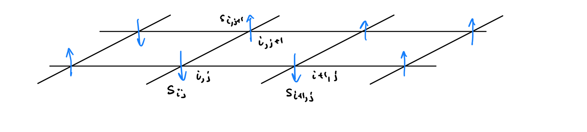
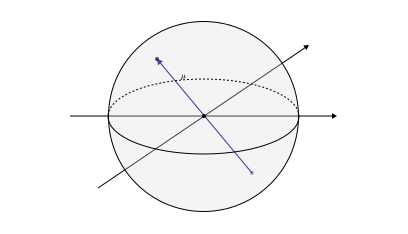

# Ising Model

This is a Conformal Field Theory “Hello World” project. Apparently the symmetry group of the ising model around its phase transition is actually the Virasoro group. Therefore we can conformal field theory our way into a nice description about it, just to play around with the fundamental objects there. 

We begin with a classical treatment of the model to fully define some terminology (but also because it is fun) and then move on to identify how the matching with the CFT description occurs.

[toc]

----

# Classical Treatment

Here is a brief overview the classical treatment of the 2D Ising model in order to find the limit at which it reduces to a quantum model. 

## Physical Setting

The setup is a bunch of arrows arranged in a lattice that can interact with their nearest neighbors. A picture is the following, where we have a 2D lattice and an arrow attached at each point.

 

To build a mathematical description of the model, we can first identify a suitable configuration space. Let’s start with a finite lattice 2D lattice that contains a total of $N = n^2$ particles. This can be described as $\mathbb{Z}_n^2$, where at each point of which we have attached a spin up or down vector in $\mathbb{Z}_2$ for the vector space. Therefore the configuration space is given by

$$
C_N \coloneqq \mathbb Z_n^2 \times \mathbb Z_2.
$$

Notice that $\mathbb{Z}_n^2$ as a graph admits the topology of a discrete donut! That is because we can connect the endpoints of the grid for each $\mathbb Z_n$. The next ingredient we need is a Hamiltonian $H:C_N\to \mathbb{R}$.

The Hamiltonian in this case must capture the interaction of the neighboring spins. For some point $p = (s_1,s_2,\cdots, s_N) \in C_N$ we usually pick the Hamiltonian 

$$
H(p) = -\sum_{i,j} J_{ij} s_i s_j -  h \sum_{i} s_i
$$

where $J$ is an $N\times N$ symmetric matrix such that $J_{ij} = I >0$ iff $s_i$ is neighboring $s_j$, otherwise $J_{ij} = 0$, and $h > 0$ represents some external magnetic field type interaction. Note that $s_i \in \{-1,1\}$. Now we are ready to calculate the magnetization in the Canonical ensemble.

## Magnetization in the Canonical Ensemble

In the Canonical Ensemble, the partition function is given by 

$$
Z = \sum_{p\in C_N} e^{-\beta H(p)}
$$

Classically the magnetization is given by the average of the particles aligned in the up direction like so 

$$
M = \frac{1}{N\beta} \langle s_T \rangle = \frac{1}{N \beta} \sum_{i = 0}^N\langle s_i\rangle = \frac{1}{N \beta} \frac{\partial }{\partial h} \log Z.
$$

The phase transition also appears on the susceptibility which is given by

$$
\chi = \left.\frac{\partial M}{\partial h}\right|_{h=0} = \frac{1}{N \beta} \left.\frac{\partial ^2}{\partial h^2}\right|_{h=0} \log Z
$$

With some algebraic manipulation we can get that

$$
\chi = \frac{1}{N\beta} \left[ -\frac{1}{Z^2} \left(\frac{\partial Z}{\partial h}\right)^2 + \frac{1}{Z} \frac{\partial ^2 Z}{\partial h^2} \right] = \frac{\beta}{N} \left[\langle s^2_Τ \rangle - \langle s_Τ\rangle^2\right] = \frac{\beta}{N} \text{Var}(s_Τ)
$$

OK! All of this is not quantum, but check out that 

$$
\text{Var}\left[\sum_{i=0}^N s_i\right] = \sum_{i,j=0}^n\text{Cov}(s_i,s_j) = \sum_{i,j=0}^n \langle s_is_j\rangle - \langle s_i\rangle \langle s_j\rangle
$$

The cool thing is that $s_i,s_j$ are uncorrelated unless $i,j$ are neighbors. Therefore we can write this a sum of the uncorrelated differences, which depends only on $|i-j|$ which hints to translation invariance, and a really cool use of CFT!

We will use CFT to calculate these correlation functions.

## Mean Field Theory During Transition

----

# Quantum Treatment

Ok, everything up to now has been fun, but it has mostly been background so that when we treat Ising in CFT we can be like OH COOL! Look at these conformal weights! They are the same as the classical ones! Now we will proceed with establishing a correspondence between the classical Ising model and some CFT. We do this by establishing a connection between the classical treatment and the quantum treatment and then we take a *continuum* limit of the quantum model to some CFT. So before we do everything there let's understand the Quantum Ising model.

## Classical Starting Point

*This whole section can be skipped if you don't care about rigorously motivating angular momentum in classical Hamiltonian mechanics.*

Let's first consider the single spin case in 3D. We have a magnetic moment $\mu$ with fixed magnitude and the only thing we care about is its direction.  This is the picture of the classical situation.

The only quantity of interest is this angular momentum vector $\mu$, which transforms under a representation of $SO(3)$. In practice, in our physics we don't care about anything other than the orientation of this magnetic moment. Therefore, we can safely say that the *configuration space* is the set of all possible rotations of this vector. Doing so, we will find that this forms the Lie group $SO(3)$.

As a result, we can now form the canonical phase space which in this case is simply the cotangent bundle of $SO(3)$. Notice that this bundle has the form:
$$
\begin{CD}
\mathfrak{so}(3)^\ast @>>> T^\ast SO(3) \\ 
@. @VV\pi V\\ 
@. SO(3)
\end{CD}
$$
 where the fiber is the Lie algebra of $SO(3)$. This is really nice in terms of the intuition that we have that the angular momentum of an object are the generators of rotations (i.e. Left invariant vector fields of $SO(3)$).  

## Left Trivializations

Before we introduce the concept of angular momentum in this case (in order to proceed with its quantization) we can explore some general facts about the tangent bundles of Lie groups.

**<u>Corollary:</u>** Given a Lie group $G$, its **left translation** map $L_g : G\to G$ given by $a \mapsto ga$ for any $g\in G$ is smooth.

***Proof:*** By definition the multiplication map of Lie groups is smooth.

The reason we introduce the left translation is because we can trivialize the cotangent bundle of any Lie group.

**<u>Theorem:</u>** Given a Lie group $G$ with Lie algebra $\mathfrak g \coloneqq T_eG$ the following map, known as **left trivialization** is a bundle automorphism
$$
\begin{align*}
G\times \mathfrak g &\to T G \\
(g,X) &\mapsto {L_g}_{\ast,e}(X).
\end{align*}
$$
***Proof:*** We can typecheck to see that indeed the pushforward of the left translation map allows us to define this, but invertability is guaranteed by the invertability of the group elements, i.e. $L_g^{-1} = L_{g^{-1}}$.

**<u>Corollary:</u>** The cotangent bundle has the following left trivialization $T^\ast G \cong G\times \mathfrak g^\ast$. 

***Proof:*** We can follow the following vector bundle operations $T^\ast G \cong (TG)^\ast \cong (G\times\mathfrak g)^\ast = G \times \mathfrak g^\ast$.

One more interesting thing is to find the tangent bundle of $G\times \mathfrak g^\ast$. 

**<u>Proposition:</u>** The tangent bundle $T(G\times \mathfrak g^\ast)$ is given by
$$
T(G\times \mathfrak g^\ast) \cong \pi_G^\ast TG \oplus \pi_{\mathfrak g^\ast}^\ast T\mathfrak g^\ast  \cong (G\times \mathfrak g^\ast) \times (\mathfrak g \times \mathfrak g^\ast).
$$
***Proof:*** The first isomorphism is given by the theorem of the tangent bundles of product manifolds, the second isomorphism is given by left trivialization when recognizing that $G\times \mathfrak g^\ast$ is also a Lie group and applying the last theorem. 

## Left trivialized Liouville Form on Lie groups 

Now we are ready to express everything in terms of the generators of the group rather than anything else, which is particularly convenient. Specifically we can derive the Liouville form. Let's first recall the definition.

**<u>Definition:</u>** A cotangent bundle $\pi : T^\ast M\to M$ over a smooth manifold $M$, it admits a symplectic structure $\omega = d\theta$ generated by the **canonical symplectic potential** $\theta \in \Omega^1(T^\ast M)$ given at any point $\alpha \in T^\ast M$ by
$$
\theta_\alpha = \alpha \circ \pi_\ast.
$$
**<u>Proposition:</u>** In the case of a Lie group $G$, with a canonical symplectic potential $\theta \in \Omega^1(T^\ast G)$, its pullback under the left trivialization is given by the form $\tilde \theta \in \Omega^1(G\times \mathfrak g^\ast)$ such that at any point $(g,J) \in G\times \mathfrak g^\ast$
$$
\tilde \theta_{g,J} = 
$$

## Construction of Hilbert Space

Consider the single spin case. In this case the phase space is $\mathbb Z_2$ so the set of wavefunctions over $\mathbb Z^2$ is $\mathbb C^{\mathbb Z_2} \cong \mathbb C^2 = \mathcal H_1$. This is what we will call the single particle Hilbert space

**<u>Proposition:</u>** The single particle Hilbert space $\mathcal H_1$ is a quantum Hilbert space.

Now we can proceed by defining operators appropriately through second quantization by mapping the coordinate map $s: \mathbb Z_2 \to \mathbb R$ to the linear operator $\hat s : \mathcal H_1 \to \mathcal H_1$. That for the two pure states $\psi_+ = \binom 1 0, \psi_- = \binom 0 1$  it acts as follows

$$
\begin{align*}
\hat s \psi_+ = \psi_+ && \hat s \psi_- = -\psi_- && \implies && \hat s = \sigma_z = \begin{pmatrix} 1 & 0 \\ 0 & -1 \end{pmatrix}.
\end{align*}
$$

 We can then create the $N$ particle Hilbert space by taking tensor products like so:

**<u>Definition:</u>** The $N$ **particle Hilbert space** is given by $\mathcal H_N \coloneqq \bigotimes_{n=1}^N \mathcal H_1$. And the $i$th spin operator $\hat s_i : \mathcal H_N \to \mathcal H_N$ is given by

$$
\hat s_i = 1\otimes 1\otimes \cdots \underbrace{\otimes\ \hat s\  \otimes}_{i^{\text{th}}\text{ position}} \cdots \otimes 1.
$$

 So now we have the Hilbert space constructed and we can proceed with the Hamiltonian.

**<u>Definition:</u>** The **Quantum $N$ particle Ising Hamiltonian** is the linear map $\hat H : \mathcal H_N \to \mathcal H_N$ given by

$$
\hat H = \hat H_1 + \hat H_0 = -\sum_{i,j = 0}^N J_{ij}\hat s_i \hat s_j - \sum_{i=0}^N h\hat s_i
$$

where $J$ is the same matrix as in the classical case. 

## Quantum to Classical Correspondence

