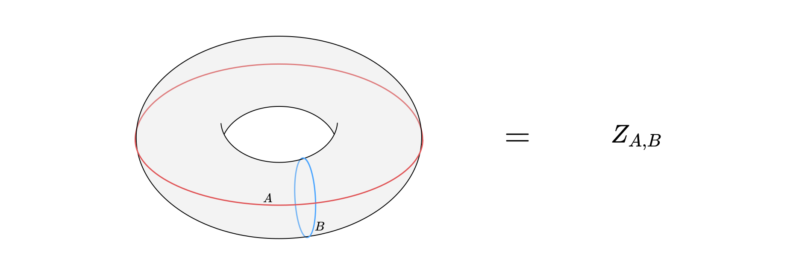

# Conformal Defects in Tricritical Ising

These are haphazard notes about the Tricritical Ising CFT that I will put together in a better format soon. 

[toc]

# WZW Models with $\mathfrak{su}(2)_k$

To avoid crying with representation theory of affine Lie algebras let's take a moment to write everything in terms of $\mathfrak{su}(2)$ representations.

## Blazing through WZW Models

These are CFTs with (surprisingly) a Lagrangian description. Consider a map $\gamma : \Sigma \to \text{SU}(2)$ from some Riemann surface $\Sigma$ that is the boundary of some manifold $B$. The $k$ level WZW action is given by
$$
S(\gamma)= - \frac{k}{8\pi} \int_{\Sigma}\gamma^{-1}d\gamma \wedge \ast \gamma^{-1}d\gamma -\frac{k}{24 \pi}  \int_B \gamma^\ast c,
$$
where the hodge dual is taken with respect to $K$, the Killing form in $\mathfrak{su}(2)$, and $c$ is the Harmonic 3-form on $SU(2)$. Honestly the Lagrangian is fun, but here are some results without proof.

**<u>Proposition:</u>** Let $\Omega : \Sigma \to SU(2)$ be holomorphic or antiholomorphic. Then
$$
S(\Omega \gamma \bar \Omega^{-1}) = S(\gamma).
$$
***Proof:*** AHAHAHAHA sure. if you apply the Polyakov identity 10 thousand times you'll get it. I love copying theorems from textbooks. 
$$
\begin{equation}\tag*{$\Box$}\end{equation}
$$
This has the interesting corollary using Noether's theorem.

**<u>Corollary:</u>** The following are associated conserved currents under the action of the holomorphic and antiholomorphic parts respectively 
$$
\begin{align*}
J(z) = -\frac{k}{2} (\partial \gamma) \gamma^{-1}&& \bar J(\bar z) = -\frac{k}{2} \gamma^{-1}\bar \partial \gamma.
\end{align*}
$$
Now consider the fields given by
$$
\begin{align*}
J^a = K(T^a,J) && \bar J^a = K(T^a,\bar J),
\end{align*} 
$$
where $T^a \in \mathfrak{su}(2)$ is some generator of the Lie algebra, and $K$ is the Killing form again. These can be expanded in modes 
$$
J^a(z) = \sum_{n\in \mathbb{Z}} J_n^a z^{-n-1},
$$
to yield a representation of the **affine lie algebra** of $\mathfrak{su}(2)$ at level $k$. This is the algebra such that
$$
[J_n^a,J_m^b] = f^{ab}_c J^c_{m+n} + kn \delta^{ab} \delta_{n,-m},
$$
where $f^{ab}_c$ are the structure constants of $\mathfrak{su}(2)$. So overall this is a conformal field theory with additional stuff in its chiral algebra. The affine lie algebra at level $k$ is often denoted by $\mathfrak{su}(2)_k$.

## Representation Theory of $\mathfrak{su}(2)_k$

The $\mathfrak{su}(2)$ algebra is generated by $J_{\pm},J_0 \in \mathfrak{su}(2)$ such that
$$
\begin{align*}
[J_0,J_{\pm}] = \pm J_{\pm} && [J_+,J_-] = 2J_0.
\end{align*}
$$
What we already know is that the irreducible representations can be labeled by $j \in \frac{1}{2} \mathbb{N}$ and have dimension $2j + 1$ where the highest weight state is annihilated by $J_+$ and other states are obtained by applying $J_-$.

As we already know however the only representations that appear in a CFT are highest weight representations. So we expect the chiral algebra to be a direct sum of irreducible highest weight representations of $\mathfrak{su}(2)_k$.

**<u>Proposition:</u>** The highest weight unitary representations of $\mathfrak{su}(2)_k$ have conformal weight classified by
$$
h_j = \frac{j(j+1)}{k+2},
$$
where $j \in \frac{1}{2} \mathbb{Z}_{k+1}$. Additionally, (and quite conveniently) the fusion rules can be obtained by (almost) the Clebsch Gordan theorem, i.e. 
$$
V_j \otimes V_{l} = V_{\abs{j-l}} \oplus \cdots \oplus V_{\min\{j+l,k-j-l\}},
$$
where $V_j$ are Verma modules. 

Notice that here the central charge is fixed by $k$ and it is
$$
c = \frac{3k}{k+2} - 1.
$$

The other result is that each representation can be further decomposed into $U(1)$ representations like so
$$
V_l = \bigoplus_{m=-l}^l V_{l,m},
$$
where these are highest weight representations with conformal weight $h = \frac{m^2}{k}$.

## The Coset Model

The quotient we are taking in this theory is $\frac{\mathfrak{su}(2)_8}{\mathfrak{u}(1)}$ which basically implies that we have the following identifications for the irreducible representations.
$$
V_{l,m} \sim V_{\frac{k}{2} - l, m+\frac{k}{2}} \sim V_{\frac{k}{2} - l, m-\frac{k}{2}},
$$
if they exist. So with this identification we have the final decomposition for the coset model in primaries. So let's find the characters. Actually I don't need to do that, here they are.
$$
\chi_{lm}= \eta(q)c^l_m(q),
$$

where $\eta(q)$ is given by the ratio of the generalized theta function
$$
\Theta_m(q) = \sum_{n\in \mathbb{Z}}q^{8(n+m/8)^2},
$$
to the the $\mathfrak{u}(1)_8$ characters $K_m$ at level $8$ as
$$
\eta(q) = \frac{\Theta_m(q)}{K_m(q)} = q^{\frac{1}{24}} \phi(q) = q^{\frac{1}{24}} \prod_{n=1}^\infty (1-q^n).
$$
One can show that $\eta$ is the Dedekind function. Also $c^l_m$ is the normalized string function given by
$$
c^l_m(q)= q^{h_l - h_m -\frac{1}{10}} \sigma_m^l(q),
$$
where 
$$
\sigma_m^l(q) = \sum_{n=0}^\infty \text{mult}_l(m-n\delta)q^n,
$$
is the actual string function, i.e. the generating function of the multiplicities along Weyl orbits. 

# Gauging Tricritical Ising

We want to study the folded Tricritical Ising $\text{TIsing}$ model which is the cft we denote $\text{TIsing}^2$. This CFT has chiral algebra $\mathcal{A} = \text{Vir}^2$ and it is a rational CFT with central charge $c = 7/5$. 

## Identifying a $\mathbb{Z}_2$ 

We want to perform discrete Gauging by $\mathbb{Z}_2$. We can write the operator algebra of $\text{TIsing}^2$ in $\text{Vir}^2 \times \overline{\text{Vir}^2}$ irreducible representations as
$$
\mathbb{H} = \bigoplus_{i,j=1}^6 (W_i\otimes \overline W_j) \otimes (\overline W_i\otimes W_j),
$$
where $W_i$ are the 6 irreducible Virasoro Modules that appear in the Tricritical Ising minimal model. We can show, but I won't, that each irreducible representation in $\text{TIsing}^2$ is given by 
$$
W_{ij} = W_i \otimes \overline W_{j},
$$
and there are $36$ of them. 

**<u>Proposition:</u>** Consider the $\text{Vir}$-equivariant linear map
$$
\begin{align}
\sigma : \mathbb{H} &\to \mathbb{H}\\
\sigma(v_{ij}\otimes \bar v_{ij}) &\mapsto v_{ji} \otimes \bar v_{ji},
\end{align}
$$
where $v_{ij} \in W_{ij}$ is the highest weight vector in $W_{ij}$. Then $\sigma$ together with $\mathbb{1}_{\mathbb{H}}$ forms a representation of $\mathbb{Z}_2$ on $\text{Aut\,}\mathbb{H}$. 

***Proof:***  $\sigma^2 = \mathbb{1}_{\mathbb{H}}$. Then the representation is mapping the corresponding elements of $\mathbb{Z}_2$. 
$$
\begin{equation}\tag*{$\Box$}\end{equation}
$$
So we have defined a representation $\rho_{\sigma} : \mathbb{Z}_2 \to \text{Aut}(\mathbb{H})$, which we will call the **exchange representation**.

**<u>Corollary:</u>** $\sigma$ is a global symmetry in $\text{TIsing}^2$.

***Proof:*** Notice that the Laurent modes of this theory are given by $L_n = L_n^1 + L_n^2$. Additionally $\sigma$ is permutation transformation so it is hermitian. Therefore we have that
$$
\begin{align*}
\sigma^\dagger L_n \sigma 
&= \sigma (L_n^1 + L_n^2) \sigma\\
&= \sigma^2 (L_n^1 + L_n^2)\\
&= L_n,
\end{align*}
$$
where in the next to last step we have used equivariance of $\sigma$, i.e. $[\sigma,L_n] = 0 $ and $\sigma^2 = 1$.
$$
\begin{equation}\tag*{$\Box$}\end{equation}
$$
So we have a tasty $\mathbb{Z}_2$ global symmetry to gauge under! Wohooo!

## Gauging $\mathbb{Z}^2$

I mean, the exact map between the ungauged and gauged theories is hard to write down. However, we don't *really* need it. We can calculate the modular partition function of the gauged theory like so.

**<u>Lemma:</u>** Let $W_{ij}$ denote an irreducible representation of $\text{Vir}^2$ in the $\text{TIsing}^2$ CFT, and $\chi_i(q)$ be the character associated with an irreducible representation $V_i$ of $\text{Vir}$ in the $\text{TIsing}$ CFT. Then 
$$
\text{Tr}_{W_{ij}}\ \sigma q^H = \delta_{ij} \chi_i(q^2),
$$
where $H = L_0 - \frac{c}{24}$, $q \in \mathbb{C}$.

***Proof:*** Notice that $\{W_n,\sigma\} = 0$ where $W_n = L_n^1 - L_n^2$ are the remaining generators of $\text{Vir}^2$. Then We have that there is an orthonormal basis $B_{ij}$ of $W_{ij}$ where every element $v \in B_{ij}$ can be given as
$$
v = L_v W_v v_{ij},
$$
where $v_{ij} \in W_{ij}$ is the highest weight vector of $W_{ij}$ and $L_v,W_v$ are strings comprised of multiplying $L_n,W_n$ operators. Assume that there are $m_v \in \mathbb{Z}_+$ $W_n$ operators in the string $W$. Then we have that
$$
\sigma v = (-1)^{m_v} L_vW_vv_{ji}.
$$
Putting these together we have that
$$
\begin{align*}
\text{Tr}_{W_{ij}} \sigma q^H 
&= \sum_{v \in B_{ij}} \langle v,\sigma q^H v \rangle\\
&= \sum_{v \in B_{ij}} \langle v,\sigma W_v q^HL_v v_{ij} \rangle\\
&= \sum_{v \in B_{ij}} (-1)^{m_v}q^{h_i + h_j -\frac{c}{24} + n_v} \langle L_{v}^\dagger W_{v}^\dagger v,v_{ji} \rangle,
\end{align*}
$$
where in the last step $n_v$ is the Virasoro level of $v \in B_{ij}$ and $h_i,h_j$ are the conformal weights of Tricritical Ising. Most interestingly notice that the vectors $L_v^\dagger W_v^\dagger W_v L_v v_{ij} \propto v_{ij}$ and $v_{ji}$ are orthogonal unless $i=j$. Using these two facts we can rewrite this as
$$
\text{Tr}_{W_{ij}} \sigma q^H = \delta_{ij}\sum_{v \in B_{ii}}(-1)^{m_{v}} q^{2h_i -\frac{c}{24} +n_v} = \delta_{ij} \Tr_{W_{ii}} \sigma q^H.
$$
We are almost there, but we now need to calculate this trace over $W_{ii}=W_{i} \otimes \overline{W}_i$. To do this, we know that 
$$
W_i = \bigoplus_{n=0}^\infty W_i^n,
$$
where $W_i^n$ is the eigenspace of $L_0^1$ with eigenvalue $h_i + n$. Therefore we can perform a similar decomposition into such eigenspaces of $L_0 = L_0^1 + L_0^2$ in $W_{ii}$ by noticing that for $v \in W_i^n$ and $w \in \overline{W}_i^m$ then $L_0 v\otimes w = (2h_i + n +m)v\otimes w$. This leads to the following decomposition
$$
W_{ii} = \bigoplus_{n=0}^\infty \left( \bigoplus_{m=0}^n W_i^m \otimes \overline{W}^{n-m}_i \right).
$$
With this we can write the trace as
$$
\text{Tr}_{W_{ii}} \sigma q^H = \sum_{n=0}^\infty q^{2h_i +n - \frac{c}{24}}\sum_{m=0}^n\Tr_{W_i^m\otimes \overline{W}_i^{n-m}}\sigma .
$$
Calculating $\Tr_{W_i^m\otimes \overline{W}_i^{n-m}}\sigma$ might seem daunting but there is a trick. First notice that if $n-m = m$ and $B_i^m = \{v_i^j\}_{j=0}^{\dim W_i^m}$ is a basis for $W_i^m$, then 
$$
\begin{align*}
\Tr_{W_i^m\otimes \overline{W}_i^{m}}\sigma 
&= \sum_{jk = 0}^{\dim W_i^m} \langle v_i^j\otimes \bar v_i^k,\sigma v_i^j\otimes \bar v_i^k \rangle\\
&= \sum_{jk = 0}^{\dim W_i^m} \langle v_i^j\otimes \bar v_i^k, v_i^k\otimes \bar v_i^j \rangle\\
&= \sum_{jk = 0}^{\dim W_i^m} \delta_{kj}\\
&= \dim W_i^m.
\end{align*}
$$
But if $n -m \neq m$ we have that
$$
\begin{align*}
\Tr_{W_i^m\otimes \overline{W}_i^{n-m}}\sigma 
&= \sum_{j = 0}^{\dim W_i^m}\sum_{k = 0}^{\dim W_i^{n-m}} \langle v_i^j\otimes \bar v_i^k,\sigma v_i^j\otimes \bar v_i^k \rangle\\
&= \sum_{jk = 0}^{\dim W_i^m} \langle v_i^j\otimes \bar v_i^k, v_i^k\otimes \bar v_i^j \rangle\\
&= \sum_{jk = 0}^{\dim W_i^m} 0\\
&= 0.
\end{align*}
$$
Therefore we conclude that
$$
\Tr_{W_i^m\otimes \overline{W}_i^{n-m}} \sigma = \delta_{n-m,m} \dim W_i^m.
$$
Doing some rewriting of our original sum ($n\mapsto 2n$) we obtain
$$
\begin{align*}
\text{Tr}_{W_{ii}} \sigma q^H 
&= \sum_{n=0}^\infty q^{2h_i +2n - \frac{c}{24}}\sum_{m=0}^{2n}\Tr_{W_i^m\otimes \overline{W}_i^{2n-m}}\sigma\\
&= \sum_{n=0}^\infty q^{2h_i +2n - \frac{c}{24}}\sum_{m=0}^{2n}\delta_{2n-m,m} \text{dim} W_i^m\\
&= \sum_{n=0}^\infty q^{2h_i +2n - \frac{c}{24}} \text{dim} W_i^n\\
&= \chi_i(q^2),
\end{align*}
$$
where in the last step we notice that $c$ for $\text{TIsing}^2$ is twice the central charge for $\text{TIsing}$.
$$
\begin{equation}\tag*{$\Box$}\end{equation}
$$
**<u>Corollary:</u>** The partition function with one spacelike insertion of a $\sigma$ TDL is given by
$$
Z_{\sigma}(q) = \text{Tr\,} \sigma q^{H} = \sum_{i=1}^6 \abs{\chi_{i}(q^2)}^2 = Z(q^2),
$$
where $Z(q)$ is the partition function of the untwisted Tricritical Ising CFT.

***Proof:*** This is an application of the previous lemma when taking the trace with respect to the irreducible representations of $\mathcal{H}$ and the level basis of each.
$$
\begin{equation}\tag*{$\Box$}\end{equation}
$$
This is pretty nifty because we didn't even have to use modular invariance to figure this out! We can now simply use $S$ and $T$ transformations as long as modular covariance of $Z_\sigma$ to obtain the full partition function of the gauged theory. Therefore we can get the gauged partition function by modular transformations of $Z_\sigma$.

**<u>Lemma:</u>** Under the exchange $\mathbb{Z}_2$ symmetry we have introduced the gauged partition function is given by 
$$
Z_{\mathbb{Z}_2}(q) = \frac{1}{2}Z(q)^2 + \frac{1 + S + TS }{2} \cdot Z(q^2) = \frac{1}{2} \left[ Z(q)^2 + Z(q^2) + Z(\sqrt{q}) + Z(-\sqrt{q}) \right],
$$
where $Z(q)$ is the partition function of the Tricritical Ising Model. 

***Proof:*** We can see this through applying modular transformations in $Z_\sigma(q) = Z(q^2)$.
$$
\begin{equation}\tag*{$\Box$}\end{equation}
$$

## Identifying another $\mathbb{Z}_2$

We know that the fusion ring of $\text{TIsing}^2$ has to contain the tensor product of the $\text{TIsing}$ fusion rings. Each of which contains a copy of $\mathbb{Z}_2$, so we can find multiple other $\mathbb{Z}_2$ symmetry groups in the folded theory. One that is of interest is the one obtained by the identity and the tensor product of the Ising spin flip operators $\eta$ from each one. Specifically, the representation $\rho_{\eta}$ of $\mathbb{Z}_2 =\{1,-1\}$ such that 
$$
\rho_{\eta}(1) = \eta \boxtimes \eta.
$$
We can call this representation the **spin flip representation**.

More to the point we can gauge $\mathbb{Z}^2_2$ by constructing the representation $\rho \coloneqq \Delta \circ \rho_{\sigma}\times \rho_{\eta} : \mathbb{Z}_2^2 \to \text{Aut}(\mathbb{H})$, where $\Delta: \text{Aut}(\mathbb{H})^2 \to \text{Aut}(\mathbb{H})$ is the multiplication map of $\text{Aut}(\mathbb{H})$. Before we proceed with gauging let's prove some cool properties.

**<u>Lemma:</u>** Let $W_{ij}=V_i\otimes V_j$ denote an irreducible module of $\text{Vir}^2$, $\eta \coloneqq \rho_{\eta}(1)$, $\chi_i(q)$ the modular character associated to $V_i$ an irreducible module of $\text{Vir}$, and $\eta_i$ be the $\eta$ eigenvalue of $v_i \otimes \mathbb{1}$, the highest weight vector of $V_i \otimes V_{\mathbb{1}}$. Then the following identities hold

1. $\text{Tr}_{W_{ij}} \eta q^{H} = \eta_{i}\eta_{j} \chi_i(q) \chi_j(q)$.
2. $\text{Tr}_{W_{ij}} \eta \sigma q^{H} = \delta_{ij} \chi_i(q^{2}).$

***Proof:*** To show the first identity we notice both $\eta$ and $q^H$ factorize into operators of $V_i$ and $V_j$. Therefore we can write
$$
\text{Tr}_{W_{ij}}\eta q^H = (\text{Tr}_{V_i} \eta q^H)(\text{Tr}_{V_j} \eta q^H ),
$$
where we have abused some notation to denote the factors of the two operators with the same notation as their product. Then we know that $\eta$ commutes with $\text{Vir}$, therefore $\text{Tr}_{V_i} \eta q^H = \eta_i \text{Tr}q^H$. This proves the first Identity. 

For the second, we know that $\eta_i \in \{\pm 1\}$. Then we can use the invariance under cyclic permutations of the trace to show that
$$
\text{Tr}_{W_{ij}} \eta \sigma q^{H} = \text{Tr}_{W_{ij}} \sigma q^{H} \eta = \eta_i \eta_j \text{Tr}_{W_{ij}} \sigma q^H.
$$
Then we use the previous proposition to evaluate this in terms of the characters to obtain
$$
\eta_i \eta_j \text{Tr}_{W_{ij}} \sigma q^H. = \eta_i \eta_j \delta_{ij} \chi_i(q^2) = \delta_{ij} \eta_i^2 \chi_i (q^2).
$$
Since $\eta_i^2 = 1$ for any $V_i$ we have proven the lemma.
$$
\begin{equation}\tag*{$\Box$}\end{equation}
$$
In fact here is a nice generalization of the second identity.

**<u>Lemma:</u>** Let $A \in \text{Aut}(W)$ where $W$ is an irreducible $\text{Vir}^2$ module, then $\text{Tr}_W\,\eta \sigma A = \text{Tr}_W \sigma A$.

***Proof:*** The proof is similar to the identity we derived before by realizing that we didn't assume anything about $q^H$ other than it leaves irreducible modules invariant.
$$
\begin{equation}\tag*{$\Box$}\end{equation} 
$$

## Gauging $\mathbb{Z}_2^2$

We now want to calculate the partition function of $\mathbb{Z}_2^2$. To do this consistently we need to take into account of discrete torsion.

**<u>Theorem:</u>** The discrete torsion of $\mathbb{Z}_2^n$ is $\mathbb{Z}_n$ valued.

As a result, there are two nontrivial choices of discrete torsion. What this means essentially is that there are two equivalence classes of projection operators that we can use to gauge with. For now, let us restrict our attention to the identity class, but this is a complication that we will soon need to take into account. 

Let's use the following notation for the torus partition functions. 

With this notation we can make things work. Here is a proposition.

**<u>Proposition:</u>** The following identities between twisted partition functions hold where $a,b \in \{1, \eta,\sigma, \eta\sigma\}$, $Z$ is the $\text{TIsing}$ partition function, $\hat Z$ is the $\text{TIsing}^2$ partition function, and $S,T$ are the modular generators.

1. $S\cdot \hat Z_{a,b}(q) = \hat Z_{b,a}(q)$.
2. $T \cdot \hat Z_{a,b} = \hat Z_{a,ab}(q)$.
3. $\hat Z_{\sigma,1}(q) = Z_{1,1}(q^2)$.
4. $\hat Z_{\eta \sigma, a}(q) = \hat Z_{\sigma,a}(q)$.
5. $\hat Z_{\eta,1}(q) = Z_{\eta,1}(q)^2$.
6. $\hat Z_{1,1}(q) = Z_{1,1}(q)^2$.

***Proof:*** We successively apply the properties we derived before. The non-trivialities are worked out there.
$$
\begin{equation}\tag*{$\Box$}\end{equation} 
$$
Now we are ready to calculate the gauged partition function under $\mathbb{Z}_2^2$.

**<u>Theorem:</u>** The gauged partition function of $\text{TIsing}^2$ under the representation $\rho$ with trivial discrete torsion is given by
$$
\tilde Z(q) = \frac{1}{4}Z_{1,1}(q)^2 + \frac{1 + S + TS}{2}\cdot \left[Z_{1,1}(q^2) + Z_{\eta,1}(q^2) + \frac{1}{2} Z_{\eta,1}(q)^2\right].
$$
***Proof:*** We write out the 16 combinations, and then apply the identities of the previous proposition.
$$
\begin{equation}\tag*{$\Box$}\end{equation}
$$

# Rearranging the Gauged Theory

We can numerically evaluate that the gauged partition function of $\text{TIsing}^2$ under $\rho$ with trivial discrete torsion is the same as the partition function of the WZW coset model with chiral algebra $\frac{\mathfrak{su}(2)_8}{\mathfrak{u}(1)}$. What we would like to do now is to calculate the branching rules between the irreps that appear in the coset model and the irreps that appear in the gauged theory. By the way when we say $\mathcal{A}$ module in the following we mean $\mathcal{A}$ Verma module unless specified otherwise.

## Maximally Invariant Chiral Algebra

The issue is the following. Neither theory is minimal. This means that if we were to arrange the Hilbert space into irreducible Virasoro modules we would have infinitely many of them. However, the coset theory is rational when we use $\frac{\mathfrak{su}(2)_8}{\mathfrak{u}(1)}$ as the chiral algebra. So we want to find a chiral algebra that makes the gauged theory look rational too.

Since every state in the gauged theory's Hilbert space must be invariant under $\rho$ it makes sense to try to arrange its Hilbert space in terms of irreducible modules of the maximally invariant algebra with respect to $\rho$. This is a tall order, but we can try and make sense of a close proxy.

We know that an algebra where the ungaged theory ($\text{TIsing}^2$) appears rational is $\text{Vir}^2$. In other words we can arrange the Hilbert space of the ungaged theory in terms of irreducible representations of $\text{Vir}^2$. However, while $[\eta,\text{Vir}^2]=0$ (we have shown this in a previous proposition) this is not true for $\sigma$. 

**<u>Proposition:</u>** Let $l_n$ be the generators of $\text{Vir}$. Then consider the following generators of $\text{Vir}^2$ given by $L_n = l_n^1 + l_n^2$ and $W_n = l_n^1 - l_n^2$. Then the Largest $\sigma$ invariant subalgebra of $\text{Vir}^2$ is $A_2$ generated by
$$
A_2 \coloneqq \langle \{L_n\}_{n\in \mathbb{Z}} \cup  \{W_nW_m\}_{n,m \in \mathbb{Z}}\rangle_{\text{Vir}^2}.
$$
This is essentially the subalgebra with even number of $W$ generators.

***Proof:*** We can calculate that $\sigma l_n^1 = l_n^2 \sigma$. This implies that for any $n \in \mathbb{Z}$
$$
\begin{align*}
[\sigma, L_n] = 0 && \{\sigma, W_n\} = 0.
\end{align*}
$$
The second identity implies that
$$
[\sigma, W_nW_m] = [\sigma, W_n] W_m + W_n[\sigma, W_m] = 2 \left( \sigma W_{n}W_m - \sigma W_n W_m \right) = 0.
$$
So we have shown that $A_2$ is invariant under $\sigma$. We can show that it is maximal by contradiction. The only elements in $\text{Vir}^2$ that are not in $A_2$ Are words formed with odd numbers of $W$ generators. None of them is invariant under $\sigma$.
$$
\begin{equation}\tag*{$\Box$}\end{equation} 
$$

## Decomposition of $\text{TIsing}^2$ into $A_2$ irreducible modules

Now we can start trying to decompose the untwisted and twisted sectors of $\text{TIsing}^2$ into irreducible modules of our new algebra. We will do it in two steps. One for the untwisted sector and one for the twisted sector by $\sigma$. Then we will twist by $\eta$. In fact it is worth showing why we can do it like this. 

Since $[\eta, \text{Vir}^2] = 0$ then we know that $[\eta, A_2] = 0$ (btw these identities are calculated in the universal enveloping algebra where we have lifted $\sigma$ and $\eta$ to the exchange and identity elements respectively). So in order to arrange our Hilbert space in representations of $A_2$ we need only to care about how the $\sigma$ automorphism permutes the states, since $\eta$ commutes with both the $\text{Vir}^2$ and $A_2$ generators. So we will "gauge" by $\rho$ by first gauging by $\rho_{\sigma}$ and then gauging by $\rho_\eta$. In the absence of discrete torsion gauging is associative.

***Note:*** *Unfortunately in the following (and in large extent in the previous) calculations we have abused the notation to refer to $\sigma$ both as an operator on the chiral modules $V$ as well as the full modules $V\otimes \bar V$. Sorry! I will at some point rewrite this to read more cleanly.* 

### Untwisted Hilbert space

The untwisted Hilbert space of $\text{TIsing}^2$ is easy to find out because it is given by
$$
\mathbb{H}_1 = \bigoplus_{i,j} W_{ij} \otimes \overline W_{ij},
$$
where $W_{ij} = V_i \otimes V_j$ where $V_i$ are irreducible unitary $\text{Vir}$ modules with central charge $c=\frac{7}{10}$. According to Kac's classification theorem there is only finitely many such modules, so the indices $i,j$ run over all of them. 

These modules are not $A_2$ modules since they are generated by applying operators with either even or odd $W$ generators on their corresponding vacuum vectors. However, in this realization lies our answer. Consider the modules $W_{ii} = V_i \otimes V_i$, and let $v_{ii} = v_i \otimes v_i$ be the vacuum vector. Here is a proposition.

**<u>Proposition:</u>** Let  $V$ be some irreducible unitary $\text{Vir}$ module with highest weight vector $v$. Then Let $W \in \text{Vir}^2$ be the generator with highest weight in $V\otimes V$ such that $Wv\otimes v \neq 0$. Then we can define two modules $U_V^{\pm}$ by
$$
\begin{align*}
U^+ = A_2 \cdot v\otimes v && U^- = A_2 \cdot Wv\otimes v.
\end{align*}
$$
Then it is true that
$$
V\otimes V \cong U^+ \oplus U^-,
$$
as an $A_2$ module.

***Proof:*** We know that since $v$ is cyclic in $V$, for each vector $ u \in V\otimes V$ there exist an element $U \in \text{Vir}^2$ such that $u = U v\otimes v$. If we think of $A_2$ as a subalgebra of $\text{Vir}^2$ we can say that if $U \in A_2$ then $u \in W^+$. However if $U \notin A_2$ then there exists an element $\tilde U \in A_2$ and generator $W \in \text{Vir}^2$ such that $U = \tilde U W$. In this case $u \in W^-$.

To show that this must be true we need to realize that in a unitary representation for any generator $W$. $[W^\dagger,W]v\otimes v = \alpha_W v\otimes v$ for some $\alpha_W \in \mathbb{\mathbb{C}}$. Now we define $\tilde U = \frac{1}{\alpha_W} U W^\dagger$. If $W$ satisfies the relationship in the proposition then $W^\dagger v\otimes v = 0$. So 
$$
\tilde U W v\otimes v = \frac{1}{\alpha_W} U W^\dagger W v\otimes v = \frac{1}{\alpha_W} U [W^\dagger ,W] v\otimes v = U v\otimes v.
$$
However we see that since $\tilde U$ has an even number of $W$ generators then $\tilde U \in A_2$. 
$$
\begin{equation}\tag*{$\Box$}\end{equation}
$$
**<u>Corollary:</u>** The module $(V\otimes V) \otimes (\overline V\otimes \overline V)$ can be written as
$$
(U^+ \otimes \overline{U^+}) \oplus (U^+ \otimes \overline{U^-}) \oplus (U^- \otimes \overline{U^+}) \oplus (U^- \otimes \overline{U^-}).
$$
***Proof:*** Expand.
$$
\begin{equation}\tag*{$\Box$}\end{equation}
$$
This was fun, however, this only classifies the $W_{ii}$ modules and not the $W_{ij}$. The reason why we didn't do this for the $W_{ij}$ is because unlike $W_{ii}$ the $W_{ij}$ modules are not $\sigma$ invariant. In other words $\sigma W_{ij} = W_{ji}$. So we see that if we want to rearrange into $\sigma$ invariant modules, we need to do something else.

Here we need to be more careful. Remember that for the off-diagonal primaries in our CFT correspond to $\text{Vir}^2 \oplus \text{Vir}^2$ modules of the form $W_{ij} \otimes \overline W_{ij}$. Such a module is not $\sigma$ invariant either, but what is invariant is the module $W_{ij} \otimes \overline W_{ij} \oplus W_{ji} \otimes \overline W_{ji}$. The question is if we can break that into $A_2 \oplus A_2$ invariant modules. Here is how to do it.

**<u>Proposition:</u>** Let $V_i, V_j$ be two unitary cyclic $\text{Vir}$ modules with different highest weights and $W_{ij} \coloneqq V_i \otimes V_j$. Then, there exist $A_2$ modules $U_{ij}$ and $U_{ji}$ such that
$$
W_{ij} \otimes \overline W_{ij} \oplus W_{ji} \otimes \overline W_{ji} = U_{ij}\otimes \overline U_{ij} \oplus U_{ji}\otimes \overline U_{ji}.
$$
***Proof:*** We will calculate the modules directly. Let $v_{ij} = \frac{1}{\sqrt{2}}\left( w_{ij}\otimes \overline w_{ij}+w_{ji}\otimes \overline w_{ji}\right)$ and $v_{ji} = \frac{1}{\sqrt{2}}\left( w_{ij} \otimes \overline w_{ij} - w_{ji}\otimes \overline w_{ji}\right)$, where $w_{ij}$ is the cyclic vector of $W_{ij}$. Now the Virasoro descendants of $v_{ij}$ form a Virasoro module isomorphic to $W_{ij} \otimes \overline W_{ij}$. Let $W$ be the highest weight element of $\text{Vir}^2$ such that $Ww_{ij} \neq 0$. Then we can break up the $\text{Vir}^2 \oplus \overline{\text{Vir}^2}$ module $V_{ij} \coloneqq \text{Vir}^2 \oplus \overline{\text{Vir}^2} \cdot v_{ij}$ into 4 $A_2 \oplus \overline A_2$ modules given by 
$$
\begin{align*}
A_2 \oplus \overline A_2 \cdot v_{ij} && A_2 \oplus \overline A_2 \cdot W v_{ij} && A_2 \oplus \overline A_2 \cdot \overline W v_{ij} && A_2 \oplus \overline A_2 \cdot W \overline W v_{ij}.
\end{align*}
$$
 We can do the same with the module generated by $v_{ji}$ to obtain 8 $A_2 \oplus \overline A_2$. The trick is that they are not independent! Notice that
$$
W_0 v_{ij} = \frac{1}{\sqrt 2} \left[ (h_i - h_j)  w_{ij}\otimes \overline w_{ij}+ (h_j - h_i)w_{ji}\otimes \overline w_{ji}\right] = (h_i - h_j) v_{ji} = \overline W_0 v_{ij}.
$$
Therefore we can see that for some generator $W$ of $\text{Vir}^2$ we have that
$$
\frac{W W_0}{h_i - h_j} v_{ij} = Wv_{ji}.
$$
So $A_2 \oplus \overline A_2 \cdot W v_{ji}$ is a submodule of $A_2 \oplus \overline A_2 \cdot v_{ij}$. Similarly we can show that $W\overline W v_{ij} \propto WW_0 \overline W\overline W_0 v_{ij}$ therefore this is also included in $A_2 \oplus \overline A_2 \cdot v_{ij}$. What we have shown is that
$$
W_{ij} \otimes \overline W_{ij} \oplus W_{ji} \otimes \overline W_{ji} = A_2 \oplus \overline A_2 \cdot v_{ij} \oplus A_2 \oplus \overline A_2 \cdot v_{ji}.
$$
So we can define 
$$
U_{ij} = A_2 \cdot v_{ij},
$$
and we are done!
$$
\begin{equation}\tag*{$\Box$}\end{equation} 
$$
**<u>Corollary:</u>** $U_{ij} = A_2 \cdot v_{ij} \cong W_{ij}$.

***Proof:*** We accidentally proved this by the previous construction since we have shown that all the vectors in a module isomorphic to $W_{ij}$ are $A_2$ descendants of $v_{ij}$.
$$
\begin{equation}\tag*{$\Box$}\end{equation}
$$

Let's calculate the characters of the $U$ modules. We will introduce the notation that for $i=j$ we call the corresponding $A_2$ modules $U_{i}^\pm$. This way we can write the untwisted Hilbert space as
$$
\mathbb{H}_1 = \bigoplus_{\substack{i\\j,k = \pm}} U_{i}^j \otimes \overline {U_{ij}^k} \hspace{0.5em} \oplus \hspace{0.5em} \bigoplus_{i\neq j} U_{ij} \otimes \overline{U_{ij}}.
$$
Sheesh! We made it. Now let's calculate the characters. One extremely useful tool is packaged in this proposition.

**<u>Proposition:</u>** Let $U$ be any of the $A_2$ modules that appear in the above decomposition of the untwisted Hilbert space $\mathbb{H}_1$. Then 
$$
\left.\sigma\right|_{U} = \sigma_U \text{Id}_{U},
$$
for some $\sigma_U \in \{\pm 1\}$.

***Proof:*** We know that $[\sigma, A_2] = 0$ and we have constructed that for all such $U$ the highest weight vector $u$ obeys $\sigma u = \sigma_U u$ for some $\sigma_U \in \{\pm 1\}$. This is a direct application of Schur's lemma.
$$
\begin{equation}\tag*{$\Box$}\end{equation}
$$
In fact this was the whole purpose of this decomposition. What is interesting now though is that we can calculate the characters of the individual modules. In other words to show the following corollary.

***Corollary:*** $\text{Tr}_{U} \sigma q^H = \sigma_U \text{Tr}_U q^H$.

This states that the characters under a $\sigma$ defect will simply be multiplied by a number. Therefore we can obtain the characters of the twisted sector by $S$ transformations. Let's first evaluate the untwisted characters.

**<u>Proposition:</u>** Let $\chi_i(q)$ be the modular character that corresponds to the Virasoro module $V_i$. Then the following identities hold.

1. $\hat \chi_{i\pm}(q)\coloneqq  \text{Tr}_{U_i^\pm}q^H = \frac{\chi_i(q)^2 \pm \chi_i(q^2)}{2}$.
2. $\hat \chi_{ij}(q)\coloneqq  \text{Tr}_{U_{ij}} = \chi_i(q)\chi_j(q)$.

***Proof:*** We use a bunch of our previous results. For the first one, notice that
$$
\begin{align*}
\chi_i(q)^2 &= \text{Tr}_{U^+_i \oplus U_i^-} q^H = \text{Tr}_{U^+_i} q^H + \text{Tr}_{ U_i^-} q^H\\
\chi_i(q^2) &= \text{Tr}_{U^+_i \oplus U_i^-} \sigma q^H = \text{Tr}_{U^+_i} q^H - \text{Tr}_{ U_i^-} q^H.
\end{align*}
$$
Solving the system we obtain the first identity. For the second one we use the corollary which said that as Virasoro modules $W_{ij} \cong U_{ij}$. Then 
$$
\begin{align*}
\text{Tr}_{U_{ij}}q^H  = \text{Tr}_{W_{ij}}q^H = \text{Tr}_{V_i \otimes V_j}q^H = \chi_i(q) \chi_j(q). 
\end{align*}
$$

$$
\begin{equation}\tag*{$\Box$}\end{equation}
$$

### Twisted Hilbert space

We want to calculate the twisted sector by $\sigma$ of $\text{TIsing}^2$. Yet, we really only care about the subspace of the twisted sector that is invariant under $\sigma$ since we only want to find which twisted modules appear in the gauged theory. So if we ignore something, there is a good reason for it. Yet it will be clear in context if we do ignore anything.

Calculating the Hilbert space of the $\sigma$ twisted Hilbert is a challenge, because there isn't an obvious way to use the original representation theory of Virasoro to obtain the new representations of $A_2$ that would appear under twisting with $\sigma$. However, we are kind of lucky because of the interpretation $\sigma$ as a defect line has on $\text{TIsing}^2$. Here is the idea.

The chiral algebra of our theory $A = \text{Vir}\oplus \text{Vir}$ is split into two parts $A_2$ which is the maximally invariant subalgebra, and the rest $A_2' = A/A_2$. Now if $A$ was invariant under $\sigma$ then our twisted sector would not contain any new chiral modules. They might be arranged differently (assuming identity is unique they would have to be), but we wouldn't see any new chiral weights or anything.

The situation changes here. Our original theory can be written in terms of $A_2$ modules as we have already seen. When 

. The question is what is the representation of $A_2'$ on the twisted sector.

## Invariant Sectors

Now we can try to arrange the gauged Hilbert space in terms of irreducible representations of $A_2$. We realize that the gauged Hilbert space contains the invariant untwisted and twisted sectors. Let's start by deriving the invariant untwisted sector of the theory

**<u>Proposition:</u>** The operator $P_{\sigma} : \mathbb{H}_1 \to \mathbb{H}_1$ defined by
$$
P_\sigma = \frac{1 + \sigma}{2},
$$
is a projector operator to the invariant subspace of $\sigma$.

***Proof:*** We know that since $\rho_\sigma$ is a representation of $\mathbb{Z}_2$ then $\sigma^2 = 1$ which implies that the eigenvalues of $\sigma$ are $\pm 1$. Therefore there is a nontrivial invariant subspace with eigenvalue $1$. Then we verify by direct calculation that $P_\sigma^2 = P_\sigma$ and we are done.
$$
\begin{equation}\tag*{$\Box$}\end{equation} 
$$
Therefore the invariant Hilbert space of $\mathbb{H}_1$ that will be present in the gauged theory is a subspace of $P_\sigma \mathbb{H}_1$. But we didn't 

