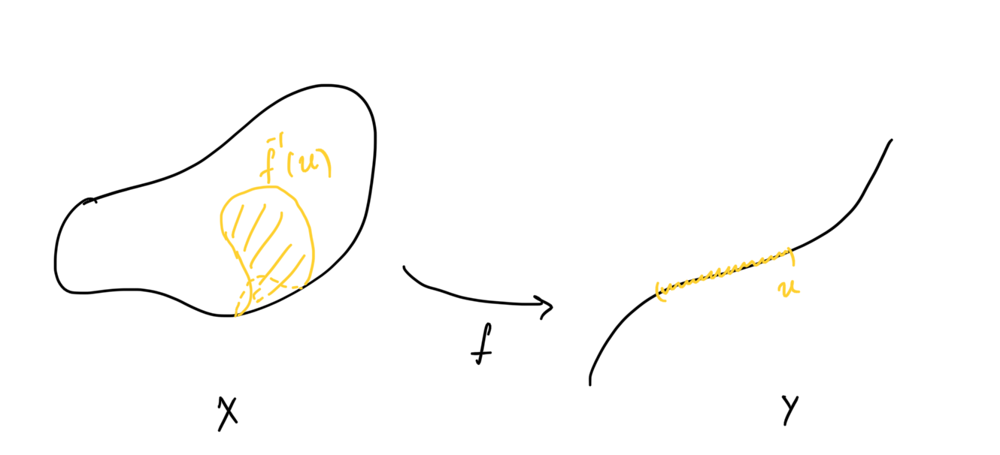
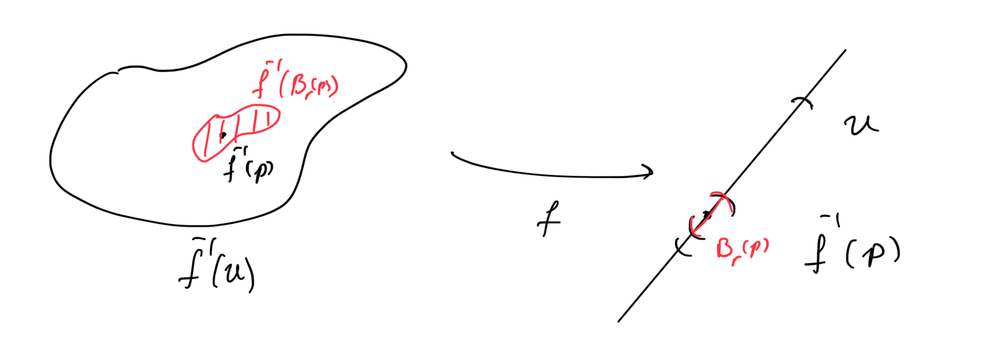
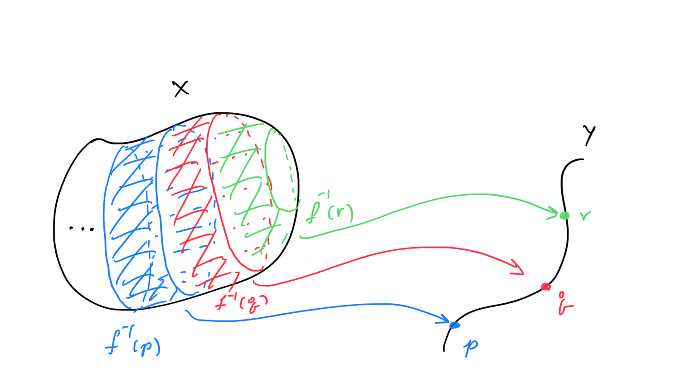

# Inducing Topology Using Maps

We have previously characterized the set of all spacelike slices and eventually we want to add a nice and smooth structure on it so that we can start writing things down such as the *kinetic energy of path from a spacetime with a black hole to one without.* The first step is to define a topology, we do so using maps to topological spaces that have the properties we want and forcing them to be continuous. 

## Spacelike Slices

Let’s briefly and without motivation recall definitions for spacelike slices, even though we develop the following in greater generality below. 

**<u>Definition:</u>** An **$n$ dimensional spacelike slice** or just **slice** is an $n$ dimensional, orientable, connected, Riemanian manifold $(S,g)$ along with other niceness conditions that remain unspecified at the moment. The **set of all slices** is $\mathcal{M}^n$

***Note:*** Let’s drop the $n$ since I will never specify it anyway. lol

## Topology from a single Map

Let’s study inducing the topology on some space using a single map first, before moving on to using multiple maps. 

Consider a map $f: X\to Y$ between a set $X$ and a topological space $Y$. Then the following proposition is cool.

**<u>Proposition:</u>** Given any map $f:X\to Y$ the set

$$
T_f \coloneqq \{f^{-1}(U) \mid U\subset Y \text{ open}\}
$$

defines a topology on $X$.

***Proof:*** $X$ is the preimage of $Y$, and $\emptyset \subset X$ is the preimage of $\emptyset \subset Y$. Additionally notice that for some $U,V\subset Y$ open,  $f^{-1}(U)\cup f^{-1}(V) = f^{-1} (U\cup V)$ and similarly for intersections. Therefore $T_f$ is closed under arbitrary unions and finite intersections. 

**<u>Corollary:</u>** $f:X\to Y$ is continuous.

Ok so now we have a way of defining a topology for a space using a single map, but how about properties? Let’s restrict the possible maps that could work for this. Look at the following proposition.

**<u>Proposition:</u>** $(X,T_f)$ is Hausdorff iff $f$ is an injective map to a Hausdorff space. 

Before we prove this proposition and have a nice discussion consider the following property which I will not prove

**<u>Property:</u>** Let $f:X\to Y$ be an injective map then $f^{-1}(U \cap V) = f^{-1}(U) \cap f^{-1}(V)$ for any $U,V \subset X$.

***Proof (of proposition):*** $(\implies)$ Assume that $f$ is injective, then let $p,q \in X$ where $p\neq q$. Then there exist $U,V \subset Y$ disjoint neighborhoods  of $f(p), f(q)$ respectively. Since $f^{-1}(U\cap V) = f^{-1}(U) \cap f^{-1}(V) = \emptyset$, by injectivity, we have found two disjoint neighborhoods. 

$(\impliedby)$ Assume that $X$ is Hausdorff, then for any pair of points $p,q \in X$ there exists a pair of neighborhoods $f^{-1}(U),f^{-1}(V) \subset X$ that contain $p,q$ respectively for two open sets $U,V \subset Y$ and are disjoint iff $p\neq q$. Then we know that if they are not the equal then $U\cap V = \emptyset \implies f(p) \neq f(q)$.

We can prove a similar proposition for second countability. Which is great because second countable Hausdorff spaces have a shit ton of properties that can help us.

**<u>Proposition:</u>** $(X,T_f)$ is second countable if $f$ is an injective map to a second countable space. 

***Proof:*** $(\implies)$ Assume that $f:X\to Y$ is injective to a second countable space $Y$ with a countable basis $\mathcal{B}$. Then $\mathcal{B}_f \coloneqq \{f^{-1}(B) \mid B\in \mathcal{B}\}$ is a basis for $T_f$ because for any map the preimage of unions is the union of the preimages, and the preimage of finite intersections is the preimage of intersections if the map is injective. 

***Note:*** Since we only care for Hausdorff spaces $f$ has to be injective, so there is reason to prove the backwards statement of the previous proposition. 

Now we can build up to the next really useful theorem!

**<u>Theorem:</u>** *(Topology Induction by a single map)* Given a set $X$, a toplogical space $Y$ that is second countable and Hausdorff, and a map $f: X\to Y$  the topological space $(X,T_f)$ is second countable and Hausdorff iff $f$ is injective.

### Injectivity Sucks!

The previous theorem is great because it shows us an equivalent condition for the topological space to have most of the niceness properties we require. Here is a glimpse of what we get by using an injective map:

1. If a sequence converges the limit is unique.
2. Baire Category theorem: Countable intersections of dense sets are dense. This is very helpful in characterizing the space later.
3. If in addition it is regular (this is a weaker condition of normality), i.e. a closed set and a point outside it are separated by open neighborhoods, then $X$ is metrizable. (Urysohn Theorem)
4. $X$ is separable and Lindelöf. 

and more! Personally this makes me very happy, because the step for showing that $X$ is a metrizable space is very simple after this point, which is eventually what we want to build up to. 

Yet injectivity is **very strong**. Who knows if we can even find a map to a second countable Hausdorff space that maps ALL THE (nice) MANIFOLDS!? So injectivity sucks. Yet we don’t have to give up. We can turn any map into an injective map by restricting the domain. So we can explore that

**<u>Proposition:</u>** Given a map $f:X\to Y$ between any two sets $X,Y$ the restriction of the map to the equivalence classes of $f$ in $X$ in injective.

The equivalence classes referred to here are the fibres of $f$. In particular $x\sim y \iff f(x) = f(y)$ so $f:X/{\sim} \to Y$ is injective by construction. 

The obvious caveat is that we are reducing the original set $X$ to a much smaller one that might not be fine enough to contain all the interesting cases. So this begs the natural question, can we proceed with making sequences of maps with finer and finer equivalence classes?

## Inducing Topology from Multiple maps

We have already seen how we can induce a topology using a single map. Here we want to talk about a systematic way of inducing it using multiple maps. The answer to that is products. We will use maps to the product space to talk about these 

