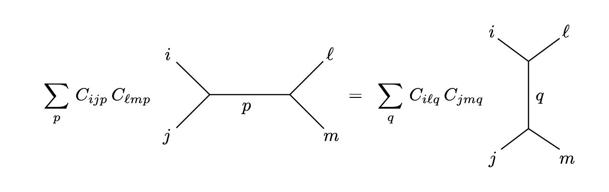

# 2D\_CFT\_Axioms

## Axioms in 2D CFT

Here we build 2D Conformal Field Theories from an axiomatic point of view and calculate some basic results in this language.

\[TOC]

## Operators in CFT

The first and potentially most important step in understanding the propagators in CFT is to understand the operators and their structure. We begin by describing a hilbert space of states, defining its properties and then talk about operators on the hilbert space. Then we will talk about operator valued distributions there that are what we call operators in CFT. Finally, we will prove certain niceness properties between them and the hilbert space.

**Definition:** A **quantum Hilbert space** is a separable Hilbert space with hermitian inner product.

This has all the niceness properties of the hilber spaces that we want. Now it’s time to start thinking about operators.

**Definition:** A **unitary operator** $U$ in a quantum Hilbert space $\mathbb{H}$ is a complex bilinear, bijective map $U: \mathbb{H}\to \mathbb{H}$ such that the inner product is invariant. i.e. $\langle Ux,Uy\rangle = \langle x,y\rangle$.

Notice that these operators do not have to be bounded or have any other niceness properties. What we would like to do is to create maps from our base manifold to operators. However, this is not good enough. Since we only care about what happens in regions of space and not in points the natural object to talk about is distributions, which encompasses more stuff than normal functions.

***

### Quick aside on the domain of operators

Now the next question is: should we restrict the definition of operators to a function defined in the entirety of the Hilbert space? The answer is, surprisingly, no!

Infact this is not even a new idea, we have implicitly been doing it in physics for ages! Think about any continuous function $f:\mathbb{R}^2 \to \mathbb{R}$. Now restrict the function on $D = \mathbb{R}\setminus {0}$ to obtain $\tilde{f}:D\to \mathbb{R}$. However we know that since $D$ is dense and $f$ is continuous on $\overline{D}$ that $\lim\_{x\to 0} \tilde{f}(x) = f(x)$. In other words by continuity we can extract the value of $f$ at some point outisde of $D$ simply by looking at the limit! This is great because if $D$ is dense, we could extend $\tilde{f}$ to all of $\mathbb{R}^2$ by doing this limit thing. Let’s summarize this in the following proposition.

**Proposition:** Let $f:X \to Y$ be continuous from some topological space $X$ to some topological space $Y$ and $D\subset X$ be dense. Then given the restriction $\tilde{f}:D\to Y$ of $f$ we have that $\forall y \in \overline{D} = X$

$$
\lim_{x\to y} \tilde{f}(x) = f(y)
$$

Which means that if we only were to have $\tilde{f}$ we could get $f$ as long as the domain of the restriction is dense!

Ok, so what? Well in physics (unfortunately) things are almost never defined in the entirety of space. But they are almost always defined on a dense subset of it. Think of the charge of a test particle. It is defined everywhere but the origin. Therefore, if we were to develop a theory of physics that only works on functions that are well defined everywhere, we would have to exclude some of these very real cases!

Therefore, we _have_ to make our physics work using functions that are not necessarily defined everywhere, but are at least defined on a dense subset.

But if we are not considering some points in the entirety of space won’t we loose information about them? The answer is no! In fact that’s what we’ve shown in the previous proposition. If the function is continuous everywhere, then we can recover its value everywhere from any restriction to a dense subset. So we have lost nothing. On the contrary we have gained a richer tool to talk about functions.

Often, this remains unsaid, because it is a REALLY subtle point that at the end, ends up changing nothing in day to day calculations. But we do use it every time we change to spherical or cylindrical coordinates which I think is pretty cool.

On the matter at hand, when we are trying to axiomatize something as complicated as QFT we need to take into account the same subtlety. **We don’t just wanna study operators that map from the entire hilbert space, we want to do it for ones defined in a dense subset of it.** So let’s start building on that

***

Ok now that we have motivated the need to talk about operators from dense subsets of the hilbert space other than its entirety let’s try to define them!

**Definition:** An **operator** defined on a quantum hilbert space $\mathbb{H}$ is a pair $(A,D)$ where $D \subset \mathbb{H}$ is a linear subspace and $A:D \to \mathbb{H}$ is a $\mathbb{C}$-linear map. The operator is **densely defined** if $D$ is dense in $\mathbb{H}$. We call $\mathcal{O}(\mathbb{H})$ the set of all _densely defined_ operators on $\mathbb{H}$. We often denote $D$ by $D\_A$.

TADAAAA!

This is a really nice definition. $D$ is still a vector space so we can talk about linear maps from it, and this definition allows for $D$ to be any subset of the Hilbert space, including dense subsets, or even just all of it. We have lost nothing in this process, but we have been so nicely general.

There is one more point of subtlety, we want to talk about operators that are self adjoint, and the way that we defined them is a bit iffy, so let’s write it down.

**Definition:** An operator $(A^_,D^_)$ on a quantum Hilbert space $\mathbb{H}$ is the **adjoint** of a densely defined operator $(A,D)$ if

$$
\begin{gather*}
D^* = \{f \in \mathbb{H} \mid \exists h \in \mathbb{H} \text{ s.t. } \forall g\in D\  \langle h,g\rangle=\langle f,A g\rangle\}\\
\langle A^* f, g \rangle = \langle f,A g \rangle\ \ \  \forall f\in D^*, g\in D
\end{gather*}
$$

An operator is **self adjoint** if $(A^_, D^_) = (A,D)$.

The adjoint still means the same thing, but we had to be careful about where it is defined (sorry this is the price we pay for restricting our domain).

### Field Operators

The next step is to talk about the concept of a **field operator**. This is a bit harder to define. What I picture as a field operator is simply a map that takes a manifold and assigns an operator to its every point. Obviously, this is quantum mechanics so it doesn’t work. But why?

The central object of quantum mechanics is not really the value of the field itself, but rather expectation values of stuff. We don’t care about what happens at a particular point, we always care about what happens on average in a region (that could be arbitrarily small). By restricting ourselves to thinking about functions we are loosing the ability to talk about regions. Perhaps some functions are not ingerable in some regions, or perhaps some information about a region could not be expressed in terms of functions. That’s why we create distributions. So we are going to use those to define our field operators.

**Definition:** An **operator valued distribution** on an open subset $U \subset M$ of a (pseudo-) Riemannian manifold $M$ is a continuous linear map $u \in \mathcal D'(U,\mathbb H)$ of the form $u : \mathcal D(U) \to \mathcal O(\mathbb H)$, where $\mathcal D(U)$ is the space of compactly supported test functions on $U$ defined [here](../Analysis/Distributions.md).

**Definition:** A **field operator** or a **quantum field** is a local operator valued distribution on some manifold $M$, i.e. a linear map

$$
\Phi:\mathcal{D}(M) \to \mathcal{O}(\mathbb{H})
$$

such that there exists a dense subspace $D\subset \mathbb{H}$ where

1. For all $f\in \mathcal{D}(M)$ we have that $D\subset D\_{\Phi(f)}$.
2. The induced map $\mathcal{D}(M) \to \text{End}(D), f\mapsto \left.\Phi(f)\right|\_D$ is linear.
3. For all $v\in D$ and $w \in \mathbb{H}$ the map $f \mapsto \langle w,\Phi(f)(v)\rangle$ is a distribution on $M$.
4. $\text{sing,supp,} \Phi$ is a discrete set of measure $0$ on $M$.

The **set of all field operators** is denoted as $\mathbb{\Phi}(M,\mathbb{H})$ or just $\mathbb{\Phi}$ when the setting is understood.

The first condition is to say that every operator that we attach is densely defined in a way that if we compose all of them we will still have a densely defined operator (we won’t accidentally remove a chunk of our Hilbert space that we can’t take back). The next condition is that we want this to be linear in the dense domain shared by all, and finally that if we fix two states we want to get back a distribution. Also there is some small abuse of notation. While $\Phi(f)$ is technically $(A,D)$ we choose to refer to $A = \Phi(f)$ and $D = D\_{\Phi(f)}$. I know it sucks, but it makes sense. The last condition is locality, in other words we want the singularities of the distribution to be of measure zero such that there is a neighborhood around every point where the distribution is regular. A more detailed version of distributions is presented [here](../Analysis/Distributions.md).

### Conformal Transformations

In order to fully understand the requirements for something to be a conformal field we need to consider how do things transform under conformal transformations. We begin by considering the definition of conformal transformations through the metric. Then we study how maps and distributions transform and then we impose this condition on our conformal fields.

**Definition:** Given two Riemannian Manifolds $(M,g)$ and $(N,h)$, a **Weyl transform** is a smooth map of manifolds $F:(M,g) \to (N,h)$ such that $F^\star h = \Omega g$ for some $\Omega \in C^{\infty}(M)$ and $\Omega(x) > 0, \forall x\in M$.

Note that a priori a Weyl transform does not tell you anything about the metric $h$ from the metric $g$. All it tells you is that if you take a vector and transform it to the new manifold its length would be scaled by $\Omega$.

**Definition:** Let $(M,g)$ be some $n$-dimensional Riemannian manifold. Then a **conformal transformation** $F:(M,g)\to (M,g)$ is a diffeomorphism such that

$$
F^\star g = \Omega \ g
$$

where $\Omega \in C^{\infty}(M)$ and $\Omega(x) > 0, \forall x\in M$.

This is suuuper confusing. To unpack first we understand that $F$ is a diffeomorphism of manifolds, i.e. a smooth map between manifolds with smooth inverse. In this case, it maps to the manifold we started with, but with the same metric. YET, for some reason the pullback of the metric is different.

The pullback of $g$ can be loosely thought of what $g$ would look like if we take it back to the original manifold _through_ $F$. This doesn’t help. Here is the expression

$$
(F^\star g)(X,Y) = g(F_\star X,F_\star Y)
$$

In other words it is telling you how $g$ acts on transformed vector fields. Which is what we call $g$ in the “new coordinates” of $F$. As a result in component notation we have that

$$
F^\star g= \frac{\partial F^\mu}{\partial x^\alpha} \frac{\partial F^\nu}{\partial x^\beta}g_{\mu\nu}\ dx^\alpha \otimes dx^\beta
$$

So this was easy (lol). In this notation $F^\mu = x^\mu \circ F$ we usually denote this as $y^\mu$ constructing a new chart $(y^1, y^2, \cdots, y^n)$. In that notation we can safely write

$$
F^\star g = g_{\mu\nu}\ dy^\mu \otimes dy^\nu = \frac{\partial y^\mu}{\partial x^\alpha} \frac{\partial y^\nu}{\partial x^\beta}g_{\mu\nu}\ dx^\alpha \otimes dx^\beta = \Omega\ g_{\alpha \beta}\ dx^\alpha \otimes dx^\beta
$$

In other words we see that

$$
\frac{\partial y^\mu}{\partial x^\alpha} \frac{\partial y^\nu}{\partial x^\beta}g_{\mu\nu} = \Omega\ g_{\alpha \beta}
$$

Nice. What that means in practice is that these transformations are coordinate transformations that preserve the angles. THEY DO NOT CHANGE THE METRIC! The length of any vector remains the same, the length of any path remains the same. This is a really crucial subtlety. The map mapped us between the same manifold with the same metric, the condition with the pullback was to make a statement about how it does it, not how it changes the metric.

### Conformal Transformations in $\mathbb{C}$

When $M = \mathbb{C}$ we can write the Euclidean metric as $g = dz, d\bar{z}$. The following is an amazing result about conformal field theories in two dimensions.

**Theorem:** The conformal transformations in $\mathbb{C}$ are exactly the analytic ones.

_**Proof:**_ Let $f: \mathbb{C} \to \mathbb{C}$ be any map. Then we can check the pullback of the metric under $f$ where we should have

$$
\begin{align*}
f^\ast g &= f^\ast dz\, d\bar{z}\\
&= df^\ast z \, df^\ast \bar{z}\\
&= df\, d\bar{f}\\
&= \frac{\partial f}{\partial z}\frac{\partial \bar f}{\partial z} dz\, dz + \left( \frac{\partial f}{\partial z}\frac{\partial \bar f}{\partial \bar z} + \frac{\partial f}{\partial \bar z}\frac{\partial \bar f}{\partial z} \right) dz\, d \bar z + \frac{\partial f}{\partial \bar z}\frac{\partial \bar f}{\partial \bar z} dz\, dz
\end{align*}
$$

Notice that in order for this to be conformal we need to at least have

$$
\begin{align*}
\frac{\partial f}{\partial z}\frac{\partial \bar f}{\partial z} &= 0
\end{align*}
$$

Therefore, either $\frac{\partial f}{\partial z} = 0$ or $\frac{\partial f}{\partial \bar z} = 0$. If both are zero then the metric vanishes, so it’s not good. Both of these conditions are restatements of the Cauchy criterion, therefore $f$ is analytic. As a result, without loss of generaility we can assume $\frac{\partial f}{\partial \bar{z\}} = 0 $. Therefore we have that

$$
f^\ast g  = \left|\frac{df}{dz}\right|^2 dz\, d\bar z
$$

Which also shows the sign enforcement as well. $\Box$

Now consider a tensor field $\Phi \in \mathcal{T}^{(m,n)}(\mathbb{C})$, then it transforms as

$$
f^\ast \Phi = \Big(\frac{df}{dz}\Big)^h \Big(\frac{d\bar f}{d\bar z}\Big)^{\bar h} \Phi
$$

where $h,\bar{h} \in \mathbb{N}$. So that’s pretty, where we can fully classify our operators. Again we are building up to thinking of operator valued distributions instead of maps. But for now we are good!

***

## Setting for Axiomatization

What we aim to do in the following is to define a set of axioms such that we ensure a duality between **Field Operators** and **States** or elements of the chosen quantum Hilbert space. In reality we do not really care about the fields themselves. What defines the theory is the correlation functions (i.e. the green’s functions) that are constructed through vacuum expectation values of field operators. This will make sense as we go along. To start with we need some defintions of the nice spaces we are working on.

**Definition:** The **ordered configuration space** of $n$ points in some set $X$ is the set

$$
C_n(X) = \text{Conf}_n(X)\coloneqq\{(z_1,z_2,\cdots,z_n) \in X^n \mid z_i\neq z_j \text{ for } i,j=1\dots n\}
$$

Then the **time ordered configuration space** is the subset of $C\_n(\mathbb{C})$ with positive real coefficients given by

$$
C_n^+(\mathbb{C}) = \text{Conf}_n^+(\mathbb{C}) \coloneqq \{(z_1,z_2,\cdots,z_n) \in C_n(\mathbb{C}) \mid \Re\, z_i >0 \text{ for }i=1\dots n\}
$$

This is the space where all the points have coefficients in the positive half plane. So if there are many points at some time and space we just put them all together. We will drop the $\mathbb{C}$ in the rest of the text and assume that $C\_n$ and $C\_n^+$ refer to the complex configuration space.

This is already a pretty good starting point, the next step would be to force something else on the base space. We could force that the order at which the configuration is taken does not matter. In practice this means that for any point $(z\_1,z\_2,\cdots, z\_n) \in C\_n$ if we permute the coordinates to say $(z\_2,z\_1,\cdots,z\_n)\in C\_n$ we would still get the same point. To be more rigorous about it consider the permutation action.

**Definition:** The **permutation action** of on $C\_n$ is a group action of the permutation group of $n$ elements $S\_n$ given by

$$
\begin{align*}
\rho : C_n\times S_n &\to C_n\\
((z_1,z_2,\cdots, z_n),\pi) &\to (z_{\pi(1)},z_{\pi(2)},\cdots, z_{\pi(n)})
\end{align*}
$$

We use it to define the space where the order does not matter!

**Definition:** The **unordered configuration space** of $n$ points in some set $X$ is the set of orbits of the permutation action on $C\_n(X)$ given by

$$
\mathcal{C}_n(X) \coloneqq C_n(X)/S_n
$$

Similarly the **time ordered unordered configuration space** (lmao I love the name) of $n$ complex numbers is defined similarly as

$$
\mathcal{C}_n^+ \coloneqq C_n^+(X)/S_n
$$

I know I have spent a lot of time showing these stuff, however, they will lead to real simplification in a second essentially implementing locality in our correlation functions.

The next step is to define the spaces of Scwartz functions on these sets so that we can define operators very soon. In particular they are defined like so

**Definition:** The space of **rapidly decreasing functions** of $n$ unordered points is given by

$$
\mathcal{J}_n^+\coloneqq\{f \in \mathcal{J}(\mathbb{C}^n) \mid \text{supp }f \subset \mathcal{C}_n^+\}
$$

where $\mathcal{J}\_0^+ = \mathbb{C}\setminus {0}$, and $\mathcal{J}(\mathbb{C}^n) \subset C^\infty(\mathbb{C}^n)$ is the space of **Scwartz functions** $f\in C^\infty(\mathbb{C}^n)$ which are defined to rapidly decrease such that for any multiindex $\alpha$, and any $p,k\in \mathbb{N}$ the following exists and is finite

$$
\sup_{|\alpha| < p} \sup_{x\in \mathbb{C}^n} \abs{\partial^\alpha f(x)} (1+|x|^2)^k
$$

Now we will start with the axiomatization of the theory. The first thing we want to construct is to define the set of all propagators and give them the right properties under conformal transformations.

### Conformal Group

We have talked about the [Witt Algebra](Virasoro_Algebra.md#witt-algebra) in detail and showed how the generators look. The important corollary is that the following generators under matrix multiplication form a group called the **conformal group** which is the group of transformations we want our theory to be invariant under.

**Definition:** The **Conformal Group** is the group generated by the set

$$
\{L_{-1},\bar L_{-1}, L_{0} + \bar L_{0}, iL_{0} - i\bar L_{0},L_1,\bar L_1\}
$$

where $L\_i \in W$ and $\bar L\_i \in \bar W$, with multiplication. In order, first two generate translations, then we have the generators of dilations and rotations, and finally we have the special conformal transformations.

**Propostion:** The conformal group is isomorphic to $SL(2,\mathbb{C})$.

### Correlation functions

Here we will first give an intuitive picture of correlation functions just to illustrate how important of a role they play in this. In QFT correlation functions are the result of taking the expectation value of an operator composed by acting with the field operators in a _time ordered way._ Now we are ready for a formal definition of $n$-point correlation functions in the language of two dimensional CFTs.

**Definition:** An **$n$-point correlation function** for some $n\in \mathbb{N}$ is a polynomially bounded continuous map $G\in \mathcal J\_n^+$ from the unordered configuration space, with _conformal weights_ $h, \bar h \in \mathbb{R}$ such that for any $w \in SL(2,\mathbb{C})$ we have that

$$
G(z_1,\bar z_1, \cdots , z_n,\bar z_n) = \prod_{j=1}^n \left(\frac{\partial w}{\partial z^j}\right)^{h_j}\left(\overline{\frac{\partial w}{\partial z^j}}\right)^{\bar h_j} G(w_1,\bar w_1, \cdots , w_n,\bar w_n),
$$

where $w\_j = w(z\_j)$, $\bar w\_j = \overline{w( z\_j)}$​. Since the generator of rotations is $L\_0 - \bar L\_0$, we define the **conformal spin** of the ith index as $s\_i = h\_i - \bar h\_i$. Similarly because $L\_0 + \bar L\_0$ is the generator of rotations, we define $\Delta\_i = h\_i + \bar h\_i$ to be the **scaling dimension** of the correlation function.

The important thing to notice is that this definition implies that there aren’t many choices for these functions. Let’s look at the following proposition.

**Proposition:** Consider an n-point correlation function $G$ with $n\geq 2$. Then denote by $z\_{ij} = z\_i - z\_j$ and we can write

1. $G(z\_i,\bar z\_i) = G(z\_i-z\_j,\bar z\_i - \bar z\_j,0)$, i.e. they only depend on the difference of the coordinates.
2. if $h\_i = \bar h\_i = 0$ then $G(z\_{ij}) = C\in \mathbb{C}, \ \forall z\_{ij} \in \mathbb{C}$
3. if $h\_i = \bar h\_i = 1$ then $G(z\_1,\bar z\_1,z\_2,\bar z\_2) = \frac{C} {z\_{12}^2 \bar z\_{12}^2}$ for some $C\in \mathbb{C}$.

We can keep deriving these identities, but this is amazing! We could just use contour integration to figure out anything about the correlation functions, simply by knowing their weights.

### Reconstruction of Field Operators

With a given set of $n$ point correlation functions there is a proceedure we can go through to define a quantum Hilbert space $\mathbb{H}$ with natural field operators that that give rise to the specific correlations, as well as have a natural unitary representation of the conformal group, and contain a vector $\Omega \in \mathbb{H}$ such that it is invariant under the unitary representation of the conformal group. I am going to skip the details of this construction now because it is unnessesarily involved, but the important thing is that it is always possible to do so and obtain a unique $\mathbb{H}$.

**Theorem:** _(Reconstruction of Field Operators)_ Given a set of indexed correlation functions ${G\_{i\_1,\cdots,i\_n\}}\_{i\_1,\cdots,i\_n \in B}$ there exists a unique quantum hilbert space $\mathbb{H}$ with a canonical representation $U:SL(2,\mathbb{C}) \to \text{Aut}(\mathbb{H})$ of $SL(2,\mathbb{C})$ and an invariant vector $\Omega \in \mathbb H$ such that there exist quantum fields $\Phi\_i : \mathcal J^+ \to \text{End}(D)$ for some $D\subset \mathbb{H}$ a dense subspace such that for some $w\in SL(2,\mathbb{C})$, $z\in \mathbb{C}$

$$
U(w)\Phi_i(z,\bar z)U(w)^\dagger = \left(\frac{\partial w}{\partial z}\right)^{h_i} \left(\overline{\frac{\partial w}{\partial z}}\right)^{\bar h_i} \Phi(w(z),\overline{w(z)})
$$

and if $\Re z\_n> \cdots > \Re z\_2 > \Re z\_1 > 0$ then

$$
\langle \Omega, \Phi_{i_1}(z_1) \Phi_{i_2}(z_2) \cdots \Phi_{i_n}(z_n) \Omega   \rangle = G_{i_1,i_2,\cdots,i_n}(z_1,z_2,\cdots,z_n)
$$

Note that when we say $\Phi(z)$ what we really mean is that the operator $\Phi$ acts on the variable $z$ of a function of many variables.

Ok! Now we are cooking! We have our field operators, even somewhat haphazardly, so now let’s try to figure out what they really mean.

### Conformal Ward Identities

Let’s study those correlation functions a bit more in detail and develop some tools that will be useful for calculation. These are called ward identities.

**Theorem:** _(Conformal Ward Identities)_ The transformation assumptions of correlation functions under $SL(2,\mathbb{C})$ leads to the following identities

1. $$
   0 = \sum_{j=0}^n \frac{\partial }{\partial z_j}G(z_1,z_2,\cdots,z_n)
   $$
2. $$
   0 = \sum_{j=0}^n \left(z_j\frac{\partial }{\partial z_j} + h_j\right)G(z_1,z_2,\cdots,z_n)
   $$
3. $$
   0 = \sum_{j=0}^n \left(z_j^2\frac{\partial }{\partial z_j} + 2h_jz_j\right)G(z_1,z_2,\cdots,z_n)
   $$

We use these identities to further restrict the form that the correlation functions can take. We will see it in practice later, but they are important to mention here.

### Energy Momentum Tensor

The central object that encodes our physics is the stress energy tensor of the theory. Here is a definition for it.

**Definition:** An **energy momentum tensor** is 4 quantum fields $T\_{\mu\nu}:\mathcal J^+ \to \text{End}(D)$ such that

1. $T\_{\mu \nu} = T\_{\nu\mu}$ and $T\_{\mu \nu}(z)^\ast = T\_{\nu\mu}(-z^\ast)$
2. $\frac{\partial T\_{\mu 0\}}{\partial t} + \frac{\partial T\_{\mu 1\}}{\partial x} = 0$​
3. It has scaling dimension $\Delta\_{\mu\nu} = h\_{\mu\nu} + \bar h\_{\mu\nu} = 2$ and conformal spin $s\_{\mu\nu} = \pm 2$.

**Corollary:** _(Properties of the Energy Momentum Tensor)_ The axioms of the energy momentum tensor and the covariance properties lead to

1. $\Tr(T\_{\mu\nu}) = 0$
2. The quantum field $T = T\_{00} - i T\_{01}$ is holomorphic with conformal weights $h\_T = 2, \bar h\_T =0$
3. The quantum field $\bar T = T\_{00} + iT\_{01}$ is antiholomorphic with conformal weights $h\_T = 0, \bar h\_T =2 $

### Physical Motivation

So far these constructions have been introduced without any motivation, so let's introduce the usefulness of the stress tensor as an object in our CFT using some physical motivation and [variational calculus](../Analysis/Variational_Calculus.md). We will also derive the ward identities to justify their almost axiomatic presentation above.

As we have shown in an [example](../Analysis/Variational_Calculus.md#Examples-in-Physics), a stress tensor $T$ on $\mathbb{R}^2$ can be obtained by the variation of some action $S: \Gamma^\infty\_{\text{Sym\}}\left( T^\ast \mathbb{R}^2 \otimes T^\ast \mathbb{R}^2 \right) \to \mathbb{R}$ via

$$
\delta S[g](\delta g) = \int_{\mathbb{R}^2} \ast_g \iota_T\delta g,
$$

where $g,\delta g$ are some metrics on $\mathbb{R}^2$ and $\iota\_T\delta g$ is the contraction of $\delta g$ by the stress tensor $T$. We will go over two derivations for why the variation can be given in terms of the stress tensor. One will be completely classical using phase spaces, and the other will be completely quantum using path integrals. Then we will show the equivalence between the path integral conserved current and the quantized Noether current.

### Virasorization of our Hilbert Space

We derived this object because it will give us the symmetries of our theory. Let’s do some groundwork

Consider the following operators in the quantum Hilbert space

$$
\begin{align*}
L_{-n} \coloneqq \frac{1}{2\pi i}\lim_{\epsilon \to 0} \int_{|x| = \epsilon} \frac{T(x)}{x^{n+1}} dx && \bar L_{-n} \coloneqq \frac{1}{2\pi i} \lim_{\epsilon \to 0} \int_{|x| = \epsilon} \frac{\bar T(x)}{x^{n+1}} dx 
\end{align*}.
$$

The integral here is well defined since $T$ is a local distribution which means that if it has a singularity near $x = 0$ there is a neighborhood $U$ of $x \in \mathbb C$ such that $T$ is regular in $U\setminus {x}$. Therefore we use the function that generates $T$ to define it. Notice that with this definition the distributions $T$ and $T + \delta$ yield the same operators. This is going to be a useful observation for later, when we are studying anomalies.

**Proposition:** The operators $L\_{-n}$ and $\bar L\_{-n}$ on the quantum Hilbert space $\mathbb{H}$​ follow the commutation relation of two unitary representations of the [Virasoro Algebra](Virasoro_Algebra.md#virasoro-algebra) with the same central charge $c$.

HELL YEAH! We found it! We have found our symmetry algebra. Now we can do something else that is cool, we can reconstruct the stress tensor

**Corollary:** _(Stress Tensor Reconstruction)_ It follows that given these two representations the stress tensor components can be obtained by

$$
\begin{align*}
T(z) = \sum_{n\in \mathbb{Z}} L_{n}z^{-n-2}
&& \bar T(z) = \sum_{n\in \mathbb{Z}} \bar L_{n}\bar z^{-n-2}
\end{align*}
$$

This is amazing! We essentially have found that the stress energy tensor yields a unitary representation of $\text{Vir} \times \overline{\text{Vir\}}$. Now we can attempt to decompose it. One piece of subtlety is that we have not reconstructed $T$ entirely, but we instead reconstructed its regular part, which we analytically continue to obtain another distribution.

**Lemma:** _(Decomposition of Hilbert Space)_ Under the Virasoro representation of defined by the stress energy tensor $T$, the quantum Hilbert space can be decomposed to a direct sum of irreducible unitary positive definite highest weight representations, i.e.

$$
\mathbb{H} \supset D \cong \bigoplus_{c,h} W(c,h) \otimes \bar W(c,\bar h)
$$

If this decomposition is finite, we call the conformal field theory **minimal.**

## Definition of a 2D CFT

Now we are ready to define a conformal field theory. (This is useless, but cool)

**Definition:** A **conformal field theory** for a countable index set $B$ (we usually call this the index set for the quasi-primary fields) is a family of $n$-point correlation functions $\mathcal{G} = (G\_i)_{i\in \mathcal B}$, where $\mathcal B = \bigcup_{n\in \mathbb{N\}} B^n$ (i.e. the set of all multi-indeces obtained from $B$), together with a stress energy tensor $T\_{\mu\nu} \in \mathbb{\Phi}(\mathcal{G})$, where $\mathbb{\Phi}(\mathcal{G})$ is the set of quantum fields that generate $\mathcal{G}$.

YES! This is it! Isn’t this amazing? The following corollary summarizes what we have done so far.

**Corollary:** For any conformal field theory $(\mathcal{G},B)$ for a countable index set $B$, and $n-$point correllation functions $\mathcal{G}$ there exists a unique, up to isomorphism, quantum Hilbert space $\mathbb{H}(\mathcal{G})$ with a canonical unitary representation of the conformal group and a vacuum state $\Omega \in \mathbb{H}(\mathcal{G})$ invariant under the that representation. There also exists a unique collection of quantum fields $\mathbb{\Phi}(\mathbb{H})$ that generate $\mathcal{G}$.

Now that we have something, let’s look at some examples

**Example:** _(Free Boson)_ Consider a complex scalar field $\phi: \mathbb{C} \to \mathbb{C}$ with the action $S: C^\infty(\mathbb{C}) \to \mathbb{R}$

$$
S(\phi) = \frac{1}{2\pi}\int_{\mathbb{C}} d\phi \wedge \star d \bar \phi.
$$

Where the metric is given by

$$
g = \frac{1}{2} \left[dz\otimes d\bar z + d\bar z \otimes dz \right] = dz\cdot d\bar z
$$

Let’s find the green’s functions to do so we will rearrange using Leibniz rule the action to obtain

$$
S(\phi) = -\frac{1}{2\pi} \int_{\mathbb{C}} \phi\,  d\star d \bar \phi - d(\phi \star d\bar \phi)
$$

Then we consider the set of variations $\eta \in C^\infty(\mathbb{C})^\mathbb\{{C\}}$ such that $\int\_\mathbb{C} d\eta = 0$. As a result we can write

$$
\lim_{\epsilon \to 0} \frac{1}{\epsilon} \left[S(\phi + \epsilon \eta) - S(\phi)\right] = -\frac{1}{2\pi}\int_{\mathbb{C}} \eta\, d\star d \bar \phi + \bar \eta\,  d\star d \phi
$$

As a result, we have that the equation of motion is given by

$$
\frac{1}{2\pi}d\star d \phi = 0 \implies \frac{1}{2\pi} G(z,w) = \frac{1}{2}\log\frac{1}{\abs{z-w}}
$$

Using variational principle we can calculate the the 2 point correlation function is

$$
G(z,\bar z,w,\bar w) =  \langle\phi(z,\bar z) \phi(w,\bar w)\rangle = -\frac{1}{2}\log|z-w|,
$$

which is a really cute formula, essentially saying that this correlation can be split in two. In practice is does. From the equations of motion we see that

$$
\phi =\frac{1}{2} (\psi + \bar \psi),
$$

for some holomorphic and anti holomorphic functions $\psi, \bar \psi$. These have the following two point functions

$$
\begin{align*}
\langle \psi(z) \psi (w)\rangle = -\log(z-w) && \langle \bar \psi(\bar z) \bar \psi (\bar w)\rangle = -\log(\bar z-\bar w)
\end{align*}
$$

Now we see that $\psi$ doesn’t have the structure of a conformal field because its correlation function doesn’t look conformally invariant (for example, scaling transformations look like adding a constant). However their derivatives just might! In fact

$$
\langle \partial \psi(z) \partial \psi (w)\rangle = -\frac{1}{(z-w)^2}
$$

which we can see that is invariant under translations, and under scalings it just acquires an exponent to the power of 2! So this looks like it could be a conformal field with weights $(h,\bar h) = (1,0)$.

### Operator Product Expansion

The first thing we need in order to talk about this concept, which is super useful in calculation, is to get the Primary Fields. Let’s understand what they are.

**Definition:** A quantum field $\Phi : \mathcal J^+ \to \text{End}(D)$ is a **primary field** if

$$
[L_n,\Phi(z,\bar z)] = z^{n+1}\frac{\partial \Phi(z,\bar z)}{\partial z} + h_{\phi}(n+1) z^n\Phi(z,\bar z)
$$

where $h\_\Phi$ is its conformal weight.

**Corollary:** A primary fields satisfies

$$
[\bar L_n,\Phi(z,\bar z)] = \bar z^{n+1}\frac{\partial \Phi(z,\bar z)}{\partial \bar z} + \bar h_{\phi}(n+1) \bar z^n\Phi(z,\bar z)
$$

Ok this was kind of a lame corollary, but here is a cool one, which will help us introduce the Operator Product expansion.

**Corollary:** A primary field $\Phi$ satisfies

$$
T(z)\Phi(z') \sim \frac{h_\Phi}{(z-z')^2} \Phi(z') + \frac{1}{z-z'}\frac{\partial \Phi(z')}{\partial z'}
$$

Where the symbol $\sim$ signifies the asymptotic expansion, i.e.

$$
A(z) \sim B(z) \iff A(z) = B(z) + R(z), \text{ where } \int_{S^1} R dz = 0
$$

Honestly, I am not sure how to prove this, and I will get there eventually. However, here is what we mean by OPE.

**Theorem:** _(Operator Product Expansion of Primary Fields)_ Any pair primary fields $\Phi,\Psi$ obey the following

$$
\Phi(z) \Psi(w) \sim \sum_{X\in \mathcal{G}} C_{\Phi\Psi X} (z-w)^{h_X- h_\Psi - h_\Phi} X(w)
$$

where $C\_{\Phi\Psi X} \in \mathbb{C}$​ is some constant. We can figure out these constants by how conformal invariance implies restrictions in the correlation functions.

**Remark:** We usually require that in a CFT the OPE is _associative_. This really means that when we are expanding the vaccuum expectation values it doesn’t matter which field operator we take the OPE of first, we should obtain the same result regardless. This is sometimes known as **crossing symmetry** and all it really means is that the following diagrams evaluate to the same thing

Now we are ready to talk about an OPE in more generality.

### Local Symmetries (Where are the Verma Modules?)

So far we have seen that by adding a stress energy tensor in our theory, we have effectively created a global representation of the Virasoro algebra. Here we will study local symmetry.

**Definition:** Given a primary quantum field $\Phi$ with conformal weights $(h,\bar h)$ an **asymptotic state** $\nu \in \mathbb{H}$ for this field is given by

$$
\nu = \lim_{z\to 0} \Phi(z) \Omega,
$$

where $\Omega \in \mathbb{H}$ is the vacuum vector.

These are what we call asymptotic states, and they are very useful for starting to talk about highest weight representations of Virasoro algebra. Take a look at this corollary, which will be one of the very few here with proofs.

**Proposition:** An asymptotic state $\nu$ is an eigenstate of $L\_0$ with eigenvalue $h$. and $L\_n \nu = 0$

_**Proof:**_ We know from the commutation relations we derived that

$$
[L_0,\Phi(z)]\Omega = L_0 \Phi(z) \Omega - \Phi(z) L_0 \Omega = L_0 \Phi(z) \Omega\\
[L_0,\Phi(z)]\Omega = z\frac{\partial \Phi(z)}{\partial z}\Omega + h \Phi(z)\Omega
$$

Taking the limit we find that

$$
L_0\nu = h\nu
$$

Similarly for $L\_{n}$ we get that

$$
L_n\nu = 0
$$

This is a really cool result! Because we have now created a virasoro module!

**Corollary:** Given a an **asymptotic state** $\nu = \lim\_{z\to 0} \Phi(z)\Omega$ for some primary field $\Phi$ there exists a Virasoro module as a subspace of the quantum hilbert space, given by

$$
V_{\nu} \coloneqq \{L_{i_1}L_{i_2} \cdots L_{i_n} \nu \in \mathbb{H} \mid  i_k < 0, n\in \mathbb{N} \} \subset \mathbb{H}
$$

with highest weight vector $\nu$.

**Definition:** A state $ x \in V\_{\nu} $ is called a \*\*descendant \*\*of $\nu$ if $x\neq \nu$.

We usually think of those states as excited states. We usually require in addition that the descendants of the asymptotic states for all primary fields span a dense subset of the quantum Hilbert space. In this case we can decompose the Hilbert space into Virasoro modules using just the primary fields.

**Definition:** Given a primary field $\Phi$ a **secondary field** or **descendant** of **level** $n$ (yes same name) $\Phi^a$ is given by

$$
\Phi^a(z) = L_{-a_1}(z)L_{-a_2}(z)\cdots L_{-a_n}(z) \Phi(z)
$$

where $a \in \mathbb{N}^n$, $a\_1 \geq a\_2 \geq \cdots \geq a\_n > 0$ and

$$
L_{n}(z) \coloneqq \frac{1}{2\pi i}\int_{S^1}T(x)(x-z)^{n-1} dx
$$

for some $z\in \mathbb{C}$. Therefore, to each primary field we can associate a **conformal family** $\[\Phi]$ which is a complex vector space generated by all the secondary fields, given by

$$
[\Phi] = \text{span}_{\mathbb{C}}\{ \Phi^a \in \mathbb{\Phi} \mid n\in \mathbb{N}, a \in \mathbb{N}^n\}
$$

With this definition we have done multiple steps. The first one is that we have defined local generators for the Virasoro algebra $L\_n(z)$ such that $L\_n = L\_n(0)$. The second cool thing is the following proposition.

**Proposition:** For a primary field $\Phi$ with conformal weights $(h,\bar h)$ and any $z \in \mathbb{C}$, its conformal family $\[\Phi]$ defines a highest weight representation of the Virasoro algebra with conformal parameters $(c\_{\Phi},h)$ and highest weight vector $\nu = \Phi(z)$.

When I read this, I was screaming to my computer that $\[\Phi]$ is not a subspace of the quantum Hilbert space $\mathbb{H}$ so why do we even care about the representation at the level of quantum fields? The reason is the state to field operator correspondence. Here it is formulated in a nice way.

**Theorem:** _(Field Operator, State Correspondence)_ If the asymptotic states span and the descendants (i.e. $V\_\nu$ for every $\nu$) span a dense subset $V \subset \mathbb{H}$ of the quantum Hilbert space, then for any $x \in V$ there exists a unique field $\Phi \in \mathbb{\Phi}$ such that $x = \lim\_{z\to 0}\Phi(z) \Omega$.

The corollary is that for any conformal family we can find a corresponding subspace in the Hilbert space with the same properties. So essentially, with this step we have managed to partition our quantum Hilbert space (or at least a dense subset of it) in Verma modules!

**Corollary:** For some field operator $\Phi$ the Verma module $\[\Phi]$ is isomorphic to $V\_\nu \subset \mathbb{H}$ for $\nu = \lim\_{z\to 0}\Phi(z) \Omega$. And thus $V\_\nu$ is a Verma module with conformal parameters $(c,h)$.

But here is the thing. We know $h$ from $\Phi$, but what about $c$, the central charge? To find the central charge we only need to do some algebra.

### Wick's Theorem and Normal Ordering

In calculating correlation functions we have a very useful tool in QFT that takes advantage of the noncommutativity of quantum fields.

**Definition:** Let $A,B$ be two quantum fields. Then their **normally ordered product** is given by

$$
:AB: = AB - \langle AB\rangle
$$

For more operators we do it for all possible contractions.

## Aside on why Virasoro

It would be interesting to try and justify why the Virasoro algebra is the algebra that appears in the Hilbert space, even though the Lie algebra of the conformal group is the Witt algebra. In other words: Why the f\*\* is there a central charge?

Usually the answer to this is: something something take OPE of $T$ with itself and boom, here is a central charge. And while this is correct, it is not very illuminating. So here is a more abstract presentation of the same fact.

**Observation:** Any observable symmetry of a quantum system is a symmetry of its projective space.

This is important. In the Hilbert space there is some ambiguity (i.e. the overall phase) to define the possible quantum states. So if the representation of a group changes that exclusively changes that phase then that representation is trivial in the projective space. In other words, it will not change one state to another, so an experimentalist would not see it. Therefore, in a conformal field theory, the symmetry that we do, in fact, observe is the conformal symmetry, but on the projective space. So an experimentalist would see conformal invariance as a result.

One question is, if some group (or Lie algebra) has a representation of the projective space, does that imply that there exists another (aka a lift) on the corresponding Hilbert space? The answer is not in general! Not every possible representation can be lifted into a Hilbert space. However, we can do the next best thing.

**Theorem:** Given a representation $T:G \to U(\mathbb{P})$ of a Lie group to the projective space $\mathbb{P}$, there exists a representation $\tilde G \to U(\mathbb{H})$ of its $U(1)$ proper central extension $\tilde G$ to the Hilbert space $\mathbb{H}$ such that the following diagram commutes

$$
\vcenter{
\xymatrix{
1\ar[r] & U(1)\ar[r]\ar[d]^{\text{Id}} & \tilde G\ar[r]\ar[d]^T & G\ar[r]\ar[d]^S & 1\\
& U(1)\ar[r] & U(\mathbb{H})\ar[r]^{\delta} & U(\mathbb{P})
}},
$$

where $\delta:U(\mathbb{H})\to U(\mathbb{P})$ is the lifted projective quotient map.

In other words, while it might not be possible to lift the representation to a representation of the same group, it is always possible to lift it to a central extension! That new element is the anomaly that is introduced in the Hilbert space and it characterizes the projective representation somehow.

To find weather this is possible we study the homology of the Group or algebra we are working with induced by the representation. This might be too abstract, but actually it isn't. Some day I will complete these notes saying how studying these homology groups is equivalent to studying the CFT on a cylinder, which is absolutely fascinating.
