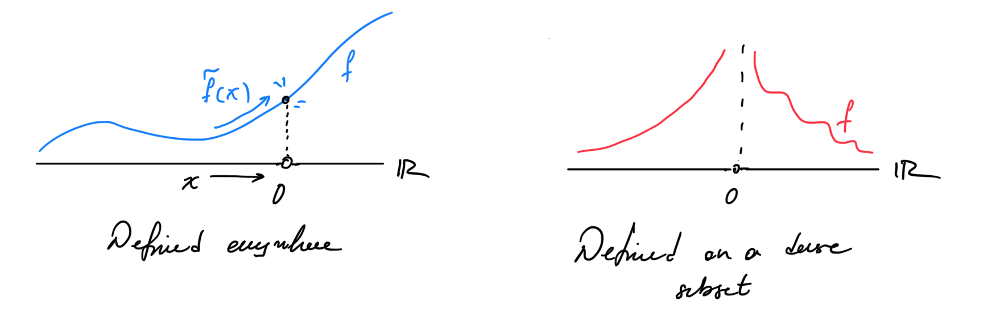

# Axioms in 2D CFT

Here we build 2D Conformal Field Theories from an axiomatic point of view and calculate some basic results in this language.

## Operators in CFT

The first and potentially most important step in understanding the propagators in CFT is to understand the operators and their structure. We begin by describing a hilbert space of states, defining its properties and then talk about operators on the hilbert space. Then we will talk about operator valued distributions there that are what we call operators in CFT. Finally, we will prove certain niceness properties between them and the hilbert space.

**<u>Definition:</u>** A **quantum Hilbert space** is a separable Hilbert space with hermitian inner product.

This has all the niceness properties of the hilber spaces that we want. Now it’s time to start thinking about operators.

**<u>Definition:</u>** A **unitary operator** $U$ in a quantum Hilbert space $\mathbb{H}$ is a complex bilinear, bijective map $U: \mathbb{H}\to \mathbb{H}$ such that the inner product is invariant. i.e. $\langle Ux,Uy\rangle = \langle x,y\rangle$. 

Notice that these operators do not have to be bounded or have any other niceness properties. What we would like to do is to create maps from our base manifold to operators. However, this is not good enough. Since we only care about what happens in regions of space and not in points the natural object to talk about is distributions, which encompasses more stuff than normal functions. 

---

### Quick aside on the domain of operators

Now the next question is: should we restrict the definition of operators to a function defined in the entirety of the Hilbert space? The answer is, surprisingly, no! 

Infact this is not even a new idea, we have implicitly been doing it in physics for ages! Think about any continuous function $f:\mathbb{R}^2 \to \mathbb{R}$. Now restrict the function on $D = \mathbb{R}\setminus \{0\}$ to obtain $\tilde{f}:D\to \mathbb{R}$. However we know that since $D$ is dense and $f$ is continuous on $\overline{D}$ that $\lim_{x\to 0} \tilde{f}(x) = f(x)$. In other words simply by continuity we can extract the value of $f$ at some point outisde of $D$ simply by looking at the limit! This is great because if $D$ is dense, we could extend $\tilde{f}$ to all of $\mathbb{R}^2$ by doing this limit thing. Let’s summarize this in the following proposition.

**<u>Proposition:</u>** Let $f:X \to Y$ be continuous from some topological space $X$ to some topological space $Y$ and $D\subset X$ be desnse. Then given the restriction $\tilde{f}:D\to Y$ of $f$ we have that $\forall y \in \overline{D} = X$

$$
\lim_{x\to y} \tilde{f}(x) = f(y)
$$

Which means that if we only were to have $\tilde{f}$ we could get $f$ as long as the domain of the restriction is dense!

Ok, so what? Well in physics (unfortunately) things are almost never defined in the entirety of space. But they are almost always defined on a dense subset of it. Think of the charge of a test particle. It is defined everywhere but the origin. Therefore, if we were to develop a theory of physics that only works on functions that are well defined everywhere, we would have to exclude some of these very real cases!

Therefore, we *have* to make our physics work using functions that are not necessarily defined everywhere, but are at least defined on a dense subset. 

But if we are not considering some points in the entirety of space won’t we loose information about them? The answer is no! In fact that’s what we’ve shown in the previous proposition. If the function is continuous everywhere, then we can recover its value everywhere from any restriction to a dense subset. So we have lost nothing. On the contrary we have gained a richer tool to talk about functions. 

Often in physics classes, this remains unsaid, because it is a REALLY subtle point that at the end, ends up changing nothing in day to day calculations. But we do use it every time we change to spherical or cylindrical coordinates which I think is pretty cool. 

On the matter at hand, when we are trying to axiomatize something as complicated as QFT we need to take into account the same subtlety. We don’t just wanna study operators that map from the entire hilbert space, we want to do it for ones defined in a dense subset of it. So let’s start building on that

---

Ok now that we have motivated the need to talk about operators from dense subsets of the hilbert space other than its entirety let’s try to define them!

**<u>Definition:</u>** An **operator** defined on a quantum hilbert space $\mathbb{H}$ is a pair $(A,D)$ where $D \subset \mathbb{H}$ is a linear subspace and $A:D \to \mathbb{H}$ is a $\mathbb{C}$-linear map. The operator is **densely defined** if $D$ is dense in $\mathbb{H}$. We call $\mathcal{O}(\mathbb{H})$ the set of all densely defined operators on $\mathbb{H}$.  We often denote $D$ by $D_A$.

TADAAAA!

This is a really nice definition. $D$ is still a vector space so we can talk about linear maps from it, and this definition allows for $D$ to be any subset of the Hilbert space, including dense subsets, or even just all of it. We have lost nothing in this process, but we have been so nicely general. 

There is one more point of subtlety, we want to talk about operators that are self adjoint, and the way that we defined them is a bit iffy, so let’s write it down.

**<u>Definition:</u>** An operator $(A^*,D^*)$ on a quantum Hilbert space $\mathbb{H}$ is the **adjoint** of a densely defined operator $(A,D)$ if

$$
\begin{gather*}
D^* = \{f \in \mathbb{H} \mid \exists h \in \mathbb{H} \text{ s.t. } \forall g\in D\  \langle h,g\rangle=\langle f,A g\rangle\}\\
\langle A^* f, g \rangle = \langle f,A g \rangle\ \ \  \forall f\in D^*, g\in D
\end{gather*}
$$

An operator is **self adjoint** if $(A^*, D^*) = (A,D)$.

The adjoint still means the same thing, but we had to be careful about where it is defined (sorry this is the price we pay for restricting our domain). 

## Field Operators

The next step is to talk about the concept of a **field operator**. This is a bit harder to define. What I picture as a field operator is simply a map that takes a manifold and assigns an operator to its every point. Obviously, this is quantum mechanics so it doesn’t work. But why?

The central object of quantum mechanics is not really the value of the field itself, but rather expectation values of stuff. We don’t care about what happens at a particular point, we always care about what happens on average in a region (that could be arbitrarily small). By restricting ourselves to thinking about functions we are loosing the ability to talk about regions. Perhaps some functions are not ingerable in some regions, or perhaps some information about a region could not be expressed in terms of functions. That’s why we create distributions. So we are going to use those to define our field operators.

**<u>Definition:</u>** A **field operator** or a **quantum field** is an operator valued distribution on some manifold $M$, i.e. a map

$$
\Phi:\mathcal{J}(M) \to \mathcal{O}(\mathbb{H})
$$

such that there exists a dense subspace $D\subset \mathbb{H}$ where

1. For all $f\in \mathcal{J}(M)$ we have that $D\subset D_{\Phi(f)}$.
2. The induced map $\mathcal{J}(M) \to \text{End}(D), f\mapsto \left.\Phi(f)\right|_D$ is linear. 
3. For all $v\in D$ and $w \in \mathbb{H}$ the map $f \mapsto \langle w,\Phi(f)(v)\rangle$ is a tempered distribution on $M$. 

Where $\mathcal{J}(M)$ is the set of rapidly decaying (Schwartz) functions on $M$. The **set of all field operators** is denoted as $\mathbb{\Phi}(M,\mathbb{H})$ or just $\mathbb{\Phi}$ when the setting is understood. 

The first condition is to say that every operator that we attach is densely defined in a way that if we compose all of them we will still have a densely defined operator (we won’t accidentally remove a chunk of our hilbert space that we can’t take back). The next condition is that we want this to be linear in the dense domain shared by all, and finally that if we fix two states we want to get back a distribution. Also there is some small abuse of notation. While $\Phi(f)$ is technically $(A,D)$ we choose to refer to $A = \Phi(f)$ and $D = D_{\Phi(f)}$. I know it sucks, but it makes sense. 

## Conformal Transformations

In order to fully understand the requirements for something to be a conformal field we need to consider how do things transform under conformal transformations. We begin by considering the definition of conformal transformations through the metric. Then we study how maps and distributions transform and then we impose this condition on our conformal fields. 

**<u>Definition:</u>** Given two Riemannian Manifolds $(M,g)$ and $(N,h)$, a **Weyl transform** is a smooth map of manifolds $F:(M,g) \to (N,h)$  such that $F^\star h = \Omega g$ for some $\Omega \in C^{\infty}(M)$ and $\Omega(x) > 0, \forall x\in M$. 

Note that a priori a Weyl transform does not tell you anything about the metric $h$ from the metric $g$. All it tells you is that if you take a vector and transform it to the new manifold its length would be scaled by $\Omega$. 

**<u>Definition:</u>** Let $(M,g)$ be some $n$-dimensional Riemannian manifold. Then a conformal transformation $F:(M,g)\to (M,g)$ is a diffeomorphism such that 

$$
F^\star g = \Omega \ g
$$

where $\Omega \in C^{\infty}(M)$ and $\Omega(x) > 0, \forall x\in M$. 

This is suuuper confusing. To unpack first we understand that $F$ is a diffeomorphism of manifolds, i.e. a smooth map between manifolds with smooth inverse. In this case, it maps to the manifold we started with, but with the same metric. YET, for some reason the pullback of the metric is different. 

The pullback of $g$ can be loosely thought of what $g$ would look like if we take it back to the original manifold *through* $F$. This doesn’t help, I know. Here is the expression

$$
(F^\star g)(X,Y) = g(F_\star X,F_\star Y)
$$

In other words it is telling you how $g$ acts on transformed vector fields. Which is what we call $g$ in the “new coordinates” of $F$. As a result in component notation we have that

$$
F^\star g= \frac{\partial F^\mu}{\partial x^\alpha} \frac{\partial F^\nu}{\partial x^\beta}g_{\mu\nu}\ dx^\alpha \otimes dx^\beta
$$

So this was easy (lol). In this notation $F^\mu = x^\mu \circ F$ we usually denote this as $y^\mu$ constructing a new chart $(y^1, y^2, \cdots, y^n)$. In that notation we can safely write

$$
F^\star g = g_{\mu\nu}\ dy^\mu \otimes dy^\nu = \frac{\partial y^\mu}{\partial x^\alpha} \frac{\partial y^\nu}{\partial x^\beta}g_{\mu\nu}\ dx^\alpha \otimes dx^\beta = \Omega\ g_{\alpha \beta}\ dx^\alpha \otimes dx^\beta
$$

In other words we see that 

$$
\frac{\partial y^\mu}{\partial x^\alpha} \frac{\partial y^\nu}{\partial x^\beta}g_{\mu\nu} = \Omega\ g_{\alpha \beta}
$$

Nice. What that means in practice is that these transformations are coordinate transformations that preserve the angles. THEY DO NOT CHANGE THE METRIC! The length of any vector remains the same, the length of any path remains the same. This is a really crucial subtlety. The map mapped us between the same manifold with the same metric, the condition with the pullback was to make a statement about how it does it, not how it changes the metric.

## Conformal Transformations in $\mathbb{C}$

When $M = \mathbb{C}$  we can write the Eucledian metric as $g = dz\, d\bar{z}$. The following is an amazing result about conformal field theories in two dimensions.

**<u>Theorem:</u>** The conformal transformations in $\mathbb{C}$ are exactly the analytic ones.

***Proof:*** Let $f: \mathbb{C} \to \mathbb{C}$ be any map. Then we can check the pullback of the metric under $f$ where we should have

$$
\begin{align*}
f^\star g &= f^\star dz\, d\bar{z}\\
&= df^\star z \, df^\star \bar{z}\\
&= df\, d\bar{f}\\
&= \frac{\partial f}{\partial z}\frac{\partial \bar f}{\partial z} dz\, dz + \left( \frac{\partial f}{\partial z}\frac{\partial \bar f}{\partial \bar z} + \frac{\partial f}{\partial \bar z}\frac{\partial \bar f}{\partial z} \right) dz\, d \bar z + \frac{\partial f}{\partial \bar z}\frac{\partial \bar f}{\partial \bar z} dz\, dz
\end{align*}
$$

Notice that in order for this to be conformal we need to at least have

$$
\begin{align*}
\frac{\partial f}{\partial z}\frac{\partial \bar f}{\partial z} &= 0
\end{align*}
$$

Therefore, either $\frac{\partial f}{\partial z} = 0$ or $\frac{\partial f}{\partial \bar z} = 0$. If both are zero then the metric vanishes, so it’s not good. Both of these conditions are restatements of the cauchy criterion, therefore $f$ is analytic. As a result, without loss of generaility we can assume $\frac{\partial f}{\partial \bar{z}} = 0 $. Therefore we have that

$$
f^\star g  = \left|\frac{df}{dz}\right|^2 dz\, d\bar z
$$

Which also shows the sign enforcement as well. $\Box$

Now consider a tensor field $\Phi \in \mathcal{T}^{(m,n)}(\mathbb{C})$, then it transforms as

$$
f^\star \Phi = \Big(\frac{df}{dz}\Big)^h \Big(\frac{d\bar f}{d\bar z}\Big)^{\bar h} \Phi
$$

where $h,\bar{h} \in \mathbb{N}$. So that’s pretty, where we can fully classify our operators. Again we are building up to thinking of operator valued distributions instead of maps. But for now we are good!

## Setting for Axiomatization

What we aim to do in the following is to define a set of axioms such that we ensure a duality between **Field Operators** and **States** or elements of the chosen quantum Hilbert space. In reality we do not really care about the fields themselves. What defines the theory is the correlation functions (i.e. the green’s functions) that are constructed through vacuum expectation values of field operators. This will make sense as we go along. To start with we need some defintions of the nice spaces we are working on.

**<u>Definition:</u>** The **ordered configuration space** of $n$ points in some set $X$ is the set

$$
C_n(X) = \text{Conf}_n(X)\coloneqq\{(z_1,z_2,\cdots,z_n) \in X^n \mid z_i\neq z_j \text{ for } i,j=1\dots n\}
$$

Then the **time ordered configuration space** is the subset of $C_n(\mathbb{C})$ with positive real coefficients given by

$$
C_n^+(\mathbb{C}) = \text{Conf}_n^+(\mathbb{C}) \coloneqq \{(z_1,z_2,\cdots,z_n) \in C_n(\mathbb{C}) \mid \Re\, z_i >0 \text{ for }i=1\dots n\}
$$

This is the space where all the points have coefficients in the positive half plane. So if there are many points at some time and space we just put them all together. We will drop the $\mathbb{C}$ in the rest of the text and assume that $C_n$ and $C_n^+$ refer to the complex configuration space.

This is already a pretty good starting point, the next step would be to force something else on the base space. We could force that the order at which the configuration is taken does not matter. In practice this means that for any point $(z_1,z_2,\cdots, z_n) \in C_n$ if we permute the coordinates to say $(z_2,z_1,\cdots,z_n)\in C_n$ we would still get the same point. To be more rigorous about it consider the permutation action.

**<u>Definition:</u>** The **permutation action** of on $C_n$ is a group action of the permutation group of $n$ elements $S_n$ given by

$$
\begin{align*}
\rho : C_n\times S_n &\to C_n\\
((z_1,z_2,\cdots, z_n),\pi) &\to (z_{\pi(1)},z_{\pi(2)},\cdots, z_{\pi(n)})
\end{align*}
$$

We use it to define the space where the order does not matter!

**<u>Definition:</u>** The **unordered configuration space** of $n$ points in some set $X$ is the set of orbits of the permutation action on $C_n(X)$ given by

$$
\mathcal{C}_n(X) \coloneqq C_n(X)/S_n
$$

Similarly the **time ordered unordered configuration space** (lmao I love the name) of $n$ complex numbers is defined similarly as

$$
\mathcal{C}_n^+ \coloneqq C_n^+(X)/S_n
$$

I know I have spent a lot of time showing these stuff, however, they will lead to real simplification in a second essentially implementing locality in our correlation functions. 

The obvious next step is to define the spaces of Scwartz functions on these sets so that we can define operators very soon. In particular they are defined like so

**<u>Definition:</u>** The space of **rapidly decreasing functions** of $n$ unordered points is given by

$$
\mathcal{J}_n^+\coloneqq\{f \in \mathcal{J}(\mathbb{C}^n) \mid \text{supp }f \subset \mathcal{C}_n^+\}
$$

where $\mathcal{J}_0^+ = \mathbb{C}$, and $\mathcal{J}(\mathbb{C}^n) \subset C^\infty(\mathbb{C}^n)$ is the space of **Scwartz functions** $f\in C^\infty(\mathbb{C}^n)$ which are defined to rapidly decrease such that for any multiindex $\alpha$, and any $p,k\in \mathbb{N}$ the following exists and is finite

$$
\sup_{|\alpha| < p} \sup_{x\in \mathbb{C}^n} \abs{\partial^\alpha f(x)} (1+|x|^2)^k
$$

Now we will start with the axiomatization of the theory. The first thing we want to construct is to define the set of all propagators and give them the right properties under conformal transformations. 

The next step is to talk about symmetries.

### Conformal Group

We have talked about the [Witt Algebra](./Virasoro_Algebra.md#witt-algebra) in detail and showed how the generators look. The important corollary is that the following generators under matrix multiplication form a group called the **conformal group** which is the group of transformations we want our theory to be invariant under.

**<u>Definition:</u>** The **Conformal Group** is the group generated by the set 

$$
\{L_{-1},\bar L_{-1}, L_{0} + \bar L_{0}, iL_{0} - i\bar L_{0},L_1,\bar L_1\}
$$

where $L_i \in W$ and $\bar L_i \in \bar W$, with multiplication. In order, first two generate translations, then we have the generators of dilations and rotations, and finally we have the special conformal transformations. 

**<u>Propostion:</u>** The conformal group is isomorphic to $SL(2,\mathbb{C})$.

### Correlation functions

Here we will first give an intuitive picture of correlation functions just to illustrate how important of a role they play in this. In QFT correlation functions are the result of taking the expectation value of an operator composed by acting with the field operators in a *time ordered way.* For example, think of a simple experiment. 

Usually we take a priviledged state in our hilbert space that we call the vacuum. Acting with a field operator on the vacuum is giving us a different state that is interpreted as “adding a particle in some position in spacetime” (in as many quotations as I can get). Essentially the state we get back by acting with an field operator is the one that generates a particle of that field. 

Now we are ready for a fomal definition of $n$-point correlation functions in the language of two dimensional CFTs.

**<u>Definition:</u>** An **$n$-point correlation function** for some $n\in \mathbb{N}$ is a polynomially bounded continuous map $G\in \mathcal J_n^+$ from the unordered configuration space, such that there are *conformal weights* $h, \bar h \in \mathbb{R}$ such that for any $w \in SL(2,\mathbb{C})$ we have that

$$
G(z_1,\bar z_1, \cdots , z_n,\bar z_n) = \prod_{j=1}^n \left(\frac{\partial w}{\partial z^j}\right)^{h_j}\left(\overline{\frac{\partial w}{\partial z^j}}\right)^{\bar h_j} G(w_1,\bar w_1, \cdots , w_n,\bar w_n),
$$

where $w_j = w(z_j)$, $\bar w_j = \overline{w( z_j)}$​. Since the generator of rotations is $L_0 - \bar L_0$, we define the **conformal spin** of the ith index as $s_i = h_i - \bar h_i$. Similarly because $L_0 + \bar L_0$ is the generator of rotations, we define $\Delta_i = h_i + \bar h_i$ to be the **scaling dimension** of the correlation function.

The important thing to notice is that this definition implies that there aren’t many choices for these functions. Let’s look at the following proposition.

**<u>Proposition:</u>** Consider an n-point correllation function $G$ with $n\geq 2$. Then denote by $z_{ij} = z_i - z_j$ and we can write 

1. $G(z_i,\bar z_i) = G(z_i-z_j,\bar z_i - \bar z_j,0)$, i.e. they only depend on the difference of the coordinates.  
2. if $h_i = \bar h_i = 0$ then $G(z_{ij}) = C\in \mathbb{C}, \ \forall z_{ij} \in \mathbb{C}$
3. if $h_i = \bar h_i = 1$ then $G(z_1,\bar z_1,z_2,\bar z_2) = \frac{C} {z_{12}^2 \bar z_{12}^2}$ for some $C\in \mathbb{C}$.

We can keep deriving these identities, but this is amazing! We could just use contour integration to figure out anything about the correllation functions, simply by knowing their weights. 

### Reconstruction of Field Operators

With a given set of $n$ point correlation functions there is a proceedure we can go through to define a quantum hilbert space $\mathbb{H}$ with natural field operators that that give rise to the specific correlations, as well as have a natural unitary representation of the Eucledian group, and contain a vector $\Omega \in \mathbb{H}$ such that it is invariant under the unitary representation of the Eucledian group. I am going to skip the details of this construction now because it is unnessesarily involved, but the important thing is that it is always possible to do so with a unique $\mathbb{H}$.

**<u>Theorem:</u>** *(Reconstruction of Field Operators)* Given a set of indexed correlation functions $\{G_{i_1,\cdots,i_n}\}_{i_1,\cdots,i_n \in B}$ there exists a unique quantum hilbert space $\mathbb{H}$ with a canonical representation $U:SL(2,\mathbb{C}) \to \text{Aut}(\mathbb{H})$ of $SL(2,\mathbb{C})$ and an invariant vector $\Omega \in \mathbb H$ such that there exist quantum fields $\Phi_i : \mathcal J^+ \to \text{End}(D)$ for some $D\subset \mathbb{H}$ a dense subspace such that for some $w\in SL(2,\mathbb{C})$, $z\in \mathbb{C}$

$$
U(w)\Phi_i(z,\bar z)U(w)^\dagger = \left(\frac{\partial w}{\partial z}\right)^{h_i} \left(\overline{\frac{\partial w}{\partial z}}\right)^{\bar h_i} \Phi(w(z),\overline{w(z)})
$$

  and if $\Re z_n> \cdots > \Re z_2 > \Re z_1 > 0$ then 

$$
\langle \Omega, \Phi_{i_1}(z_1) \Phi_{i_2}(z_2) \cdots \Phi_{i_n}(z_n) \Omega   \rangle = G_{i_1,i_2,\cdots,i_n}(z_1,z_2,\cdots,z_n)
$$

Ok! Now we are cooking! We have our field operators, even somewhat haphazardly, so now let’s try to figure out what they really mean. 

### Conformal Ward Identities 

Let’s study those correlation functions a bit more in detail and develop some tools that will be useful for calculation. These are called ward identities. 

**<u>Theorem:</u>** *(Conformal Ward Identities)* The transformation assumptions of correlation functions under $SL(2,\mathbb{C})$ leads to the following identities

1. $$
   0 = \sum_{j=0}^n \frac{\partial }{\partial z_j}G(z_1,z_2,\cdots,z_n)
   $$

2. $$
   0 = \sum_{j=0}^n \left(z_j\frac{\partial }{\partial z_j} + h_j\right)G(z_1,z_2,\cdots,z_n)
   $$

3. $$
   0 = \sum_{j=0}^n \left(z_j^2\frac{\partial }{\partial z_j} + 2h_jz_j\right)G(z_1,z_2,\cdots,z_n)
   $$

4. 

We use these identities to further restrict the form that the correlation functions can take. We will see it in practice later, but they are important to mention here. 

### Energy Momentum Tensor

The central object that encodes our physics is the stress energy tensor of the theory. Here is a definition for it.

**<u>Definition:</u>** An **energy momentum tensor** is 4 quantum fields $T_{\mu\nu}:\mathcal J^+ \to \text{End}(D)$ such that 

1. $T_{\mu \nu} = T_{\nu\mu}$ and $T_{\mu \nu}(z)^\ast = T_{\nu\mu}(-z^\ast)$ 
2. $\frac{\partial T_{\mu 0}}{\partial t} + \frac{\partial T_{\mu 1}}{\partial x} = 0$​
3. It has scaling dimension $\Delta_{\mu\nu} = h_{\mu\nu} + \bar h_{\mu\nu} = 2$ and spin $s_{\mu\nu} = \pm 2$.

**<u>Corollary:</u>** *(Properties of the Energy Momentum Tensor)* The axioms of hte energy momentum tensor and the covariance properties lead to

1. $\Tr(T_{\mu\nu}) = 0$. 
2. The quantum field $T = T_{00} - i T_{01}$  is holomorphic with conformal weights $h_T = 2, \bar h_T =0$
3. The quantum field $\bar T = T_00 + iT_{01}$ is antiholomorphic with conformal weights $h_T = 0, \bar h_T =2 $

### Vermification of our Hilber Space

Now you’re probably about to say. Ok? SO WHAT? Why even bother defining such a strange object. The reason is because it will give us the symmetries of our theory. Let’s do some groundwork

Consider the following operators in the quantum Hilbert space

$$
\begin{align*}
L_{-n} \coloneqq \frac{1}{2\pi i} \int_{|x| = 1} \frac{T(x)}{x^{n+1}} dx && \bar L_{-n} \coloneqq \frac{1}{2\pi i} \int_{|x| = 1} \frac{\bar T(x)}{x^{n+1}} dx 
\end{align*}
$$

**<u>Proposition:</u>** The operators $L_{-n}$ and $\bar L_{-n}$ on the quantum Hilbert space $\mathbb{H}$​ follow the commutation relation of two unitary representations of the [Virasoro Algebra](./Virasoro_Algebra.md#virasoro-algebra) with the same central charge $c$. 

HELL YEAH! We found it! We have found our symmetry algebra. Now we can do something else that is cool, we can reconstruct the stress tensor

**<u>Corollary:</u>** *(Stress Tensor Reconstruction)* It follows that given these two representations the stress tensor components can be obtained by

$$
\begin{align*}
T(z) = \sum_{n\in \mathbb{Z}} L_{n}z^{-n-2}
&& \bar T(z) = \sum_{n\in \mathbb{Z}} \bar L_{n}\bar z^{-n-2}
\end{align*}
$$

This is amazing! We essentially have found that the stress energy tensor yields a unitary representation of $\text{Vir} \times \overline{\text{Vir}}$. Now we can attempt to decompose it. 

**<u>Lemma:</u>** *(Decomposition of Hilbert Space)* Under the virasoro representation of defined by the stress energy tensor $T$, the quantum Hilbert space can be decomposted to a direct sum of irreducible unitary positive definite highest weight representations, i.e. 

$$
\mathbb{H} \supset D \cong \bigoplus_{c,h} W(c,h) \otimes \bar W(c,\bar h)
$$

If this decomposition is finite, we call the conformal field theory **minimal.**

