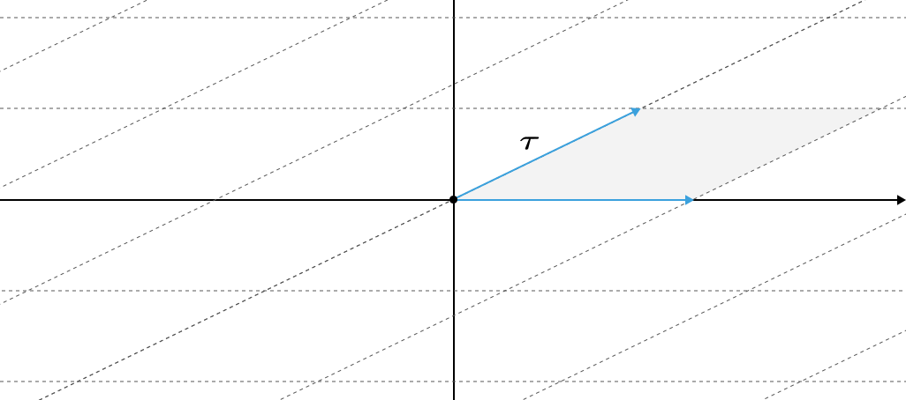

# Conformal Boundaries

What happens when we try to do a 2D CFT on a manifold that has a Boundary? In these notes we describe what are boundary states, as well as conformal and topological defects that our theory can have.

[toc]

# Modular Invariance

Before we talk about boundaries let's try to explore some relevant properties of Conformal Field Theories that should not be broken when we add a boundary. To study modular invariance we will talk about intertwiners. These are objects that map between representations of CFTs. 

## Complex Quotient Maps of Tori

To explain modular invariance, let’s try to understand modular transformations. To do this, we need to understand how we can obtain a torus from the complex plane.

**<u>Lemma:</u>** Any complex number $\tau \in \mathbb H\subset \mathbb C $ in the upper half plane defines the **torus equivalence** relation on $\mathbb C$ such that
$$
z \sim z + n + m\tau,
$$
where $n,m\in \mathbb Z$. 

This is pretty clear to verify, but the picture is looks like this. 

Essentially, each parallelogram is equivalent to each other. If we take the quotient we get a torus like so.

**<u>Theorem:</u>** The quotient $\mathbb C/{\sim}$ under the torus equivalence is homeomorphic to a torus iff $\Im \tau \neq 0$ otherwise it is homeomorphic to a Cylinder.

***Proof:*** Consider the surjective map $\mathbb C \to I^2$ such that $z + m + n\tau \mapsto $ that preserves the identifications of the torus equivalence. Then we see that the quotient map $I^2 \to T^2$ also preserves the identifications of the torus equivalence. In the case of $\Im \tau = 0$ we have that the above is no longer true. However, we can map every horizontal line into a segment like so $\mathbb C \to \mathbb R\times I$, and then notice that a quotient map to the cylinder $\mathbb R\times I \to \mathbb R\times S^1$ respects the identifications made. 
$$
\begin{equation}\tag*{$\Box$}\end{equation}
$$
**<u>Corollary:</u>** The quotient under the torus equivalence is diffeomorphic to the flat torus, i.e. the Riemannian manifold $(T^2 \coloneqq S^1\times S^1,g)$ where the metric is given by the canonical product metric of Euclidean circles.

***Proof:*** We can think of the quotient $\mathbb C/{\sim}$ under the torus equivalence as the quotient by the group $\mathbb Z^2$ under the smooth action defined by $\tau \in \mathbb C$ on $\mathbb C$. Also, the action is free (the stabilizer of any point in $\mathbb C$ is trivial), proper (under the map $\mathbb Z^2\times \mathbb C \to \mathbb C \times \mathbb C$, given by $(g,x) \mapsto (gx,x)$ the preimage of any compact set is compact, we just translate it), and isometric (For any $g\in \mathbb Z^2$ the orbit map is an isometry since in this case it is a translation).

Then by the quotient manifold theorem, the quotient is a smooth manifold of dimension 2, and the quotient map $q : \mathbb C \to \mathbb C/\mathbb Z^2$ is a submersion. As a result the map $q^\ast$ is injective and linear, therefore by dimension counting it is an isomorphism of the cotangent tangent spaces pointwise. Therefore, we can define a metric on the quotient as $g'= (q^{\ast})^{-1}g$.
$$
\begin{equation}\tag*{$\Box$}\end{equation}
$$

## Conformal Equivalence

Conformal equivalence is the property we want the modular transformations to preserve. So let's think about it first before we think of the rest. The idea is very simple. 

**<u>Definition:</u>** Two Riemannian manifolds $(M,g)$ ans $(N,h)$ are **conformally equivalent** iff there exists a diffeomorphism $f:M\to N$ such that
$$
f^\ast h = \Omega^2 g,
$$
for some $\Omega \in C^\infty(M)$. 

**<u>Corollary:</u>** Conformal equivalence is an equivalence relation.

The intuition behind conformal equivalence is that two manifolds are conformally equivalent if I can take one and stretch it into the other without changing the orientation or any of the angles in the process. 

**<u>Example:</u>** The flat tori obtained by the torus equivalence for some $\tau \in \mathbb H$ and $-\frac{1}{\tau}$ are conformally equivalent. 

***Proof:*** The transformation $R : \mathbb C\to \mathbb C$ given by $z\mapsto -e^{-i\arg \tau}z$ is a conformal transformation as a rotation of the complex plane. The same thing is true for scalings $D :\mathbb C\to \mathbb C $ where $z\mapsto \frac{1}{||\tau||} z$. We note that the transformation $z\mapsto -\frac{1}{z}$ is the composition of the two so it is conformal. 

Now take a look at he following commutative diagram.
$$
\begin{CD}
\mathbb C @>f>> \mathbb C\\
@Vq_{\tau}VV @VVq_{-\frac{1}{\tau}}V\\
\mathbb C/{\mathbb Z^2} @>>\tilde f> \mathbb C/{\mathbb Z^2}
\end{CD}
$$
We have a conformal map $f$ such ttaht $q_{-\frac{1}{\tau}} \circ f$ respects the identifications of $q_\tau$. As a result the composition descends to the quotient. In other words there exists a unique map $\tilde f :  \mathbb C/\mathbb Z^2\to \mathbb C/\mathbb Z^2$ such that 
$$
\tilde f\circ q_\tau = q_{-\frac{1}{\tau}} \circ f.
$$
Using this, we can prove that $\tilde f$ is conformal. Consider the metric
$$
g_{-\frac{1}{\tau}} = (q_{-\frac{1}{\tau}}^\ast)^{-1} g,
$$
of the right quotient. Then we can take the pullback under $\tilde f$ to obtain
$$
\begin{align*}
\tilde f^\ast g_{-\frac{1}{\tau}} 
&= \tilde f^\ast \circ (q_{-\frac{1}{\tau}}^\ast)^{-1} g\\
&= (q_{\tau}^\ast)^{-1} \circ f^\ast \circ q_{-\frac{1}{\tau}}^\ast \circ (q_{-\frac{1}{\tau}}^\ast)^{-1} g\\
&= (q_{\tau}^\ast)^{-1} \circ f^\ast g\\
&= (q_{\tau}^\ast)^{-1} \Omega^2 g\\
&= \tilde \Omega^2 g_{\tau}.
\end{align*}
$$
where we have used the fact the that quotient maps are submersions, therefore their pullback is surjective, and thus invertible since the dimension of the quotient is the dimension of the original manifold. 
$$
\begin{equation}\tag*{$\Box$}\end{equation}
$$

## The Modular Group

Now we are ready to find the modular group. 

**<u>Definition:</u>** A diffeomorphism $f: \mathbb H \to \mathbb H$ is called **modular** if for every $\tau \in \mathbb H$ the torus quotients under $\tau$ and $f(\tau)$ are conformally equivalent.

Before we find them, let’s think about lattices for a second. 

**<u>Definition:</u>** Given a vector space $(V,\mathbb K)$ with a basis $B \subset V$ over a field $\mathbb K$, and a ring $R\subset \mathbb K$, a **lattice** $\Lambda \subset V$ is the $R$ span of the basis $B$ given by
$$
\Lambda \coloneqq \left\{ \sum_{b\in B}^\infty r_b b\ \middle|\ r_b \in R  \right\}
$$
This definition gives us exactly what we expect from a lattice. We pick a basis, such that we can get to every point in the lattice in integer steps. The reason for introducing them in the first place is because a lattice induces an action of the group $R^{|B|}$ on the vector space $V$ like so.

**<u>Lemma:</u>** Every lattice $\Lambda$ on a vector space $(V,\mathbb{K})$ over ring $R\subset \mathbb{K}$ spanned by the basis $B \subset V$ is homomorphic to $R^{B}$ under addition. 

***Proof:*** The following map is a group homomorphism
$$
\begin{align*}
f: R^{B} &\to \Lambda\\
\{r_b\}_{b\in B} &\mapsto \sum_{b\in B} r_b b \in \Lambda
\end{align*}
$$
this map is called the **defining homomorphism**. Just so that we can have a name for it.
$$
\begin{equation}\tag*{$\Box$}\end{equation} 
$$
Now we use this to find the group action. 

**<u>Proposition:</u>** Given a lattice $\Lambda$ on a topological vector space $(V,\mathbb{K})$ over ring $R\subset \mathbb{K}$ spanned by the basis $B \subset V$, the map 
$$
\begin{align*}
\rho: R^{B}\times V &\to V\\
(r,v) &\mapsto  v+f(r),
\end{align*}
$$
where $f:R^{B}\to \Lambda$ is the defining homomorphism, defines a *free* and *proper* group action of $R^B$ on $V$.

***Proof:*** It is easy to see that it is a group action, since for any $g\in R^{B}$ the induced map
$$
\rho_g : V\to V,
$$
is a vector space isomorphism (so technically $\rho$ is a representation), since it acts by translation. To show that it is free, we need to show that for any $v \in V$, its stabilizer is trivial. The stabilizer for any point is defined as
$$
S_v \coloneqq \{ g \in R^B \mid gv = v\}.
$$
However, we can see that in this case, we have that $gv = v+ f(g)$ so this implies that $g\in S_v \iff f(g) = 0 \iff g=e$. So the stabilizers are trivial, hence the action is free. Then we can show that the action is proper. A proper action, satisfies that the preimage of any compact set under the map
$$
\begin{align*}
R^B \times V &\to V\times V\\
(g,v) &\to (gv,v)
\end{align*}
$$
is compact. To show this we treat $R^B$ with the subset topology induced by the defining homomorphism of $f:R^B \to \Lambda \subset V$ and we can see that the preimages of compact sets are simply translated, so they remain compact in the topological vector space topology since translations are proper maps, and so are their products.

Therefore the action is free and proper. 
$$
\begin{equation}\tag*{$\Box$}\end{equation}
$$
We have enough tools to find the modular transformations now. We will do so by first classifying the conformal automorphisms of the flat torus and then get the modular transformations for free. 

**<u>Lemma:</u>** Any conformal automorphism of a flat torus, lifts to a conformal map of the complex plane.

***Proof:*** We can construct any flat torus given the action of $\mathbb Z^2$ on $\mathbb C$ defined using a lattice $\Lambda$ over $\mathbb Z$ defined using the basis $w \in \mathbb{C}^2$, i.e.
$$
\Lambda \coloneqq \{mw_1 + nw_2 \in \mathbb{C}\mid m,n \in \mathbb Z\}.
$$
 Using the previous theorem, the action of $\mathbb{Z}^2$ on $\mathbb{C}$ defined by the lattice $\Lambda$ is free and proper, therefore by the quotient manifold theorem, the quotient map $q$ by the $\mathbb Z^2$ orbits is a well defined submersion of $\mathbb{C}$ to the flat torus. Now consider the following commutation diagram
$$
\begin{CD}
\mathbb{C} @>\tilde f>> \mathbb{C}\\
@VqVV @VVqV\\
\mathbb{C}/\mathbb{Z}^2 @>>f> \mathbb{C}/\mathbb{Z}^2
\end{CD}
$$
where $f$ is conformal. It is easy to see that $q$ is a covering map, therefore $f$ lifts to a smooth map $\tilde f$ between the covering spaces. In other words, we can see that $f\circ q : \mathbb{C}\to \mathbb{C}/\mathbb{Z}^2$ is a well defined map, and it should have a lift $\tilde f : \mathbb{C}\to \mathbb{C}$ to the covering space of the torus. This map has the property: 
$$
q\circ \tilde f = f\circ q.
$$
By fixing the origin this map we guarantee uniquess. Also, since $f$ is invertible then we so is $\tilde f$. We will now show that the lifted map is indeed conformal. To do so we use the fact that $q$ is a submersion. 

The metric of $T_{\Lambda} \coloneqq \mathbb{C}/\mathbb{Z}^2$ is given by
$$
g_\Lambda = (q^\ast)^{-1} g,
$$
where $g$ is the metric of $\mathbb{C}$ and we know that $q^\ast$ is invertible, because $q$ is a submersion to a manifold of the same dimension. Since $f$ is conformal, we know that
$$
f^\ast g_{\Lambda} = \Omega^2 f,
$$
for some $\Omega \in C^\infty(T_{\Lambda})$. We also know that 
$$
(q\circ \tilde f)^\ast = \tilde f ^\ast \circ q^\ast = (f\circ q)^\ast = q^\ast \circ f^\ast \implies \tilde f^\ast = q^\ast \circ f^\ast \circ (q^\ast)^{-1}
$$
which, by the way, is the conjugation of $f^\ast$ which I think is pretty cool. Regardless, we can now calculate 
$$
\begin{align*}
\tilde f^\ast g 
&= q^\ast \circ f^\ast \circ (q^\ast)^{-1}g\\ 
&= q^\ast \circ f^\ast g_{\Lambda}\\
&= q^\ast (\Omega^2 g_{\Lambda})\\
&= (\Omega^2 \circ q)\ q^\ast g_{\Lambda}\\
&= (\Omega^2 \circ q) g
\end{align*}
$$
Therefore $\tilde f$ is conformal.
$$
\begin{equation}\tag*{$\Box$}\end{equation}
$$
This was a lot of proof. In essence, we said that any conformal map of the flat torus is can be thought of as a conformal map of the complex plane. And we are about to use this fact to find all the conformal transformations of the plane. We do this by first classifying the conformal maps of the torus.

**<u>Theorem:</u>** The conformal maps of the flat torus are the group $GL(\mathbb Z^2)$ under composition.

***Proof:*** Any such conformal map of the torus lifts to a conformal map of the complex plane. However, since any flat torus is defined by the action of some lattice, in order to obtain the same torus we need the conformal map to leave the lattice invariant. Therefore it must map a lattice basis to a different lattice basis. This implies that the map is an element of $GL(\mathbb Z^2)$. 
$$
\begin{equation}\tag*{$\Box$}\end{equation}
$$
Now we can finally find the modular transformations.

**<u>Lemma:</u>** The set of modular transformations is the group $PSL(\mathbb Z^2)$ under composition. 

***Proof:*** The modular transformations are the transformations of $\tau$ such that the resulting quotient under the torus equivalence gives conformally equivalent tori. We know that given a basis $w \in \mathbb{C}^2$ for a lattice $\tau \coloneqq \frac{w_1}{w_2}$ as a result, any conformal transformation of the torus will affect $\tau$ only as far as the fraction is irreducible, therefore the only nonequivalent elements form the group $SL(\mathbb{Z}^2)$.  Wanting to keep $\tau \in \mathbb{H}$ in the upper half plane, we want to identify the elements of the center of the group, such that we don\'t accidentally shift the orientation. Therefore we obtain the projective group $PSL(\mathbb{Z}^2)$. 
$$
\begin{equation}\tag*{$\Box$}\end{equation}
$$

## From the Sphere to the Cylinder to the Torus

Conformal Field theories are usually defined on a sphere $\bar{\mathbb{C}}$ which is the one point compactification of $\mathbb{R}^2$. Modular conformal theories however, are the ones that can be expressed as living on the torus. Here we describe unambiguously what the series of mappings are, and how these induce different representations of the Virasoro algebra on the Hilbert space.

Using the stress tensor we have defined an important representation $\rho: \text{Vir} \to \text{End}(\mathcal{H})$ of the Virasoro Algebra on the Hilbert space $\mathcal{H}$ of our CFT. One key observation is that if we change our base space from $\bar{\mathbb{C}}$ to something else, we would have to push the stress tensor forward. Then the new stress tensor will induce a different representation of the Virasoro algebra for our CFT. 

Let's see this in practice  

**<u>Proposition:</u>** The map $f: \mathbb{C} \to \bar{\mathbb{C}}$ defined by
$$
f(z) = e^{z}
$$
is conformal. 

***Proof:*** It is analytic.
$$
\begin{equation}\tag*{$\Box$}\end{equation} 
$$
This transformation maps the punctured plane to the conformal sphere. We will use this to construct a quotient map to the cylinder. But first, let's see how the stress tensor changes when we pull it back by that map.  

**<u>Lemma:</u>** The pullback of the stress tensor $T=T(z)dz\otimes dz + \bar T(\bar z) d\bar z \otimes d\bar z$ under any conformal map $f:\bar{\mathbb{C}} \to \bar{\mathbb{C}}$ is given by
$$
f^\ast T = \left[\left(\frac{df}{dz}\right)^{2} T\circ f + \frac{c}{12}\{f;z\}\right]dz\otimes dz +  \left[ \left(\frac{d\bar f}{d\bar z}\right)^2 \bar T\circ f + \frac{c}{12}\{\bar f;\bar z\}\right] d\bar z\otimes d\bar z,
$$
where $\{f;z\}$ is the Scwartzian derivative given by
$$
\{f;z\} = \frac{f'''(z)}{f'(z)} - \frac{3}{2} \left( \frac{f''(z)}{f'(z)} \right)^2.
$$

***Proof:*** This expression is not obvious. The first term of each component is what we expect the pullback to be classically (which is derived the standard way). The presence of the conformal anomaly in the second term is because in the process of taking the pullback we inevitably encounter the OPE with the stress tensor itself. There are more steps here, but I am not sure I can calculate them.

Mathematically, we can think of it like so. The stress-tensor (the operator) transforms under the induced representation of the Virasoro algebra on the Hilbert space, while the classical stress-tensor (the tensor field) transforms under the Witt algebra.  Therefore, the appearance of the central charge in the transformation law is not unexpected. 
$$
\begin{equation}\tag*{$\Box$}\end{equation} 
$$
Knowing how the stress tensor transforms under a conformal transformation $f$, we can induce the new representation of the Virasoro algebra on the Hilbert space that corresponds to the conformal field theory that "lives" in the domain of the transformation $f$. The way we do so is by defining $T' = f^\ast T$ and the new representation by 
$$
\begin{align*}
\rho_f(L_n) \coloneqq \frac{1}{2\pi i}\int_{C} f^\ast \left(z^{n+1} T\right)
\end{align*}
$$
where $C \subset \mathbb{C}$ is a closed curve that encloses the origin and no other singularities of $T$. Here is an example using the transformation we defined in the previous proposition.

**<u>Proposition:</u>** Under $f(z) = e^{z}$ we have that the holomorphic part of the stress tensor is given by
$$
T'(z) = e^{2z} T(e^{z}) - \frac{c}{24}
$$
***Proof:*** Plug in $f'=f$ into the formula of the previous lemma.
$$
\begin{equation}\tag*{$\Box$}\end{equation}
$$
Similarly we can get the antiholomorphic part. This has the following corollary.

**<u>Corollary:</u>** The Dilation operator $H = \rho(L_0 + \bar L_0)$ and momentum operator $P = \rho(L_0 - \bar L_0)$ are pulled back under $f$ to be
$$
\begin{align*}
H_f &= \rho_f(L_0 + \bar L_0) =\rho(L_0 + \bar L_0) - \frac{c}{12} = H-\frac{c}{12}\\
P_f &= \rho_f(L_0 - \bar L_0) =\rho(L_0 - \bar L_0) = P.
\end{align*} 
$$

This is all that our Lie algebra representation knows about transformations. Here is an example.

***Proof:*** The related vector field to dilation in the conformal sphere (minus the poles) is given by 
$$
X_{H} = -z \frac{\partial }{\partial z} - \bar z \frac{\partial }{\partial \bar z }.
$$
Notice that we can pull this back to $\mathbb{C}\setminus \{0\}$ at least locally since $e^{iz}$ is a diffeomorphism $f:\mathbb{R}\times (0,2\pi)\subset \mathbb{C} \to\mathbb{C}\setminus\{0\}$. So the pushforward of $f$ is a linear isomorphism of tangent spaces. As a result, using $w$ to denote the coordinate of $(0,2\pi) \times \mathbb{R}$ and $z$ for the coordinate of $\mathbb{C}\setminus\{0\}$ as is conventional we have that
$$
\begin{align*}
f_\ast \frac{\partial }{\partial w} = ie^{iw} \frac{\partial }{\partial z} = iz \frac{\partial }{\partial z} && f_\ast \frac{\partial }{\partial \bar w} = -ie^{\bar w} \frac{\partial }{\partial \bar z} = -i\bar z \frac{\partial }{\partial \bar z}.
\end{align*}
$$
Therefore we can see that the pullback of $X_H$ is
$$
X_{H_{f}} = \left( f_{\ast} \right)^{-1} X_H = i\frac{\partial }{\partial w} - i\frac{\partial }{\partial \bar w } = -\frac{\partial }{\partial y},
$$
or otherwise known as the translation vector field along the imaginary axis (in the opposite direction). Similarly, for the momentum operator, the related vector field on the sphere is given by
$$
X_P = -z \frac{\partial }{\partial z} + \bar z \frac{\partial }{\partial \bar z },
$$
 hence its pullback is
$$
X_{P_{f}} = \left( f_\ast \right)^{-1}X_P = i\frac{\partial }{\partial w} + i\frac{\partial }{\partial \bar w} = i \frac{\partial }{\partial x}.
$$
Now that we have pulled back our vector fields, we can finally obtain the pullback Virasoro generators by contracting with the pullback of the stress tensor and then integrating along a "spacelike" slice.
$$
\begin{equation}\tag*{$\Box$}\end{equation}
$$

**<u>Example:</u>** Consider translations by $\tau \in \mathbb{C}$ of our new theory obtained by pullback under $f(z) = e^{iz}$. 

## Partition Functions

What we will show here, is that a partition function for a conformal field theory gives us information about the structure of the Virasoro level decomposition of the Hilbert space of the CFT! To do this, however, we would have to be able to define it using a path integral somehow, which is not possible for compact domains. This is where tori come to play. 

Given a parameter $\tau \in \mathbb{H}$ the flat torus we will get under the torus equivalence will have $\tau$ as the "time" coordinate.

Therefore the Hamiltonian of the theory defined on the torus would be the Virasoro generator of translations along $\tau$, which is given by
$$
H_{\tau} = -iH\, \Im \tau -  P \, \Re \tau ,
$$
where $H = L_0 + \bar L_0 - \frac{c}{12}$ is the generator of translations in the imaginary direction of the conformal cylinder, and $P = L_0 - \bar L_0$ is the generator of translations on the real direction on the conformal cylinder. *The reason for the $-i$ in front of the Hamiltonian is because we have performed the transformation to the cylinder $z = e^{iw}$ we are actually evolving by an amount* $t=-i\text{Im\,}\tau$. 

**<u>Definition:</u>** For a given automorphism $A : \mathcal{H} \to \mathcal{H}$ of some Hilbert space $\mathcal{H}$, its **partition function** $Z_A \in \mathbb{R}$ is defined as the trace
$$
Z_A = \Tr e^{-iA}.
$$
The physical definition for this quantity as the partition function comes from finite temperature field theory, and can be found [here](../Quantum_Fields/Thermal_QFT.md#Free-Theory-Partition-Functions-\(Intuition\)). The cool result is that partition functions in the torus are related to the structure of the level decomposition of the Hilbert space of the theory. We will show this in steps. 

**<u>Lemma:</u>** The **modular partition function**, i.e. the map $Z:\mathbb{H} \to \mathbb{R}$ given by
$$
Z(\tau) = \Tr e^{-iH_\tau},
$$
is given by
$$
Z(\tau) = \text{Tr\,} q^{L_0 - \frac{c}{24}}\bar q^{\bar L_0 - \frac{c}{24}},
$$
where $q = e^{i \tau}$.

***Proof:*** We can perform the algebra
$$
\begin{align*}
Z(\tau) 
&= \text{Tr\,} \exp \left[ -\frac{\tau-\bar \tau}{2i}\left(L_0 + \bar L_0 - \frac{c}{12}\right) + \frac{\tau+\bar \tau}{2} i(L_0 - \bar L_0) \right]\\
&= \text{Tr\,} \exp i \left[ \tau \left(L_0 - \frac{c}{24}\right) - \bar \tau \left( \bar L_0 - \frac{c}{24} \right)\right]\\
&= \text{Tr\,} \exp \left[ i\tau \left(L_0 - \frac{c}{24}\right)\right] \exp \left[- \bar \tau \left( \bar L_0 - \frac{c}{24} \right)\right]\\
&= \text{Tr\,} q^{L_0 - \frac{c}{24}}\bar q^{\bar L_0 - \frac{c}{24}}.
\end{align*}
$$

$$
\begin{equation}\tag*{$\Box$}\end{equation}
$$

The interesting result of this, however, is that these look so much like [characters](../Quantum_Fields/Minimal_Models.md#Characters-for-Rational-Modules)! In fact, we will see that modular invariance of the partition function will help us calculate the operator algebra for minimal models by solving for characters.

# Conformal Boundaries

The reason we did all this was to be able to describe what's called the modular partition function of a CFT. We will see at a different point how are those things actually related to one another, but for now, let's try and restrict our attention on boundaries. 

## Conformal Boundary Condition

Let's consider a CFT on the closed upper half plane $\overline{\mathbb{H}} \subset \mathbb{C}$. Now we have a boundary at the real axis, and that is somewhat confusing in terms of our symmetry. Clearly doing conformal transformations we would move the boundary around. 

Therefore, we have to refine what we mean by conformal invariance. The easiest way to think about it would be to restrict our attention to transformations that leave the boundary alone. In other words we want to consider conformal transformations $f:\overline{\mathbb{H}}\to \overline{\mathbb{H}}$ such that
$$
f^\ast g = \Omega^2 g,
$$
where $g$ is the metric on $\overline{\mathbb{H}}$ and such that $f(z,\bar z) = \overline {f(z,\bar z)}$ whenever $z = \bar z$. This restricts the representations of the Virasoro algebra we have in our theory. 

**<u>Theorem:</u>** The local conformal transformations that preserve the real axis on $\overline{\mathbb{H}}$ form a representation of the $\text{Witt}$ algebra. 

***Proof:*** We know that conformal transformations are either holomorphic or antiholomorphic functions. Therefore they must form a representation of $\text{Witt}\oplus \text{Witt}$ as we have shown before. Now without loss of generality assume that a local conformal transformation is given by the Laurent expansion
$$
f(z) = f_n z^{n+1}.
$$
Since for all $x \in \mathbb{R}$ we must have that $f(x) = \bar f(x)$ then it is true that $f_n = \bar f_n \implies f_n\in \mathbb{R}$. A similar argument applies to the antiholomorphic coefficients. Since $\text{Witt}$ is a complex Lie algebra, this amounts to picking the real part of the Lie algebra for the holomorphic and the imaginary for the anti holomorphic functions. As a result, the full algebra is
$$
\text{Witt}^+ \oplus \text{Witt}^+ \cong \text{Witt}.
$$

$$
\begin{equation}\tag*{$\Box$}\end{equation}
$$

This is very nice condition! In essence, our symmetry was reduced by half by imposing that the boundary stays put. Here is a more physical interpretation.

**<u>Corollary:</u>** $T(x) = \bar T(x)$ for any $x \in \mathbb{R}$.

***Proof:*** Conformal invariance under the new $\text{Witt}$ (instead of itself squared) algebra implies that since the coefficients for each conformal transformation must be real. Therefore, we would never be able to create a transformation with flow along
$$
\frac{\partial }{\partial y} = -i\left(\frac{\partial }{\partial z} - \frac{\partial }{\partial \bar z}\right) = i \left( l_{-1} - \bar l_{-1} \right),
$$
on the real axis, where $l,\bar l$ are the representations of the generators of the $\text{Witt}$ algebra as defined in the conformal sphere in a regular cft.  Since the stress tensor $T = Tdz^2 + \bar T d\bar z^2$ induces a representation of the new algebra on the fields (through the conserved currents), the representation of $\frac{\partial }{\partial y}$ must vanish on the boundary. Otherwise we would have that our theory has an extra conserved current that just the ones that can be obtained by conformal symmetry which we identified.

*Notice that this statement is equivalent to saying that no energy flows along the boundary since any conserved current associated with the perpendicular direction to the boundary must vanish.*

We can now do some algebra to show
$$
T\left( \frac{\partial }{\partial y} \right) = iTdz -i\bar T d\bar z.
$$
Taking the pullback to the real line $x+iy \mapsto x$ we have that
$$
i\left(T(x) - \bar T(x)\right)dx = 0 \implies  T(x) = \bar T(x).
$$
It is possible to make a more careful statement through decomposing the representation of the original CFT. That would involve thinking of the projective representation of the Witt Algebra, induced by the conserved charges, as a subrepresentation of the real part of $\text{Witt} \oplus \text{Witt}$ under some injection $\iota: \text{Witt}^+ \oplus \text{Witt}^+ \to \text{Witt} \oplus \text{Witt}$.
$$
\begin{equation}\tag*{$\Box$}\end{equation}
$$

## Intuition Behind Boundary States

What we want to motivate here is that for each **boundary condition** we can find a **boundary state** that implements it. To understand this statement, let's give intuition and consistency conditions behind the definition of Boundaries. 

The effect of a boundary condition is to assign the value of a field on the boundary of the manifold it lives in. Therefore in some sense we can thing of a boundary condition as a map of the form $\text{Fields} \to \mathbb{C}$. Yet from the operator state correspondence a boundary condition can be thought of as a structure preserving map $\mathcal{H} \to \mathbb{C}$ where $\mathcal{H}$ is the Hilbert space of the theory. Therefore, we can see that a boundary state is an element of $\mathcal{H}^\vee$ the dual space of $\mathcal{H}$. States in $\mathcal{H}$, or series thereof, can define elements of the dual space. Such series are called **boundary states**.

Without any further exploration this idea is useless. However we know that using the OPE one can define an "algebra" of fields for a given conformal theory. In particular that algebra is a **fusion category** $F$ that we have various ways of obtaining.  Therefore, not any state can be a boundary state, it must be a sort of *homomorphism* of $F$. That actually restricts what kind of states we must have, and also provides a way for us to introduce further consistency conditions. 

## Boundary States

Let's do that more precisely here. The idea is that any boundary we insert should be invariant under the symmetries we want to keep. In particular in the beginning of this section we saw how that implies that for a boundary on the real line to be conformal $T(x) = \bar T(x)$ for $x\in \mathbb{R}$. 

It is not obvious how we will interpret this as a condition in terms of a state. To do this 

**<u>Proposition:</u>** 

# Conformal Defects

We haven't presented this yet, but the whole point of studying boundaries is so that we can find the possible conformal defects we can add to our theory. There is an identification we can make between the possible boundary states we can add on the boundary theory, and the conformal defects we can add on the unfolded one. 

## Interpreting Boundary States as Conformal Defects

