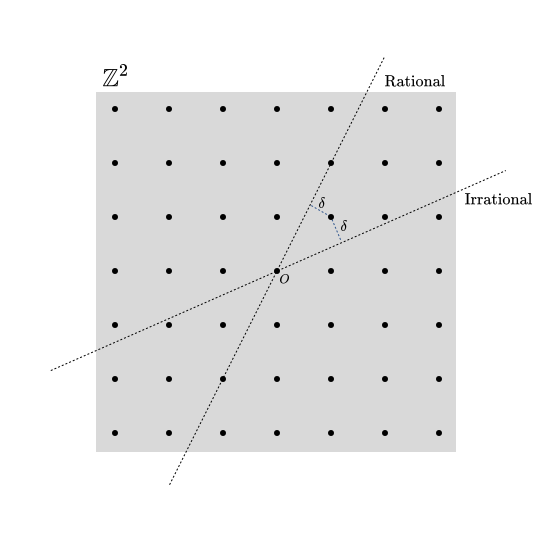

# Minimal Models

We go over some examples of commonly encountered minimal models in 2D CFT as well as common calculations for them. These are taken from [Schottenloher](https://link.springer.com/book/10.1007/978-3-540-68628-6) and [Di Francesco](https://link.springer.com/book/10.1007/978-1-4612-2256-9).

[toc]

# Introduction

As we have seen in [here](../Quantum_Fields/Virasoro_Algebra.md), a representation $\rho: \text{Vir} \to \text{End}(V)$  of the highest weight representation of a Virasoro Algebra is called a **Virasoro module.** If, in addition, the elements of the form $\rho(L_{-n_1})\rho(L_{-n_2})\cdots\rho(L_{-n_k}) v$ form a basis, where $v$ is the vacuum vector of $V$, then $V$ is called a **Verma module**. What is interesting is that Verma modules are indecomposable, but not (in general) irreducible!

Remember indecomposable is being able to find two proper subresentations whose direct sum is isomorphic to the full Verma module not just as a vector space, but also as a representation. While irreducible, is simply being able to find a proper subrepresentation. One can take the vector space quotient but it isn't necessary  that the resulting thing will be naturally isomorphic **as a module** to the vector space decomposition by the quotient.

# Useful Tools

## Singular Vectors

Let's be more specific. As we have already seen [here](../Quantum_Fields/Virasoro_Algebra.md) there is a natural bilinear Hermitian (possibly degenerate) form $H: M^2 \to \mathbb{C}$ on any Verma module $M$ that takes advantage of the *grading* in the level subspaces. 

**<u>Definition:</u>** Elements of the kernel of $H$ are known as **singular vectors**, or null vectors, and $\text{ker\,} H$ is known as the **singular, maximal, or null subspace**. A representation $M(c,h)$ with $c<1$ such that there exist singular vectors is called **vanishing**. 

**<u>Corollary:</u>** $M/\text{ker\,}H$ is an irreducible Virasoro module. 

We can show their existence in certain Verma Modules. 

**<u>Theorem:</u>** *(Existence of Singular Vectors)* Consider a Verma module $M(h_{pq}(c),c)$ with 
$$
h_{pq}(c)= \frac{1}{48}\left[ (13-c)(p^2+q^2) + \sqrt{(c-1)(c-25)}(p^2 -q^2) -24pq +2(c-1) \right],
$$
 for some natural numbers $p,q \in \mathbb{N}$, then there exists a singular vector at level $pq$ in the level decomposition, i.e. $L_0 \chi = h_{pq} + pq$ and $\langle u,\chi \rangle = 0$ for any $u\in M$.

***Note:*** All minimal models are built from Verma modules of this form. 

***Proof:*** It is enough to show that the Gram determinant vanishes at level $pq$. By Kac's theorem, we have that
$$
\det A_{pq} \propto (h_{pq}-h_{pq}) = 0.
$$

$$
\begin{equation}\tag*{$\Box$}\end{equation}
$$

## Classifying Vanishing Representations

Ok so we have shown some elementary results for singular vectors, it is time to find properties.

A vanishing representation with central charge $c$ has highest weight $h_{pq}(c)$ for some $p,q \in \mathbb{Z}$. What is interesting about these is that depending on the value of the central charge, some of them show some pretty cool recursions. 

**<u>Lemma:</u>** *(Classification of Rational Modules)* Let $r,s \in \mathbb{Z}$ be coprime integers and $0\leq c\leq 1$, such that
$$
r\alpha_{+} + s\alpha_{-} = 0,
$$
where $\alpha_{\pm}$ are defined by [Kac's theorem](../Quantum_Fields/Virasoro_Algebra.md#Kac-Determinant) as 
$$
\begin{align*}
h_{p,q} &= h_0 + \frac{1}{4}(p\alpha_+ +q \alpha_-)^2\\
h_0 &= \frac{c-1}{24}\\
\alpha_{\pm} &= \frac{\sqrt{1-c} \pm \sqrt{25-c}}{\sqrt{24}}.
\end{align*}
$$
Then, the following identity holds
$$
h_{p,q} = h_{p+r,q+s},
$$
And any highest weight representation with this central charge is called **rational**.

If no such pair of integers exists (i.e. $\frac{\alpha_{+}}{\alpha_{-}}$ is irrational), the associated highest weight representations are called **irrational**. 

***Proof:*** Check this out! Here is a diagram of $\mathbb{Z}^2$ along with lines passing through the origin with slope $-\frac{\alpha_{+}}{\alpha_{-}}$ one where the slope is rational and another where the slope is irrational. Notice that this slope is completely determined by the central charge $c$ that we picked.

You can also notice that $\delta$ is the distance between one of the points (marked my $(p,q)$) and the lines. In fact, by using this $\delta$ we can write that for that central charge, and any $p,q \in \mathbb{N}$ 
$$
h_{p,q} = h_{0} + \frac{\delta^2}{4} \left( \alpha_{+}^2 + \alpha_{-}^2 \right),
$$
where again $\delta$ is the distance of closest approach of the corresponding line through the origin to the lattice point $(p,q)\in \mathbb{Z}^2$. It is clear that now if the slope $-\frac{\alpha_{+}}{\alpha_{-}}$ is irrational, it will not pass through any points in the lattice. On the other hand, if it is rational then it can be written in irreducible form as
$$
-\frac{\alpha_{+}}{\alpha_{-}} = \frac{s}{r},
$$
for coprime integers $s,r \in \mathbb{Z}$ then we see that for that particular conformal weight there is a periodicity in the vanishing Virasoro representations, since the line will cross infinitely many of these points, proving the lemma. 
$$
\begin{equation}\tag*{$\Box$}\end{equation}
$$
This diagram is usually called the **diagram of dimensions**, and it is a nice visualization for the periodicity of certain vanishing representations. 

***Note:*** Since the sign of $\alpha_\pm$ doesn't affect the value of $h_{p,q}$ we can pick $s,r \in \mathbb{N}$ without loss of generality. This will simplify some of the calculations in what follows. 

**<u>Corollary:</u>** A Virasoro highest weight representation is rational iff there exist coprime natural numbers $r,s \in \mathbb{N}$ and integers numbers $p,q \in \mathbb{Z}$ such that the conformal weight and central charge are given by
$$
\begin{align*}
c &= 1 - 6\frac{(r-s)^2}{rs}\\
h &= \frac{(sp - rq)^2 - (r-s)^2}{4rs}.
\end{align*}
$$
Here are some properties of such representations

**<u>Proposition:</u>** Consider a rational representation as defined in the corollary above. Then the following identities hold

1. $h_{p,q} + pq = h_{r+p,s-q} = h_{r-p,s+q}$
2. $h_{p,q}+(r-p)(s-q) = h_{p,2s-q} = h_{2r-p,q}$

***Proof:*** Rearrange the formula in the corollary a couple times. 
$$
\begin{equation}\tag*{$\Box$}\end{equation}
$$
When it comes to studying singular vectors the proposition above, has the direct corollary:

**<u>Proposition:</u>** In a rational Verma module, there are infinitely many singular Virasoro submodules.

We have already shown the existence of a singular vector at level $pq$ and as a result, the existence of a singular Virasoro submodule which consists of the descendants of the singular vector at $pq$. The interesting fact about rational Verma modules is that there are infinitely many such submodules.

***Proof:*** First notice that there exists a singular vector at level $(r-p)(s-q)$. We can show this by plugging it in Kac's formula for the Gram Matrix determinant at that level, and using the previous proposition. Now, consider the singular vector at level $pq$, This has eigenvalue $h_{p,q} + pq$ for $L_0$. For the proposition above we can see that that vector is the cyclic vector for the Verma module $M(c,h_{r+p,s-q})$, and since all of its descendants are by definition contained in $M(c,h_{p,q})$, then the module homomorphism $M(c,h_{r+p,s-q}) \to M(c,h_{p,q})$ is an inclusion!

This is a pretentious way of saying that such a singular vector forms a singular Verma submodule that must contain at least one singular Verma submodule and so on, leading to infinite singular vectors!
$$
\begin{equation}\tag*{$\Box$}\end{equation}
$$

## Irreducible Rational Highest Weight Representations

We can be more precise about this classification. Since we can classify the singular submodules, we can classify how to remove them in order to obtain a description of the irreducible rational highest weight representations.

>  **Note:** Since we are interested in studying minimal models, what we will see is that for a given pair of coprime naturals $r,s \in \mathbb{N}$ the only distinct conformal weights $h_{p,q}$ that will appear are the ones where $1 \leq p < r$ and $1 \leq q < s$. That restriction comes from fusion which we haven't seen yet, but we will prove later.

**<u>Proposition:</u>** Given a rational Verma module $M(c,h_{p,q})$ with $c,h_{p,q}$ given by $r,s \in \mathbb{N}$ and $1 \leq p < r$, $1 \leq q < s$, where $H: M^2 \to \mathbb{C}$ is the canonical Hermitian form, we have that 
$$
\text{ker\,}H = \text{span\,} \left[M(c,h_{r+p,s-q}) \cup M(c,h_{p,2s-q})\right],
$$
where we identify $M(c,h_{r+p,s-q})$ and $M(c,h_{p,2s-q})$ with their canonical inclusions in $M(c,h_{p,q})$.

***Proof:*** We have already shown that the two modules above are singular submodules of $M(c,h_{p,q})$. We just need to show that any other submodules are contained in them. But I don't want to write this, this can definitely be shown by induction on Kac's formula, or maybe a nifty trick that I am unaware of. 
$$
\begin{equation}\tag*{$\Box$}\end{equation} 
$$
Unfortunately, the quotient is not entirely straightforward to calculate because the intersection between the singular submodules is not empty! Schematically, if we quotient by one, we have inadvertently quotiented by part of the other.

 

## Characters for Rational Modules

One useful tool in characterizing a Virasoro module is it's *character*. This is simply a generating function for the dimension each level, i.e. taking the appropriate number of derivatives gives us the number of independent vectors at that level. 

**<u>Definition:</u>** Given a Virasoro module $V$ and its [level decomposition](../Quantum_Fields/Virasoro_Algebra.md#Representations-of-Virasoro-Algebra)
$$
V = \bigoplus_{n\in \mathbb{N}} V_n,
$$
 a **Virasoro character** for that module is a smooth function $\chi \in C^\infty(\R)$ at such that 
$$
\text{dim\,}V_n = \frac{1}{n!} \left.\frac{\partial^{n}}{\partial t^{n}}\right|_0 \chi(t) t^{c/24 - h}.
$$
***Note:*** The reason for the factor of $t^{c/24 - h}$ is because it helps us simplify some calculations that involve modular invariance. The information of the character is still the same.

**<u>Proposition:</u>** Given a Virasoro module $V$ its character is uniquely given by
$$
\chi(t) = \text{Tr\,} t^{L_0 - \frac{c}{24}}.
$$
***Proof:*** Since $\chi$ is smooth, it has a Taylor series, each term of which is constrained by the definition.
$$
\begin{equation}\tag*{$\Box$}\end{equation}
$$
[tbc, but honestly Di Francesco has a table]

## Fusion

What is interesting about singular vectors? Primarily that they constrain the correlation functions further than conformal symmetry. Constraining correlation functions implies the famous fusion rules as we will see now

**<u>Theorem:</u>** 

# Definitions

We are finally ready to define a Minimal model!

**<u>Definition:</u>** A conformal field theory is a **minimal model** iff its associated Hilbert space can be written as a direct sum of irreducible tensor products of holomorphic and antiholomorphic Virasoro modules that is closed under fusion. 

This has a very interesting property.

**<u>Proposition:</u>** In a minimal model the following are true

1. There are finitely many conformal primaries.
2. All the Virasoro modules that appear in its decomposition are rational.

**<u>Corollary:</u>** For every minimal model there exist a unique pair of coprime naturals $r,s \in \mathbb{N}$ such that 
$$
\begin{align*}
c &= 1 - 6\frac{(r-s)^2}{rs},\ r>s
\end{align*}
$$
and every Virasoro module in the decomposition has conformal weight
$$
h = \frac{(sp - rq)^2 - (r-s)^2}{4rs},
$$
for some integers $p,q \in \mathbb{Z}$ such that $0<p<r$ and $0<q<s$.

> **Note:** For that reason we use the notation $\mathcal{M}(r,s)$ to refer to the corresponding minimal model.

***Proof:*** (2) Every CFT must be closed under fusion. This puts constraints into which highest weight representations can appear. If the representation is rational then there are finitely many conformal weights available through fusion, since at higher and higher Kac indices the conformal weights repeat. If the representation is irrational, highest weights do not repeat, and therefore closure under fusion would include infinitely many of them. 

(1) Via the state-field correspondence, a conformal primary is associated to a cyclic vector in a Virasoro submodule of the theory. Since there are finitely many of them, there are finitely many cyclic vectors. Additionally, since we have the description in terms of irreducible representations we can't find a different decomposition into Virasoro modules with more terms.

(Corollary) By (2) the representations are rational. Therefore the central charge (which is shared by all of them otherwise it wouldn't be a cft) defines the two coprime indices. Representations of conformal weights with Kac indices greater than those are either prohibited by fusion or by periodicity. 
$$
\begin{equation}\tag*{$\Box$}\end{equation}
$$

