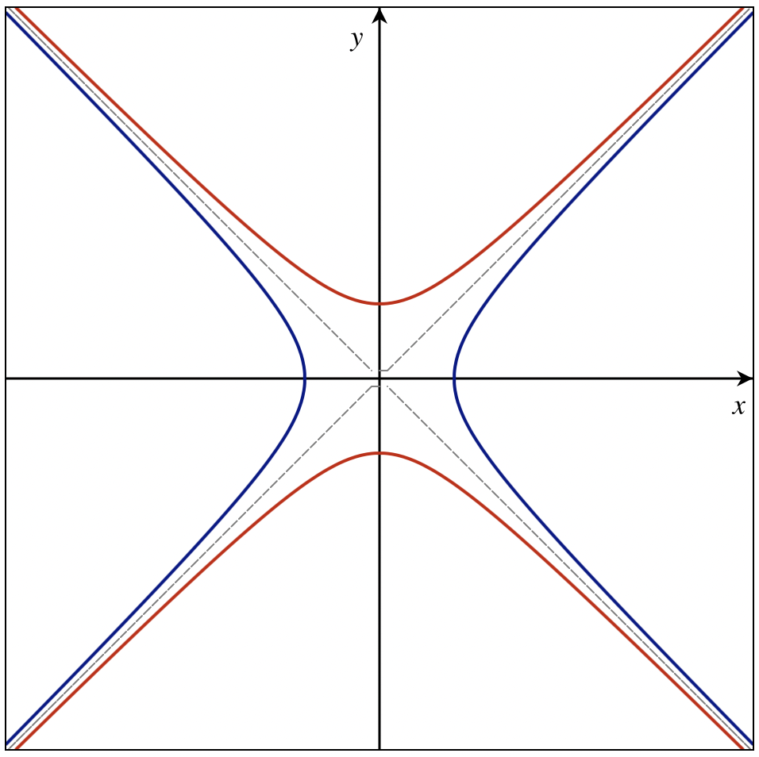
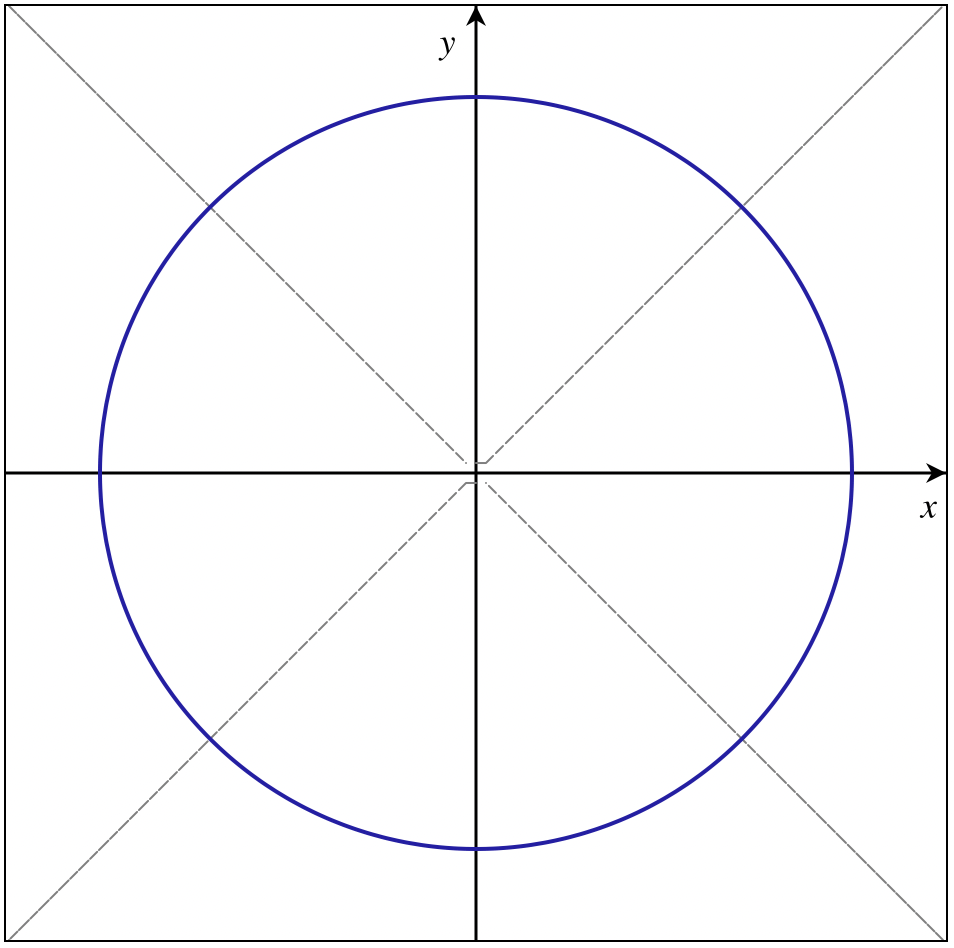
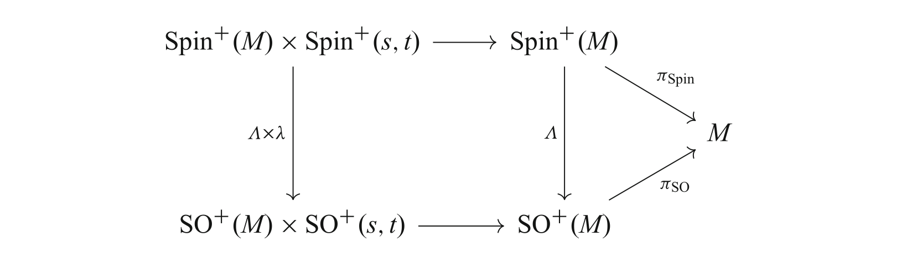

# Spinors

I am constantly scared every time I see a spinor and every time I hear anything about it. I don’t wanna deal with them, but here it is. 

[toc]

## Wordy Introduction

When doing experimental particle physics we found out that not all particles are nicely described using scalar or vector fields (i.e. attaching a number or a vector in space). We found out that some of them are better described in the case where fields LOOK like attaching a vector at every point, but when we turn around, the vectors are not exactly stuck on the plane. In fact they look like they are rotating slower than the plane. Like they’re lagging behind in a sense. This would be such that when you do a full rotation of a plane they would have only done half a rotation in the same direction. **You can see why I hate them.** 

In here we will build a rigorous description of doing this half rotation thing. We will build it in much generality, and then specify stuff. One of the cool results we will see is that given some spacetime (say Minkowski space) this type of slow spinny vector (the spinor) cannot have any dimension! It has to have a specific dimension so that it is compatble with rotations in that spacetime. A simple example which will be helpful in guiding intuition is rotations in $\mathbb{R}^3$. These rotations are always about an axis! So any vector that describes rotations HAS to have 3 dimensions to denote the axis. However, in $\mathbb{R}^2$ the situation is not as you expect, the rotation vector is still a member of $\mathbb{R}^3$ but it is just perpendicular to the plane having only one degree of freedom instead of 2 as we might have expected. As a result fixing information about the rotation kinda fixes the type of objects that we use to describe them. This is a sidenote that will become clearer as we go along, but it is nice to be slightly familiar with it when we come across it again.

How do we rigorously describe the disgusting concept of half rotation? It is not as simple as rotating by half the angle unfortunately. The way we do this is by constructing an algebraic object, called a Clifford Algebra, that will help us describe the square root of the elements of the rotation group, in such a way that when we apply them twice we get the full rotation. Then we will form a group out of this Clifford Algebra square-root–of-a-group-thype-thing and then use a representation (a way to map a group element to an object that can transform quantum sates or whatnot) to a particular vector space that will contain our spinors. The representation will tell us how the spinors rotate. 

# Clifford Algebras

The first thing to talk about is more of a helper object, called a *Clifford algebra.* It was invented when people were trying to find out a way to take “the square root” of the laplace operator $\Delta = \sum_i \frac{\partial }{\partial x^i}\frac{\partial }{\partial x^i}$ . We now know that its square root is a different operator $\nabla = \sum_{i}\frac{\partial }{\partial x^i}  e_i$. Notice that even though $\nabla^2 = \Delta$ the object $\nabla$​ clearly belongs to a different space because it can be thought of as a vector. This space is some Clifford algebra. The way we think about them, is that I give you a vector space and with some norm, and then you give me an algebra that contains elements that are interpreted as the square root of the norm. Let’s formalize this!

## Definitions

**<u>Definition:</u>** Given a vector space $V$ over a field $\mathbb{K}$ equipped with a nondegenerate bilinear form $B$, a **Clifford Algebra** is an associative unital algebra $\text{Cl}(V,B)$ over $\mathbb{K}$ such that there exists a $\mathbb{K}$-linear map $\gamma: V \to \text{Cl}(V,B)$ where for any $v\in V$

$$
\gamma(v)^2 = - B(v,v) \cdot 1,
$$

and for any other such map $\delta : V \to A$ to some other associative unital algebra $A$ that satisfied the same property, there exists a unique algebra homomorphism $\phi: \text{Cl}(V,B) \to A$ such that $\phi \circ \gamma = \delta$. 

The last property is called the universal property of the clifford algebra and is what helps us define it uniquely. Also note that the map $\gamma : V \to \text{Cl}(V,B)$ looks like the map that takes a vector and gives you its *square root* since $\gamma(v)^2 = - B(v,v)\cdot 1$. 

We can alternatively approach the subject constructively by taking a quotient of the tensor algebra $T(V)$ generated by $V$ with the two sided ideal $I(B) \coloneqq \text{span}\{v\otimes v + Q(v,v) \mid v \in V\}$​. After doing this it takes some tedium to show uniqueness and we have an equivalent definition that I am not gonna write down because it’s long, but I will write this as a corollary. 

**<u>Corollary:</u>** A clifford algebra $\text{Cl}(V,B)$ is isomorphic to

$$
\text{Cl}(V,B) \cong T(V)/I(B)
$$

where $I(B) \coloneqq \text{span}\{v\otimes v + B(v,v) \mid v \in V\}$ is the two sided ideal defined by the form $B$ and $T(V)$ is the tensor algebra of the vector space $(V,\mathbb{K})$ given by

$$
T(V) = \mathbb{K} \oplus V\oplus V^{\otimes 2} \oplus \cdots 
$$

Doing so gives us a convenient way to split the algebra in half. Namely, 

**<u>Definition:</u>** Given a vector space $V$ over a field $\mathbb{K}$ the **even and odd subspaces** of its tensor algebra are given by

$$
\begin{align*}
T^0(V) &\coloneqq \text{span}\{v_1\otimes v_2\otimes \cdots \otimes v_k \mid k \text{ even } v_i \in V \}\\
T^1(V) &\coloneqq \text{span}\{v_1\otimes v_2\otimes \cdots \otimes v_k \mid k \text{ odd } v_i \in V \}
\end{align*}
$$

then given a clifford algebra $\text{Cl}(V,B)$ we can define its **even and odd parts** as

$$
\begin{align*}
\text{Cl}^0(V,B) &\coloneqq T^0(V)/(T^0(V) \cap I(B))\\
\text{Cl}^1(V,B) &\coloneqq T^1(V)/(T^1(V) \cap I(B))
\end{align*}
$$

With these definitions we have the corollary that everyone expected.

**<u>Corollary:</u>** Any clifford algebra can be decomposed as

$$
\text{Cl}(V,B) = \text{Cl}^0(V,B) \oplus \text{Cl}^1(V,B)
$$

this is going to be super useful when we start speaking of majorana vs dirac spinors, but for now it seems a bit arbitrary. 

## Common Examples

Let’s see some common Clifford algebras that are used all the time in physics. 

**<u>Definition:</u>** For the vector space $\mathbb R^{s,t}$ with the inner product given by the metric $\eta$ the clifford algebra is denoted by $\text{Cl}(s,t)$. If $t= 0$ we denote the algebra as $\text{Cl}(s)$. For the vector space $\mathbb C^n$ with the standard eucledian inner product $q$ (not a Hermitian form) the Clifford algebra is denoted by $\mathbb C\text{l}(d)$.

With these definitions of common algebras we can play around a lot in interesting ways! In particular the following proposition will help establish why complex numbers appear out of nowhere when describing spinors. 

**<u>Proposition:</u>** Any complex Cliffpord algebra is isomorphic to a complexification of a real Clifford agebra, i.e.

$$
\mathbb{C}\text{l}(s+t) =\text{Cl}(s,t) \otimes \mathbb{C}
$$

therefore complex representations of $\text{Cl}(s,t)$ are equivalent to representations of the complex clifford algebras. 

Then the following lemma will unlock more about spinors when we talk about their dimension and such. Namely,

**<u>Lemma:</u>** For $n\geq 1$ $\mathbb C \text l^0(n) \cong \mathbb C \text l(n-1)$

## Gamma Matrices

Honestly we are building all the materials of spinors before even talking about them. Next up we have the *gamma matrices*. These are objects tied to a particular representation of the algebra and help us see how they act. In particular here is a definition.

**<u>Definition:</u>** Consder an algebra representation $\rho : \text{Cl}(s,t) \to \text{End}(\Sigma)$ of the real Clifford agebra of $\mathbb{R}^{s,t}$ to the endomorphism algebra of a $\mathbb{K}$ vector space $\Sigma = \mathbb K^N$. Assume that $\mathbb{R}^{s,t}$ has a basis $e_1, e_2,\cdots e_n$ where $n = s+t$. Then the **physical gamma matrices** are the representation of the basis given by

$$
\gamma_{\alpha} = -i \rho\circ \gamma(e_\alpha),
$$

for $1 \leq \alpha \leq n$, where $\gamma$ is the map that defines the clifford relation. 

The $-i$ factor is there because it makes physics look prettier, but other conventions exist and are used. An intuitive view of the $\gamma$ matrices is that they are the representations of the square root of the basis of minkowski space. In other words is how the square roots of minkowski space vectors would transform the vectors of $\Sigma$. These matrices have cool properties

**<u>Proposition:</u>** The Gamma matrices satisfy

$$
\{\gamma_\alpha,\gamma_\beta\} = 2 \eta_{\alpha\beta}\, I_N,
$$

where $I_N$ is the idenity on $\Sigma$.

## Chirality

There is a special element in representations of Clifford algebras associated with even dimensional vector spaces. This element is used to prove a lot of things and representations of it are related to really cool physical symmetries.

**<u>Definition:</u>** For $n$ even and $e_1,e_2,\cdots, e_n$ an oriented orthonormal basis of $\mathbb R^{s,t}$ the **chirality element** of $\mathbb C\text l (n)$ is given by

$$
\omega = \lambda \gamma(e_1) \gamma(e_2) \cdots \gamma(e_n).
$$

where $\lambda \in \mathbb{C}$ is given by $\lambda = -i^{n/2 + t}$

**<u>Corollary:</u>** The chirality element is independent of the choice of basis, and it satisfies

1. $\{\omega,\gamma(e_\alpha)\} = 0$

2. $[\omega,\gamma(e_\alpha)\gamma(e_\beta)] = 0$

3. if $\lambda^2 = (-1)^{n/2 + t}$ then $\omega^2 = 1$​. 

4. Given a complex representation $\rho : \text{Cl}(s,t) \to \text{End}(\Sigma)$ the representation of the chirality element is given by
   $$
   \gamma_{n+1} = \rho(\omega) = -i^{n/2 + t}\gamma_{1} \gamma_{2} \cdots \gamma_n.
   $$

## Properties of Standard Clifford Algebras

Honestly, I am writing this part because we will be using results about the standard Clifford algebras all the time when talking about spinors almost interchangeably so a lookup table would be useful.

We start some results that are super cute and then we will pull them together. 

**<u>Lemma:</u>** *(Complex Clifford Algebras are Periodic)* Ahe complex Clifford algebras satisfy 

$$
\mathbb C \text l (n+2) \cong \mathbb C \text l (n) \otimes_{\mathbb C} \mathbb C \text l (2) \cong \mathbb C \text l (n) \otimes_{\mathbb C} \text{End}(\mathbb C^2)
$$

This will help us prove a very nice theorem that can classify the clifford algebras. 

**<u>Theorem:</u>** *(Structure theorem for complex Clifford algebras)* Complex Clifford algebras and their even part are classified as follows

| $n$  | $\mathbb C \text l (n)$                                      | $\mathbb{C} \text l^0(n)$                                    | $N$           |
| ---- | ------------------------------------------------------------ | ------------------------------------------------------------ | ------------- |
| Even | $\text{End}(\mathbb C^N)$                                    | $\text{End}(\mathbb C^{N/2}) \oplus \text{End}(\mathbb C^{N/2})$ | $2^{n/2}$     |
| Odd  | $\text{End}(\mathbb C^{N}) \oplus \text{End}(\mathbb C^{N})$ | $\text{End}(\mathbb C^{N})$                                  | $2^{(n-1)/2}$ |

Then we have a similar, but less pretty theorem for classifying the real Clifford Algebras.

**<u>Theorem:</u>** *(Structure Theorem for real Clifford algebras)* Real Clifford algebras of the form $\text{Cl}(s,t)$ with $\rho = s-t$ and $n = s+t$ are cassified like so

| $\rho \mod 8$ | $\text{Cl}(s,t)$                                          | $N$           | $\text{Cl}^0(s,t)$                                         | $M$           |
| :-----------: | --------------------------------------------------------- | ------------- | ---------------------------------------------------------- | ------------- |
|      $0$      | $\text{End}(\mathbb{R}^N)$                                | $2^{n/2}$     | $\text{End}(\mathbb{R}^M)\oplus \text{End}(\mathbb{R}^M)$  | $2^{(n-2)/2}$ |
|      $1$      | $\text{End}(\mathbb{C}^N)$                                | $2^{(n-1)/2}$ | $\text{End}(\mathbb{R}^M)$                                 | $2^{(n-1)/2}$ |
|      $2$      | $\text{End}(\mathbb{H}^N)$                                | $2^{(n-2)/2}$ | $\text{End}(\mathbb{C}^M)$                                 | $2^{(n-2)/2}$ |
|      $3$      | $\text{End}(\mathbb{H}^N)\oplus \text{End}(\mathbb{H}^N)$ | $2^{(n-3)/2}$ | $\text{End}(\mathbb{H}^M)$                                 | $2^{(n-3)/2}$ |
|      $4$      | $\text{End}(\mathbb{H}^N)$                                | $2^{(n-1)/2}$ | $\text{End}(\mathbb{H}^M) \oplus \text{End}(\mathbb{H}^M)$ | $2^{(n-4)/2}$ |
|      $5$      | $\text{End}(\mathbb{C}^N)$                                | $2^{(n-1)/2}$ | $\text{End}(\mathbb{H}^M)$                                 | $2^{(n-3)/2}$ |
|      $6$      | $\text{End}(\mathbb{R}^N)$                                | $2^{n/2}$     | $\text{End}(\mathbb{C}^M)$                                 | $2^{(n-2)/2}$ |
|      $7$      | $\text{End}(\mathbb{R}^N)\oplus \text{End}(\mathbb{R}^N)$ | $2^{(n-1)/2}$ | $\text{End}(\mathbb{R}^M)$                                 | $2^{(n-1)/2}$ |

**<u>Example:</u>** For the useful example of minkowski space we have that

$$
\text{Cl}(1,3) \cong \text{End}(\mathbb{R}^4)\\
\text{Cl}(3,1) \cong \text{End}(\mathbb{H}^4)\\
\text{Cl}^0(3,1) \cong \text{Cl}^0(1,3)  \cong \text{End}(\mathbb{C}^2)
$$

With these in mind we are finally ready to talk about spinors!!

# Spinor Representations

Finally! Without further ado we have 

**<u>Definition:</u>** The **vector space of Dirac Spinors** is given by $\Delta_n = \mathbb{C}^N$ where $N = 2^{n/2},2^{(n-1)/2}$ when $n$ is even or odd respectively. Then the **Dirac spinor representation of the complex Clifford algebra** is given by 

$$
\rho : \mathbb C \text l(n) \to \text{End}(\Delta_n)
$$

defined by the structure theorem for complex clifford algebras, given by

| $n$  | Representation                                               |
| :--: | ------------------------------------------------------------ |
| Even | $\mathbb C \text l(n) \xrightarrow{\cong} \text{End}(\Delta_n)$ |
| Odd  | $\mathbb C \text l(n) \xrightarrow{\cong} \text{End}(\Delta_n) \oplus \text{End}(\Delta_n) \xrightarrow{\text{pr}_1} \text{End}(\Delta_n)$ |

These are induced complex representations of $\text{Cl}(s,t)$. 

Using this definition we can find a way that vectors from $\mathbb{R}^{s,t}$ can multiply spinors (which are elements of the spinor vector space). 

**<u>Defintion:</u>** The **Clifford multiplication** is a bilinear map 

$$
\begin{align*}
\mathbb{R}^{s,t} \times \Delta_n &\to \Delta_n\\
(X,\psi) &\mapsto X\cdot \psi \coloneqq -i \rho \circ \gamma (X) \psi = X^\mu \gamma_\mu \psi
\end{align*}
$$

Via the isomorphism of vector spaces

$$
\Lambda^\ast \mathbb R^{s,t} \to \text{Cl}(s,t),
$$

we can extend this definition to the multiplication of spinors by forms given by the complecification of $\text{Cl}(s,t)$. 

Ok yey! Let’s keep going! The next thing to understand are the left and right handed spinors. 

## Weyl Spinors

**<u>Corollary:</u>** *(Weyl Spinor representations)* Consider the restriction of the spinor representation to $\mathbb C \text{l}^0(n)$ the even subspace. Then 

1. If $n$ is odd then the induced representation is irreducible and it is given by the isomorphism
   $$
   \mathbb{C} \text l^0 (n) \xrightarrow{\cong} \text{End}(\Delta_n)
   $$

2. If $n$ is even then the induced representation decomposes to two irreducible ones called the **left-handed** and **right-handed Weyl Spinors.** 
   $$
   \mathbb C \text l^0 (n) \xrightarrow{\cong} \text{End}(\Delta_n^+) \oplus \text{End}(\Delta_n^+)
   $$
   where $\Delta_n^\pm \cong \mathbb C^{N/2}$.

That’s so cool! We see that in even dimensions the spinor representation breaks into two! This is really cool. Let’s see some properties. 

**<u>Proposition:</u>** *(Properties of Weyl Spinors)* Let $n= 2k$ for $k\in \mathbb {N}$ and the Dirac spinor representation on $\Delta_n$ and $\Gamma_{n+1}$ the representation of the chirality representation. Then the following is true. 

1. $\Delta_n^\pm$ is the eigenspace of $\Gamma_{n+1}$ with eigenvalue $\pm 1$ on $\Delta_n$.

2. The induced representation of $\mathbb C \text l^0 (n)$ leaves $\Delta_n^\pm$ invariant, and the induced representation $\mathbb C \text l^1(n)$ maps $\Delta_n^{\pm}$ to $\Delta_n^{\mp}$. Therefore, it follows that
   $$
   \mathbb C\text l^0(n) \cong \text{Hom}(\Delta_n^+,\Delta_n^+) \oplus \text{Hom}(\Delta_n^-,\Delta_n^-)\\
   \mathbb C\text l^1(n) \cong \text{Hom}(\Delta_n^+,\Delta_n^-) \oplus \text{Hom}(\Delta_n^-,\Delta_n^+)
   $$

## Spin Groups

Before we move on to Majorana spinors it would be nice to think of the algebra we are taking the representations of as the lie algebra of some lie group. Let’s find these groups. 

We begin with a very friendly and simple lemma that is going to be the guiding principle for the rest of the section. 

**<u>Lemma:</u>** Let $\mathbb K \in \{\mathbb R, \mathbb C, \mathbb H\}$. Then 

$$
\text{End}(\mathbb K^n) \cong \mathbb{K}^n \times \mathbb{K}^n.
$$

This is intuitively clear as we are assigning an element of $\mathbb{K}^n$ to each element of $\mathbb{K}^n$ without caring if it is invertible, with the only requirement that the map is linear. Then we consider the invertible transformations as the invertible elements of $\mathbb{K}^n \times \mathbb{K}^n$ and call that subgroup $GL(\mathbb K,n)$. 

What we will see is that inside every Clifford algebra there are hidden Lie groups that end up being double covers of orthogonal and pseudo orthogonal groups. Let’s start weeding them out. 

**<u>Definition:</u>** Given a Clifford algebra $\text{Cl}(V,B)$ we define the **group of invertible elements** of the algebra as

$$
\text{Cl}^\times(V,B) \coloneqq \{x \in \text{Cl}(V,B) \mid \exists y \in \text{Cl}(V,B) : xy = yx = 1 \}
$$

**<u>Lemma:</u>** The group of invertible elements is an open subset of the clifford algebra, and it is therefore a lie group. 

Now let’s define some nice subsets of $\mathbb{R}^{s,t}$. 

1. $S_+ ^{s,t} \coloneqq \{v \in \mathbb{R}^{s,t} \mid \eta(v,v) = + 1\}$
2. $S_- ^{s,t} \coloneqq \{v \in \mathbb{R}^{s,t} \mid \eta(v,v) = - 1\}$
3. $S_\pm ^{s,t} \coloneqq S^{s,t}_+ \cup S^{s,t}_-$

You can see that these subsets of the Lorenz space are the corresponding spheres. For examples for $\mathbb{R}^{1,3}$ we have that $S_+$ is a sphere in $\mathbb{R}^3$, and $S_-$​​ contains two points 

|  |  |
| :----------------------------------------------------------: | :----------------------------------------------------------: |
| An example of the spaces for Minkowski space $\mathbb{R}^{1,1}$, where $S_+$ is the blue curve, and $S_-$ is the blue curve. | An example of the spaces for Eucledian space $\mathbb{R}^{2}$, where $S_+$ is the blue curve, and $S_-$ is empty. |

These are basically the spheres with positive and negative radii, we will use them to find nice groups hidden inside the Clifford algebra. 

**<u>Definition:</u>** The **Pin group** is the subgroup of $\text{Cl}^\times(s,t)$ given by 

$$
\text{Pin}(s,t) \coloneqq \{\gamma(v_1)\gamma(v_2)\cdots \gamma(v_k) \in \text{Cl}(s,t) \mid v_i \in S_\pm, k \in \mathbb{N}\}
$$

The **Spin group** (or Special Pin group) is given by

$$
\text{Spin}(s,t) \coloneqq \text{Pin}(s,t) \cap \text{Cl}^0(s,t) = \{\gamma(v_1)\gamma(v_2)\cdots \gamma(v_{2k}) \in \text{Cl}(s,t) \mid v_i \in S_\pm, k \in \mathbb{N}\}
$$

Finally, the **Orthochronous Spin Group** is given by

$$
\text{Spin}^+(s,t) \coloneqq \{\gamma(v_1)\cdots \gamma(v_{2k}) \gamma(w_1)\cdots \gamma(w_{2l}) \in \text{Cl}(s,t)\mid v_i \in S_+, w_i \in S_-, k,l \in \mathbb{N}\}
$$

Now we can formulate a lot of theorems that show how these spin and pin groups correspond to rotations of vectors in $\mathbb{R}^{s,t}$ through conjugation. To do this, let’s write a canonical group action of the spin groups to the Lorenzian spaces by considering that $\gamma : \mathbb R^{s,t} \to \text{Cl}(s,t)$ is an embedding, therefore it has a left inverse $\bar \gamma$ such that $\bar \gamma \circ \gamma= 1$. 

**<u>Definition:</u>** The **canonical action of the Pin group** is given by the map

$$
\begin{align*}
R : \text{Pin}(s,t) \times \mathbb R^{s,t} &\to \mathbb R^{s,t} \\
(u,v) &\mapsto  (-1)^{\deg(u)}\bar\gamma(u \gamma(v) u^{-1})
\end{align*}
$$

where $\deg(u)$ is the **degree** of the group element $u$ which is $0$ if $u \in \text{Cl}^0(s,t)$ and $1$ if $u \in \text{Cl}^1(s,t)$.

This action basically works by considering the canonical embedding of a vector in the clifford algebra, then moving it by the element of the spin group via conjugation and then come back by the natural left inverse. Let’s see how this action lends itself to cool stuffs.

**<u>Lemma:</u>** The following map is a continuous homomorphism of Lie groups

$$
\begin{align*}
\lambda : \text{Pin}(s,t) &\to  O(s,t)\\
u &\mapsto R_u \coloneqq R(u,\cdot) \in O(s,t)
\end{align*}
$$

Furthermore the following are true

1. $\lambda$ is surjective with kernel $\ker \lambda = \{\pm 1\}$.
2. The preimages under $\lambda$ of $SO(s,t)$ and $SO^+(s,t)$ are equal to $\text{Spin}(s,t)$ and $\text{Spin}^+(s,t)$ respectively. 
3. $\lambda$ restricts to surjective homomorphisms in $\text{Spin}(s,t)$ and $\text{Spin}^+(s,t)$ with kernel equal to  $\{\pm 1\}$.
4. The orthochronous spin group is connected if $s\geq 2$ or $t\geq 2$. 
5. For all $n\geq 2$ the restrictions of the homomorphisms are universal (double) covers. 

Notice that since $\text{Spin}$ and $\text{Spin}^+$ are subgroups of $\text{Pin}$​ they also have canonically defined actions and homomorphisms. 

**<u>Example:</u>** We see that $\text{Spin}(3,0) = SU(2),\ \text{Spin}(4,0) = SU(2)\times SU(2)$ and most importantly for physics

$$
\text{Spin}^+(1,3)\cong SL(2,\mathbb{C})
$$

We can use this to see how the spinors affect the vectors of Minkowski space!

## Spinor Representation of Spin Groups

We can define the natural representation of the orthochronous spin group by copy pasting it from the representation of the clifford algebra since the spin groups are subspaces of it. 

**<u>Definition:</u>** The **spinor representation of the **$\text{Spin}^+(s,t)$ **group** is the restriction 

$$
\kappa : \text{Spin}^+(s,t) \to GL(\Delta_n)
$$

induced by the restriction of the spinor representation $\rho$ of the Clifford algebra $\text{Cl}(s,t).$ 

We can also use this representation to study the differential of the covering map! 

**<u>Proposition:</u>** *(Lie Algebra of Orthochronous spin group)* The lie algebra of the orthochronous spin group is given by 

$$
\mathfrak{spin}^+(s,t) \coloneqq \{\gamma(e_i)\gamma(e_j) \in \text{Cl}(s,t) \mid 1 \leq i < j \leq s+t\}
$$

with the canonical commutator $[\cdot,\cdot]$.

**<u>Corollary:</u>** *(The differential of the Covering Homomorphism)* The covering homomorphism $\lambda$ restricted on the spin group 

$$
\lambda : \text{Spin}^+(s,t) \to SO^+(s,t)
$$

has a pushforward given by 

$$
\begin{align*}
\lambda_\ast : \mathfrak{spin}^+(s,t) &\to \mathfrak{so}(s,t)\\
\lambda_\ast(z) x &= [z,x] = zx - xz
\end{align*}
$$

and it is an isomorphism. 

## Majorana Spinors

Some of the spinors in a spinor representation are Majorana. Every spinor representation can admit a real or quarternionic structure. The special real (or quarternionic) elements of the structure are what we call Majorana spinors. The reason is that these elments have special properties. Let’s see them.

**<u>Definition:</u>** Consider a complex vector space $V$ with a representation of a Lie group $G$. 

1. A **real structure** on $V$ is a complex antilinear $G$ equivariant map $\sigma : V \to V$ such that $\sigma \circ \sigma = 1$. If a vector space has a real structure, the **real subspace** is given by 
   $$
   V^\sigma = \{v \in V \mid \sigma(v) = v\}
   $$

2. A **complex structure** on $V$ is a complex linear $G$ equivariant map $I:V\to V$ such taht $I\circ I = -1$. 

3. A **quarternionic structure** on $V$ is a complex antilinear $G$ equivariant map $J : V \to V$ such that $J \circ J = -1$.

**<u>Proposition:</u>** Given a complex vector space $V$ with a real structure $\sigma$ we can write 

$$
V = V^\sigma \oplus i V^\sigma
$$

Now we are ready to define Majorana spinors. We will use the representations of the spin group to do so. Eitherway, they completely define our Spinor vector space. 

**<u>Definition:</u>** Let $\kappa : \text{Spin}^+(s,t) \to GL(\Delta_n)$ be the complex spinor representation of the orthochronous spin group. Then 

1. If $\Delta_n$ admits a real $\text{Spin}^+(s,t)$ equivariant structure $\sigma$ then the representation is called **Majorana,** and there exists a real subspace of half dimension $\Delta^\sigma_n$ where $\kappa$ induces a real representation of the orthochronous spin group. Elements of $\Delta_n^\sigma$ are called **Majorana Spinors**. We also define the **Majorana conjugate** of a spinor $\psi \in \Delta_n$ as $\psi^C \coloneqq \sigma(\psi)$. 
2. If $\Delta_n$ admits a quarternionic $\text{Spin}^+(s,t)$ equivariant structure $J$ then the representation is called **symplectic Majorana** and elements of $\Delta_n$ are called **symplectic Majorana spinors.** 

## Spin Invariant Scalar Products

The next thing we want is to come up with ways to measure “length” for spinors in order to define a notion of kinetic energy. We will do this using different bilinear forms that we will then use to promote to bundle metrics when we are talking about spinor fields. 

**<u>Definition:</u>** Consider a complex spinor representation to $\Delta_n$ of $\text{Cl}(s,t)$. A **Majorana form** on $\Delta_n$ is a complex bilinear form $(\cdot, \cdot): \Delta_n \times \Delta_n \to \mathbb{C}$ such that for any $\phi,\psi \in \Delta_n$ and $X \in \mathbb{R}^{s,t}$

1. $(\phi,X\cdot \psi) = \mu(X\cdot \phi,\psi)$ 
2. $(\phi,\psi) = \nu(\psi,\phi)$ 

where $\mu,\nu = \pm 1$ and are given by 

| $n \mod 8$ | $\mu$ | $\nu$ |
| :--------: | :---: | :---: |
|    $0$     | $-1$  | $+1$  |
|    $0$     | $+1$  | $+1$  |
|    $1$     | $+1$  | $+1$  |
|    $2$     | $+1$  | $+1$  |
|    $2$     | $-1$  | $-1$  |
|    $3$     | $-1$  | $-1$  |
|    $4$     | $-1$  | $-1$  |
|    $4$     | $+1$  | $-1$  |
|    $5$     | $+1$  | $-1$  |
|    $6$     | $+1$  | $-1$  |
|    $6$     | $-1$  | $+1$  |
|    $7$     | $-1$  | $+1$  |

**<u>Lemma:</u>** There exists a complex matrix $C$ such that for any $\phi,\psi \in \Delta_n$

$$
(\psi,\phi) = \psi^T C \phi,
$$

which has the following properties:

1. $C^T = \nu C$
2. $\mu C^{-1} \gamma_\mu C = {\gamma_{\mu}}^T$

This matrix is called the **charge conjugation matrix**. 

**<u>Corollary:</u>** Every Majorana form is invariant under the action of the orthochronous spin group. 

**<u>Example:</u>** As we can see from the above table, in dimension $4$ the charge conjugation matrix is necessarily antisymmetric. 

**<u>Definition:</u>** Given a spinor $\psi \in \Delta_n$ we define its **Majorana conjugate** as 

$$
\tilde{\psi} = (\psi,\cdot) = \psi^T C
$$

Next up we have the king of spinors, the **Dira forms.** These are the traditional bilinear forms that we think of when we try to define kinetic energies of spinors. They’re an almost Hermitian innner product in the spinor vector space.

**<u>Definition:</u>** Consider a complex spinor representation to $\Delta_n$ of $\text{Cl}(s,t)$. A **Dirac form** on $\Delta_n$ is a non degenerate $\mathbb R$ bilinear form $\langle\cdot, \cdot\rangle: \Delta_n \times \Delta_n \to \mathbb{C}$ such that for any $c \in \mathbb{C}$,  $\phi,\psi \in \Delta_n$ and $X \in \mathbb{R}^{s,t}$ 

1. $\langle \psi, X\cdot \phi \rangle = \delta \langle C \cdot \psi, \phi \rangle,$
2. $\langle \psi,\phi\rangle = \langle \phi ,\psi \rangle^\ast$
3. $\langle \psi,c\phi\rangle = c\langle \psi ,\phi \rangle = \langle c^\ast \psi ,\phi \rangle$ 

where $\delta = \pm 1$ is an arbitrary choice.

Note that we did not assume that the form is positive definite as a Hermitian form would otherwise be. This is super close approximation to a hermitian form. Just as in Majorana forms we have a similar Lemma

**<u>Lemma:</u>** For any Dirac form there exists a complex matrix $A$ such that for any $\phi,\psi \in \Delta_n$

$$
\langle \psi, A \phi\rangle = \psi^\dagger A \phi,
$$

with the following properties

1. $A^\dagger = A$
2. $-\delta A\gamma_\mu A^{-1} = \gamma_\mu^\dagger$

**<u>Lemma:</u>** Every Dirac form is invariant under the reperesentation of the orthochronous Spin group. 

**<u>Definition:</u>** The **Dirac Conjugate** $\bar \psi$ of a spinor $\psi \in \Delta_n$ is given by 

$$
\bar \psi = \langle \psi,\cdot \rangle = \psi^\dagger A
$$

Notice that if spinors are anticommuting then we have that the dirac form is a hermitian form! 

**<u>Corollary:</u>** For Majorana spinors the Dirac and Majorana conjugates are equal. 

# Spin Structures

The time is Finally here to create spinor bundles over some spacetime and take sections that we will call spinor fields! This is where a lot of the formalism unfolds naturally. In this section we will examine what is a *spin structure* over a Lorenzian manifold. We will find that there is a unique one see how it acts and then create spinor bundles! With spinor bundles we will expand some of the ingredients we have already discussed in a natural way. Namely, we will add Dirac and Majorana bundle metrics over the spinor bundle as well as real and quarternionic structures to talk about Majorana spinors and so on. 

## Orientability and Frame Bundles

In order to spin stuff it would be helpful to have an orientation. We could define orientations using top forms, but there is a much more involved way that is going to help us understand intuitively what is going on for spin structures. This is the language of **Frame bundles**. Let’s play with them for a second. 

**<u>Definition:</u>** Let $M$ be a smooth manifold and $p \in M$. Then the **set of all bases** of $T_pM$ is given by 

$$
\text{Fr}_{GL}(M)_p \coloneqq \{(v_1,v_2,\cdots, v_n) \subset T_pM \text{ basis}\}
$$

The disjoint union 

$$
\text{Fr}_{GL}(M) \coloneqq \bigsqcup_{p\in M}\text{Fr}_{GL}(M)_p
$$

is known as the **Frame Bundle** of $M$.

The definition is not complete yet, let’s figure out why that thing is a bundle.

**<u>Proposition:</u>** There exists a natural projection $\pi : \text{Fr}_{GL}(M) \to M$ and an action 

$$
\begin{align*}
\text{Fr}_{GL}(M) \times GL(n,\mathbb R) &\to \text{Fr}_{GL}(M)\\
((v_1,v_2,\cdots, v_n), A) &\mapsto (A_{\ 1}^i v_i, A_{\ 2}^i v_i, \cdots, A_{\ n}^i v_i).
\end{align*}
$$

Also the projection and action make $\pi : \text{Fr}_{GL}(M) \to M$ into a principal $GL(n,\mathbb R)$ bundle. 

**<u>Corollary:</u>** Consider an $n$-dimensional Riemannian manifold $(M,g)$ then we can similarly define an **orthogonal frame bundle** which is a principal $O(n)$ bundle 

$$
\pi : \text{Fr}_O(M) \to M,
$$

such that the fiber consists of the set of all orthonormal bases in $T_pM$. 

The process by which we defined the orthogonal frame bundle is called *reduction.* Let’s define it more rigorously for general principal $G$ bundles. 

**<u>Definition:</u>** Suppose $G \to P \xrightarrow{\pi} M$ and $G' \to P' \xrightarrow{\pi'} M$ are principal $G$ and $G'$ bundles respectively, and $f:G\to G'$ is a lie group homomorphism then a **bundle morphism** between $P$ and $P'$ is an $f$ equivariant smooth bundle map $H: P\to P'$ such that

$$
\pi' \circ H = \pi
$$

and for any $p\in P, g \in G$ 

$$
H(p\cdot g) = H(p) \cdot f(g)
$$

Together with the homorphism $f$, $P'$ is known as a **$f$ reduction of $P'$**. If $f$ is an embedding, then $H$ is called a **$G$ reduction of $P’$** and the image of $H$ is called a **principal $G$ subbundle**. 

To see how the reduction was used in the previous corollary look at the following proposition.

**<u>Proposition:</u>** Any Riemanian metric defines an $O(n)$ reduction of the frame bundle. 

Finally, we can take a look into this definitino which is going to be popping up again and again, so we might as well give it a name.

**<u>Definition:</u>** Let $G$ be a Lie group. A principal subbundle of the frame bundle of $M$, aka a $G$ reduction of the frame bundle, is called a **$G$ structure on $M$.**

We already created an $O(n)$ structure on $M$ by using the Riemannian metric. Now it becomes clear that a spin structure would be some kind of reduction of $GL(n)$ by the spin group. 

But I talked about orthogonality! Here are some definitions. 

**<u>Definition:</u>** Let $(M,g)$ be a pseudo-Riemannian manifold with signature $(s,t)$. Then we define the following orientations

1. $M$ is **orientable** if its frame bundle can be reduced to a principal $SO(s,t)$ bundle under the embedding $SO(s,t) \subset O(s,t)$.
2. $M$ is **time orientable** if its frame bundle can be reduced to a principal $O^+(s,t)$ bundle under the embedding $O^+(s,t) \subset O(s,t)$.
3. $M$ is **orientable and time orientable** if its frame bundle can be reduced to a principal $SO^+(s,t)$ bundle under the embedding $SO^+(s,t) \subset O(s,t)$.

Other than orientations is there any other reason to even define a frame bundle? The answer is yes! Associated vector bundles of the frame bundle are going to give us the all the tensor bundles, sections of which are what we call tensor fields! This is really cool! Really the matter contect of our physics is taken by associated vector bundles of the frame bundle. What we aim to do with spinors is to take a $\text{Spin}^+$ reduction of the frame bundle (similar to taking an orthogonal reduction when adding a Riemannian metric, and an orthochronous reduction when adding an orientation witha Lorenzian metric) and then construct all possible matter content. What we will find is all the tensor bundles we have seen before, as well as new spinor subspaces that we haven’t.

## Definitions

We are now ready to talk about Spin Structures!

**<u>Definition:</u>** Given $(M,g)$ a pseudo-Riemannian manifold with signature $(s,t)$ a **spin structure** on $M$ is a Principal $\text{Spin}^+(s,t)$ bundle 

$$
\pi_{\text{Spin}}:\text{Spin}^+(M) \to M,
$$

with a double cover

$$
\Lambda : \text{Spin}^+(M) \to SO^+(M)
$$

such that the following diagram commutes. 

Now we can show that this is a Spin reduction.

**<u>Corollary:</u>** The spin structure is thus a $\lambda$ equivariant bundle morphism $\Lambda$ therefore the spin structure is a $\text{Spin}^+(s,t)$ reduction of the $SO^+(s,t)$ frame bundle. 

There are various hard to pronounce theorems that guarantee existance and uniqueness of the spin bundle for a given manifold. But basically the only thing required is some version of orientability. The interesting corollary is this 

**<u>Corollary:</u>** The manifold $\mathbb R^{s,t}$ admits a unique spin structure for any $s,t \geq 0$ 

Cool! We almost made it! Let’s see how to use the spin structures.

**<u>Defintion:</u>** A local section $e$ of the frame bundle $SO^+(M)$ is called a **vielbein.**

**<u>Lemma:</u>** Let $M$ have a spin structure. Then for any vielbein $e$ on a contractible open set $U \subset M$ there exist precisely two local sections $\epsilon_\pm \in \Gamma(\text{Spin}^+(M))$ over $U$ such that $\Lambda \circ \epsilon_\pm = e$.

This is sort of guaranteed by the fact that the spin group is a double cover of $SO^+$ but it also has a deeper meaning. A vielbein corresponds to a smooth coordinate system that we can place on the tangent bundle. We see that for each such coordinate system there are two distinct ways we can form it using elements of the spin group. This is starting to be reminiscent of the square root thing we tried to achieve using Clifford algebras. 

