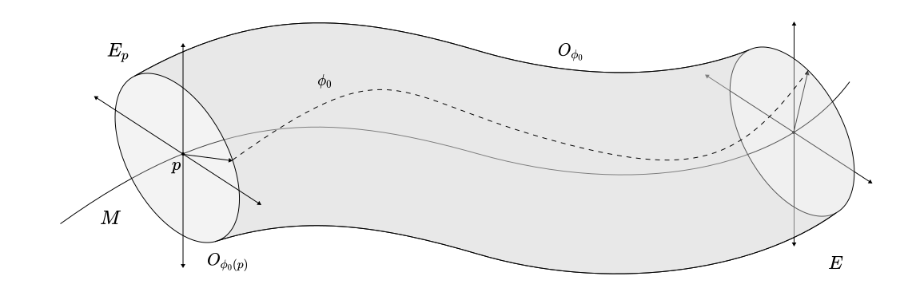

# Symmetry Braking

Consider a symmetric function $f:\mathbb R\to \mathbb R$. Then we know that it must follow
$$
f(x) = f(-x).
$$
If we do a perturbative expansion around $x=0$ then we can take advantage of that fact and use the symmetry. For example there will be no odd terms in the expansion. Now consider an automorphism $\sigma : \mathbb R \to \mathbb R$ given for all $x\in \mathbb R$ by
$$
\sigma(x) = x + c,
$$
where $c\in \mathbb R$. Then the transformed function
$$
\tilde f = \sigma^\ast f = f\circ \sigma,
$$
is no longer symmetric a priori for $c\neq 0$. Now, if we take the same expansion then the mirror symmetry we had before might no longer be there! We broke it. This is symmetry braking. By following such procedures we can get very interesting physical results in classical and quantum field theory. 

The discussion here is primarily drawn from these references

1. [Gauge Theory and Variational Principles](https://archive.org/details/gaugetheoryvaria00blee_0)
2. [An Introduction to Quantum Field Theory](https://www.google.com/books/edition/An_Introduction_To_Quantum_Field_Theory/GjGy0AEACAAJ?hl=en)
3. [Mathematical Gauge Theory](https://link.springer.com/book/10.1007/978-3-319-68439-0)
4. [Field Theory: A Modern Primer](https://www.routledge.com/Field-Theory-A-Modern-Primer/Ramond/p/book/9780367154912?srsltid=AfmBOopi099PMiNiuMJ-ooHBpLH1gKU0uX7NO0OZmMspkfr45njrTzo8)

[toc]

# In Classical Field Theory

Let's start with a formal description of Symmetry Braking in Classical Field theory. 

## Vacuum in a Field Theory

We will define vacuums and chop up our symmetry accordingly. But first let's introduce a useful tool

**<u>Definition:</u>** Let $f:X\to \mathbb K$ be a function from some manifold $X$ to a field $\mathbb K$. A **bundle lift** of $f$ via a bundle $\pi:E\to M$ with fiber $X$ over some manifold $M$ is a map $F:E\to \mathbb R$ such that, given a global trivialization $(\phi=(\phi_1,\phi_2),M)$ of $E$, the function is given by
$$
F= \phi^{-1} \circ (\text{Id}_M \times f) \circ \phi
$$
**<u>Note:</u>** the bundle lift depends on the trivialization. 

**<u>Definition:</u>** Let $F$ be a bundle lift on the bundle $\pi:E\to M$ with connection $\nabla$ on its fibers. We say that $\sigma \in \Gamma^\infty(E)$ is a **local minimum** of $F$  if for all $p\in M$ the Hessian $\nabla \nabla \left.F\right|_{\pi^{-1}(p)}$  is positive semidefinite at $\sigma(p)$ and $(\nabla \left.F\right|_{\pi^{-1}(p)})(\sigma(p)) = 0$.

This is a disgustingly complicated way to say what we all think when we think of a minimum. Gradient zero, and Hessian bowl. 

**<u>Definition:</u>** Consider a Lagrangian $\mathcal L : \Gamma^\infty(E) \to \Omega^n(M)$, where $(M,g)$ is an $n$-dimensional connected and simply connected Riemannian manifold and $\pi:E \to M$ is an associated vector bundle over $M$ to a principal $G$-bundle $\bar\pi : P\to M$ where $G$ is a compact Lie group. Let the Lagrangian be given for any $\phi \in \Gamma^\infty(E)$ by
$$
\mathcal L(\phi) = \ast \langle \nabla  \phi,\nabla \phi \rangle + \ast V(\phi),
$$
where $\nabla:\mathfrak{X}(M)\times \Gamma^\infty(E)\to  \Gamma^\infty(E)$ is a connection induced by $P$, $\langle \cdot, \cdot \rangle $ is a $G$-invariant bundle metric, and  $V:\Gamma^\infty(E) \to C^\infty(M)$ is a smooth, $G$-invariant map called the **potential** which is a bundle lift of some smooth function on the fiber of $E$. If $\phi_0 \in \Gamma^\infty(E)$ is a local minimum of $V$ and it is covariantly constant, i.e. $\nabla \phi_0 = 0$, then it is called a **vacuum**. It's orbit under $G$ given by the subbundle
$$
O_{\phi_0} = G \cdot \phi_0 = \{g\cdot \phi_0(p) \in E \mid g\in G,\ p\in M \}
$$
is called the **vacuum orbit**. We usually denote the fibers as $O_{\phi_0(p)}$ for some $p\in M$. The vacuum's stabilizer
$$
G_{\phi_0} = \{g\in G \mid g\cdot \phi_0 = \phi_0\},
$$
is called the **unbroken subgroup** of $G$ relative to $\phi_0$.

Ooof. This was a lot of setup. And while the elements, such as Principal and Associated Vector bundles are explained [here](../Geometry/Bundles.md), they are only there to provide the natural calculus structure that we usually take for granted in physics. In essence, a **vacuum** is a field configuration that minimizes the potential of our theory. Here is a picture of what is going on.

The interesting theorem that will lead to the creation of Goldstone Bosons is the following.

**<u>Theorem:</u>** Let $\phi_0 \in \Gamma^\infty(E)$ be a vacuum for some Lagrangian on a vector bundle $E$ of rank $k$ with fiber $F$, and $d = \dim O_{\phi_0(p)}$ the dimension of the vacuum orbit. Then for every $p\in M$ there exist $d$ basis vector fields $\{X_i\}_{i=1}^d \subset \mathfrak X(E_p)$ for $TO_{\phi_0 (p)} \subset TE_p$ such that
$$
\nabla_{X_i} \nabla_{X_i} V_p = 0,
$$
where $V_p$ is the potential restricted at the fiber above $p$, i.e. $V_p = \left. V\right|_{\pi^{-1}(p)} : E_p \to \mathbb R$. 

***Proof:*** The proof of this theorem is based on the fact that $V$ is $G$-invariant. In particular, we know that $G$ acts transitively on $O_{\phi_0(p)}$ since it is an orbit.  Therefore, for any element of the Lie algebra $X \in \mathfrak g$, there exists a related vector field $\tilde X$ such that
$$
\nabla_{\tilde X} V_p = 0.
$$
This is because any $q \in O_{\phi_0(p)}$ is given by some $q = e^{X}\cdot  \phi_0(p)$, but since $V_p$ is $G$-invariant, $V_p(q) = V_p(\phi_0(p))$. Therefore, $V_p$ is constant on $O_{\phi_0(p)}$. As a result,
$$
\nabla_{\tilde X} V_p = \mathcal L_{\tilde X} V_p = \lim_{\epsilon \to 0}\frac{V(e^{\epsilon X}\cdot ) - V(\cdot )}{\epsilon} = 0.
$$
The only question is to show that we can form a basis for $TO_{\phi_0(p)}$ using such related vector fields from the Lie algebra. The answer is yes! Since $G$ acts transitively on the orbit, we know that the orbit is isomorphic to the quotient by the vacuum stabilizer
$$
O_{\phi_0(p)} \cong G/G_{\phi_0},
$$
Therefore, this isomorphism of Lie groups, induces an isomorphism of the Lie algebras. So we are done! 
$$
\begin{equation}\tag*{$\Box$}\end{equation}
$$

## Goldstone Bosons

A vacuum is the fundamental ingredient of symmetry braking. Now that we have it, we would like to create a field theory around deflections from this vacuum. Here is how we do it.

**<u>Definition:</u>** Let $\phi \in \Gamma^\infty(E)$ be a field and $\phi_0 \in \Gamma^\infty(E)$ a vacuum for some Lagrangian. Then we know that there exists a section of the Vertical tangent space $\delta\phi \in \Gamma^\infty(VE)$ such that
$$
\phi = e^{\delta \phi} \cdot \phi_0,
$$
where $e$ is the canonical exponential map between the tangent space and the manifold. The field $\delta \phi$ is known as the **shift field.**

**<u>Sidenote:</u>** Notice that the vertical tangent space $VE=\ker \pi_\ast$ of any vector bundle $E$ is isomorphic to $E$ that is because for any point, p, the fiber $V_pE \cong TE_{\pi(p)} \cong E_{\pi(p)}$. Therefore the exponential map gives us an isomorphism so we can interpret the shift field $\delta \phi$ as a regular field. 

**<u>Definition:</u>** If $X \in \mathfrak g$ is an element of the Lie algebra of $G$ that maps to $0 \in \tilde {\mathfrak g}$ in the Lie algebra of $G/G_{\phi_0}$ for some vacuum $\phi_0$ then it is called **broken.**

**<u>Lemma:</u>** The vertical tangent space $VE$ admits a vector field basis $\{X_1,X_2,\cdots, X_d, Y_{1},Y_{2},\cdots,Y_{k-d}\}$, where $k = \rank E$ and $d = \dim O_{\phi_0(p)}$ for any $p \in M$, where $X_i = \tilde A_i$ for some $A_i \in G/G_{\phi_0}$ and $Y_i \in \mathfrak X(V^\perp O_{\phi_0})$ are vector fields on the perpendicular subspace of the vacuum orbit. 

***Proof:*** The proof of this is directly taken from the last theorem above in the previous section. 

So we can have an interesting approximation of the Lagrangian.
$$
\begin{equation}\tag*{$\Box$}\end{equation}
$$

**<u>Corollary:</u>** The Lagrangian can be approximated in terms of the shift field as 
$$
\ast \mathcal L(\delta \phi) = \frac{1}{2}\langle\delta\phi,\delta\phi\rangle - V(\phi_0) - \frac{\lambda^i}{2}\langle Y_i,Y_i \rangle + \mathcal O(\langle \delta\phi,\delta\phi\rangle^3),
$$
where $\lambda^i > 0$ are the eigenvalues of the Hessian of $V$.

***Proof:*** We use the fact that $\phi_0$ is a minimum and Taylor expand to second order. Therefore the first order vanishes. We also know that if we write $\delta\phi$ in its standard basis, using the previous theorem these eigenvalues are zero for the $X_i$, therefore we are left with the corollary's form. 
$$
\begin{equation}\tag*{$\Box$}\end{equation}
$$

**<u>Definition:</u>** We can write the shift field in the basis above like so
$$
\delta \phi = \pi^i X_i + \sigma^iY_i,
$$
where $\pi^i,\sigma^i \in \Gamma^\infty(E)$ are known as **Goldstone fields** and **scalar mesons** respectively. 

**<u>Theorem:</u>** *(Goldstone's Theorem)* A theory with a vacuum admits as many Goldstone fields as independent broken generators of the Lie algebra.

***Proof:*** We have already shown this in the previous lemma. This just combines it with the definition. 
$$
\begin{equation}\tag*{$\Box$}\end{equation}
$$

## Linear $\sigma$ Model

As an example we will follow Peskin to construct the Goldstone bosons that arise in the symmetry braking of the Linear Sigma model.

**<u>Definition:</u>** Let $(M,\eta)$ be the $n$-dimensional Minkowski space and $\pi : E \to M$ be a trivial real vector bundle of rank $N$ with a Euclidean bundle metric $\langle \cdot, \cdot \rangle : E \times E\to \mathbb R$. The **linear sigma model Lagrangian** is a Lagrangian $\mathcal L : \Gamma^\infty(E) \to \Omega^n(M)$ such that for any $\phi \in \Gamma^\infty(E)$ it is given by
$$
\ast \mathcal L(\phi) = \frac{1}{2}\langle \nabla \phi,\nabla \phi \rangle + \frac{\mu^2}{2}\langle \phi, \phi \rangle -\frac{\lambda}{4}\langle  \phi, \phi \rangle^2,
$$
where $\mu \in \mathbb R, \lambda >0$. 

This is not a gauge theory (even though it actually is because the frame bundle of this is a principal bundle with fiber $O(N)$) so we can treat it without using principal bundles. 

**<u>Proposition:</u>** The linear sigma model Lagrangian is invariant under the fundamental action of $O(N)$ on $E$ given by the trivialization.

***Proof:*** Let $p \in M$. We know that $E = M\times \mathbb R^N$ since it is a trivial bundle and the fundamental action of $O(N)$ is given by the fundamental representation on $\mathbb R^N$ like so
$$
\begin{align*}
\rho: O(N) \times E &\to E\\
(g,p,v) &\mapsto (p,gv).
\end{align*}
$$
Therefore we see that for any $\phi,\psi \in \Gamma^\infty(E)$
$$
\langle g\phi,g\psi\rangle = \langle \phi,\psi\rangle.
$$
Additionally consider
$$
\nabla g\phi = \nabla \phi^i g e_i = d\phi^i \otimes ge_i = g \nabla \phi.
$$
With these two identities we can show that the Lagrangian remains invariant, i.e.
$$
\mathcal L(g\phi) = \mathcal L(\phi).
$$

$$
\begin{equation}\tag*{$\Box$}\end{equation}
$$

So now we have a group that the Lagrangian is invariant under, and more importantly, that the interaction term 
$$
V(\phi) = -\frac{\mu^2}{2}\langle \phi, \phi \rangle +\frac{\lambda}{4}\langle  \phi, \phi \rangle^2
$$
is invariant under the action of the Lagrangian and it is a bundle lift of a function $v: \mathbb R^N\to \mathbb R$ that looks identical to this one in notation, and is also invariant under the action of $O(N)$. This means that we can try and find a vacuum! 

**<u>Proposition:</u>** The section $\phi_0 \in \Gamma^\infty(E)$ given for any $p\in M$ by
$$
\phi_0(p) = -\frac{\mu}{\sqrt{\lambda}} e_1,
$$
is a vacuum for the linear sigma model Lagrangian. 

***Proof:*** The minimum of $V$ is going to be when a field contains minima of $v:\mathbb R^N\to \mathbb R$. We can now take
$$
\frac{\partial v}{\partial x} = (-\mu^2 + \lambda x^Tx) x^T.
$$
 Therefore, for this to vanish we need
$$
0=-\mu^2 + \lambda x^Tx \implies \norm{x} = \frac{\mu}{\sqrt{\lambda}}.
$$
Also we can take the second derivative to obtain the Hessian to be
$$
\frac{\partial^2 v}{\partial^2x} = -\mu^2 + \lambda x^Tx +2\lambda xx^T.
$$
We see that $\norm {\phi_0(p)} = \frac{\mu}{\sqrt\lambda}$ for any $p\in M$. Therefore, this is a root of the gradient, and produces a positive definite Hessian. As a result, for every $p$, $\phi(p)$ minimizes $v$. To show that it also minimizes $V$ we need to show that
$$
\begin{align*}
\nabla \phi_0 = -\frac{\mu}{\sqrt{\lambda}} \nabla e_1 = 0.
\end{align*}
$$

$$
\begin{equation}\tag*{$\Box$}\end{equation}
$$

Out of sheer luck for this case notice that $V(\phi) = 0$ as well! Now we can directly apply our theorem to obtain the decomposition of the Lagrangian. 

**<u>Proposition:</u>** The Lagrangian can be written as
$$
\mathcal L(\delta\phi) = \frac{1}{2}\langle \delta \phi,\delta \phi\rangle - \mu^2 \langle e_1,\delta \phi\rangle^2 + \cdots
$$
***Proof:*** This is a direct application of the last corollary of the previous section.
$$
\begin{equation}\tag*{$\Box$}\end{equation}
$$
The cool thing though is that this new theory, to this approximation, is a theory of $N-1$ massless (Goldstone bosons) and $1$ massive boson of mass $\sqrt 2 \mu$ that are noninteracting.

# In Quantum Field Theory

Through the path integral formulation, all of our previous understanding can be directly ported through in our quantum theory. However, this picture hides itself once we start to renormalize. In this section will will go through the renormalization procedure of the linear sigma model and show some ugly outcomes. Then we will look more specifically into quantizing spontaneously broken gauge theories. 

