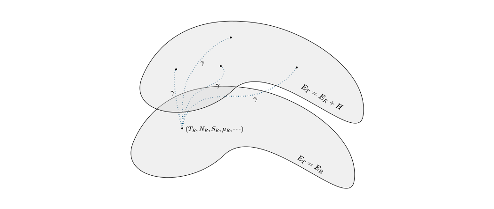
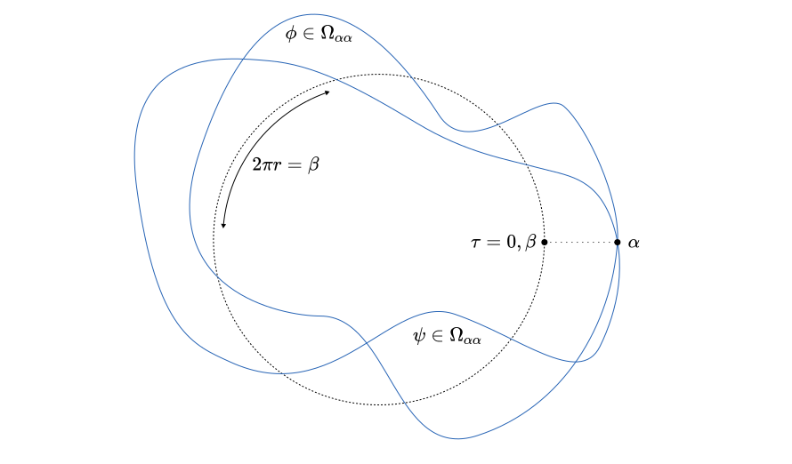
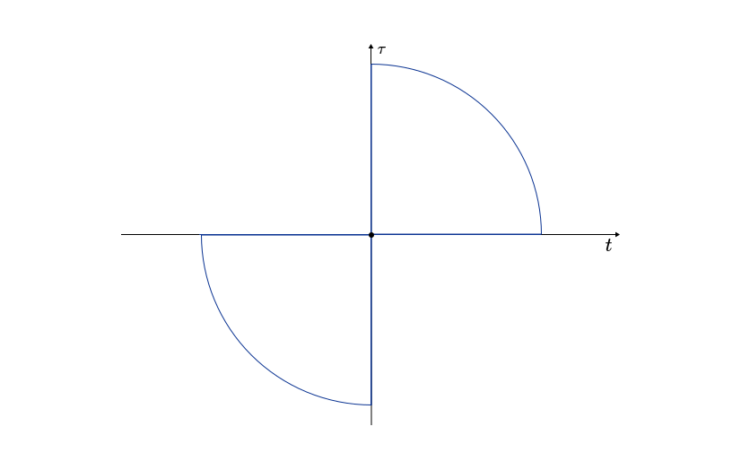
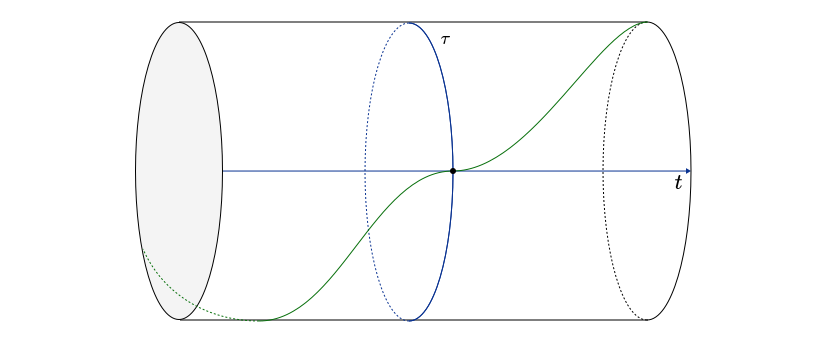
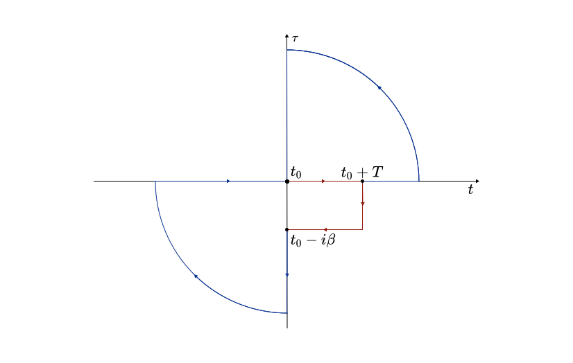
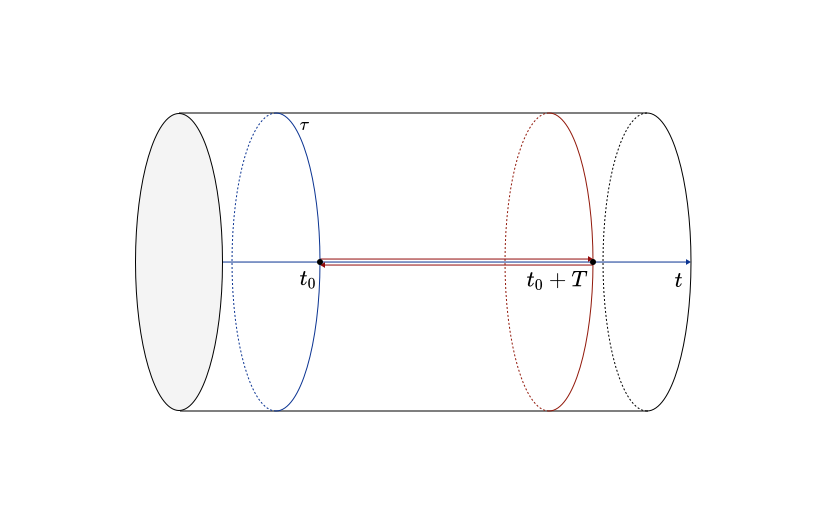

# Warm Quantum Fields

What happens when there is more than a couple of particles in space? We will use thermodynamics to introduce perturbative corrections to QFT calculations. We start with a revision of the basic structures in statistical physics, formulated in a more abstract way such that it is directly applicable to the path integral formalism. Then play with the partition function for QFTs enough to derive corrections to the Green's functions of the theory and finally do some perturbative corrections to show that the temperature is meaningless and we were right to ignore it all along.

These notes rely on:

1. [Kapusta - Finite temperature field theory](https://library.oapen.org/bitstream/handle/20.500.12657/64016/1/9781009401968.pdf)
2. [Bellac - Thermal Field Theory](https://www.cambridge.org/core/books/thermal-field-theory/327ADC94F9AF342A6355EA65F1E6991A)
3. [Ramond - Field Theory](https://archive.org/details/fieldtheorymoder0000ramo_c7r4)
4. [Donoghue - The analytic continuation of distributions](https://www.sciencedirect.com/science/article/pii/S0079816908618899?via%3Dihub)
5. [Peskin - Introduction to Quantum Field Theory](http://home.ustc.edu.cn/~gengb/200923/Peskin,%20An%20Introduction%20to%20Quantum%20Field%20Theory.pdf)
6. [Tong - QED](https://www.damtp.cam.ac.uk/user/tong/qft/six.pdf)
7. [Weldon - Covariant Calculations in Finite Temperature Field Theory](https://journals.aps.org/prd/abstract/10.1103/PhysRevD.26.1394)
8. [Ahmed - Vacuum Polarization at Finite Temperature in QED](https://www.sciencedirect.com/science/article/pii/000349169190066H)

[toc]

# Ensembles

The playing field of statistical physics is ensembles which is a term that comes from probability. The idea is that one has a measure space that denotes all the possible outcomes for the big system and then they add a probability measure that satisfies certain physical conditions such as the existence of temperature or chemical potential and so on. 

The definition of an Ensemble is useless because it is too general, but here it is but that's too abstract to make sense.

**<u>Definition:</u>** An **ensemble** $(\Gamma,\Sigma,\lambda,S)$ is a measurable space $\Gamma$ with sigma algebra $\Sigma$ and a map $\lambda:S\times \Sigma \to [0,1]$, where $S$ is some set and for any $s\in S$  $\lambda_s = \lambda(s,\cdot)$ is a measure on $(\Gamma,\Sigma)$. 

The definition of the other components is [here](../Analysis/Functional_Analysis.md) and honestly it isn't even that relevant. An ensemble is basically a space $\Gamma$ that contains all the configurations of the constituents of the system and a probability measure $\lambda$ slapped on top of that such that we can tell how likely some configurations are versus others. 

The physics of the ensemble are all inside $\lambda$. Usually it depends on the Hamiltonian in a cute way, or the chemical potential, temperature, and so on. These are the parameters in the set $S$. Usually $S$ is something like $\mathbb{R}$ representing time, where we get a different measure for every point in time. Other times $S$ can be the set of all temperatures or chemical potentials or both. Let's see how that works.

## Quantum Mechanical Canonical Ensemble

It is actually worth to go through this as an example because it will force us to think about interesting topics such as the spectral theorem and so on, plus it will be a useful motivating intuition for our subsequent definitions.

**<u>Example:</u>** *(Quantum Canonical Ensemble)* Consider a quantum system with Hilbert space $\mathbb{H}$ that describes the states for a single particle. Then we can consider the *Fock space* of that system which is the Hilbert space that contains all the possible combinations of this kind of particle and it is given by
$$
\mathbb{F} = \bigoplus_{n=0}^\infty \mathbb{H}^{\otimes n} = \mathbb{C}\oplus \mathbb{H} \oplus (\mathbb{H}\otimes \mathbb{H}) \oplus \cdots.
$$
In any physical theory one doesn't just get the Fock space by itself, but also gets an algebra of possibly bounded self adjoint operators $\mathcal{A}$, or observables, that contains familiar physics concepts such as the Hamiltonian $H$, the number operator $N$, etc. Honestly there is a generalization for algebras of unbounded operators but I don't know it, and I don't need to. It exists. 

Given all that, we need to convert $\mathbb{F}$ into a measure space by introducing a sigma algebra. We are lucky because there is a free sigma algebra in the projective Hilbert space given to us by the Born rule! 

**<u>Definition:</u>** The **projective Hilbert space** $P(\mathbb{H})$ is the set of all rays of a Hilbert space $\mathbb{H}$, namely
$$
P(\mathbb{H}) = \{[\psi] \subset \mathbb{H}\setminus \{0\} \mid \phi \sim \psi  \iff \exists \lambda \in \mathbb{C} \text{ s.t. } \psi = \lambda \phi\}.
$$
**<u>Corollary:</u>** The projective Hilbert space is isomorphic to the set of all projection operators to the lines in $\mathbb{H}$.

The projective space has a natural Khaler manifold structure with metric induced by the inner product in $\mathbb{H}$. Here is how.

**<u>Theorem:</u>** Consider a complex Hilbert space $\mathbb{H}$ with the canonical metric induced by its hermitian form
$$
g = dz^\mu\otimes dz_\mu,
$$
where $z^\mu$ are projection coordinates. Then $P(\mathbb{H})$ can be identified as the quotient of the unit sphere $S^{\mathbb{H}} \subset \mathbb{H}$ on the Hilbert space, and the induced metric, known as the **Fubini metric**, makes it a Khaler manifold.

This is way too complicated for what it is. It just means that the probability norm we are using for the born rule defines a metric on the projective space and more importantly a volume form there, including a measure. 

**<u>Example:</u>** Let $\psi, \phi \in \mathbb{H}$, then their geodesic distance in $R(\mathbb{H})$ induced by the Fubini metric is given by
$$
\gamma(\psi,\phi) = \arccos \frac{|\langle \psi,\phi \rangle|}{\langle \psi,\psi \rangle\langle \phi,\phi \rangle}.
$$
This can be thought of as their angle in the projective space which belongs in $[0,\pi/2]$. 

We actually don't care to measure $\mathbb{F}$ we only really care on measuring $P(\mathbb{F})$ which we can do with the Fubini metric. However, there is one super awesome theorem that can define the measures so much simpler. Here it is.

**<u>Theorem:</u>** *(Gleason's Theorem)* I probability measure is a Fubini probability measure $\mu$ on $P(\mathbb{H})$ iff there exists a unique positive semidefinite linear map $\rho:\mathbb{H}\to \mathbb{H}$ on $\mathbb{H}$ with unit trace $\text{Tr}\rho =1$ such that the measures density is given by the map
$$
\begin{align*}
p:P(\mathbb{H}) &\to [0,1]\\
\Pi &\mapsto \text{Tr\,}\rho \Pi,
\end{align*}
$$
where $\Pi : \mathbb{H} \to \mathbb{H}$ is an element of $P(\mathbb{H})$ thought of as a projection operator to a line in $\mathbb{H}$. 

Note that the integral of the Fubini form on $P(\mathbb{H})$ is normalized to 1 for this to work.

> **Intuition:** In physics we call $\rho$ a **density matrix**. The above theorem can be rephrased to any density matrix defines a distribution over the projective space. 
>
> In particular, the configurations in quantum mechanics are really only the elements projective space of the Hilbert space. This is the rigorous form of the statement: "Physical states are equivalent up to a phase." As a result, the density states are essentially a probability distribution over the set of such configurations. 
>
> In a more quantum mechanical language a density matrix can be thought of as the probability distribution that a quantum system would collapse to a specific state after observation. For example, the density matrix $\ketbra{0}$ in a spin-$\frac{1}{2}$ system is a probability distribution over all the possible quantum states that after observation the system would collapse to the $\ket{0}$ state. 
>
> This is similar to classical statistical mechanics, where the density of states is a distribution over the classical configurations.

So now we can add measures using density matrices which is honestly pretty cool! We are ready to define an ensemble.

**<u>Definition:</u>** Consider a quantum system with Hilbert space $\mathbb{H}$, a Hermitian map $H:\mathbb{F}\to \mathbb{F}$ (i.e. the Hamiltonian), and a Hermitian map $N:\mathbb{F} \to \mathbb{F}$ such that for any $\psi \in \mathbb{H}^{\otimes n}$ $N\psi = n\psi$ (i.e. the number operator). The **quantum mechanical grand canonical ensemble** is an ensemble $(P(\mathbb{F}), \Sigma, \mu)$ where $(P(\mathbb{F}),\Sigma)$ is the Fubini measure space on the projective space, and $\lambda: \mathbb{R}^2 \times \Sigma \to [0,1]$ is a collection of measures given by
$$
(\beta,\mu, A) \mapsto \lambda_{\beta,\mu}(A) = \frac{1}{Z(\beta,\mu)}\int_{A} \ast \text{Tr}\left(e^{-\beta H + \mu N}\Pi_{\bullet}\right),
$$
where $\ast$ is the Hodge star on $P(\mathbb{F})$ with the Fubini metric and $Z : \mathbb{R}^2 \to \mathbb{R}$ is a normalization factor called the **partition function** and given by
$$
Z(\beta,\mu) = \int_{P(\mathbb{F})} \ast \text{Tr}\left(e^{-\beta H + \mu N}\Pi_{\bullet}\right) = \text{Tr}\left(e^{-\beta H + \mu N}\Pi_{\bullet}\right),
$$
where the last equality is given by the spectral theorem. 

And here we have it! A fully fledged ensemble! Probably not the best first example for this, but this can serve as a blueprint for the later definitions. 

## Physical Motivation

Notice that the grand canonical ensemble is the ensemble given by the density matrix
$$
\rho = \frac{e^{-\beta H + \mu N}}{Z}.
$$
Let's go over the physical motivation for this. The grand canonical ensemble is supposed to describe a system where there are a bunch of particles at some fixed temperature that is connected to a reservoir such that adding or removing particles expends a fixed amount of energy. The total energy remains constant though. Let's motivate each condition separately. 

Such a system thermodynamically has to obey the first law of thermodynamics which in this case is written by
$$
dE = TdS - \mu dN,
$$
where we define the number of microscopic states that correspond to a particular macroscopic state to be
$$
\Omega = e^{S},
$$
by where $S$ is the entropy which is some function over the macroscopic configuration space. The probability is going to be proportional to $\Omega$ since it indicates the number of available states to our system with given macroscopic variables. Now consider the system attached to a big reservoir. This corresponds to taking the (categorical tensor) product of the two configuration spaces, so the total number of states $\Omega_T$ is going to be $\Omega_S \cdot \Omega_R$, i.e. the product of the available states of our system $S$ and the reservoir $R$. This implies that
$$
\Omega_T = \Omega_S\Omega_R \iff e^{S_T} =  e^{S_S + S_R} \iff S_T = S_S + S_R.
$$
Now assume that the reservoir is *much bigger* than our system. This really means that if we change its state variables the reservoir won't budge. To be more precise, we focus on the Reservoir. It is a system whose total energy is given by
$$
E_R = E_T - H,
$$
where $H$ is the Hamiltonian of our system. The issue is that the system is **not in equilibrium** unless $H=0$. Therefore our thermodynamics only work for that regime. Here is where the large assumption comes in. The picture below is the intuition of what it means for the two energies to be close. The bottom blob is the surface in the macroscopic configuration space where the total energy is $E_R$, while the other surface is the one with the Hamiltonian.

What the condition means is that these surfaces are physically close in the configuration space. In other words, for every path $\gamma$ from the bottom surface to the top, defined by some evolution of the Hamiltonian any observable $O$ can be written as
$$
O\circ \gamma(\epsilon) = O_R + \frac{\partial O}{\partial \epsilon} \epsilon + \mathcal{O}(\epsilon^2),
$$
where $\epsilon$ is some small unitless parameter. In addition to that, we have that at any point in the configuration space
$$
TdS_R = \mu dN_R + dE_R.
$$
Therefore we can now calculate the difference in entropy. This directly leads to the weighting factor we have introduced above.

## Partition Function

Almost by accident we got introduced to the partition function in the definition of the grand canonical ensemble above as this normalization constant. It very often happens to be a smooth function and it can give us information about all thermodynamic observables by taking appropriate derivatives of it. In some sense, one has an Ensemble simply by knowing the partition function. 

To see how that is true we will first define the *average of observables* in our thermodynamical system. 

**<u>Definition:</u>** Let $(\Gamma,\Sigma,\lambda,S)$ be an ensemble and $f:\Gamma \to X$ be a map from the configuration space to some Banach space $X$. Then the **ensemble average** of $f$ is a map $\langle f \rangle : S\to X$ given for any $s\in S$ by
$$
\langle f \rangle(s) = \int_{\Gamma} f d(\lambda(s)).
$$
where the integral is the *Bochner integral* (generalization of Lebesgue integral for Banach spaces).

With this we can see that the partition function is very close to the ensemble average. In particular the partition function helps us define a probability measure using a volume integral. 

**<u>Proposition:</u>** Let $\mu$ be a measure on $(\Gamma,\Sigma)$ then the measure $\lambda : \Sigma \to \bar{\mathbb{R}}$ defined for all $A \in \Sigma$ by
$$
\lambda(A) = \frac{\mu(A)}{Z},
$$
where $Z = \mu(\Gamma)$ is the partition function, is a probability measure.

***Proof:*** Clearly $\lambda(\Gamma) = \frac{\mu(\Gamma)}{\mu(\Gamma)} = 1$ for finite $Z$. The proof also extends to the other case using appropriate limits.
$$
\begin{equation}\tag*{$\Box$}\end{equation}
$$
So in some sense, the partition function can help us relate one measure as a function of another, but it can also help us obtain ensemble averages. Specifically check out this example.

**<u>Example:</u>** *(Cool stuff on manifolds)* Let $\Gamma$ be an orientable Riemannian manifold and consider it as a measure space using integration of top forms. Now we can define a collection of measures $\mu : S \to C^\infty(\Gamma)$ parameterized by another manifold $S$. Given such a collection of measures, one can define a partition function $Z:S\to \mathbb{R}$ obtained for any $s\in S$ by
$$
Z(s) = \int_{\Gamma} \ast \mu(s).
$$
Then one can define the collections of probability measures $\lambda: S \to C^\infty(\Gamma,I)$ by $\lambda = \mu / Z$. Then we have that for any vector $X_s \in T_sS$ for some $s\in S$
$$
\left\langle \frac{X\mu}{\mu} \right\rangle = X\log Z.
$$
The proof for this is through the following calculation
$$
X\log Z = \frac{XZ}{Z} = \frac{1}{Z} \int_{\Gamma} \ast X\mu =\int_{\Gamma} \frac{X\mu}{\mu} \ast \frac{\mu}{Z} = \int_{\Gamma}\frac{X\mu}{\mu} \lambda.
$$
This is a pretty powerful fact, because usually in thermodynamics $S$ is some set of thermodynamic parameters $\mu$ is an exponential function that includes all of our interested quantities like the Hamiltonian, number of particles, etc.
$$
\begin{equation}\tag*{$\Box$}\end{equation} 
$$
Given such a successful construct we would like to use it in our path integral formalism.

# Partition Functions in QFT

As we have seen in the previous section a partition function doesn't exist without a reference to a measure. In quantum field theory the configuration space is a projective space of a Fock space that is comprised out of all the field operators. There we have introduced a measure called *the path integral* that allows us to integrate over everything and assign probabilities to each state just like in the quantum mechanical grand canonical ensemble we saw in the previous example. We want to find the partition function with respect to that measure in such a way that it encodes the idea of temperature. 

## Aside on Complexification

Let's begin by considering what is the condition under which one can continue a real valued distribution to a complex analytic function in some sense. Let's first define the object that would make sense in this context.

**<u>Definition:</u>** Let $U\subset \mathbb{C}$ and $\Omega \subset \mathbb{R}$ then an **analytic distribution valued function** is a map $T:U \to \mathcal{D}^\ast(\Omega)$ such that for any $\phi \in \mathcal{D}(\Omega)$ the complex valued function $T(\phi) : U\to \mathbb{C}$ is analytic. 

Recall that $\mathcal{D}(\Omega)$ contains test functions of the form $\phi:\Omega \to \mathbb{C}$. The relevant theorem is as follows.

**<u>Theorem:</u>** Let $V \subset \mathbb{C}$ be an open subset of the complex plane such that $U\subset V$ is a proper subset. Additionally, consider an analytic distribution valued function $T:U\to D^\ast(\Omega)$ for some measure space $\Omega$. Then there exists a unique analytic valued function $T':V\to D^\ast(\Omega)$ such that for any test function $\phi \in D(\Omega)$ and point $z \in U$
$$
T_z(\phi) = T'_z(\phi),
$$
if and only if for all such test functions $T(\phi):U\to \Omega$ can be analytically continued to $V$.

This result is what facilitates Wick rotation in field theory. The fields are such distribution valued functions usually with discrete singular support. 

## Transition Amplitudes

In Quantum field theory we want to calculate things like the amplitude that a state, after time evolution, will evolve to a different state. These are called transition amplitudes and can be calculated with the path integral prescription that we briefly describe here. 

To make this more precise consider the eigenstates of the field operator $\phi(x,0)$ defined by
$$
\phi(x,0) \ket{\alpha} = \alpha(x) \ket{\alpha}, 
$$
where $\alpha$ is some section of the appropriately chosen time slice. Following a lattice limiting procedure one can derive that the amplitude between two field eigenstates is given by
$$
\bra{\alpha} e^{-iHt} \ket{\beta} = \int_{\Omega_{\alpha\beta}} \mathcal{D} \phi\,^{i\int_0^t L(\phi)dt }
$$
where the domain $\Omega_{\alpha\beta}$ is populated by the functions with appropriate boundary conditions like so
$$
\Omega_{\alpha\beta} \coloneqq \{\phi \in \Gamma^\infty(E) \mid \iota^\ast_0\phi = \beta, \iota^\ast_t\phi = \alpha\},
$$
where $\iota_t : \Sigma_t \to M$ is the inclusion map of the corresponding time slice. The partition function looks extremely similar to this! So let's try it.

## Free Theory Partition Functions (Intuition)

These path integrals are really only well defined in free theories. So let's try  to do one derivation and then we can move on to the interacting ones.

We have seen from the previous example of the quantum mechanical phase space that the appropriate partition function is given by
$$
Z = \text{Tr\,} e^{-\beta H},
$$
 where $\beta \in \mathbb{R}$ is some real number related to the temperature. We could create a field theoretic equivalent of this statement by calculating the trace in the basis of eigenstates of the field operators. Without loss of generality we will do this for a single field since theories with multiple fields can be written as single field theories. 

Specifically, we would have (up to an overall factor that we divide out in all calculations)
$$
Z = \int d\alpha \bra{\alpha} e^{-\beta H} \ket{\alpha},
$$
where the integration is carried out over all field configurations. The cool thing is that we are already familiar with such constructions because we can Wick rotate. In other words, we analytically continue our fields to the complex plane such that plugging in $\tau =it$ in the fields is a sensible thing to do. Once we do so, the action changes because we are integrating over the imaginary axis instead. Specifically, we obtain
$$
Z=\int d\alpha \int_{\Omega_{\alpha\alpha}} e^{\int_0^\beta L_E d\tau}.
$$
 Now is where things get suuuuper cool. What we have here is that we are integrating the domain $\Omega_{\alpha\alpha}$ over all configurations $\alpha$. One such element of $\Omega_{\alpha\alpha}$ is one that starts at $\tau = 0$ at $\alpha$ and ends at $\alpha$  at $\tau = \beta$. Therefore this is sort of like a field on a circle. Here is a picture.

In this picture we have a circle with perimeter $\beta$ parameterized by arc-length $\tau$ on top of which two fields satisfying the boundary conditions are depicted in blue. As a result we can notice that integrating over all the possible $\alpha$ we are summing over all the possible field configurations on this circle without double counting (since each set of fields differs at at least one point). Therefore the partition function for equilibrium temperature $\beta$ can be equivalently written as this trace over a field theory on a circle with perimeter $\beta$.  This yields,
$$
Z = \int \mathcal{D}\phi \, e^{\int_{S^1} L_E(\phi)},
$$
where the integral is taken over all the fields in this new compactified configuration. With this motivation we are ready to rigorously treat the free field theoretic partition function.

## Free Bosonic Theory Partition Functions

We want to consider a free bosonic theory and calculate its partition function. To do this we assume that underlying spacetime is some Riemannian manifold $M = \mathbb{R}^{n-1} \times S^1$ and the fields are sections of a vector bundle $\pi: E \to M$ with rank $k$, equipped with a Euclidean (or Hermitian) bundle metric, that has a cute connection $\nabla : \mathfrak{X}(M)\times \Gamma(E) \to \Gamma(E)$ so that the fields can move nicely. The Euclidean Lagrangian $\mathcal{L}_E: \Gamma(E)\to \Omega^n(M)$ is then given for any fields $\phi \in \Gamma(E)$ by
$$
\mathcal{L}_E(\phi) = \frac{1}{2} d_\nabla \phi\wedge \ast d_\nabla\phi - \ast m^2 \langle \phi,\phi \rangle,
$$
where the wedge product incorporates the bundle metric on the fibers of $E$. Now we can define the action $S:\Gamma(E) \to \mathbb{R}$ as 
$$
S(\phi) = \int_M \mathcal{L}_E(\phi).
$$
We also pick a metric on $M$ such that the volume of the circle is $\beta \in \mathbb{R}$. Using integration by parts we can write the action as
$$
S(\phi) = -\frac{1}{2}\int_M \ast \langle \phi,(-\ast d_\nabla \ast d_\nabla +m^2) \phi \rangle = -\frac{1}{2}\langle \phi,D\phi  \rangle_{L^2},
$$
where $D$ is a linear differential operator on $\Gamma(E)$ and the second inner product is the inner product in $L^2(E)$. Therefore the partition function can be written as
$$
Z = \int \mathcal{D}\phi\, e^{-\frac{1}{2}\langle \phi,D\phi  \rangle_{L^2}} \propto (\text{det\,} D)^{-\frac{1}{2}},
$$
where we have used some functional integration techniques from Peskin. To evaluate this determinant we need to find the eigenvalues of $D$. Luckily since our space is quite flat it would be possible to do this let's express $\phi$ in Fourier modes.

**<u>Lemma:</u>** Let $\phi:S^1 \to V$ be a smooth function to a finite dimensional vector space $V$ over $\mathbb{R}$. Then there exist $\{\phi_n\}_{n\in \mathbb{Z}} \subset V$ and $\{\omega_n\}_{n\in \mathbb{Z}}\subset \mathbb{R}$ such that for any $t\in S^1$
$$
\phi(t) = \sum_{n \in \mathbb{Z}} \phi_n e^{i2\pi n t}.
$$
Now we are ready to do this! Now, however, we have a different metric in our circle such that the integration measure yields
$$
\int_{S^1} d\tau = \beta,
$$
instead of $2\pi$. Using this different metric, the expansion of any field now reads
$$
\phi(t) = \beta^{\frac{1}{2}}\sum_{n\in \mathbb{Z}} \phi_n e^{i\omega_n t},
$$
where $\omega_n = \frac{2\pi n }{\beta}$. We usually call these frequencies **Matsubara frequencies**.

This has the following interesting consequence.

**<u>Corollary:</u>** Any field $\phi \in L^2(E)$ can be written for any point $(x,\tau) \in M$ as
$$
\phi(x,\tau) = \beta^{\frac{1}{2}} \sum_{n\in \mathbb{Z}}\int_{\mathbb{R}^{n-1}} d^{n-1}p\, e^{ip\cdot x +i\omega_n\tau} \phi_n(p).
$$
Notice that $\phi_{-n}(-p) = \phi^\ast_n(p)$ in order for $\phi$ to be real valued. If the connection on $E$ is trivial, $\phi_n(p) = \phi_n^m(p) e_m$ where $\nabla e_m = 0$.

The really interesting thing is that we are rarely interested in the partition function itself, but rather in its log and its derivatives. Therefore we only need to calculate the log of the determinant of $D$ which is its trace! From now on we will assume that the connection on $E$ is flat. It also works for non flat connections, but we would have to sum these eigenvalues, etc. which is getting too much for this example. 

**<u>Proposition:</u>** The logarithm of the partition function is given by
$$
\log Z = -\frac{1}{2} \text{Tr\,} \log D.
$$
up to some real number $A \in \mathbb{R}$.

***Proof:*** We use the fact that $\text{det\,} e^A = e^{\text{Tr\,} A}$. 
$$
\begin{equation}\tag*{$\Box$}\end{equation} 
$$
The trace is much easier to calculate than the determinant, especially since we have found a basis for all the fields given by 
$$
\{e^{ix\cdot p +i\omega_n \tau}e_m \mid n\in \mathbb{Z}, p\in \mathbb{R}^3, 1\leq m \leq k\},
$$
where $\{e_m\}_1^k \subset V$ is the standard basis of the fiber. But more importantly this is not just a basis, it is an **eigenbasis**! So much luck and love came out of this choice. Here is why. 

**<u>Corollary:</u>** The trace of $\log D$ is given by
$$
\text{Tr\,} \log D = \sum_{n \in \mathbb{Z}} \int_{\mathbb{R}^{n-1}} d^{n-1}p \log \left[ \beta^2\left(\omega_n^2 + \omega(p)^2\right) \right],
$$
where $\omega(p) = \sqrt{p^2 + m^2}$. 

***Proof:*** First let's see what happens when we calculate
$$
\begin{align*}
D e^{ix\cdot p + i \omega_n\tau}e_m 
&= \beta^2\left(- \frac{\partial^2 }{\partial \tau^2} - \Delta + m^2\right)e^{ix\cdot p + i \omega_n\tau}e_m \\
&= \beta^2  \left( \omega_n^2 + p^2 +m^2 \right)e^{ix\cdot p + i \omega_n\tau}e_m.
\end{align*}
$$
if we define $\omega = \sqrt{p^2 +m^2}$ as usual, the eigenvalues are
$$
\lambda_n(p) = \beta^2 \left[ \omega_n^2 + \omega(p)^2 \right].
$$
The reason why this is nice is that for an eigenvector $\phi$ of a linear operator $A = e^{\log A}$ we have that
$$
A\phi = \lambda \phi = e^{\log \lambda} \phi = e^{\log A} \phi.  
$$
Therefore the trace of the log, its going to be the sum of the eigenvalues which is given by
$$
\Tr \log D = k\sum_{n\in \mathbb{Z}}\int_{\mathbb{R}^{n-1}}  d^{n-1} p \, \log \lambda_n(p).
$$
With this we have proven the statement.
$$
\begin{equation}\tag*{$\Box$}\end{equation} 
$$
Ok, but while this calculation was satisfying it is still not interpretable in a nice way. In particular, we would like to get some thermodynamics out of this about the particles of the theory in some ensemble. So let's start noticing some things. 

**<u>Lemma:</u>** The following identity holds
$$
S(x) \coloneqq \sum_{n \in \mathbb{Z}} \frac{1}{n^2 + x^2} = \frac{\pi \coth \pi x}{x}.
$$
***Proof:*** Consider the identity
$$
f(x) = \frac{\sinh \pi x}{\pi x} = \prod_{n=1}^\infty \left( 1 + \frac{x^2}{n^2} \right).
$$
Then we can take
$$
\log f = \sum_{n=1}^\infty \log \left( 1 + \frac{x^2}{n^2} \right).
$$
By differentiating we deduce that
$$
\frac{f'}{f} = 2x \sum_{n=1}^\infty \frac{1}{n^2 + x^2} = 2x \left( \frac{1}{2}S(x) - \frac{1}{2x^2} \right).
$$
On the other hand
$$
\frac{f'}{f} = \pi \coth \pi x - \frac{1}{x}.
$$
Equating we obtain the identity. 
$$
\begin{equation}\tag*{$\Box$}\end{equation} 
$$
In addition to this silly proposition we also need to remember that the partition function is the same up to a constant factor (i.e. independent of $\beta$). From now on we will denote that equivalence $\sim$. Therefore we can write the partition function is equivalent to
$$
\log Z \sim -\frac{k}{2}\sum_{n\in \mathbb{Z}}\int_{\mathbb{R}^{n-1}}  d^{n-1} p \,\log (n^2 + \alpha^2) \sim  -\frac{k}{2}\sum_{n\in \mathbb{Z}}\int_{\mathbb{R}^{n-1}}  d^{n-1} p \int_{1}^\alpha \frac{d\xi^2}{n^2 + \xi^2},
$$
where $\alpha = \frac{\beta \omega}{2\pi}$. Notice that inside this integral we encountered the sum of the previous lemma. Therefore the partition function is equivalent to
$$
\log Z \sim -\pi k\int_{\mathbb{R}^{n-1}}  d^{n-1} p \int_{1}^\alpha d\xi\, \coth\pi \xi \sim  -k \int_{\mathbb{R}^{n-1}}  d^{n-1} p \log \left|\sinh \frac{\beta \omega}{2}\right|.
$$
 where we have been dropping terms independent of $\beta$ along the way. This is a cool result because we can reinterpret it to
$$
\log Z \sim  \int_{\mathbb{R}^{n-1}}  d^{n-1} p\, \left[ -\frac{k\beta \omega}{2} -k \log (1-e^{-\beta \omega})\right].
$$
which is the partition function for Bose Einstein! Yey. This includes the energy of the vacuum so we can subtract it because by definition we pick the vacuum to be at $0$ energy. But still.

## Theories with Interactions

Now that we have some calculations under our belt, it is time to play around with theories where interactions can happen. Such theories have action 
$$
S = S_{0} + S_I,
$$
where $S_0$ is the action of some free theory, and $S_I$ is the action that contains only interaction terms in the fields. Therefore we can write down the partition function as
$$
Z = \int \mathcal{D}\phi \, e^{S_0 + S_I} = \int \mathcal{D}\phi\, e^{S_0}\sum_{n=0}^\infty \frac{S_I^n}{n!}.
$$
Since we are not interested in the partition function itself, but its logarithm we can write
$$
\log Z = \log \left[  \int \mathcal{D}\phi\, e^{S_0}\right] + \log \left[ 1 + \sum_{n=0}^\infty\frac{1}{n!}\cfrac{\int \mathcal{D}\phi\, e^{S_0} S_I^n}{\int \mathcal{D}\phi\, e^{S_0}} \right] = \log Z_0 + \log Z_I,
$$
where $Z_0$ is the partition function of the free theory, and $Z_I$ will be the correction due to interactions. The reason for expressing it this way, is because the quantity inside the sum is what we actually know what to compute, which is computing the interaction terms in the background. For that we can use diagrams. We will explore this in detail in the following example.

## The Generating Functional

We often use the partition function as a generating functional for the correlators, so it would make sense for us to do it here too. Here is how to extend that definition.
$$
Z(\beta,J) = \int \mathcal{D}\phi \, e^{\int_{\bar M} \mathcal{L}_E(\phi) + J\phi} = Z(\beta,0) e^{\frac{1}{2}\int_{\bar M^2} G J\times J}
$$
where $\bar M \cong \mathbb{R}^{n-1}\times S^1$ is the Euclidean space with compactified time an\phi(x')d $G$ is the Matsubara propagator. Notice that $Z(\beta,0)$ is the partition function we have found before. Using this tool we can derive generalizations of Wick's theorem and time ordered correlators for the finite temperature expectation values of observables given by the Born rule. 

The Matsubara propagator satisfies the equation
$$
DG = \delta,
$$
where $D$ is the differential operator that we have found before.

## First order corrections to the propagator

It is clear that one can obtain the propagator using the generating functional above. Now we can calculate its first order correction in the coupling, using Wick's theorem.

The 2-point correlation function is given by
$$
\langle \phi(x)\phi(y) \rangle = \frac{\int \mathcal{D}\phi\, \phi(x)\phi(y)e^{\int_{\bar M} \mathcal{L}_E(\phi)}}{\int \mathcal{D}\phi\,e^{\int_{\bar M} \mathcal{L}_E(\phi)}} = \left.\frac{\delta^2 \log Z}{\delta J(y)\delta J(x)}\right|_{J=0}.
$$
To first order we can approximate this using perturbation theory on a well defined potential term.  However, we often want to calculate such expressions in momentum space (in order to define things like polarization etc.). This results in ugly expressions involving sums over all the Matsubara frequencies so we would really like to figure out a way to do this in "real-time." 

# Real Time Formulation

For real time we have found all our expressions in the compactification of the Euclidean space that we got access to through Wick rotation. What we want to try now is to motivate how the formalism exists back in the Minkowski space. We will start by motivating this through the definition of Feynman rules.

## Feynman Rules for $T\neq 0$

Consider a Lagrangian with interaction term $V(\phi)$. Therefore the generating functional can be written as
$$
\begin{align*}
Z(\beta, J) \propto e^{-\int_{\bar M} V\left( \frac{\delta }{\delta J} \right)} e^{\frac{1}{2}\int_{\bar M^2} G J\times J}.
\end{align*} 
$$
This is exactly the same generating functional as the one we had for $0$ temperature with two exceptions. The first is that the propagator is now the Matsubara propagator on the compactified Euclidean space $\bar M$, and the second is that we are integrating over the compactified Euclidean space.  Yet, we can symbolically derive Feynman rules without any difference for the procedure at $T=0$. The differences are

1. The integration measure in momentum space becomes proportional to
   $$
   T \sum_{n\in \mathbb{Z}} \int_{\mathbb{R}^k} \frac{d^kp}{(2\pi)^k}.
   $$

2. And the vertex lines get delta functions on the momenta and positions which implements "momentum conservation" but with different normalization.

## Complex Time ordering

One could now notice that the measure in momentum space could be written (with some appropriate meromorphic functions) as a integral over an carefully chosen contour over the full (not compactified) space. Therefore we could use that to move to the real time picture via introducing a consistent notion of Time ordering. 

**<u>Definition:</u>** A **thermal Green's function** ordered on a contour $\gamma:\mathbb{R} \to \mathbb{C}$ parameterized in a monotonically increasing way is a distribution $G_\gamma$ given by 
$$
G_\gamma(x_1,x_2,\cdots, x_k) = \langle T_\gamma\phi(x_1) \phi(x_2)\cdots \phi(x_k) \rangle_{\beta},
$$
where $T_\gamma$ is the **$\gamma$-ordering operation** defined as follows. 
$$
T_\gamma A(x)B(x') = \theta(\gamma^{-1}(t) - \gamma^{-1}(t')) A_\gamma(x) B_\gamma(x') + \theta(\gamma^{-1}(t') - \gamma^{-1}(t)) B_\gamma(x') A_\gamma(x),
$$
where $\theta : \mathbb{R}\to [0,1]$ is the Heaviside step function, and the notation $A_\gamma(x) = A(\gamma(t),x^i)$ stands for the analytic continuation of $A$ along $\gamma$. For a complete definition, given a countable set of operators $\mathcal{A} = \{A_i(x_i)\}_{i\in I}$ indexed by a partially ordered set $I$ there exists a permutation $\sigma : I\to I$ such that for $i,j\in I$ then
$$
\gamma^{-1}(t_i) \geq \gamma^{-1}(t_j) \implies \sigma(i) \geq \sigma(j).
$$
The the $\gamma$**-ordered product** of the operators in $\mathcal{A}$ is 
$$
T_\gamma \mathcal{A}(x_i) = \prod_{i\in I} A_{\sigma(i)}(x_{\sigma(i)}).
$$

The thermalness of the propagator depends on the path we choose we will soon find conditions on what this path should be, but for now let's try and see what implications does this have on the propagators.

## Propagators

Not any curve $\gamma$ would correspond to our intuition of *thermal*, but we can naively see that if it does when we wick rotate the fields we are considering must fall inside $[0,\beta]$ therefore it suffices to consider curves such that $\Im \gamma(t) \in [-\beta,0]$ (since $\tau = i t$). Therefore the curves are actually segments in this domain. 

Therefore we can consider curves of the form $\gamma : [-T,T] \to \mathbb{C}$ where $T\in \mathbb{R}$ is some time that we will later take to infinity. 

Additionally we want the 2-point functions to be defined by
$$
G_\gamma(x,x') = \langle T_\gamma \phi(x)\phi(x') \rangle_\beta = \theta_\gamma(t-t')\langle \phi_\gamma(x)\phi_\gamma(x') \rangle_\beta + \theta_\gamma(t'-t)\langle \phi_\gamma(x')\phi_\gamma(x) \rangle_\beta,
$$
where $\theta_\gamma \coloneqq \theta \circ \gamma^{-1}$. The interesting thing is though that we can actually calculate these correlations in the Matsubara formalism to derive the following property. 

**<u>Theorem:</u>** The following is true regarding the 2-point thermal correlation function
$$
\langle \phi(x)\phi(x') \rangle_\beta = \langle \phi(x') \phi(x + i\beta) \rangle_\beta,
$$
where the addition is understood to apply at the time component, i.e. $x+i\beta = (x_0+i\beta,x_i)$.

***Proof:*** To show this we need to expand things slightly, namely
$$
\begin{align*}
\langle \phi(x') \phi(x + i\beta) \rangle_\beta 
&= \frac{1}{Z} \text{Tr\,} \left[e^{-\beta H} \phi(x') e^{-\beta H}\phi(x) e^{\beta H}\right]\\
&= \frac{1}{Z} \text{Tr\,} \left[e^{-\beta H}\phi(x)\phi(x') \right]\\
&= \langle \phi(x)\phi(x') \rangle_\beta.
\end{align*} 
$$

$$
\begin{equation}\tag*{$\Box$}\end{equation} 
$$

By the way, this implies the need for periodic boundary conditions on the time axis but in a slightly more general way that applies to the real time formalism also. Now we are ready to continue with our derivation of the propagators. 

Consider the Fourier transform of the correlation function
$$
D^{>}_\beta(x-x') \coloneqq \langle \phi(x)\phi(x') \rangle_\beta \eqqcolon D_\beta^{<}(x'-x).
$$
The Fourier transforms (using translation invariance) have the property that 
$$
D^<_\beta(-k_0,\vec k) = D^>_\beta(-k_0,\vec k) = e^{-\beta k_0} D^>_\beta(k_0,\vec k).
$$
This results in the fact that we can write the propagator as
$$
\begin{align*}
D^>_\beta(k) = (1-f(k_0))\rho(k) && D^<_\beta(k) = f(k_0)\rho(k)
\end{align*}
$$
where 
$$
f(x) = \frac{1}{e^{\beta x} -1},
$$
and $\rho$ is some undetermined envelope function called the **spectral function**. 

**<u>Proposition:</u>** The following identity holds
$$
f(x) + f(-x) = -1.
$$
Therefore the propagator can finally be written like so. 

**<u>Lemma:</u>** The thermal propagator on path $\gamma$ can be written as
$$
G_\gamma(x-x') = \int_{\mathbb{R}^4}\frac{d^4k}{(2\pi)^4}[\theta_\gamma(t-t') + f(k_0)]\rho(k).
$$
***Proof:*** This is done by writing the propagator in terms of $D^{>,<}_\beta$ and then using the following proposition. 
$$
\begin{equation}\tag*{$\Box$}\end{equation} 
$$
This is an awesome result because it simplifies so many things! For example, we can derive the free propagator by taking
$$
\rho(k) =2\pi \epsilon(k_0) \delta(k^2 -m^2).
$$

## Contours for the Real Time Partition Function

One of the weird results is that the real time propagator is not the analytic continuation of the imaginary time (Matsubara) propagator. Here is how to calculate what it actually should be.

What we will derive is that we need to double the degrees of freedom of our theory in order to obtain the real time propagator. To do this we will find the path $\gamma$ that corresponds to the thermal temperature.

Essentially the 'thermal' condition is the thing that we derived earlier. A field is thermal if it is $i\beta$ periodic in time. Taking the path integral with respect to such fields will naturally give the trace of $e^{-\beta H}$. We did this already and calculated that the periodic wick rotated fields are such fields. This required us to calculate all our observables in imaginary time, but the natural question to ask is if it is possible to calculate our observables in real time. 

Let's go back to the partition function which we calculated by the trace
$$
Z = \text{Tr\,}e^{-\beta H} =  \int d\alpha \bra{\alpha} e^{-\beta H} \ket{\alpha}.
$$
What we secretly did here is that we said that the integral over the field in "real time" that appears in the action, is the same as the integral over the fields in "imaginary time" because the action is not expected to have any singularities in the contour below.

So what we said was that as long as no singularities are present on the two quadrants, the total action on a field analytically continued to that contour will be zero. Therefore we can split the action into contributions from the field on the real part (which is the action that we have started with) and contributions from the imaginary part, which is the action we are using in the "imaginary time" formalism. Then we applied the boundary condition by the trace to obtain functions that are defined on the following contour.

In this picture we have drawn the semicircular part of the contour that we take to be asymptotically far away with green. This is to illustrate that the action of fields defined on this contour vanishes as the contour is taken asymptotically far away.

Ok, but so far we haven't actually introduced an equivalent thermal field that lives on the real line! To do this, we can introduce the following contour on the complex plane and then compactify, i.e. add the trace boundary condition, to see what's up.

|                      Real Time Contour                       |                Compactified Real Time Contour                |
| :----------------------------------------------------------: | :----------------------------------------------------------: |
|  |  |

In the compactified picture I removed the lines that were drawn in Green before because this would have been too frustrating to visualize. Here is how we construct the new contour. We pick a time $t_0 \in \mathbb{R}$. Then we move by $T > 0$. Then go down by $-i\beta$, the left by $T$, and finally start the previous Wick contour but at $t_0 - i\beta$ instead of $0$. Now the action ends up having multiple contributions from fields living on each part of the contour. The claim (which is true for most insertions in the path integral) is that the contributions to the action by the blue and green imaginary time fields exactly cancel when one takes the path integral. 

While this cancellation doesn't always happen there are ways to take limits of this contour such that it does. One such limit, for example, would be to move the two parallel red parts arbitrarily close to each other. Yet after such cancellation what we are left with is the contributions to the action by two fields that live on the red parts! This is awesome!

By definition if there are no singularities enclosed, the contributions by fields on the two contours should not vanish, but the price we paid is that we have introduced two copies of the system. Therefore the real time, thermal action doubles the degrees of freedom of our theory in order to calculate the partition function by "integrating in" a copy of the system. 

## Relating to the Propagators

The effective result of this, is that the thermodynamic corrections will yield mixing terms in the propagator between the two fields. This sucks a little, but often we can diagonalize the two fields to obtain the real time propagators. 

If we consider $\gamma_1$, $\gamma_2$ to be the parallel red lines on the picture above we can define $J_i\coloneqq J\circ \gamma_i$ for $i=1,2$. Which gives us the two fields that we are interested in. Putting everything together, we can write down a generating functional with the following property
$$
Z(J_1,J_2) = Z(0,0) \exp\left[ -\frac{1}{2} \int_{\mathbb{R}^4}dx \int_{\mathbb{R}^4}dy\, J_a(x) G_{ab}^F(x-y)J_b(y) \right],
$$
where $G_{ab}^F$ is the free propagator in the new thermal theory with the double degrees of freedom which is defined by
$$
G^F = \begin{pmatrix} 
D^F(\gamma_1(t)-\gamma_1(t')) & D^F(\gamma_1(t)-\gamma_2(t'))\\ D^F(\gamma_2(t) - \gamma_1(t')) & D^F(\gamma_2(t) - \gamma_2(t')),
\end{pmatrix}
$$
where $D^F$ is the free theory propagator that we already know. 

# Finite Temperature Gauge Theory

The whole point of this introduction was to introduce finite temperature Gauge theories. The reason is that gauge fixing at finite temperatures is less trivial than it was at $T=0$. Let's see why through a calculation of black body radiation. 

## Incorrect Free Energy

Since we didn't need ghosts for quantizing Abelian Yang Mills let's try and do this thermally and see if it this is still valid. Essentially all we needed to do was to quantize a gauge theory by picking a gauge.

Let's do everything in the Feynman where we have picked this
$$
d\ast A = 0.
$$
and we impose the equations of motion coming from the Lagrangian
$$
\mathcal{L}(A) = -\frac{1}{2} F\wedge \ast F - \frac{1}{2}(d\ast A)\wedge (d\ast A).
$$
Now we can mode expand $A$ and the equivalent momentum $\pi$ to
$$
\begin{align*}
A_\mu(x) &= \int \frac{d^3k}{(2\pi)^3} \frac{1}{\sqrt{2\omega_{\mathbf{k}}}} \sum_{\lambda=0}^3 \left[ \epsilon_\mu^{(\lambda)}(\mathbf{k}) \, a_{\mathbf{k}}^{(\lambda)} e^{-i k \cdot x} + \epsilon_\mu^{(\lambda)}(\mathbf{k})^* \, a_{\mathbf{k}}^{(\lambda)\dagger} e^{i k \cdot x} \right]\\
\pi_\mu(x) &= -i \int \frac{d^3k}{(2\pi)^3} \sqrt{\frac{\omega_{\mathbf{k}}}{2}} \sum_{\lambda=0}^3 \left[ \epsilon_\mu^{(\lambda)}(\mathbf{k}) \, a_{\mathbf{k}}^{(\lambda)} e^{-i k \cdot x} - \epsilon_\mu^{(\lambda)}(\mathbf{k})^* \, a_{\mathbf{k}}^{(\lambda)\dagger} e^{i k \cdot x} \right].
\end{align*}
$$
where there are 4 polarization vectors. Notice that the constraint equation,
$$
\bra{\psi} d\ast A \ket{\phi} = 0
$$
for any physical states $\ket{\phi},\ket{\psi}$, does not constrain the polarizations in this case.

However, if we do the same thing in some physical gauge like 
$$
A(X) = 0
$$
for some vector field $X$ we would obtain something else. Let's pick $X = \frac{\partial }{\partial t}$ to go to Coulomb gauge where the field operators and their momenta are given by
$$
\begin{align*}
A_i(x) &= \int \frac{d^3k}{(2\pi)^3} \frac{1}{\sqrt{2\omega_{\mathbf{k}}}} \sum_{\lambda=1}^2 \left[ \mathbf{\epsilon}_i^{(\lambda)}(\mathbf{k}) \, a_{\mathbf{k}}^{(\lambda)} e^{-i k \cdot x} + \mathbf{\epsilon}_i^{(\lambda)}(\mathbf{k})^* \, a_{\mathbf{k}}^{(\lambda)\dagger} e^{i k \cdot x} \right]\\
\pi_i(x) &= -i \int \frac{d^3k}{(2\pi)^3} \sqrt{\frac{\omega_{\mathbf{k}}}{2}} \sum_{\lambda=1}^2 \left[ \epsilon_i^{(\lambda)}(\mathbf{k}) \, a_{\mathbf{k}}^{(\lambda)} e^{-i k \cdot x} - \epsilon_i^{(\lambda)}(\mathbf{k})^* \, a_{\mathbf{k}}^{(\lambda)\dagger} e^{i k \cdot x} \right].

\end{align*} 
$$
where we can see that the polarization vectors are only two!

While this doesn't matter at $T=0$ when calculating the partition function with one quantization scheme vs the other we will get twice as much free energy! 

Specifically the free energy is given by
$$
F = -\frac{1}{\beta} \log Z = -\frac{1}{\beta} \log \text{Tr\,} e^{-\beta H}.
$$
In principle we can write the Hamiltonian as the sum of identical single mode Hamiltonians which will result (by permutation and re-parameterization symmetry of the trace) to an overall power on the partition function. In terms of the free energy, which gives directly the black body spectrum, that becomes a factor in front.

One theory has 2 polarizations while the other has 4! Where is the mistake?

The mistakes comes in the fact that while all the operator statements are true the Hilbert spaces we are taking the trace over are different. In most cases in QED we don't actually calculate such traces therefore this never becomes an issue. However, we already know how to fix this issue! The answer is to introduce Ghosts!

## Rescuing the Free Energy with Ghosts

We introduce Fedeev-Popov ghosts to properly quantize the electric field in a covariant way. Without delving too much in the formalism we will introduce the following identity.

**<u>Theorem:</u>** Let $F: A \to A$ be an endomorphism of a Banach space. The the following identity holds in the path integral over $A$.
$$
\int_A \mathcal{D}\alpha\, \delta(F(\alpha)) \text{det\,}J_F = 1,
$$
where $J_F$ is the Jacobian of $F$ which we precisely define later.

In physics we often call $F$ the gauge fixing function because we design it in such a way such that its kernel contains only the fields in a specific gauge.

**<u>Definition:</u>** Given a gauge fixing function $F$ the $M_4$ Yang Mills partition function can be written as
$$
Z = \int \mathcal{D}^4A \, \delta(F(A))\text{det\,}J_F\, e^{S_E}.
$$
Where $S_E$ is the Euclidean effective action that includes the gauge fixing term $\frac{1}{\rho}d\ast A \wedge \ast d\ast A$. 

Usually the determinant of the Jacobian is quite a pain to calculate in practice, however there is a lemma that can help us make it easier. To derive it we need a precise definition of the Jacobian.

**<u>Definition:</u>** The Jacobian of a gauge fixing function F is the variational differential with respect to the action of a lie algebra element of the gauge group. In particular let $\omega \in \mathfrak{g}$ be a lie algebra element, then the Jacobian is given by
$$
\det J_F(A) = \text{det\,} \left[ \delta_{\omega(y)} F(A(x)) \right] = \text{det\,} \left[ \frac{\partial F^a}{\partial A^c_\mu(x)} D_\mu^{cb}(x) \delta(x-y)\right],
$$
where $D$ is the covariant derivative. 

**<u>Lemma:</u>** The following identity holds
$$
\det J_F(A) = \int \mathcal{D}\eta \mathcal{D}\bar \eta\, e^{\int_{\bar M} \bar \eta^a \frac{\partial F^a}{\partial A^c_\mu(x)} D_\mu^{cb}(x) \eta^b},
$$
for Grassmann fields $\eta, \bar \eta$, where the integral is the Berezin integral. 

These are the Ghost fields! By integrating them in to our partition function we guarantee that the gauge is fixed, and we no longer have to worry about miscounting degrees of freedom or whatever. Let's see this in practice.  

Working in the Feynman axial gauge we have that
$$
F = A(\partial_3),
$$
carrying out the calculation we have that the effective Lagrangian after the introduction of the Ghost fermions $C,\bar C$ is given by
$$
\mathcal{L}_{\text{eff}} = -\frac{1}{2}F\wedge \ast F + \ast \bar C\partial_3 C = \ast \left(-\frac{1}{4} F^{\mu\nu}F_{\mu\nu} + \bar C \partial_3 C\right).
$$
 Up to a total derivative $d\omega$ this Lagrangian can be written as
$$
\mathcal{L}_\text{eff} = -\frac{1}{2} A\wedge DA + \bar C \wedge \ast \part_3 C + d\omega.
$$
where $D = d\ast d$. Therefore, we can calculate directly the partition function using the path integral to be
$$
Z = \left(\text{det\,} D\right)^{-\frac{1}{2}} \text{det\,} \partial_3.
$$
Therefore the free energy is given by
$$
\log Z = \text{Tr\,}\left[-\frac{1}{2}\log D + \log \part_3 \right].
$$
picking the same basis that we have found before for the compactified space we can diagonalize and with a bunch of effort derive
$$
\log Z = \text{Tr\,}\left[ -\frac{1}{2}\log \left( \beta^6p_3^2 \left( \omega_n^2 + p^2 \right) \right)+\log \beta p_3  \right].
$$
Now for the other gauge, we have that $F(A) = d\ast A$ so the effective Lagrangian is (up to a total derivative $d\omega$)
$$
\mathcal{L}_{\text{eff}} = -\frac{1}{2}F\wedge \ast F -\frac{1}{2} d\ast A\wedge \ast (d\ast A) + d\bar C\wedge \ast dC = \frac{1}{2}A\wedge \ast D'A + \bar C \wedge d\ast d C,
$$
where $D'= d\ast d \ast$. Therefore we have that the partition function is given by
$$
Z = (\det D')^{-\frac{1}{2}} \det (d\ast d),
$$
which results to 
$$
\log Z = \text{Tr\,} \left[ - 4\left( \frac{1}{2}\right) \log\left( \beta^2(\omega_n + p^2) \right) + \log (\beta^2(\omega_n + p^2))\right].
$$
We can see that the two partition functions are equal! And that is because the ghosts thermalize at nonzero temperature enough to cancel the degrees of freedom obtained from the nonphysical gauge freedom.

## Photon Self Energy at Finite Temperature

Let's do some QED. In particular it would be interesting to figure out how 

 