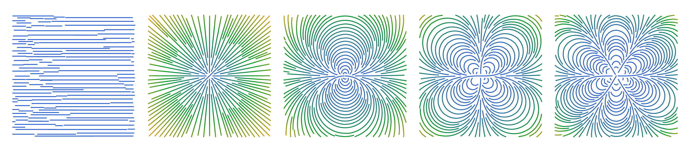

# Virasoro Algebra

We discuss abstract properties of the Virasoro Algebra and how it applies to conformal field theory in particular. That includes representation theory for Virasoro and so on. 

The path we will follow is first constract the Witt algebra, a lie alebra formed by transformations on the Eucledian plane. And then obtain the Virasoro Algebra as a central extension of it. Then we will study projective representation of the Virasoro algebra. 

## Witt Algebra

We have shown [here](./2D_CFT_Axioms.md) that the conformal transformations in the eucledian place are the holomorphic and anti-holomorphic functions, wherever the derivative does not vanish. Identifying the eucledian plane with $\mathbb{C}$ we can use taylor’s theorem to express these functions. To be more formal we have

**<u>Proposition:</u>** For some (anti) holomorphic map $f:\mathbb{C} \to \mathbb{C}$ we can write 

$$
z \mapsto f(z) = z + \sum_{n\in\mathbb{Z}} a_n z^n
$$

for an appropriately defined laurent series. Therefore there exists a vector field $X \in \mathfrak{X}(\mathbb{C})$ given by

$$
X = a_n z^{n}\frac{d}{dz}
$$

such that 

$$
z \mapsto z + Xz
$$

By that property we can call such an $X$ an *infinitesimal holomorphic transformation*. It is clear how the infinitesimal conformal transformations can be spanned by the following basis $\{L_n\}_{n\in \mathbb{Z}} \subset \mathfrak{X}(\mathbb{C})$ given by

$$
L_n \coloneqq -z^{n+1} \frac{\partial}{\partial z}
$$

Similarly, the antiholomorphic transformations would be spanned by a basis 

$$
\bar L_n \coloneqq -\bar z^{n+1} \frac{\partial}{\partial \bar z}
$$

We picked the $n+1$ with a bit of hindsight so that using the commutator of vector fields both of them have the property that

$$
[L_n,L_m] = (n-m)L_{n+m}
$$

With this nice property we can now proceed to the following proposition

**<u>Proposition:</u>** The linear span $W \coloneqq \mathbb{C} \{L_n\mid n\in \mathbb{Z}\} $ with the commutator of vector fields forms a Lie algebra called the **Witt Algebra**.

We can see from here that the Witt algebra is the algebra that contains all the holomorphic (1/2 of the conformal transformations). We can also see this, by the way, by plotting some of the vector fields. 

Here they are, from left to right they go  as $L_{-1} \cdots L_3$! First of all, they look so cool! Secondly, we notice that each of the vector fields is like a flower with exactly $n$ leafs. Therefore these are the flows in $\mathbb{R}^2$ that have to be linearly combined in order to create an infinitesimal holomorphic, conformal, transformation.

*Sidenote on global and local conformal transformations* 

A priori there is no reason that the laurent expansion of an arbitrary function is well defined everywhere. In fact, for the holomorphic functions to be **globally defined** we want it to not blow up at any point on the riemann sphere. 

**<u>Proposition:</u>** The conformal transformations generated by $L_n \in W$ is gobally defined iff $-1 \leq n \leq 1$. 

***Proof:*** Requiring the laurent expansion of the transformation to be finite at $z\to 0$ implies that $n \geq -1$. Requiring that it must be finite for $\frac{1}{z}\to 0$ implies that $n \leq 1$. The re are no other singularities in the laurent expansion. A similar result holds for the anti-holomorphic transformations. 

 

## Virasoro Algebra

In [here](./Conformal_Group.md#Central-Extensions) we have shown how the quantization of a Symmetry, really is the central extension of the classical symmetry by $U(1)$.  The Virasoro algebra is the central extension of the Witt Algebra by $\mathbb{C}$. The proof is in [A Mathematical Introduction to Conformal Field Theory](https://link.springer.com/book/10.1007/978-3-540-68628-6), but the theorem is

**<u>Theorem:</u>** The central extension of the Witt algebra $W$ by $\mathbb{C}$ exists and is unique up to group isomorphism.

**<u>Defintion:</u>** The **Virasoro Algebra** $\text{Vir}$ is the central extension of the Witt algebra $W$ by $\mathbb{C}$, given by

$$
\text{Vir} \coloneqq W\oplus \mathbb{C} Z
$$

as a complex vector space, where for any $n,m\in \mathbb{Z}$

1. $[L_n,L_m] = (n-m)L_{n+m} + \delta_{n,-m} \frac{1}{12}n(n^2-1) Z$
2. $[L_n,Z]=0$

fun fact, the $\frac{1}{12}$ factor comes from the analytic continuation of the $\zeta$ function. The extra generator $Z \in \text{Vir}$  is related to the *central charge.* 

## Representations of Virasoro Algebra

In CFT we will always encounter representations of the Virasoro Algebra in different spaces. This section will study cool representations as well as properties of the vector spaces the representations are on. Let’s start with unitary representations.

**<u>Definition:</u>**  A lie algebra representation $\rho : \text{Vir} \to \text{End}_\mathbb{C}V$ to a complex vector space $V$ is called **unitary** if there exists a hermitian form $\langle \cdot, \cdot \rangle : V\times V \to \mathbb{C}$ such that for any $v,w\in V$ 

$$
\langle \rho(L_n) v,w\rangle = \langle v, \rho(L_{-n}) w\rangle\\
\langle \rho(Z) v,w\rangle = \langle v, \rho(Z) w\rangle\\
$$

Ok cool, the thing we notice is that under a unitary representation the adjoint of $L_n$ is $L_{-n}$. Let’s see some more useful concepts. One of the most useful concepts is cyclic vectors. 

**<u>Definition:</u>** Given a lie algebra representation $\rho : \text{Vir} \to \text{End}_\mathbb{C}V$ to a complex vector space $V$, a vector $v\in V$ is called **cyclic** if 

$$
V = \text{span}\{ \rho(L_1) \rho(L_2) \cdots \rho(L_m) v \mid L_i\in \text{Vir}, m\in \mathbb{N} \}
$$

This is conducive to talking about the vaccuum state of the hilbert space. That is because we can use the virasoro algebra to get to any state of our conformal theory. 

**<u>Definition:</u>** A lie algebra representation $\rho : \text{Vir} \to \text{End}_\mathbb{C}V$ to a complex vector space $V$ is called a **highest weight representation** if there are complex numbers $h,c \in \mathbb{C}$ and a highest weight vector $v \in V$ such that

$$
\rho(Z)v=cv\\
\rho(L_0) v = hv\\
\rho(L_n) v = 0 \ \forall n \geq 1 \\
$$

If further $h>0$ the representation is called a **positive energy representation.** The vector space $V$ equipped with a highest weight representation is called a **Virasoro Module.** Additionally, $c$​ is referred to as the **central charge.** 

Here is a nice proposition that explains why highest weight representations are something that we care about.

**<u>Proposition:</u>** Given a representation of $\rho : \text{Vir} \to \text{End}_\mathbb{C}V$ to a complex vector space $V$, if $\rho(L_0)$ is bounded from below and diagonalizable then

$$
\rho(L_n) v = 0\ \forall n\geq 1
$$

So as we can see, the highest weight representation is the one that keeps the transformation generated by $L_0$ invertible, which is why we often associate it to time translation. 

Let’s now take a look at the objects that generalize those vector spaces. These are verma modules.

**<u>Definition:</u>** A **Verma module** is a vector space $M(h,c)$ equipped with a highest weight representation of the Virasoro algebra with conformal parameters $h,c \in \mathbb{C}$ and highest weight vector $v\in M(h,c)$​ such that

$$
\{\rho(L_{-n_1}L_{-n_2}\cdots L_{-n_k}) v \mid n_1 \geq n_2 \geq \cdots \geq n_k >0, k\in \mathbb{N}\} \cup {v}
$$

is a basis for $M(h,c)$.

An interesting consequence is that a verma module for fixed $c,h\in \mathbb{C}$ is unique up to isomorphism, and it fixes a highest weight representation. In fact it works the other way around. We can build a verma module using one vector and a representation of the Virasoro algebra. 

**<u>Corollary:</u>** For every Virasoro module $V$ with highest weight representation parameters $c,h$, there is a surjective homomorphism $M(c,h) \to V$ that respects the representation. 

Another important property of virasoro modules is the following decomposition.

**<u>Proposition:</u>** Let $V$ be a virasoro module for $h,c \in \mathbb{C}$. Then there exists a direct sum decomposition 

$$
V = \bigoplus_{n\in \mathbb{N}} V_n,
$$

where $V_0 = \mathbb{C} v$, and $V_n$ for $n>0$ is the complex vector space generated by

$$
\left \{\rho(L_{-n_1}L_{-n_2} \cdots L_{-n_k})v \ \middle|\   n_1 \geq n_2 \geq \cdots \geq n_k > 0, k\in \mathbb{N}, \sum_{i=1}^k n_i = n \right\}
$$

i.e. $V_n$ is the eigenspace of $\rho(L_0)$ with eigenvalue $n+ h$. 

## Reducing Representations

In CFTs we will obtain a symmetry of the form of a representation of the Virasoro algebra in some hilbert space. It would be nice to decompose the hilbert space into highest weight representations. Let’s see how to do that 

**<u>Definition:</u>** A vector space $M$ with a lie algebra representation of the Virasoro Algebra is **indecomposable** if there exist no proper subspaces $V,W$ invariant by the rerpesentation such that $M = V\oplus W$. Otherwise it is called **decomposable.**

**<u>Definition:</u>** M is called **irreducible** if there is no invariant proper subspace of $M$ under the representation. 

**<u>Theorem:</u>** For each conformal weights $(c,h) \in \mathbb{C}^2$ we have that

1. The verma module $M(c,h)$ is indecomposable.
2. If $M(c,h)$ is reducible then there is a maximal invariant subspace $I(c,h)$ such that $M(c,h)/I(c,h)$ is an irreducible, heighest weight representation. 
3. There is at most one, up to isomorphism, positive definite unitary highest weight representation of the virasoro algebra. We call the corresponding verma module $W(c,h)$
4. Any positive definite highest weight unitary representation $W(c,h)$ is irreducible. 

## KAC Determinant

We have been studying positive highest weight unitary representations. Here is a tool to help us decide if these representations have these properties. 

