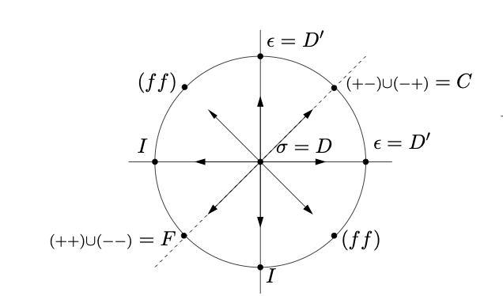

# Defects

[toc]

> **<u>Questions:</u>** 

Many body dynamics are cool. If they are strongly coupled their dense limit is a QFT. Defects are central objects in understanding impurities there. For example, given a microscopic description what kind of phase structure do you expect to see, and what transitions should you expect. Defects and their associated symmetries play a central role there. 

**<u>Example:</u>** Some examples of this are

1. 2D Lattice models (quantum group)
2. 4D Non-Abelian gauge symmetry (Siberg WItten theory) has a well understood phase structure using fusion. But also there is a mathematical interplace with the smooth structures of 4-manifolds and monopole solutions which are classified using the physics tools.

## Approach

Intuitively there are two main ways to describe defects.

1. Extended operators (can be defined by action on other operators)
2. Localized Impurities (can be defined by a modification on a hamiltonian)

One interesting thing is that defects have rich dynamics because they can have things living on them, or interuct with the bulk in a way. This leads to interesting questions about defect RG flows. Interesting questions would be measurement induced phase transitions since measurement is a defect.

As an entry point we can study the two famous impurities in free fermionic models. On the lattice we have a 1D spin chain. The one that limits to a compact boson CFT. The impurity problem we are considering is defined by the following action.

We pick $R=\sqrt{2}$ because this gives us a special SU(2) symmetry with an associated current $J$ such that
$$
S_{K} = \int_{L} \iota^\ast J ,
$$
the embedding $\iota$ is an extra degree of freedom. Sometimes we write this as $J\cdot S$ for some "spin" degree of freedom for the fermion that we just introduced. In reality this is just a qubit.  So the path integral sums over the two possible qubit orientations. 

The IR dynamics of this are quite interesting. For positive coupling this flows in the IR to a topological defect line. We say that the qubit is screened. The topological defect line is related to the $\mathbb{Z}_2$ generator of the center of $SU(2)$. Notice that at this radius this is the $SU(2)_1$ WZW model.

Note that since $J$ has dimension 1 $\lambda$ is dimensionless so this is a marginal deformation. This becomes marginally relevant at $\lambda >0$. 

The other handle that gives rize to defects is the Kane-Fisher impurity. Same thing but this time we have electrical coupling. We can pick $R$ to be general and then we obtain 
$$
S_F = \int_L \cos \tilde \theta
$$
the dimension of this operator is $\Delta = \frac{R^2}{4}$. In the Luttinger liquid this is calles the luttinger parameter. In this case we can calculate the flows (at least numerically) where we have two regimes. if $\Delta < 1$ then this thing is relevant which has an interesting result of being a factorized defect. For $\Delta > 1$ in which the perturbation is irrelevant in the IR this flows to the identity defect. 

If we are expecting that $(J_n - \bar J_{-n}) D_{IR} = 0$ then it must be factorizing (it can't really be anything else). The only thing that is factorizing with respect to that are the boundary conditions (which are 2) because $\mathfrak{su}(2)_2$ only has 2 primaries. 

The perturbation looks like
$$
e^{\lambda \int_L S\cdot(J(x) + \bar J(x))dx}
$$
# Defect Dynamics

We want to find properties of IR fixed points of deffect perturbations. We really want to understand things like symmetries and anomalies but also we can combine this iwht dynamical input to obtain defect observables. 

Let's do this by some examples. 

## Ising Category Symmetry

We can search for 2d cfts with Ising symmetry. We can calculate what happens when $N$ the noninvertible defect in Ising is preturbed. 

**<u>Claim:</u>** The fusion structure of $N$ is preserved under $\mathbb{Z}_2$ deformations.

> In Ising CFT the deformations of the Duality defect we can integrate the energy operator deforming the defect. Show that we can recover the fusion rules of $N$ and the nontrivial $F$ symbol between $N$ and $\eta$. 
>
> To take the fusion product of the nontopological defect we need to renormalize by removing the casimir energy divergence. 

The F symbol should be preserved because it encodes an animaly between $N$ and $\eta$ and anomaly matching is a thing. Why is it an anomaly? Well if we take a time reversal transformation the operator that acts on the N twisted sector is going ot be picking up a minus sign because of the F symbol, so we will see an 't Hooft anomaly.

We can also see this on the lattice! On the lattice we get
$$
H = - \sum_{i\neq 0}( \hat z_i \hat z_{i+1} + \hat x_{i+1}) - \hat z_0 \hat x_1
$$
where we have periodic boundary condtions. The defect operator in the $N$ twisted sector is going to be
$$
\hat \eta = \hat z_1 \hat x_1 \cdots \hat x_N.
$$
Immediately we can see that $\hat \eta^2 = -1$ but it is invariant under time reversal. 

An interesting idea is that $\text{Ising}^2$ has a cool line: $N\boxtimes N$ which one could ask how it flows under the marginal parameter of the $c=1$ orbifold branch. The corresponding term in the action that implements $N\boxtimes N$ is
$$
\mathcal{O}=\epsilon_1 \epsilon_2.
$$
The other thing we could ask is what happens if we perturb this by something that lives on the defect itself. Of course we know the Ising flows

which would imply that we can get rid of some of the $N$ operators by permuting with $\epsilon_i$. But there could be more stuff. 

So along the radius we can find what happens. This calculation can be done in perturbation theory by literally averaging at the different radius after writing $\epsilon_i$ in terms of the $c=1$ fields.

Another way one can solve this problem is by reframing into anyon condensation. So in the folded theory this is a boundary which is a $D$ brane. In particular folding  along the defect gives us a special D brane state, that ends up flowing to a bound state of D1 and 2D0 branes. The flow is going to be done using tachyon condensation. 

> **Question:** How do we know that we should flow to a dbrane? 

## IR Factorization

It is often the case that a topological defect flows into a factorized defect. People have not just seen thsi in 2D they have seen it in 3D too!. This was observed in the $O(N)$ model on a surface defect. 

