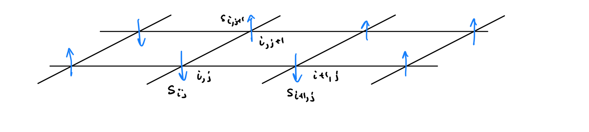

# Ising Model

This is a Conformal Field Theory “Hello World” project. Apparently the symmetry group of the ising model around its phase transition is actually the Virasoro group. Therefore we can conformal field theory our way into a nice description about it, just to play around with the fundamental objects there. 

We begin with a classical treatment of the model to fully define some terminology (but also because it is fun) and then move on to identify how the matching with the CFT description occurs.

[toc]

----

# Classical Treatment

Here is a brief overview the classical treatment of the 2D Ising model in order to find the limit at which it reduces to a quantum model. 

## Physical Setting

The setup is a bunch of arrows arranged in a lattice that can interact with their nierest neighbohrs. A picture is the following, where we have a 2D lattice and an arrow attached at each point.

 

To build a mathematical description of the model, we can first identify a suitable configuration space. Let’s start with a finite lattice 2D lattice that contains a total of $N = n^2$ particles. This can be described as $\mathbb{Z}_n^2$, where at each point of which we have attached a spin up or down vector in $\mathbb{Z}_2$ for the vector space. Therefore the configuration space is given by

$$
C_N \coloneqq \mathbb Z_n^2 \times \mathbb Z_2.
$$

Notice that $\mathbb{Z}_n^2$ as a graph admits the topology of a discrete donought! That is because we can connect the endpoints of the grid for each $\mathbb Z_n$. The next ingredient we need is a Hamiltonian $H:C_N\to \mathbb{R}$.

The Hamiltonian in this case must capture the interaction of the neighboring spins. For some point $p = (s_1,s_2,\cdots, s_N) \in C_N$ we usually pick the hamiltonian 

$$
H(p) = -\sum_{i,j} J_{ij} s_i s_j -  h \sum_{i} s_i
$$

where $J$ is an $N\times N$ symmetric matrix such that $J_{ij} = I >0$ iff $s_i$ is neighboring $s_j$, otherwise $J_{ij} = 0$, and $h > 0$ represents some external magnetic field type interaction. Note that $s_i \in \{-1,1\}$. Now we are ready to calculate the magnetization in the Canonical ensemble.

## Magnetization in the Canonical Ensemble

In the Canonical Ensemble, the partition function is given by 

$$
Z = \sum_{p\in C_N} e^{-\beta H(p)}
$$

Classically the magnetization is given by the average of the particles aligned in the up direction like so 

$$
M = \frac{1}{N\beta} \langle s_T \rangle = \frac{1}{N \beta} \sum_{i = 0}^N\langle s_i\rangle = \frac{1}{N \beta} \frac{\partial }{\partial h} \log Z.
$$

The phase transition also appears on the sucsceptibility which is given by

$$
\chi = \left.\frac{\partial M}{\partial h}\right|_{h=0} = \frac{1}{N \beta} \left.\frac{\partial ^2}{\partial h^2}\right|_{h=0} \log Z
$$

With some algebraic manipulation we can get that

$$
\chi = \frac{1}{N\beta} \left[ -\frac{1}{Z^2} \left(\frac{\partial Z}{\partial h}\right)^2 + \frac{1}{Z} \frac{\partial ^2 Z}{\partial h^2} \right] = \frac{\beta}{N} \left[\langle s^2_Τ \rangle - \langle s_Τ\rangle^2\right] = \frac{\beta}{N} \text{Var}(s_Τ)
$$

OK! All of this is not quantum, but check out that 

$$
\text{Var}\left[\sum_{i=0}^N s_i\right] = \sum_{i,j=0}^n\text{Cov}(s_i,s_j) = \sum_{i,j=0}^n \langle s_is_j\rangle - \langle s_i\rangle \langle s_j\rangle
$$

The cool thing is that $s_i,s_j$ are uncorrelated unless $i,j$ are neighbors. Therefore we can write this a sum of the uncorrelated differences, which depends only on $|i-j|$ which hints to translation invariance, and a really cool use of CFT!

We will use CFT to calculate these correlation functions.

## Mean Field Theory During Transition

----

# Quantum Treatment

Ok everythign up to now has been fun, but it has mostly been background so that when we treat Ising in CFT we can be like OH COOL! Look at these conformal weights! They are the same as the classical ones!

