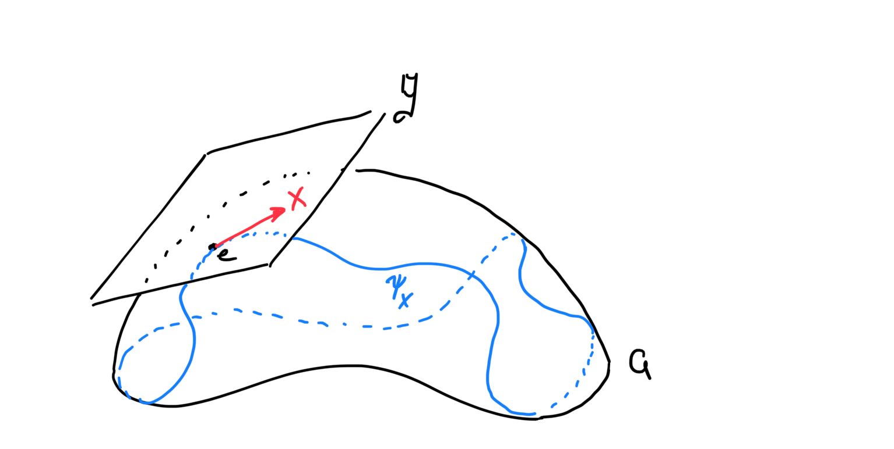

# Conformal Group

The main object of these field theories is the structure of the group of a certain kind of automorphisms on spacetime.

**<u>Definition:</u>** Let $(M,g)$ a pseudo-Riemannian Manifold with signature $(p,q)$ and dimension $\dim M = n$. Consider the following set

$$
\mathcal{G} \coloneqq \{\phi \in \text{Aut}(M) \mid \phi^* g = \Omega g,\ \Omega \in C^\infty(M)\},
$$

is called the **conformal group** of manifold $M$ and it contains all automorphisms of $M$ that leave the metric invariant up to scaling. 

**<u>Proposition:</u>** $(\mathcal{G},\circ)$ is a Lie subgroup of $\text{Aut}(M)$. 

**<u>Note:</u>** We can define the angle of two vector fields $X,Y \in \mathfrak{X}(M)$ like so

$$
\frac{g(X,Y)}{\sqrt{g(X,X)g(Y,Y)}}
$$

therefore, $\mathcal{G}$ leaves the angle invariant.

***Example:*** In Minkowski space the Poincaré group is a subgroup of $\mathcal{G}$.

---

## Infinitesimal Transformations

A little sidenote on rigorously defining infinitesimal transformations. Basically, in order to find the structure of the lie group $\mathcal{G}$ it would be nice to find the structure of its Lie Algebra $\mathfrak{g}$ and to do that it is easy to study transformations that are “infinitesimal.”

Consider a manifold $M$, a Lie group $G$ with lie algebra $\mathfrak{g}$ and a smooth left action

$$
\begin{align*}
\phi : G\times M &\to M\\
(g,p) &\to \phi(g,p) = gp,
\end{align*}
$$

with an orbit map $L_p : G \to M$ for some $p\in M$.

**<u>Definition:</u>** A one parameter subgroup of Lie group $G$ is the maximal integral curve of some left invariant vector field $X \in \mathfrak{g}$ given by the image of the map

$$
\begin{align*}
\psi_X: \mathbb{R} &\to G\\
t &\mapsto \exp(tX)
\end{align*}
$$

This picture should clarify how it looks like. We follow a left invariant vector field around the group. The “one parameter” is how far along its integral curve we have travelled.

**<u>Defintion:</u>** The flow of $p \in M$ according to a one parameter subgroup $\psi_X$ of $G$ is given by the following curve

$$
\begin{align*}
\gamma_p:\mathbb{R} &\to M\\
t &\mapsto e^{tX}p
\end{align*}
$$

**<u>Note:</u>** We can rewrite $\gamma_p$ as $\gamma_{p,X} = L_p \circ \psi_X$.

**<u>Definition:</u>** An infinitesimal transformation of $M$ with respect to the Lie group $G$ in the direction of $X\in \mathfrak{g}$ is given by the map

$$
\begin{align*}
F:M &\to M\\
p &\mapsto \gamma_{p,X}(1)
\end{align*}
$$

**<u>Corollary:</u>** The map 

$$
\begin{align*}
L_* : \mathfrak{g} &\to \mathfrak{X}(M)\\
X &\to L_*X \text{ s.t. } (L_*X)_p = L_{p*,e}X
\end{align*}
$$

is a lie algebra action induced by the lie group action. This could be a representation but we have much more general stuff.

**<u>Proposition:</u>** The components of an infinitesimal transformation of a point $p \in \mathbb{R}^n$ are given by

$$
\begin{align*}
x^\mu \circ F(p) \coloneqq  F(p)^\mu &= p^\mu + X^\nu \frac{\partial L_p^\mu}{\partial \alpha^\nu},
\end{align*}
$$

where $\frac{\partial}{\partial \alpha^\nu}$ is a basis for $\mathfrak{g}$. 

**<u>Note:</u>** In physics we usually denote $\varepsilon^\mu = X^\nu \frac{\partial L_p^\mu}{\partial \alpha^\nu}$.

This essentially says that given a group action all we need to know is the structure of the lie algebra and not the group. This is only dependent on the lie algebra representation of the group.   

---

## Central Extensions

**<u>Definition:</u>** A sequence $\{f_i : G_{i-1} \to G_{i}\}_{i\in I}$ of group homomorphisms is **exact** if the image of each homomorphism is the kernel of the next. 

Pictorially we can see this as follows

There are some interesting theorems that help us define groups using such sequences by imposing existance and uniqueness conditions on some of its terms.

**<u>Definition:</u>** An **extension** of a some group $G$ by a group $A$ is the group $E$ given by the following exact sequence of group homomorphisms

$$
1 \to A \xrightarrow{\iota} E \xrightarrow{\pi} G \to 1
$$

The extension is called **central** if $A$ is abelian and the image of $\iota$ is in the center of $E$, i.e.  

$$
\iota(A) \subset Z(E)
$$

that is $\forall a\in A, b\in Z,$ then $\iota(a) b = b\iota(a)$.

***Note:*** The extension of a group by another is not uniquely defined in general. 

---

## Quantum Hilbert Spaces

The mathematical notion of hilbert spaces is augmented with some extra niceness conditions when doing quantum mechanics. Let’s explore them

**<u>Definition:</u>** A **Hilbert Space** $\mathbb{H}$ is an inner product space, such that the inner product introduces a norm and a metric, such that $\mathbb{H}$ is complete in the induced topology. 

***Note:*** Ok a bunch of terms, there. Inner product space, and norm are cool. So is metric. Complete simply means that every convergent sequence of elements in $\mathbb{H}$ converges in $\mathbb{H}$. This is a statement about no missing points. Like don’t try to define one in such a way that I will be following a path and fall out!

**<u>Definition:</u>** A **hermitian inner product** on a vector space $V$ over $\mathbb{C}$ is a map

$$
\langle \cdot,\cdot\rangle : V\times V \to \mathbb{C}
$$

with the following properties for $x,y,z \in V, a\in \mathbb{C}$.

1. Complex antilinear in the first component. i.e. $\langle ax + y, x\rangle = \bar{a} \langle x, z\rangle + \langle y, z\rangle$
2. Skew symmetric. i.e. $\langle x,y\rangle = \overline{\langle y,x\rangle}$
3. Positive definite. i.e. $\langle x,x\rangle \geq 0$
4. Non degenerate. i.e. $\langle x,x\rangle = 0\iff x = 0$

**<u>Corollary:</u>** A complex vector space $V$ together with a **hermitian inner product** has an induced norm given by

$$
\begin{align*}
|\cdot|:V &\to \mathbb{R}\\
x & \mapsto \sqrt{\langle x,x\rangle}
\end{align*}
$$

**<u>Corollary:</u>** The norm induces the metric topology on $V$.

We are almost there! Let’s add some more niceness conditions. For example, we would looove to have a countable basis for our quantum Hilbert space, so that we can do all these fancy identity maphs. So check out this lemma

**<u>Proposition:</u>** A separable (i.e. there exists a countable dense subset) Hilbert space has a countable orthonormal basis 

This is cool! What this means precisely, is that if I get a seperable Hilbert space $\mathbb{H}$ I can find a basis $\{e_n\}_{n\in I}$ where $I$ is countable, and I can write every element $v\in \mathbb{H}$ like

$$
v = \sum_{n\in I}v_ne_n
$$

where $v_n = \langle v,e_n \rangle \in \mathbb{C}$. This not a trivial result at all! We can find a hilbert space made out of functions, and this basically means that we can express each function as a countable sequence of numbers!

We are ready to define our Hilbert space

**<u>Definition:</u>** A **Quantum Hilbert Space** $\mathbb{H}$ is a separable hilbert space with hermitian inner product. (lol)

Now let’s pivot in the not at all direction and continue talking about unitary operators

**<u>Definition:</u>** A **unitary operator** $U$ in a quantum Hilbert space $\mathbb{H}$ is a complex bilinear, bijective map $U: \mathbb{H}\to \mathbb{H}$ such that the inner product is invariant. i.e. $\langle Ux,Uy\rangle = \langle x,y\rangle$. 

We often denote the group of all unitary operators on the Hilbert space as $U(\mathbb{H})$. It is also helpful to define the special unitary group as a subgroup of $U$, namely

$$
SU(\mathbb{H}) \coloneqq \{A \in U(\mathbb{H}) \mid \det A = 1\}
$$

The other helpful definition is often implicitly talked about in physics, but it is the most important. The set of states, is not actually $\mathbb{H}$ it is the ones with unit lenght. In particular, we can identify each state with a “ray” in $\mathbb{H}$. So let’s talk about that set and find its structure. 

**<u>Definition:</u>** Let $\mathbb{P}(\mathbb{H})$ be be the **projective space** composed of 1 dimensional linear subspaces of $\mathbb{H}$. Namely

$$
\mathbb{P} \coloneqq \mathbb{P}(\mathbb{H}) = (\mathbb{H} \setminus\{0\})/{\sim}
$$

where $\sim$ is the equivalence relation of the lines of $\mathbb{H}$.

------

## A glimpse of Quantum Symmetry

With this construction in mind, we can proceed with naturally studying what it means to have a quantum symmetry. A symmetry in the Quantum Sense is a transformation that leaves the transition probabilities invariant. We will formally define transition probability and symmetries here, and study them in the next section.

**<u>Definition:</u>** Given a quantum Hilbert space $\mathbb{H}$ with projective space $\mathbb{P}$ the map

$$
\begin{align*}
\delta : \mathbb{P}\times \mathbb{P} &\to [0,1]\\
(f,g) &\mapsto \delta(f,g) =  \frac{|\langle f,g\rangle|^2}{|f|^2|g|^2},
\end{align*}
$$

is the **transition probability map**. Notice the use of two different norms, the complex norm on the numerator, and the induced Hilbert space norm on the denominator. Additionlly, we conventially take the inner product of the unit length vectors on $\mathbb{H}$ corresponding to each equivalence class of $\mathbb{P}$.

**<u>Corollary:</u>** The transition probability defines a topology on $\mathbb{P}$ with basis sets

$$
B_f(\varepsilon) = \set{g \in \mathbb{P} \mid  \delta(f,g) < \varepsilon}
$$

for some $\varepsilon >0$.

Appart from generating a topology for the projective space, this map is physically, motivated as it is the probability that state $f$ collpses to state $g$. Or in plain words, if we were able to measure state $g$ what is the probility that we would measure it in a system that is in state $f$. 

With this physical intuition we can move on to describing symmetries. 

**<u>Defintition:</u>** A bijective map $T:\mathbb{P}\to \mathbb{P}$ is called a **projective transformation** *(or projective automorphism)* if

$$
\delta(Tf,Tg) = \delta(f,g)\ \forall f,g \in \mathbb{P}
$$

We denote with $\text{Aut}(\mathbb{P})$ the group of all projective transformations of $\mathbb{P}$. 

This is our intuitive notion of symmetry. It is a way to change our states such that the probability of going from one to the other remains the same. However, this does not encapsulate completely the wider notion that symmetries take in Quantum mechanics. 

This is because, while $\text{Aut}(\mathbb{P})$ contains all the *physical* transformations, we have more degrees of freedom in quantum mechanics. In particular, the Hilbert space is much larger than the projective space, and as we will soon see, all transformations in the projective space originate by transformations in the Quantum Hilbert space. Let’s make this statement more precise now.

**<u>Definition:</u>** Let $q : \mathbb{H}\setminus \{0\} \to \mathbb{P}$ be the canonical quotient map. Then, for any unitary operator $U \in U(\mathbb{H})$ there exists a canonical representation on the quotient space given by 

$$
\hat{U}([f]) = q(Uf) \ \ \forall f \in \mathbb{H}
$$

*Note:* This is also true for anti unitary operators.

**<u>Theorem:</u>** *(Winger’s Theorem)* For every projective transformation $T \in \text{Aut}(\mathbb{P})$ there exists a unitary or anti-unitary transformation $U$ such that $T = \hat{U}$.

This statement, although abstract is very powerful. At surface level, it tells us that the following lemma is true

**<u>Lemma:</u>** The group of unitary transformations on the Quantum Hilbert space $\mathbb{H}$ is a central extension of the projective transformations by $U(1)$.

$$
1 \to U(1) \xrightarrow{\iota} U(\mathbb{H}) \xrightarrow{\wedge} \text{Aut}(\mathbb{P}) \to 1
$$

Yet, the grander consequence of this theorem, is that for states that we can physically observe, i.e. elements of $\mathbb{P}$, any symmetry we can make results from a **linear** (unitary or anti-unitary) transformation of the corresponding elements on a Hilbert space. THIS IS HUGE! That is because, it allows us to only study only the linear groups of the Quantum Hilbert space, which have a notoriusly much nicer structure than general transformation groups.

----

##  Covering maps

Covering maps are really useful objects, they can be thought of in multiple ways, one of which is as extentions of compact topological spaces. 

…Consider two topological space $(E,T_E)$ and $(X,T)$. In the following we will study some properties of subsets of $X$ through continious maps from $E$.

**<u>Definition:</u>** Any $U \in T$ is **evenly covered** by a continuous map $q: E \to X$ if $q^{-1}(U)$ is a disjoint union of connected open subsets of $E$. These subsets are called the **sheets** of the covering of $U$, each of which must be homeomorphic to $U$ by a suitable restriction of $q$.
